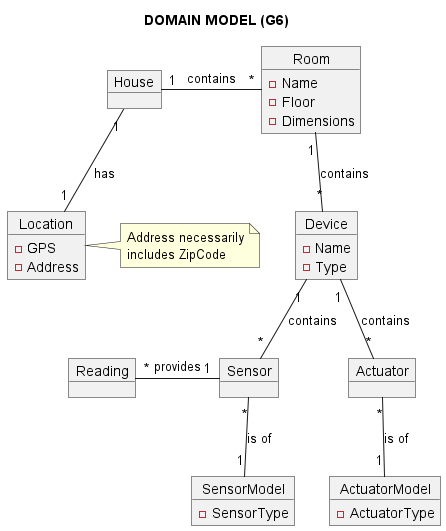

# SWitCH 23-24 Smart Home Project

Welcome to the SWitCH 23-24 Smart Home Project Repository!

## Overview

The Smart Home Project aims to leverage the power of networked devices to provide comfort, safety, security, and
efficient energy usage in a living space, such as a house. A key feature of these smart homes is the ability to control
devices or gather data from them.

## Objectives

Our main goal is to develop a comprehensive system that enables users to effectively manage their smart homes. This
encompasses controlling various devices that function as sensors, actuators, or both, ensuring seamless operation of all
aspects of the smart home.

## Domain Model

The smart home system caters to houses with complex structures, including multiple floors, gardens, and other
outbuildings. Each part of the house, such as kitchens, bedrooms, and garages, has distinct management needs. Devices
within these spaces are designed to be user-friendly, with clear naming, types, and specific locations within the house.



## Non-Functional Requirements

- **Development Approach:** The project employs an agile methodology, ensuring flexibility and adaptability throughout
  the development process.
    - **Sprints:** The project is divided into sprints, each lasting two/three weeks.
    - **Meetings:** Regular meetings are held to discuss progress, issues, and next steps.
- **Programming Language:** Java, paired with a Test-Driven Development (TDD) approach using JUnit and Mockito.
- **Code and Test Coverage:** Aiming for a minimum of 95% code coverage and mutation coverage in tests.
- **Design:** The project uses Domain-Driven Design (DDD) principles to ensure a clear and maintainable codebase.
- **Framework:** The project uses Spring Boot, a Java-based framework that simplifies the development of web
  applications.
- **Database:** The project uses a relational database (H2 for development and MySQL for deployment).
- **User Interface:** The project uses a web-based user interface, developed using React.


## Documentation and Collaboration

- **Language:** All code comments and documentation are in English.
- **Wiki Usage:** This wiki serves as the central repository for all documentation related to the Smart Home Project.
    - [Project Wiki](https://github.com/Departamento-de-Engenharia-Informatica/2023-2024-switch-dev-project-assignment-switch-project-2023-2024-grupo6/wiki)
- **Scrum Board:** The project uses GitHub Projects to manage tasks and track progress.
    - [Project Scrum Dailies](https://github.com/Departamento-de-Engenharia-Informatica/2023-2024-switch-dev-project-assignment-switch-project-2023-2024-grupo6/wiki/Scrum-Dailies)
- **Project Management:** The project is managed using GitHub Projects and Issues to track progress and manage tasks.
    - [Project Sprint Planning](https://github.com/Departamento-de-Engenharia-Informatica/2023-2024-switch-dev-project-assignment-switch-project-2023-2024-grupo6/projects?query=is%3Aopen)

## Getting Started

### Prerequisites

To set up the project locally, you will need:

- Java 17 or higher
- Maven 3.13.0 or higher

### Run our project locally

1. **Clone the repository:**
   ```sh
   git clone https://github.com/Departamento-de-Engenharia-Informatica/2023-2024-switch-dev-project-assignment-switch-project-2023-2024-grupo6.git
    ```
2. **Connect our backend to a database**
   - This process is described in a more detailed form here:</br>
     https://github.com/Departamento-de-Engenharia-Informatica/2023-2024-switch-dev-project-assignment-switch-project-2023-2024-grupo6/blob/main/docs/userStoryReport/us046/UserStory_046.md
3. **Run the Backend**
   ```sh
   mvn spring:boot run
   ```
4. **Run the Frontend**
   1. The Backend from which the Frontend consumes the API is running on DEI's Server, so we need to (next step)
   2. Connect to DEI-ISEP's VPN (student/teacher credentials)
   3. Run the following commands
   ```sh
   cd /frontend
   npm install
   npm run start
   ```

### Use the Deployed Frontend (DEI Servers)</br>
1. Connect to DEI-ISEP's VPN (student/teacher credentials)

2. Visit http://10.9.24.232:80

3. Enjoy!


   


### Use our Deployed REST-ful API (DEI Servers)

1. Connect to DEI-ISEP's VPN (student/teacher credentials)

2. http://10.9.24.232:8080/switch2023project_g6-1.0-SNAPSHOT is our Tomcat Server's Address

3. Further documentation on our API available (WHILE CONNECTED TO THE VPN) in http://10.9.24.232:8080/switch2023project_g6-1.0-SNAPSHOT/swagger-ui/index.html#/


-----------------------

## Contributors

- [André Ferreira](https://github.com/aferreira101)
- [Francisca Nogueira](https://github.com/FranciscaNogueira)
- [Inês Lemos](https://github.com/vapreace)
- [José Pedro Rodrigues](https://github.com/ozepedrorodrigues)
- [Lúcia Marco](https://github.com/MLuciaMarcoPereira)
- [Miguel Couto](https://github.com/miguelapcouto94)
- [Pedro Pires](https://github.com/pedrodgp)
- [Pedro Sampaio](https://github.com/Pedro-M-S)
- [Pedro Siqueira](https://github.com/Pedrotheofilo)

