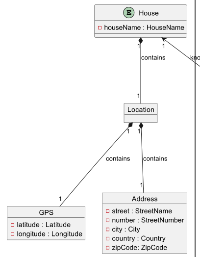
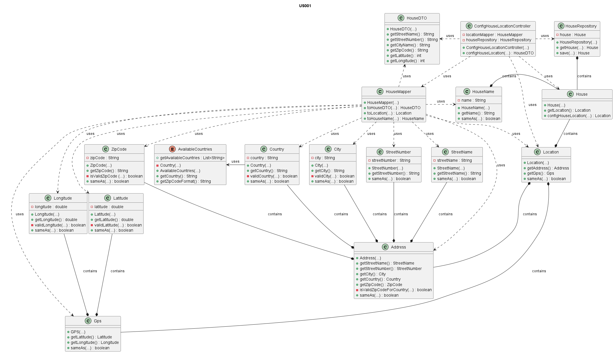

# US001 - Configure the location of the house

# Table of Contents

1. [Requirements](#1-requirements)
    - [Dependency on other user stories](#dependency-on-other-user-stories)
2. [Analysis](#2-analysis)
    - [Relevant domain model excerpt](#relevant-domain-model-excerpt)
3. [Design](#3-design)
    - [Class diagram](#class-diagram)
    - [Sequence diagram](#sequence-diagram)
    - [Applied design patterns and principles](#applied-design-patterns-and-principles)
4. [Tests](#4-tests)
    - [Acceptance Tests](#acceptance-tests)
    - [Unit tests](#unit-tests)
    - [Integration tests](#integration-tests)
5. [Implementation](#5-implementation)
6. [Conclusion](#6-conclusion)

# 1. Requirements
_As an Administrator, I want to configure the location of the house._

Requirements to configure the location of the house:
- The house must have **only one location**.
- The location of the house **must be stored in the system**.
- The location of the house **must be composed by the _address_ and the _GPS_.**
  - The _**address**_ must be composed by street, number, city, country and zip-code.
    - The **_street_, the _number_** and the _**city**_ can be composed with letters, numbers and special characters, must not be null ou empty.
    - The _**country**_ must be in the list of countries available in the system.
      - The list of countries available in the system is: "_United States of America_", "_Portugal_", "_Spain_" and "_France_".
    - The _**zip code**_ must be composed by only integer numbers and must have the length of 5 (xxxxx) if the country is "_United States of America_",
  "_Spain_" or "_France_" and 4, a dash and 3 (xxxx-xxx) if the country is "_Portugal_".
    - The _address_ must have the **_zip code_ in the correct format according to the _country_.** 
  - The _**gps**_ **must be composed by _latitude_ and _longitude_**. 
    - The _**latitude**_ must be composed with numbers in range of -90 to 90.
    - The _**longitude**_ must be composed with numbers in range of -180 to 180.


## Dependency on other user stories
None

# 2. Analysis

The House is a fundamental entity, as it represents the physical house that is being managed by the system. The house has a name (the identifier) and the location. The location of the house is not a key entity, but it is a fundamental attribute of the house, as it is used to locate the house in the real world.

As mentioned in the requirement, the location is composed by the following attributes:

| Attribute    | Rules                                                                                                                                                                                                                                    |
|--------------|------------------------------------------------------------------------------------------------------------------------------------------------------------------------------------------------------------------------------------------|
| **Address**  | Must be composed by street, number, city, country and zip-code. Need the country be matched with the zip-code format.                                                                                                                    |
| StreetName   | A string, must not be null or empty.                                                                                                                                                                                                     |
| StreetNumber | A string, must not be null or empty.                                                                                                                                                                                                     |
| City         | A string, must not be null or empty.                                                                                                                                                                                                     |
| Country      | A string, must not be null or empty. Must be in the list of countries available in the system: "United States of America", "Portugal", "Spain" and "France".                                                                             |
| ZipCode      | A string, must not be null or empty and only integer numbers are valid. Must have the length of 5 (xxxxx) if the country is "United States of America", "Spain" or "France" and 4, a dash and 3 (xxxx-xxx) if the country is "Portugal". |
| **GPS**      | Must be composed by latitude and longitude.                                                                                                                                                                                              |
| Latitude     | Must be composed with integer numbers in range of -90 to 90.                                                                                                                                                                             |      
| Longitude    | Must be composed with integer numbers in range of -180 to 180                                                                                                                                                                            |

In the context of configuring the location of the house, several key interactions occur within the system. These interactions ensure that the location is properly validated and stored in the system.
The following steps outline the key interactions that occur when configuring the location of the house:

1. The Administrator interacts with the system to configure the location of the house.
2. The system provides the possible countries available in the system.
3. The Administrator chooses the country of the house.
4. The Administrator provides the new location of the house, included the address and the GPS.
5. The system validates the input data.
6. The system stores the new location of the house, replacing the old location.
7. The system confirms the new location of the house was stored by returning the house with the new location.


## Relevant domain model excerpt

Below is the relevant domain model excerpt for this user story, showing the relationship between the `House` class and the `Location` class:




# 3. Design

The `House` class needs a method to configure the location.
This method must receive the new location as Value Object and store it in the system, replacing the old location.

## Class diagram

Below is the class diagram for this user story:

## Sequence diagram

Below is the sequence diagram for this user story:


## Applied design patterns and principles

* **Controller** - A design pattern that separates the logic of the system from the user interface. `ConfigHouseLocationController` is responsible for receiving the input from the administrator and calling the method to configure the location of the house.
* **Information Expert** - The `House` class is responsible for configuring the location of the house, as it has all the necessary information to perform this task.
* **Creator** - The `HouseMapper` class is responsible for instantiating the House value objects, including the location, because it receives the necessary information from the controller and creates the location object. When the location value object is created, it is passed in a valid state to the `House` class.
* **Low Coupling** - The `ConfigHouseLocationController` class is loosely coupled with the `House` class, as it only interacts with the `House` class to configure the location of the house.
* **High Cohesion** - The `House` class has high cohesion, as it is responsible for configuring the location of the house, which is a related task.
* **Single Responsibility Principle (SRP)** - The `House` class follows the SRP, as it is responsible for configuring the location of the house.
* **Repository** - The `HouseRepository` class is responsible for storing the house entity, including the `Location` because it is an attribute of the house entity.
* **Aggregate Root** - The `House` class is the aggregate root of the house entity, as it is responsible for configuring the location of the house.
* **Value Object** - The `Location` class is a value object, as it is immutable and represents a value that is part of the house entity. 

# 4. Tests

## Acceptance Tests

- **Scenario 1:** The available countries in the system must be provided to the administrator
    - **When** the administrator wants to configure the location of the house.
    - **Then** the system must provide the available countries in the system.

- **Scenario 2:** The administrator wants to configure the location of the house for the first time
    - **When** the administrator wants to configure the location of the house.
    - **Then** the system must allow the administrator to configure the location of the house.
    - **And** the system must store the location of the house.
    - **And** the system must confirm the location of the house was stored by returning the house with the new location.

- **Scenario 3:** The administrator wants to configure the location of the house after the first time the location was configured
    - **When** the administrator wants to configure the location of the house for the second time.
    - **Then** the system must allow the administrator to configure the location of the house.
    - **And** the system must store the new location of the house.
    - **And** the system must confirm the location of the house was stored by returning the house with the new location.

- **Scenario 4:** The administrator wants to configure the location of the house with invalid parameters (such as blank, null or invalid values that do not match the rules)
    - **When** the administrator wants to configure the location of the house with invalid parameters.
    - **Then** the system must not allow the administrator to configure the location of the house.
    - **And** the system must not store the location of the house.
    - **And** the system must confirm the location of the house was not stored by returning an error message.

- **Scenario 5:** Test the persistence of the location of the house
    - **Given** the administrator has configured the location of the house.
    - **When** the HouseRepository is called to retrieve the house that was configured
    - **And** the house is retrieved
    - **Then** the house must have the location that was configured, if the location were valid.
    - **Or** the house must not have the location th                           at was configured if the location were invalid.

## Unit tests

Method `public Location configLocation(Location location){}` in `House` class:

| Test Case | Expected Outcome                                                                                            |
|-----------|-------------------------------------------------------------------------------------------------------------|
| Test configuring the location when the provided location is null. | Should return null, indicating that the location was not updated. And must not change the current location. |
| Test configuring the location when a valid location is provided. | Should return the new location, indicating that the update was successful. The house should have the new location indicated, showing that the update was successful.                                 |


For more information on unit testing and validation, please refer to
the [HouseTest](https://github.com/Departamento-de-Engenharia-Informatica/2023-2024-switch-dev-project-assignment-switch-project-2023-2024-grupo6/blob/main/src/test/java/smarthome/domain/house/HouseTest.java).


## Integration tests

Method `public House configHouseLocation(HouseDTO houseDTO){}` in `ConfigHouseLocationController` class:


| Scenario                                                                                                                        | Test Case                                                                                                        | Expected Outcome |
|---------------------------------------------------------------------------------------------------------------------------------|------------------------------------------------------------------------------------------------------------------|------------------|
| **Scenario 1: The available countries in the system must be provided to the administrator**                                     | Test the system provides the available countries in the system.                                                  | Should return a non-null result - should return a list of countries. |
| **Scenario 2: The administrator wants to configure the location of the house for the first time**                               | Test configuring the house location for the first time.                                                          | Should return a non-null result - should return a `HouseDTO` object. |
|                                                                                                                                 | Test configuring the house location for the first time changes the location.                                     | Should change the location. |
|                                                                                                                                 | Test configuring the house location for the first time with new values updates the location accordingly.         | Should update the location to the new values. |
| **Scenario 3: The administrator wants to configure the location of the house after the first time the location was configured** | Test configuring the house location after the first configuration.                                               | Should return a non-null result - should return a `HouseDTO` object. |
|                                                                                                                                 | Test configuring the house location after the first time should change the location.                             | Should change the location. |
|                                                                                                                                 | Test configuring the house location after the first time with new values updates the location accordingly.       | Should update the location to the new values. |
| **Scenario 4: The administrator wants to configure the location of the house with invalid parameters**                          | Test configuring the house location with an invalid street name  (blank and null).                               | Should return null and keep the location unchanged. |
|                                                                                                                                 | Test configuring the house location with an invalid street number ****(blank and null).****                          | Should fail and return null, keeping the location unchanged. |
|                                                                                                                                 | Test configuring the house location with an invalid zip code **(blank, null, invalid format).**                  | Should fail and return null, keeping the location unchanged. |
|                                                                                                                                 | Test configuring the house location with an invalid city **(blank and null).**                                   | Should fail and return null, keeping the location unchanged. |
|                                                                                                                                 | Test configuring the house location with an invalid country **(blank, null or not in the list of countries).**    | Should fail and return null, keeping the location unchanged. |
|                                                                                                                                 | Test configuring the house location with an invalid address **(country and zip code do not match).**             | Should fail and return null, keeping the location unchanged. |
|                                                                                                                                 | Test configuring the house location with an invalid latitude. **(lower than -90 and bigger then 90)**            | Should fail and return null, keeping the location unchanged. |
|                                                                                                                                 | Test configuring the house location with an invalid longitude. **(lower than -180 and bigger then 180)**         | Should fail and return null, keeping the location unchanged. |
|                                                                                                                                 | Test configuring the house location with a **null** `HouseDTO` should return null and should not change the location. | Should return null and keep the location unchanged. |
| **Scenario 5: Test the persistence of the location of the house**                                                               | Test configuring the house location for the first time should persist the location of the house.                 | Should persist the updated location. |
|                                                                                                                                 | Test configuring the house location after the first time should persist the location of the house.               | Should persist the updated location. |
|                                                                                                                                 | Test configuring the house location with invalid parameters.                                                     | Should not change or persist the location. |


For more information on integration testing and validation, please refer to
the [ConfigHouseLocationControllerTest](https://github.com/Departamento-de-Engenharia-Informatica/2023-2024-switch-dev-project-assignment-switch-project-2023-2024-grupo6/blob/main/src/test/java/smarthome/controller/ConfigHouseLocationControllerTest.java).


# 5. Implementation

The `House` class need a method to configure the location of the house. This method must receive the new location as Value Object and store it in the system, replacing the old location.
```java
public class House implements AggregateRoot<HouseName> {
    
    // Rest of the class implementation
    
    public Location configLocation(Location location) {
        // Implementation
    }
}
```

The `ConfigHouseLocationController` class is responsible for receiving the input from the administrator and calling the method to configure the location of the house.
```java
public class ConfigHouseLocationController {

    private HouseMapper houseMapper;
    private HouseRepository houseRepository;
    
    public ConfigHouseLocationController(HouseMapper houseMapper,
                                         HouseRepository houseRepository) throws IllegalArgumentException {
        // Implementation
    }

    public List<String> getAvailableCountries() {
        // Implementation
    }


    public HouseDTO configHouseLocation(HouseDTO houseDTO) {
        // Implementation
    }
}
```

For more information on the implementation of this user story, please refer to the
[House](https://github.com/Departamento-de-Engenharia-Informatica/2023-2024-switch-dev-project-assignment-switch-project-2023-2024-grupo6/blob/main/src/main/java/smarthome/domain/house/House.java) and
[ConfigHouseLocationController](https://github.com/Departamento-de-Engenharia-Informatica/2023-2024-switch-dev-project-assignment-switch-project-2023-2024-grupo6/blob/main/src/main/java/smarthome/controller/ConfigHouseLocationController.java)
classes.


# 6. Conclusion

Resuming, the location of the house is a fundamental attribute of the house, as it is used to locate the house in the real world.
The system must allow the administrator to configure the location of the house, that can only have one location.
The location is composed by the address and the GPS. The address is composed by street, number, city, country and zip-code.
The GPS is composed by latitude and longitude. The system must validate the input data and store the new location of the house,
replacing the old location. The system must confirm the new location of the house was stored by returning the HouseDTO with the new location.


