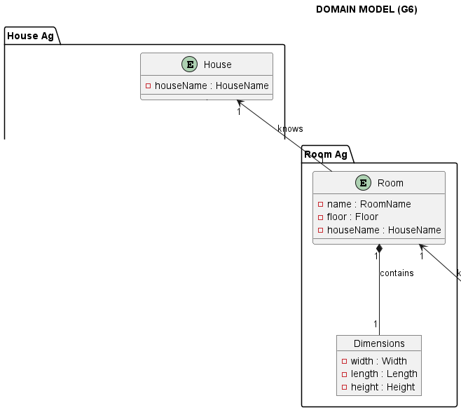
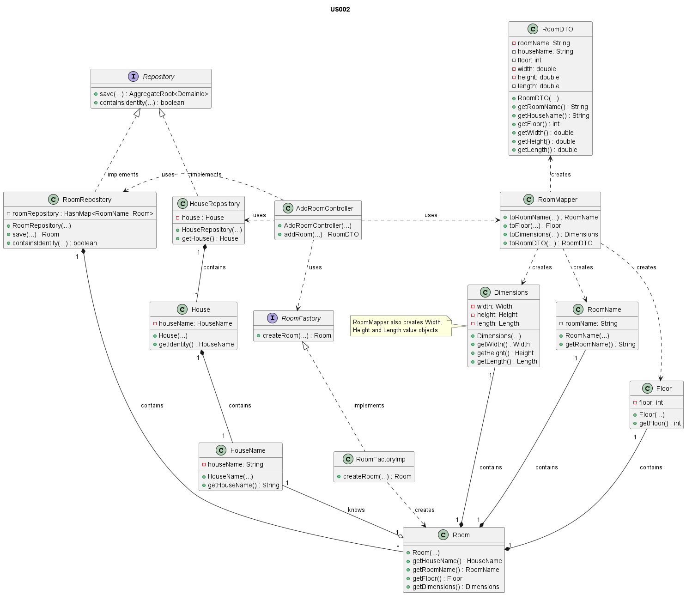

# US002 - Add a New Room to the House

### Table of Contents

1. [Requirements](#1-requirements)
    - [Dependency on other User Stories](#dependency-on-other-user-stories)
2. [Analysis](#2-analysis)
    - [Relevant Domain Model excerpt](#relevant-domain-model-excerpt)
3. [Design](#3-design)
    - [Class diagram](#class-diagram)
    - [Sequence diagram](#sequence-diagram)
    - [Applied design patterns and principles](#applied-design-patterns-and-principles)
4. [Tests](#4-tests)
    - [Acceptance Tests](#acceptance-tests)
    - [Unit tests](#unit-tests)
    - [Integration tests](#integration-tests)
5. [Implementation](#5-implementation)
6. [Conclusion](##6-conclusion)

## 1. Requirements

_As an Administrator, I want to add a new room to the house, in order to
configure it (name, house floor and dimensions)._

Requirements to add a new room to the house:

- The room must have a unique name.
- The room must know the house name that it belongs to.
- The room must have a floor number.
- The room must have valid dimensions (width, length, and height).

### Dependency on other User Stories

None

## 2. Analysis

#### The Room class is a fundamental entity in the system.
As mentioned in the requirements, the Room class is composed by the following attributes:

| Attribute      | Rules                                                                                |
|----------------|--------------------------------------------------------------------------------------|
| **RoomName**   | Must be a unique identity. It is provided by the administrator.                      |
| **HouseName**  | Must not be null. Must correspond to an existing house identity saved in the system. |
| **Floor**      | Must not be null. Must correspond to a valid floor number.                           |
| **Dimensions** | Must not be null. Must be composed by width, height and length.                      |
| Width          | Must be composed by a value above zero.                                              |
| Height         | Must be composed by a value above zero.                                              |
| Length         | Must be composed by a value above zero.                                              |

In the context of adding a new room to the house, several key interactions occur within the system. These interactions ensure that the location is properly validated and stored in the system.

The following steps outline the key interactions that occur when configuring the location of the house:

1. The Administrator interacts with the system to add a new room to the house.
2. The Administrator provides the room name, floor number and the dimensions of the room to be added.
3. The system validates the input data.
- If  the data is valid:
4. The system creates and stores the new room data.
5. The system confirms success by returning the saved room data.
- Else:
4. The system returns an error.

### Relevant Domain Model excerpt

Below is the relevant domain model excerpt for this user story:



## 3. Design

### Class Diagram

Below is the class diagram for this user story:


### Sequence Diagram

Below is the sequence diagram for this user story:


### Applied Design Patterns and Principles

* **Controller** - A design pattern that separates the logic of the system from the user interface. _AddRoomController_ is responsible for receiving the input from the administrator, processing it, and initiating the addition of a room.


* **Information Expert and Single Responsibility** - Each created class is focused on a single responsibility. Also each class knows how to manage its own data and responsibilities encapsulating the logic within the class itself.


* **Creator** - The _RoomFactory_ class plays a crucial role in the creation of rooms. 
  It encapsulates the logic required to instantiate a new room and uses information provided by the controller, ensuring that each room is created in a valid state.


* **Low Coupling** - By decoupling the creation process from the _Room_ class responsibilities, the system gains flexibility. Adjustments to how rooms are created or initialized can be made
  independently of their core functionalities.


* **High Cohesion** - The _Room_ class is responsible for managing the room data, while the 
  _RoomRepository_ class is solely concerned with storing and retrieving room information and the _RoomFactory_ 
  class is responsible for creating rooms. This separation ensures that classes are focused and understandable.


* **Repository** - The _RoomRepository_ class act as Repository patterns, providing a way to store and retrieve room data.


* **Aggregate Root** - The _Room_ class is the aggregate root of the room entity/aggregate, as it is responsible for all invariants of the aggregate.


* **Value Object** - The _Dimensions_ class is an example of a value object that encapsulates the room width, height and length values. 
  By treating these values as value objects, the system ensures that they are immutable and can be shared without risk of modification.

## 4. Tests

### Acceptance Tests

- `Scenario 1:` The administrator wants to add a new room to the house for the first time.
    - **When** the administrator wants to add the first room to the house.
    - **Then** the system must be able to create the room from the administrator's input data.
    - **And** the system should be able to save the room.
    - **Then** the system should confirm the room was successfully created and stored by returning the saved room data.


- `Scenario 2:` The administrator wants to add a new room to the house (the house already has rooms).
    - **When** the administrator wants to add a new room to the house.
    - **Then** the system must be able to create the room from the administrator's input data.
    - **And** the system should be able to save the room.
    - **Then** the system should confirm the room was successfully created and stored by returning the saved room data.

    
- `Scenario 3:` The administrator wants to add a new room to the house with an invalid room name (room name is not unique).
    - **When** the administrator wants to add a new room to the house.
    - **Then** the system must be able to check if the room name is unique.
    - **And** if the room name is not unique, the system should return an error.

    
- `Scenario 4:` The administrator wants to add a new room to the house with invalid dimensions (width, height or length are zero or negative).
    - **When** the administrator wants to add a new room to the house.
    - **Then** the system must be able to check if the dimensions are not zero or negative.
    - **And** if the dimensions are zero or negative, the system should return an error.


### Unit Tests

#### Below are some relevant unit tests in the context of the **US002**:
Value Objects:

| Test Case                                                                                   | Expected Outcome                                              |
|---------------------------------------------------------------------------------------------|---------------------------------------------------------------|
| Test creating a room name value object with the provided name.                              | The system should correctly return a room name value object.  |
| Test creating a floor value object with the provided floor number.                          | The system should correctly return a floor value object.      |
| Test creating a dimensions value object with the provided valid width, height and length.   | The system should correctly return a dimensions value object. | 
| Test creating a dimensions value object with the provided invalid width, height and length. | The system should return an error.                            |

Repository:

| Test Case                                                                  | Expected Outcome                                                                                  |
|----------------------------------------------------------------------------|---------------------------------------------------------------------------------------------------|
| Test saving a room to the repository.                                      | The system should correctly store the provided room and return the saved room data.               |
| Test if the provided room name(identity) already exists in the repository. | The system should confirm if the provided room name exits in the repository and return the result |

For more information, please refer to the
[RoomTest](https://github.com/Departamento-de-Engenharia-Informatica/2023-2024-switch-dev-project-assignment-switch-project-2023-2024-grupo6/blob/main/src/test/java/smarthome/domain/room/RoomTest.java),
and
[RoomRepositoryTest](https://github.com/Departamento-de-Engenharia-Informatica/2023-2024-switch-dev-project-assignment-switch-project-2023-2024-grupo6/blob/main/src/test/java/smarthome/repository/RoomRepositoryTest.java) classes.


### Integration Tests

#### Below are some relevant integration tests in the context of the **US002**:

| Test Case                                                                                                    | Expected Outcome                                        |
|--------------------------------------------------------------------------------------------------------------|---------------------------------------------------------|
| Test creating a room when the provided data is valid.                                                        | The system should correctly return the saved room data. |
| Test creating a room when the provided house name is invalid (null or blank)                                 | The system should return an error.                      |
| Test creating a room when the provided room name is invalid (null or blank)                                  | The system should return an error.                      |
| Test creating a room when the provided room name is invalid (not unique)                                     | The system should return an error.                      | 
| Test creating a room when the provided dimensions are invalid (width, height or length are zero or negative) | The system should return an error.                      |

For more information, please refer to
the [AddRoomControllerTest](https://github.com/Departamento-de-Engenharia-Informatica/2023-2024-switch-dev-project-assignment-switch-project-2023-2024-grupo6/blob/main/src/test/java/smarthome/controller/AddRoomControllerTest.java).

## 5. Implementation

The `AddRoomController` class is responsible for receiving the input from the administrator, processing it, and initiating the addition of a room:

```java
public class AddRoomController {
    // Atributes

    public AddRoomController(RoomMapper roomMapper, RoomFactory roomFactory, RoomRepository roomRepository) {
        // Implementation of the constructor
    }

    public RoomDTO addRoom(RoomDTO roomDTO) {
        // Implementation of the method
    }
    
}
```

The `RoomFactory` class is responsible for creating a new room:

```java
public interface RoomFactory {
    
    Room createRoom(RoomName roomName, HouseName houseName, Floor floor, Dimensions dimensions);
}
```

The `RoomRepository` class is responsible for storing and retrieving room data:

```java
public class RoomRepository implements Repository<RoomName, Room> {

    private final Map<RoomName, Room> DATA = new HashMap<>();

    @Override
    public Room save(Room entity) {
        // Implementation of the method
    }

    @Override
    public boolean containsIdentity(RoomName id) {
        // Implementation of the method
    }
}
```

The `Room` class is responsible for holding the room's information and managing its state and behavior:

```java
public class Room implements AggregateRoot<RoomName> {
    // Attributes

    protected Room(RoomName roomName, HouseName houseName, Floor floor, Dimensions dimensions) {
        // Implementation of the constructor
    }
}
```

For more information, please refer to the
[AddRoomController](https://github.com/Departamento-de-Engenharia-Informatica/2023-2024-switch-dev-project-assignment-switch-project-2023-2024-grupo6/blob/main/src/main/java/smarthome/controller/AddRoomController.java),
[RoomFactory](https://github.com/Departamento-de-Engenharia-Informatica/2023-2024-switch-dev-project-assignment-switch-project-2023-2024-grupo6/blob/main/src/main/java/smarthome/domain/room/RoomFactory.java),
[RoomFactoryImp](https://github.com/Departamento-de-Engenharia-Informatica/2023-2024-switch-dev-project-assignment-switch-project-2023-2024-grupo6/blob/main/src/main/java/smarthome/domain/room/RoomFactoryImp.java),
[RoomRepository](https://github.com/Departamento-de-Engenharia-Informatica/2023-2024-switch-dev-project-assignment-switch-project-2023-2024-grupo6/blob/main/src/main/java/smarthome/repository/RoomRepository.java),
and
[Room](https://github.com/Departamento-de-Engenharia-Informatica/2023-2024-switch-dev-project-assignment-switch-project-2023-2024-grupo6/blob/main/src/main/java/smarthome/domain/room/Room.java)
classes.


## 6. Conclusion

In conclusion, this User Story introduces the functionality of creating and adding a room to a house into the system, utilizing
the `AddRoomController` class and the `Room`, `RoomFactory` and `RoomRepository` classes for effective addition and storage of room data.

[Back to Top](#us002---add-a-new-room-to-the-house)