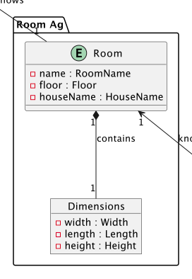
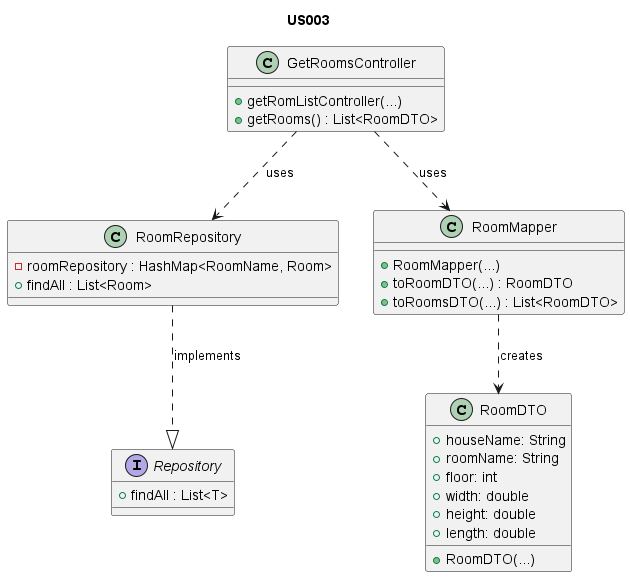
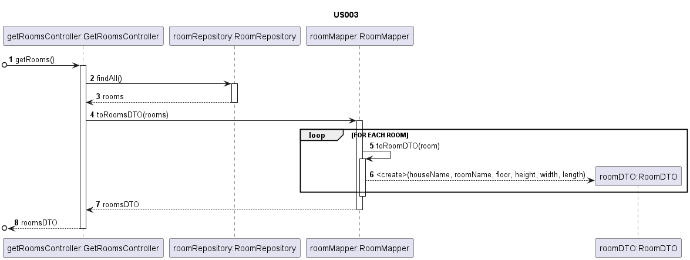

# US003 - List of rooms

# Table of Contents

1. [Requirements](#1-requirements)
    - [Dependency on other user stories](#dependency-on-other-user-stories)
2. [Analysis](#2-analysis)
    - [Relevant domain model excerpt](#relevant-domain-model-excerpt)
3. [Design](#3-design)
    - [Class diagram](#class-diagram)
    - [Sequence diagram](#sequence-diagram)
    - [Applied design patterns and principles](#applied-design-patterns-and-principles)
4. [Tests](#4-tests)
    - [Acceptance Tests](#acceptance-tests)
    - [Unit tests](#unit-tests)
    - [Integration tests](#integration-tests)
5. [Implementation](#5-implementation)
6. [Conclusion](#6-conclusion)

# 1. Requirements

_As an Administrator, I want to have a list of existing rooms, so that I can choose one to edit it._

## Dependency on other User Stories

While this User Story operates independently and doesn't directly rely on other stories, it's important to highlight 
its connection with User Story 2, which focuses on adding a new room. This relationship, although not a formal dependency,
is significant as US003's functionality to view rooms complements the actions undertaken in US002.

# 2. Analysis

This requirement is about providing a feature for the Administrator to view a list of all existing rooms.
The system should handle cases where there are no rooms available.

The `Room` class is composed by the following attributes:

| Attribute      | Rules                                                                 |
|----------------|-----------------------------------------------------------------------|
| **RoomName**   | Must be a unique identifier. Chosen by the user.                      |
| **HouseName**  | Must not be null or empty. Must correspond to an existing house.      |
| **Floor**      | Must not be null or empty. It represents a floor in the building      |
| **Dimensions** | Must not be null or empty. It is composed by length, width and height |

The system must support a series of actions that enable the Administrator to access a comprehensive list of rooms. 
The following steps illustrate the core interactions that occur from the moment the Administrator expresses the intent 
to view the rooms until the system presents the available options:

1. The Administrator requests to view the list of rooms.
2. The system retrieves the list of rooms from the repository.
3. The system displays the list of rooms to the Administrator.

## Relevant domain model excerpt

Below is the relevant domain model excerpt for this user story:



# 3. Design

## Class diagram

Below is the class diagram for this user story:


## Sequence diagram

Below is the sequence diagram for this user story:


## Applied design patterns and principles

* **Controller** - Uses a separation of concerns by handling user interaction away from the core logic. 
  The `GetRoomsController` class is tasked with processing the Administrator's request to view rooms, 
  bridging the gap between the user interface and the system's backend.
* **Information Expert** - The `Room` class encapsulates all necessary information about rooms and manages operations related
  to room details. This class knows how to manipulate its data and behaviors, acting as the knowledge holder for room attributes.
* **Low Coupling** - The design ensures `GetRoomsController` has minimal dependencies on other system components. 
  It interacts with `RoomRepository` and `RoomMapper`, but in a manner that reduces direct knowledge of their 
  implementations, enhancing system flexibility and maintainability.
* **High Cohesion** - Each class has a clearly defined responsibility. For example, `RoomRepository` is focused solely on
  the storage and retrieval of room data, promoting a design where classes are dedicated and comprehensible.
* **Single Responsibility Principle (SRP)** - Adhering to SRP, the `Room` class exclusively manages room properties and 
  behaviors, steering clear of responsibilities like data persistence. This focus makes the class simpler to comprehend 
  and maintain.
* **Repository** - The `RoomRepository` serves as a repository, overseeing the persistence of room objects.
  It offers methods as `save`, `findAll`, `getByIdentity` and `containsIdentity`, ensuring that room data is accurately managed.
* **Aggregate Root** - Following Domain-Driven Design, the `Room` class acts as an aggregate root for the room domain. 
  It serves as the primary point of interaction for room-related operations, safeguarding consistency and integrity 
  across the domain.
* **Value Object** - Attributes such as `RoomName`, `Floor`, and `Dimensions` are treated as value objects. 
  They encapsulate room properties in immutable objects, facilitating shared use across different parts of the 
  application without risking unintended modifications.

# 4. Tests

## Acceptance Tests

- **Scenario 1**: No Rooms Available
  - **Given** the system does not have any rooms listed.
  - **When** the Administrator requests to view the list of rooms.
  - **Then** the system should display an empty list of rooms.

- **Scenario 2**: Retrieving the list of rooms
  - **Given** the system contains a list of existing rooms.
  - **When** the Administrator requests to view the list of rooms.
  - **Then** the system should display the list of all available rooms.


## Unit tests

Below are some relevant unit tests for this user story, focusing on retrieval of rooms.

| Test Case                               | Expected Outcome                                                            |
|-----------------------------------------|-----------------------------------------------------------------------------|
| Test retrieving all the rooms.          | The system successfully retrieves all the rooms in the repository.          |
| Test retrieving an empty list of rooms. | The system should return an empty result when the Room repository is empty. |

For more information on testing and validation, please refer to the
[RoomRepositoryTest](https://github.com/Departamento-de-Engenharia-Informatica/2023-2024-switch-dev-project-assignment-switch-project-2023-2024-grupo6/blob/main/src/test/java/smarthome/repository/RoomRepositoryTest.java)
class.

## Integration tests

| Scenario                                 | Test Case                           | Expected Outcome                                   |
|------------------------------------------|-------------------------------------|----------------------------------------------------|
| Scenario 1: No Rooms Available           | Retrieve rooms list with no rooms.  | The system displays an empty list.                 |
| Scenario 2: Retrieving the list of rooms | Retrieve rooms list with all rooms. | The system displays the list of available rooms.   |

For more information on integration testing and validation, please refer to
the [GetRoomsControllerTest](https://github.com/Departamento-de-Engenharia-Informatica/2023-2024-switch-dev-project-assignment-switch-project-2023-2024-grupo6/blob/main/src/test/java/smarthome/controller/GetRoomsControllerTest.java).

# 5. Implementation

The `GetRoomsController` class is responsible for receiving the input from the Administrator and
calling the method to have the list of Rooms.

```java
public List<RoomDTO> getRooms() {
  // Implementation of the method
}
```

The `RoomRepository` class is responsible for retrieving the Room objects when needed.

```java
public Iterable<Room> findAll() {
  // Implementation of the method
}
```

For more information on the implementation of this user story, please refer to the
[GetRoomsController](https://github.com/Departamento-de-Engenharia-Informatica/2023-2024-switch-dev-project-assignment-switch-project-2023-2024-grupo6/blob/main/src/main/java/smarthome/controller/GetRoomsController.java),
and
[RoomRepository](https://github.com/Departamento-de-Engenharia-Informatica/2023-2024-switch-dev-project-assignment-switch-project-2023-2024-grupo6/blob/main/src/main/java/smarthome/repository/RoomRepository.java),
classes.

# 6. Conclusion

To summarize, this User Story illustrates the process of viewing rooms within the system.
It's an essential feature, provides the Administrators to easily access and review room details, enhancing the system's functionality and utility.
Room attributes, including name, location, and dimensions, play an important role by detailing essential aspects of each space.
These details are very important for both system navigation and user comprehension.
The validation of these room attributes prior to their display is crucial for maintaining the system's integrity and
reliability, ensuring data precision and reducing potential errors.
Ultimately, the capability to efficiently list rooms improves the system's effectiveness in managing space resources,
providing Administrators with a simple and reliable method for space overview.

[Back to top](#us003---list-of-rooms)