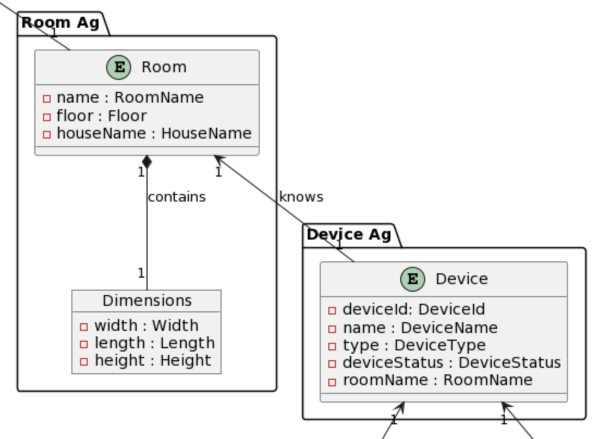
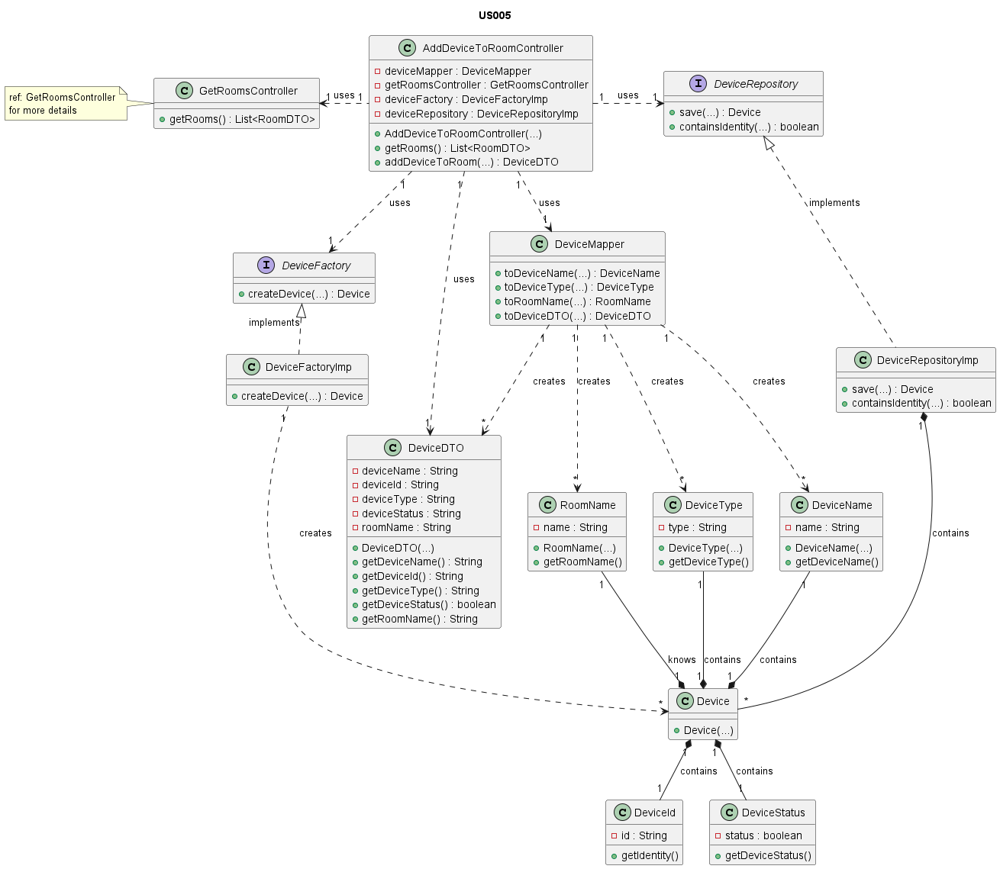
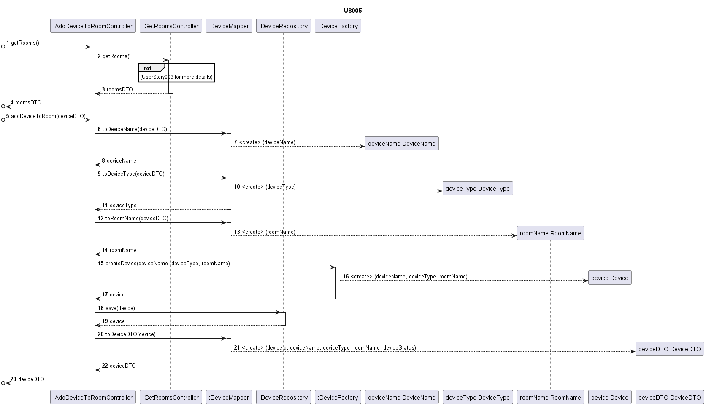

# US005 - Add a device to a room

### Table of Contents

1. [Requirements](#1-requirements)
    - [Dependency on other user stories](#dependency-on-other-user-stories)
2. [Analysis](#2-analysis)
    - [Relevant domain model excerpt](#relevant-domain-model-excerpt)
3. [Design](#3-design)
    - [Class diagram](#class-diagram)
    - [Sequence diagram](#sequence-diagram)
    - [Applied design patterns and principles](#applied-design-patterns-and-principles)
4. [Tests](#4-tests)
    - [Acceptance tests](#acceptance-tests)
    - [Unit tests](#unit-tests)
    - [Integration tests](#integration-tests)
5. [Implementation](#5-implementation)
6. [Conclusion](#6-conclusion)

## 1. Requirements

_As a Power User \[or Administrator], I want to add a new device to a room, in order to configure it._

Requirements for the device:

- A device has a name, so that the users understand its purpose.
- A device has a type/model.
- A device has a location (room).
- A device can be active or inactive.
- A device can include sensors, actuators or both.

### Dependency on other user stories

In order to add a device to a room, the Power User, or Administrator, should be able to get the list of rooms available
in the house, so that he can choose the room where the device will be added. This requirement is covered by the user
story **US003**.

## 2. Analysis

The Device class is composed by the following attributes:

| Attribute      | Rules                                                                                                                        |
|----------------|------------------------------------------------------------------------------------------------------------------------------|
| **DeviceName** | Must not be null or empty. Chosen by the user.                                                                               |
| **DeviceId**   | Must be a unique identifier. It is generated automatically.                                                                  |
| **DeviceType** | Must not be null or empty. A string indicating the type of the device.                                                       |
| **Status**     | Must be a boolean indicating whether the device is active or not. When the device is created, it is activated automatically. |
| **RoomName**   | Must not be null or empty. Must correspond to an existing room in the house.                                                 |

In the context of adding a device to a room, several key interactions occur within the system. These interactions ensure
that the device is properly validated, registered, and associated with the correct room.
The following steps outline the key interactions that occur when adding a device to a room:

1. The Power User, or Administrator, interacts with the system to add a new device to a room.
2. The system retrieves the list of available rooms.
3. The Power User, or Administrator, selects the room where the device will be added.
4. The Power User, or Administrator, provides the device name, type, and room name.
5. The system validates the input data.
6. The system generates a unique device ID and sets the status to active.
7. The system adds the new device to the specified room.
8. The system confirms the successful addition of the device to the room, displaying the added device.

### Relevant domain model excerpt

Below is the relevant domain model excerpt for this user story:



# 3. Design

### Class diagram

Below is the class diagram for this user story:


### Sequence diagram

Below is the sequence diagram for this user story:


### Applied design patterns and principles

* **Controller** - A design pattern that separates the logic of the system from the user
  interface. `AddDeviceToRoomController` class is responsible for receiving the user's input, processing it, and
  initiating the addition of a new device.
* **Information Expert** - The `Device` class holds all necessary information about devices and is responsible for
  device-related operations. It knows how to handle its own data and behaviors.
* **Creator** - The `DeviceFactory` class is in charge of creating `Device` objects. It uses information provided by the
  controller to construct new devices, ensuring they are correctly initialized in a valid state.
* **Low Coupling** - The `AddDeviceToRoomController` maintains a low level of dependency on other classes. It interacts
  with the `DeviceRepository`, `DeviceMapper`, and `DeviceFactory`, but does so in a way that minimizes direct knowledge
  of their inner workings, making the system more flexible and maintainable.
* **High Cohesion** - Each class is focused on a single responsibility. For instance, the `DeviceRepository` is solely
  concerned with storing and retrieving device information, ensuring that classes are focused and understandable.
* **Single Responsibility Principle (SRP)** - The `Device` class follows SRP by managing the state and behavior of
  devices only, without overreaching into other areas like storage. This separation of concerns makes the class easier
  to understand and maintain.
* **Repository** - The `DeviceRepository` acts as a repository, managing the persistence of device objects. It provides
  methods for storing and retrieving devices, ensuring that data is correctly managed and maintained.
* **Aggregate Root** - The `Device` entity functions as the root for the device aggregate, acting as the primary entry
  point for device operations and ensuring consistency and integrity within the domain.
* **Value Object** - Elements like `DeviceName`, `DeviceType`, and `RoomName` are value objects, representing simple
  pieces of data that are used to describe devices. They are immutable and can be shared between objects without risk of
  modification.

## 4. Tests

### Acceptance tests

- **Scenario 1**: Retrieving the list of rooms before adding a device
    - **Given** the system has a list of rooms.
    - **When** a power user or administrator requests the list of rooms.
    - **Then** the system should display the list of available rooms.


- **Scenario 2**: Adding a device to a room
    - **Given** a list of rooms is available.
    - **When** a power user or administrator selects a room and specifies a new device's details.
    - **Then** the system should validate the device's details.
    - **And** the system should save the new device in the selected room.
    - **And** the system should confirm the addition by displaying the room with the new device.


- **Scenario 3**: Adding multiple devices to multiple rooms
    - **Given** a list of rooms is available.
    - **When** a power user or administrator adds multiple devices to different rooms.
    - **Then** the system should validate each device's details.
    - **And** the system should save each device in the respective room.
    - **And** the system should confirm each addition by providing the details of the newly added devices.


- **Scenario 4**: Adding a device with invalid details
    - **Given** a list of rooms is available.
    - **When** a power user or administrator attempts to add a device with incomplete or invalid details.
    - **Then** the system should reject the device addition.
    - **And** the system should indicate the addition was unsuccessful due to the provided details.


- **Scenario 5**: Test the persistence of the attributes of the device
    - **Given** a device has been added to a room.
    - **When** the DeviceRepository is called to retrieve the device that was added.
    - **Then** the device's attributes should match the details provided during the addition process.

### Unit tests

Below are some relevant unit tests for this user story, focusing on the creation of devices.

| Test Case                                    | Expected Outcome                                                                                |
|----------------------------------------------|-------------------------------------------------------------------------------------------------|
| Test creating a device with valid details.   | The system should successfully create a device with the provided details and return the device. |
| Test creating a device with invalid details. | The system should reject the creation and throw an error.                                       |

Below are some relevant unit tests for this user story, focusing on the storage and retrieval of devices.

| Test Case                                  | Expected Outcome                                                                  |
|--------------------------------------------|-----------------------------------------------------------------------------------|
| Test saving a device.                      | The system successfully saves the device in the repository and return the device. |
| Test saving a device with invalid details. | The system should reject the saving and throw an error.                           |
| Test retrieving a device by its identity.  | The system successfully retrieves the device using its identity.                  |
| Test retrieving a non-existent device.     | The system should return an empty result when the device does not exist.          |

For more information on unit testing and validation, please refer to the
[DeviceTest](https://github.com/Departamento-de-Engenharia-Informatica/2023-2024-switch-dev-project-assignment-switch-project-2023-2024-grupo6/blob/main/src/test/java/smarthome/domain/device/DeviceTest.java)
and
[DeviceRepositoryTest](https://github.com/Departamento-de-Engenharia-Informatica/2023-2024-switch-dev-project-assignment-switch-project-2023-2024-grupo6/blob/main/src/test/java/smarthome/repository/DeviceRepositoryTest.java)
classes.

### Integration tests

Below are some relevant integration tests for this user story.

| Scenario                                                         | Test Case                                                   | Expected Outcome                                                                                                                             |
|------------------------------------------------------------------|-------------------------------------------------------------|----------------------------------------------------------------------------------------------------------------------------------------------|
| Scenario 1: Retrieving the list of rooms before adding a device  | Retrieve rooms list with multiple rooms.                    | The system displays the list of available rooms.                                                                                             |
|                                                                  | Retrieve rooms list with no rooms.                          | The system displays an empty list.                                                                                                           |
| Scenario 2: Adding a device to a room                            | Add a device with valid details to a room.                  | The system validates device details, saves the device in the room, and confirms by showing the added device.                                 |
| Scenario 3: Adding multiple devices to multiple rooms            | Add multiple devices with valid details to different rooms. | The system validates each device's details, saves them in their respective rooms, and confirms each addition by showing the updated details. |
|                                                                  | Add multiple devices, to different rooms.                   | The system validates each device's details, rejects devices with invalid details, and confirms successful additions.                         |
| Scenario 4: Adding a device with invalid details                 | Add a device with an invalid device name (blank or null)    | The system rejects the addition and throws an error.                                                                                         |
|                                                                  | Add a device with an invalid device type (blank or null).   | The system rejects the addition and throws an error.                                                                                         |
|                                                                  | Add a device with an invalid room name (blank or null).     | The system rejects the addition and throws an error.                                                                                         | |
| Scenario 5: Test the persistence of the attributes of the device | Verify attributes of a device after addition.               | The device's attributes should match the provided details.                                                                                   |

For more information on integration testing and validation, please refer to
the [AddDeviceToRoomControllerTest](https://github.com/Departamento-de-Engenharia-Informatica/2023-2024-switch-dev-project-assignment-switch-project-2023-2024-grupo6/blob/main/src/test/java/smarthome/controller/AddDeviceToRoomControllerTest.java).

## 5. Implementation

The `AddDeviceToRoomController` class is responsible for receiving the input from the Power User or Administrator and
calling the method to add the device to the room.

```java
public class AddDeviceToRoomController {
    // Attributes

  public AddDeviceToRoomController(DeviceMapper deviceMapper, DeviceFactory deviceFactory, DeviceRepository deviceRepository, GetRoomsController getRoomsController) {
        // Implementation of the constructor
    }

    public List<RoomDto> getRooms(String houseName) {
        // Implementation of the method
    }

    public HouseDTO addDeviceToRoom(HouseDTO houseDTO) {
        // Implementation of the method
    }
}
```

The `DeviceFactory` class is responsible for creating new device objects.

```java
public class DeviceFactoryImp implements DeviceFactory {

  @Override
  public Device createDevice(String deviceName, String deviceType, String roomId) {
    // Implementation of the method
  }
}
```

The `DeviceRepository` class is responsible for storing the device objects and retrieving them when needed.

```java
public class DeviceRepository implements Repository<DeviceId, Device> {

  @Override
  public Device save(Device device) {
    // Implementation of the method
  }

  @Override
  public Optional<Device> getByIdentity(DeviceId id) {
    // Implementation of the method
  }
}
```

The `Device` class is responsible for holding the device's attributes and managing its state and behavior.

```java
public class Device implements AggregateRoot<DeviceId> {

  // Attributes

  protected Device(DeviceName deviceName, DeviceType deviceType, RoomName roomId) {
    // Implementation of the constructor
  }
}
```

For more information on the implementation of this user story, please refer to the
[AddDeviceToRoomController](https://github.com/Departamento-de-Engenharia-Informatica/2023-2024-switch-dev-project-assignment-switch-project-2023-2024-grupo6/blob/main/src/main/java/smarthome/controller/AddDeviceToRoomController.java),
[DeviceFactoryImp](https://github.com/Departamento-de-Engenharia-Informatica/2023-2024-switch-dev-project-assignment-switch-project-2023-2024-grupo6/blob/main/src/main/java/smarthome/domain/device/DeviceFactoryImp.java),
[DeviceRepository](https://github.com/Departamento-de-Engenharia-Informatica/2023-2024-switch-dev-project-assignment-switch-project-2023-2024-grupo6/blob/main/src/main/java/smarthome/repository/DeviceRepository.java),
and
[Device](https://github.com/Departamento-de-Engenharia-Informatica/2023-2024-switch-dev-project-assignment-switch-project-2023-2024-grupo6/blob/main/src/main/java/smarthome/domain/device/Device.java)
classes.

## 6. Conclusion

To summarize, this User Story highlights the role of adding devices to rooms within the system.
This functionality is pivotal as it enables Administrators, or Power Users, to configure and integrate new devices
seamlessly, enhancing the system's capabilities.
The attributes associated with each device hold significant importance as they define crucial characteristics such as
device name, type, status, and location.
These attributes provide essential information for system operations and user understanding.
Validation of input data is imperative to ensure data integrity and system reliability.
By validating device details before saving, the system maintains data accuracy and consistency, minimizing errors and
potential disruptions.
Confirmation of successful device addition provides reassurance and clarity, affirming that the system has processed
their actions accurately and effectively.

[Back to top](#us005---add-a-device-to-a-room)
