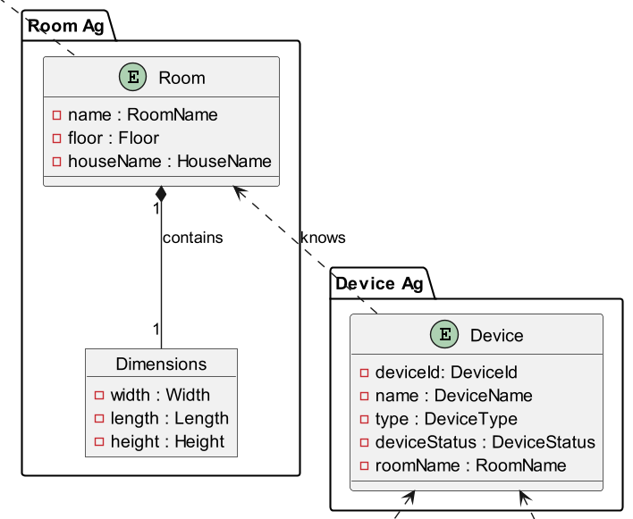
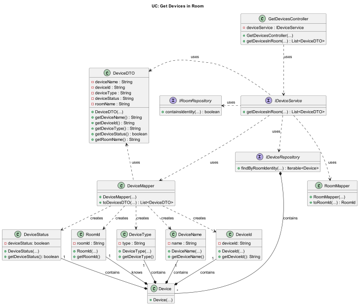

# US006 - Get a List of All Devices In a Room

### Table of Contents

1. [Requirements](#1-Requirements)
    - [Dependency on other user stories](#dependency-on-other-user-stories)
2. [Analysis](#2-analysis)
    - [Relevant domain model excerpt](#relevant-domain-model-excerpt)
3. [Design](#3-design)
    - [Class diagram](#class-diagram)
    - [Sequence diagram](#sequence-diagram)
    - [Applied design patterns and principles](#applied-design-patterns-and-principles)
4. [Tests](#4-tests)
    - [Acceptance Tests](#Acceptance-Tests)
    - [Unit tests](#unit-tests)
    - [Integration tests](#integration-tests)
5. [Implementation](#5-implementation)
6. [Conclusion](##6-conclusion)

## 1. Requirements

_As a Room Owner (or Power User, or Administrator), I want to get a list of all
devices in a room, so that I can configure them._

Requirements to get a list of all
devices in a room:

- There must be at least one room in the house.
- Each room must have a unique name, serving as its identity. 
- Devices must be associated with a room.
- Devices must have a unique identity and automatically generated.
- Devices must have a valid name.
- Devices must have a valid type.
- Devices must have a status (e.g., active, idle).
- The system must be able to retrieve a list of all rooms in the house.
- The system must be able to present the list of all rooms to the user for selection.
- The system must provide a mechanism to fetch all devices in a given room based using its unique name/identity.
- The system must ensure that the room name provided is valid. 
- The system must ensure that the room name is not null. 
- The system must ensure that the room name corresponds to an existing room identity saved in the system.
- The system must be capable of filtering devices based on the provided room name. 
- The system must retrieve all devices from the device repository. 
- The system must ensure that each device has a valid device ID, device name, device type, room name, and device status.
The system must ensure that the device room name corresponds to an existing room identity saved in the system.
- The system must ensure that the device room name matches the provided room name.
- The system must be able to present the list of all devices in the specified room to the user.

These requirements ensure that the system can fulfill the user story's functionality of first allowing the user to choose a room from the list of all rooms in the house and then retrieving a list of all devices in the selected room.

### Dependency on other User Stories

In order to get a list of devices pertaining to a specific room, the user must first get access to the list of all the rooms
available in the system. Having consulting this list, the User must choose the name of the room they wish to retrieve the list of devices from. 
This dependency comes from **US003**.

The functionality to retrieve a list of all rooms in the house depends on the existence and proper functioning of mechanisms responsible for handling this request. This dependency has been previously addressed in User Story **US003**, which covers the requirement for obtaining the necessary data to select a room for device configuration. Therefore, this dependency will not be reiterated in subsequent sections of this report.

## 2. Analysis

#### The Device is a fundamental component within the system, serving as both an entity and an aggregate root.
As mentioned in the requirement, the Device class is composed by the following attributes:

| Attribute        | Rules                                                                          |
|------------------|--------------------------------------------------------------------------------|
| **DeviceID**     | Must be a unique identifier. Automatically generated.                          |
| **RoomName**     | Must not be null. Represents the name of the room where the device is located. |
| **DeviceName**   | Must not be null. Represents the name of the device.                           |
| **DeviceType**   | Must not be null. Represents the type/category of the device.                  |
| **DeviceStatus** | Must not be null. Represents the current status of the device.                 |


In the context of adding a new room to the house, several key interactions occur within the system. These interactions ensure that the location is properly validated and stored in the system.

The following steps outline the key interactions that occur when configuring the location of the house:

1. The Administrator interacts with the system to add a new room to the house.
2. The Administrator provides the room name, floor number and the dimensions of the room to be added.
3. The system validates the input data.
- If  the data is valid:
4. The system creates and stores the new room data.
5. The system confirms success by returning the saved room data.
- Else:
4. The system returns an error.


### Relevant Domain Model excerpt

Below is the relevant domain model excerpt for this user story:



## 3. Design

### Class Diagram

Below is the class diagram for this user story:


### Sequence Diagram

Below is the sequence diagram for this user story:


### Applied Design Patterns and Principles

* **Controller** - A design pattern that separates the logic of the system from the user interface. _GetDevicesController_ manages the retrieval of devices in a specific room. It coordinates interactions between the user interface and the underlying data layer to fulfill the user's request.


* **Information Expert and Single Responsibility** - Each created class is focused on a single responsibility. Also each class knows how to manage its own data and responsibilities encapsulating the logic within the class itself.


* **Creator** - The _RoomFactory_ class plays a crucial role in the creation of rooms. 
  It encapsulates the logic required to instantiate a new room and uses information provided by the controller, ensuring that each room is created in a valid state.


* **Low Coupling** - By decoupling the creation process from the _Room_ class responsibilities, the system gains flexibility. Adjustments to how rooms are created or initialized can be made
  independently of their core functionalities.


* **High Cohesion** - The _Room_ class is responsible for managing the room data, while the 
  _RoomRepository_ class is solely concerned with storing and retrieving room information and the _RoomFactory_ 
  class is responsible for creating rooms. This separation ensures that classes are focused and understandable.


* **Repository** - The _RoomRepository_ class act as Repository patterns, providing a way to store and retrieve room data.


* **Aggregate Root** - The _Room_ class is the aggregate root of the room entity/aggregate, as it is responsible for all invariants of the aggregate.


* **Value Object** - The _Dimensions_ class is an example of a value object that encapsulates the room width, height and length values. 
  By treating these values as value objects, the system ensures that they are immutable and can be shared without risk of modification.

* **Dependency Injection and Collaboration** - The _GetDevicesController_ collaborates with the following components:

  - _GetRoomsController_: Responsible for fetching the list of all rooms in the house. This dependency is managed through dependency injection, ensuring loose coupling between components.
  - _RoomMapper_: Facilitates the conversion between Room entities and DTOs.
  - _DeviceRepository_: Manages the persistence of device data.
  - _DeviceMapper_: Facilitates the conversion between Device entities and DTOs.

The collaboration between these components enables the **GetDevicesController** to retrieve and present the necessary device information to the user effectively.

## 4. Tests

### Acceptance Tests

- `Scenario 1:` The user wants to retrieve devices in a room for the first time.
    - **Given** the user wants to retrieve devices in a room.
    - **When** the user selects a room from the list of available rooms.
    - **Then** the system should retrieve and present the list of devices in the selected room.


- `Scenario 2:` The user wants to retrieve devices in a room with existing devices.
    - **Given** the user wants to retrieve devices in a room.
    - **When** the user selects a room with existing devices.
    - **Then** the system should retrieve and present the list of devices in the selected room.

    
- `Scenario 3:` The user wants to retrieve devices in a room with no devices.
    - **When** the user selects a room that does not contain any devices.
    - **Then** the system must be able to check if the room name is unique.
    - **And** The selected room exists in the system.
    - **And** The selected room does not have any devices associated with it.
    - **When**: The user requests to view the devices in the selected room.
    - **Then**: The system should return an empty list of devices when there are no devices configured in the selected room.


### Unit Tests

#### Below are some relevant unit tests in the context of the **US006**:
Value Objects:

| Test Case                                                                                         | Expected Outcome                                                 |
|---------------------------------------------------------------------------------------------------|------------------------------------------------------------------|
| Test creating a device name value object with the provided name.                                  | The system should correctly return a device name value object.   |
| Test creating a device type value object with the provided type/category.                         | The system should correctly return a device type value object.   |
| Test creating a room name value object with the provided room name.                               | The system should correctly return a room name value object.     |
| Test creating a device status value object with the provided status (active, idle, etc.).         | The system should correctly return a device status value object. |
| Test creating a device status value object with an invalid status (null, empty, or unrecognized). | The system should return an error.                               |

Repository:

| Test Case                                                                       | Expected Outcome                                                                                    |
|---------------------------------------------------------------------------------|-----------------------------------------------------------------------------------------------------|
| Test saving a device to the repository.                                         | The system should correctly store the provided device and return the saved device data.             |
| Test if the provided room name exists in the repository before saving a device. | The system should confirm if the provided room name exists in the repository and return the result. |
| Test if the provided device ID is unique before saving a device.                | The system should ensure that the provided device ID is unique and return the result.               |


### Integration Tests

#### Below are some relevant integration tests in the context of the **US006**:

| Test Case                                                                                                      | Expected Outcome                                        |
|----------------------------------------------------------------------------------------------------------------|---------------------------------------------------------|
| Test retrieving devices in a room when the provided room name exists and there are devices associated with it. | The system should return a list of devices in the room. |
| Test retrieving devices in a room when the provided room name does not exist in the repository.                | The system should return an empty list.                 |
| Test retrieving devices in a room when there are no devices associated with the provided room name.            | The system should return an empty list.                 |
| Test retrieving devices in a room when the device associated with the room is null.                            | The system should throw a NullPointerException.         |
| Test retrieving devices in a room when at least one device is associated with the provided room name.          | The system should return a list of devices.             |


## 5. Implementation

The `GetDevicesController` class is responsible for retrieving the list of devices in a specific room:

```java

public class GetDevicesController {
// Attributes and dependencies

    public GetDevicesController(GetRoomsController getRoomsController, RoomMapper roomMapper, DeviceRepository deviceRepository, DeviceMapper deviceMapper) {
        // Constructor implementation
    }

    public List<DeviceDTO> getDevicesInRoom(RoomDTO roomDTO) {
        // Method implementation
    }

    // Other methods
}
```

The `RoomMapper class` is responsible for mapping between DTOs and domain entities for rooms:

```java

public class RoomMapper {
    public RoomDTO toDTO(Room room) {
        // Implementation to map Room entity to RoomDTO
    }

    public RoomName toRoomName(RoomDTO roomDTO) {
        // Implementation to map RoomDTO to RoomName value object
    }
    }
}
```

The `DeviceRepository` class is responsible for storing and retrieving device data:

```java

public class DeviceRepository {
    private final Map<DeviceID, Device> deviceData = new HashMap<>();

    public void save(Device device) {
        // Implementation to save device data
    }

    public List<Device> findAll() {
        // Implementation to retrieve all devices
    }

    public List<Device> findByRoomName(RoomName roomId) {
        // Implementation to retrieve devices by room name
    }
}
```

The `DeviceMapper` class is responsible for mapping between DTOs and domain entities for devices:

```java

public class DeviceMapper {
    public DeviceDTO toDTO(Device device) {
        // Implementation to map Device entity to DeviceDTO
}
```

The `RoomDTO` class represents the Data Transfer Object (DTO) for rooms:

```java

public class RoomDTO {
    public RoomDTO(String roomId, int floor, double height, double width, double length) {
        // Implementation details
}

    public String getRoomName() {
        return roomId;
    }
}
```

The `DeviceDTO` class represents the Data Transfer Object (DTO) for devices:

```java

public class DeviceDTO {
    public DeviceDTO(String deviceId, String deviceName, String deviceType, String roomId, boolean deviceStatus) {
        // Implementation details
    }

    public String getRoomName() {
        return roomId;
    }
}
```

These classes and components work together to fulfill the requirements outlined in US006, allowing users to retrieve a list of devices in a specified room.

## 6. Conclusion

In conclusion, the implementation of US006 enables users to retrieve devices in specific rooms effectively, in order to configure them eventually. By efficiently handling controllers, mappers, repositories, and DTOs, the system facilitates seamless interactions between the user interface and the underlying data layer. The design patterns and principles applied in this user story ensure that the system is flexible, maintainable, and scalable, allowing for future enhancements and modifications. The tests conducted validate the functionality of the system, ensuring that the requirements of US006 are met successfully. Overall, the implementation of US006 enhances the system's capabilities, providing users with a valuable feature to manage devices in their rooms effectively.

[Back to top](#us006---Get-a-List-of-All-Devices-In-a-Room)
