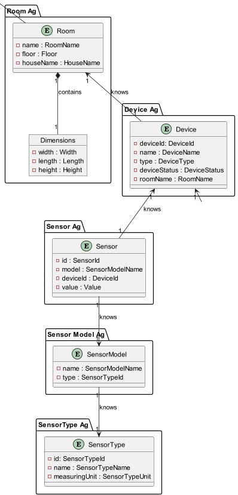
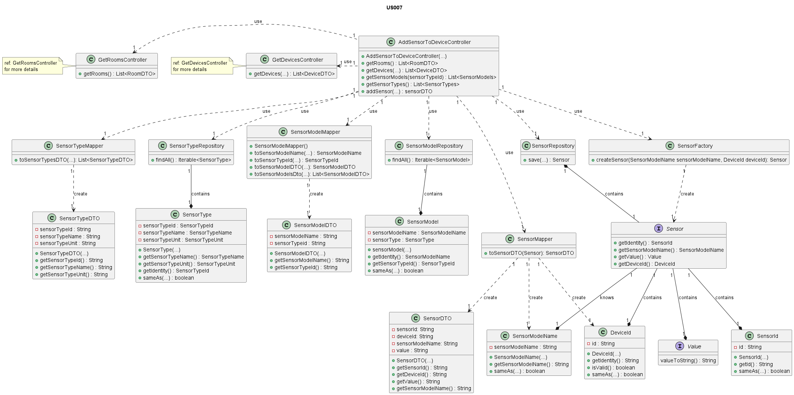
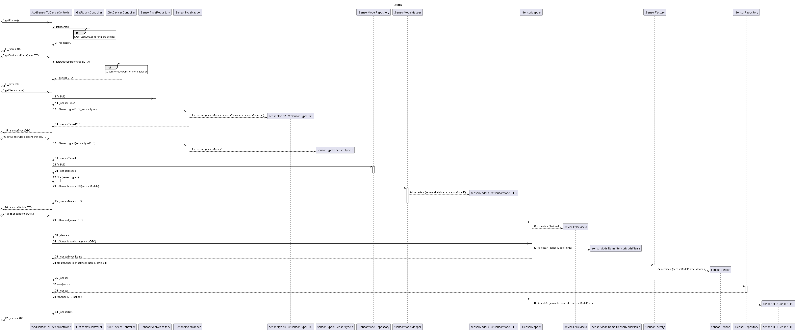

# US007 - Add a sensor to an existing device in a room.

# Table of Contents

1. [Requirements](#requirements)
    - [Dependency on other user stories](#dependency-on-other-user-stories)
2. [Analysis](#analysis)
    - [Relevant domain model excerpt](#relevant-domain-model-excerpt)
3. [Design](#design)
    - [Class diagram](#class-diagram)
    - [Sequence diagram](#sequence-diagram)
    - [Applied design patterns and principles](#applied-design-patterns-and-principles)
4. [Tests](#tests)
    - [Acceptance Tests](#Acceptance-tests)
    - [Unit tests](#unit-tests)
    - [Integration tests](#integration-tests)
5. [Implementation](#implementation)
6. [Observations](#observations)

# 1. Requirements

_As a Power User [or Administrator], I want to add a sensor to an existing device in
a room. The sensor must be of a model of an existing type of sensor._

Requirements for adding a sensor to a device:

-The system should allow the addition of a sensor to an existing device.

-The sensor must belong to an existing type of sensor.

-The sensor should be associated with a specific device.

-The sensor should be added to a room where the device is located.

## Dependency on other user stories

UserStory 003 - As an Administrator, I want to have a list of existing rooms, so that I can choose
one to edit it.

UserStory 006 - As a Room Owner [or Power User, or Administrator], I want to get a list of all
devices in a room, so that I can configure them.

# 2. Analysis

The addition of a sensor to an existing device involves interactions between various components of the system. These
interactions ensure that the sensor is correctly validated, associated with the device, and added to the specified room.

The following steps outline the key interactions that occur when adding a sensor to an existing device in a room:

| Attribute             | Rules                                                                                                                                       |
|-----------------------|---------------------------------------------------------------------------------------------------------------------------------------------|
| sensorTypeMapper      | This attribute is likely responsible for mapping objects of type SensorType between the application domain and the data persistence layer.  |
| sensorTypeRepository  | This attribute is likely responsible for interacting with the data persistence layer to retrieve and store objects of type SensorType.      |
| sensorModelMapper     | This attribute is likely responsible for mapping objects of type SensorModel between the application domain and the data persistence layer. |
| sensorModelRepository | This attribute is likely responsible for interacting with the data persistence layer to retrieve and store objects of type SensorModel.     |
| sensorRepository      | This attribute is likely responsible for interacting with the data persistence layer to retrieve and store objects of type Sensor.          |
| sensorFactory         | This attribute is likely responsible for creating new objects of type Sensor.                                                               |
| sensorMapper          | This attribute is likely responsible for mapping objects of type Sensor between the application domain and the data persistence layer.      |
| getRoomsController    | This attribute is likely responsible for providing functionality related to obtaining the list of available rooms.                          |
| getDevicesController  | This attribute is likely responsible for providing functionality related to obtaining the list of available devices.                        |

## Relevant domain model excerpt

Below is the relevant domain model excerpt for this user story, illustrating the relationship between the
AddSensorToDeviceController class and the sensor configuration process:

The AddSensorToDeviceController class is a pivotal component in the system's architecture, responsible for orchestrating
the addition of sensors to devices. It interacts with various domain entities, including sensors, devices, and rooms, to
facilitate this process effectively. Through its methods, the controller coordinates the configuration of sensors within
the context of the smart home environment.



# 3. Design

The `AddSensorToDeviceController` class requires a method to configure the location for adding sensors to devices. This
method should accept the new location as a Value Object and update the system's configuration, replacing the old
location with the new one.

## Class diagram

Below is the class diagram for this user story:


## Sequence diagram

Below is the sequence diagram for this user story:

## Applied design patterns and principles

* **Controller** - The `AddSensorToDeviceController` class separates the logic of adding a sensor to an existing device
  from the user interface.
* **Information Expert** - The `Device` class holds all necessary information about devices and is responsible for
  device-related operations.
* **Creator** - The `SensorFactory` class is responsible for creating Sensor objects and ensuring they are correctly
  initialized.
* **Low Coupling** - The `AddSensorToDeviceController` interacts with other classes such
  as `DeviceRepository`, `DeviceMapper`, and `SensorFactory` with minimal knowledge of their internal implementations.
* **High Cohesion** - Each class is focused on a single responsibility, such as device management, sensor creation, or
  repository operations.
* **Single Responsibility Principle (SRP)** - Each class follows SRP by managing a specific aspect of the system without
  unnecessary dependencies
* **Repository** - The `SensorRepository` and `DeviceRepository` classes manage the persistence of sensor and device
  objects, respectively.
* **Aggregate Root** - The `Device` entity serves as the aggregate root, ensuring consistency and integrity within the
  domain.
* **Value Object** - Objects such as `DeviceName` and `SensorType` are immutable value objects representing simple
  pieces of data.

# 4. Tests

## Acceptance Tests

- **Scenario 1:** Adding a sensor to an existing device
    - **Given** the system has a list of available devices and rooms.
    - **When** a Power User or Administrator selects an existing device and a room.
    - **Then** the system should allow the selection of a sensor type.
    - **And** the system should associate the selected sensor type with the specified device.
    - **And**  the system should confirm the successful addition of the sensor to the device.

- **Scenario 2:** Adding a sensor to a non-existent device
    - **Given** the system has a list of available rooms.
    - **When** a Power User or Administrator attempts to add a sensor to a non-existent device.
    - **Then** the system should reject the addition and display an error message.

- **Scenario 3:** The administrator wants to configure the location of the house with invalid parameters
    - **Given** the system has a list of available devices and rooms.
    - **When** a Power User or Administrator attempts to add a sensor with an invalid type.
    - **Then** the system should reject the addition and display an error message.

## Unit tests

Below are some relevant unit tests for this user story, focusing on adding a sensor to a device:

| Test Case                                         | Expected Outcome                                                                                      |
|---------------------------------------------------|-------------------------------------------------------------------------------------------------------|
| Test adding a sensor to an existing device.       | The system should successfully add the sensor to the device and confirm the addition.                 |
| Test adding a sensor to a non-existent device.    | The system should reject the addition and throw an error.                                             |
| Test adding a sensor with an invalid sensor type. | The system should reject the addition and display an error message indicating an invalid sensor type. |

### Integration Tests

Below are integration tests for the AddSensorToDeviceController, ensuring proper interaction with other components of
the system:

| Test Case                                                     | Expected Outcome                                             |
|---------------------------------------------------------------|--------------------------------------------------------------|
| Test retrieving the list of rooms available in the system     | Expects to receive a list of available rooms.                |
| Test retrieving the list of all devices available from a room | Expects to receive a list of devices within a specific room. |

For more information on the integration tests, please refer to
the [Integration Test Report](https://github.com/Departamento-de-Engenharia-Informatica/2023-2024-switch-dev-project-assignment-switch-project-2023-2024-grupo6/blob/main/src/test/java/smarthome/controller/AddSensorToDeviceControllerTest.java)
class.

## 5. Implementation

- The `AddSensorToDeviceController` class is responsible for receiving requests to add a sensor to a device and invoking
  all the necessary methods to accomplish this task (e.g., retrieving the list of rooms, fetching the list of devices,
  obtaining the device ID, and adding the sensor to the device).

```java
public class AddSensorToDeviceController {
    public AddSensorToDeviceController() {
        // Constructor
    }

    public List<RoomDTO> getRooms() {
        // Implementation of the logic to get the list of rooms
    }

    public List<DeviceDTO> getDevicesInRoom() {
        // Implementation of the logic to get the list of devices in the room);
    }

    public List<SensorTypeDTO> getSensorTypes() {
        // Implementation of the logic to get the list of sensor types
    }

    public List<SensorModelDTO> getSensorModels() {
        // Implementation of the logic to get the list of sensor models for a given sensor type    
    }

    public SensorDTO addSensor(SensorDTO sensorDTO) {
        // Implementation of the logic to add a sensor to a device    
    }
}
```

For more information on the implementation, please refer to
the [AddSensorToDeviceController](https://github.com/Departamento-de-Engenharia-Informatica/2023-2024-switch-dev-project-assignment-switch-project-2023-2024-grupo6/blob/main/src/main/java/smarthome/controller/AddSensorToDeviceController.java)
class.

- The `SensorModelMapper` class is responsible for mapping SensorModel objects to SensorModelDTO objects and vice versa.
  It facilitates the conversion between different representations of sensor models in the application.

```java
public SensorModelMapper() {
    // Constructor

}

public SensorModelDTO toSensorModelDto() {
    // Implementation of the method to convert SensorModel to SensorModelDTO
}

public List<SensorModelDTO> toSensorModelsDto() {
    // Implementation of the method to convert a list of SensorModel to a list of SensorModelDTO
}
```

For more information on the implementation, please refer to
the [SensorModelMapper](https://github.com/Departamento-de-Engenharia-Informatica/2023-2024-switch-dev-project-assignment-switch-project-2023-2024-grupo6/blob/main/src/main/java/smarthome/dto/mappers/SensorModelMapper.java)
class.

- The `SensorTypeMapper` class is responsible for mapping SensorType objects to SensorTypeDTO objects and vice versa. It
  handles the conversion between different representations of sensor types within the application.

```java
public List<SensorTypeDTO> toSensorTypesDTO() {
    // Implementation of the method to convert a list of SensorType to a list of SensorTypeDTO

}

public SensorTypeId toSensorTypeId() throws IllegalArgumentException {
    // Implementation of the method to convert SensorTypeDTO to SensorTypeId
}
```

For more information on the implementation, please refer to
the [SensorTypeMapper](https://github.com/Departamento-de-Engenharia-Informatica/2023-2024-switch-dev-project-assignment-switch-project-2023-2024-grupo6/blob/main/src/main/java/smarthome/dto/mappers/SensorTypeMapper.java)
class.

- The `SensorTypeDTO` class represents a sensor type in a smart home system. It encapsulates details about the sensor
  type, including its unique identifier, name, and the unit of measurement it employs. This class provides methods for
  accessing and manipulating these attributes.

```java
public SensorTypeDTO(String sensorTypeId) {
    // Constructor
    this.sensorTypeId = sensorTypeId;
    this.sensorTypeName = null;
    this.sensorTypeUnit = null;
}

public String getSensorTypeId() {
    // Implementation of the method to get the sensor type ID
}

public String getSensorTypeName() {
    // Implementation of the method to get the sensor type name
}

public String getSensorTypeUnit() {
    // Implementation of the method to get the sensor type unit
}
```

For more information on the implementation, please refer to
the [SensorTypeDTO](https://github.com/Departamento-de-Engenharia-Informatica/2023-2024-switch-dev-project-assignment-switch-project-2023-2024-grupo6/blob/main/src/main/java/smarthome/dto/SensorTypeDTO.java)
class.

## 6. Conclusion

In conclusion, this User Story centered around the addition of a sensor to a device. The AddSensorToDeviceController
class was developed to handle the process of adding a sensor to a device, encompassing tasks such as retrieving the list
of rooms, fetching the list of devices, obtaining the device ID, and finally adding the sensor to the device. The
implementation adhered to design patterns, coding principles, and industry best practices to ensure a robust and
maintainable codebase. A comprehensive suite of acceptance tests, unit tests, and integration tests was crafted to
verify the functionality of the system.

Overall, this User Story delivers a crucial feature that empowers users to seamlessly integrate sensors with their
devices. By enabling this capability, the system enhances its utility and flexibility, allowing users to effectively
manage their devices. The successful implementation of this User Story contributes significantly to the project's
success, delivering a high-quality solution that meets the diverse needs of the users and stakeholders.

[Back to top](#us008---deactivate-a-device)


