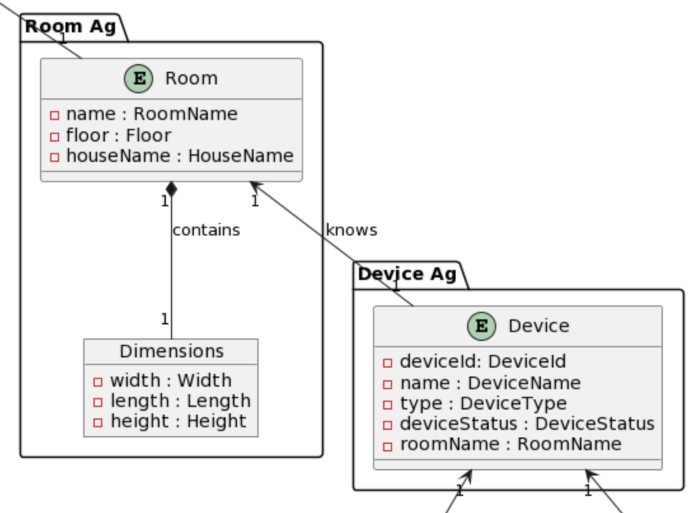
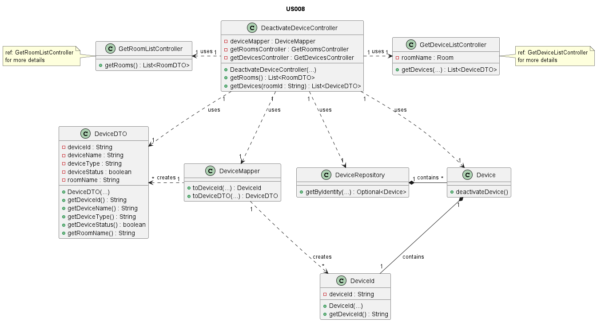
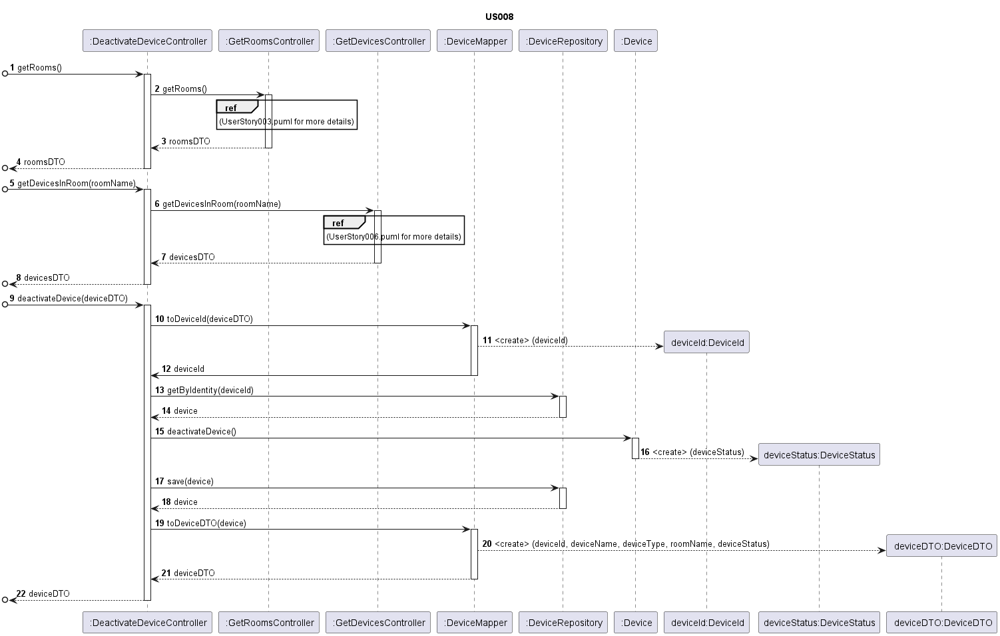

# US008 - Deactivate a device

### Table of Contents

- [1. Requirements](#1-requirements)
  - [Dependency of other User Stories](#dependency-on-other-user-stories)
- [2. Analysis](#2-analysis)
  - [Relevant domain model excerpt](#relevant-domain-model-excerpt)
- [3. Design](#3-design)
  - [Class Diagram](#class-diagram)
  - [Sequence Diagram](#sequence-diagram)
  - [Applied Design Patterns, Principles and Best Practices](#applied-design-patterns-principles-and-best-practices)
- [4. Tests](#4-tests)
  - [Tests of Acceptance](#acceptance-tests)
  - [Unit Tests](#unit-tests)
  - [Integration Tests](#integration-tests)
- [5. Implementation](#5-implementation)
- [6. Conclusion](#6-conclusion)

## 1. Requirements

_As a Power User [or Administrator], I want to deactivate a device, so that it is
no longer used. Nevertheless, it should be possible to access its configuration
and activity log._

Requirements for the device

- A device has a location (room) and an ID.
- A device has a status (active or idle).

### Dependency on other User Stories

In order to deactivate a device, the user must be able to get the list of rooms
available in the system and after choosing a room, he must be able to get the
list of all devices available from that room, so he can choose the device to be
deactivated.
These dependencies are from **US003** and **US006** respectively.

## 2. Analysis

The `Device` class is the one that will have the status attribute. The status
attribute will be a boolean, where true means that the device is active and
false means that the device is idle. This attribute is initialized as true when
the device is created. This class will also have a method to change the status
of the device. This method will be called `deactivateDevice()` and will change
the status of the device to false.

In this scenario, the user will be able to access the configuration and activity
log of the device, even if it is deactivated. This is because the device will not
be deleted from the system, only its status will be changed.

The following steps will be taken to deactivate a device:

1. The Power User [or Administrator] will get the list of rooms available in the system.
2. The Power User [or Administrator] will choose a room.
3. The Power User [or Administrator] will get the list of all devices available from that room.
4. The Power User [or Administrator] will choose the device to be deactivated.
5. The Power User [or Administrator] will deactivate the device.
6. The Power User [or Administrator] will be deactivated.

### Relevant domain model excerpt

Below is the relevant excerpt of the domain model for this User Story:




## 3. Design

### Class Diagram

Below is the class diagram for this User Story:


### Sequence Diagram

Below is the sequence diagram for this User Story:


### Applied Design Patterns, Principles and Best Practices

* **Controller** - A design pattern that separates the user interface from the
  business logic. In this case, the controller is the `DeactivateDeviceController` class
  that will receive the request to deactivate a device and will call the `deactivateDevice()`
  method from the `Device` class.
* **Information Expert** - A design principle that assigns responsibility to the class
  that has the most information required to fulfill it. In this case, the `Device` class
  is the one that has the status attribute and the method to change the status of the device.
* **Low Coupling** - A design principle that aims to reduce the dependencies between classes.
  In this case, the `DeactivateDeviceController` class is only dependent on the `Device` class to
  deactivate a device.
* **High Cohesion** - A design principle that aims to keep the responsibilities of a class
  focused and related to a single concept. In this case, the `Device` class is responsible for
  managing the status of the device.
* **Single Responsibility Principle** - A design principle that states that a class should
  have only one reason to change. In this case, the `Device` class has the responsibility to
  manage the status of the device.
* **Open/Closed Principle** - A design principle that states that a class should be open for
  extension but closed for modification. In this case, the `Device` class can be extended to
  add new features without modifying its existing code.
* **Value Object** - Elements like `DeviceId`, `DeviceStatus`, and `RoomName` are value objects, representing simple
  pieces of data that are used to describe devices. They are immutable and can be shared between objects without risk of
  modification.
* **Repository** - The `DeviceRepository` acts as a repository, managing the persistence of device objects. It provides
  methods for storing and retrieving devices, ensuring that data is correctly managed and maintained.
* **Mapper** - The `DeviceMapper` class is responsible for mapping device objects to and from their database
  representation. This ensures that the data is correctly stored and retrieved from the database, maintaining
  consistency and integrity.
* **Data Transfer Object (DTO)** - The `DeviceDTO` class is a Data Transfer Object that represents a device object in a
  format suitable for transfer between layers of the application. It provides a simple, serializable representation of a
  device, allowing data to be easily passed between different parts of the system.

## 4. Tests

### Acceptance tests

- **Scenario 1**: The Power User [or Administrator] deactivates a device.
    - **Given** that the Power User [or Administrator] knows the ID of the device.
    - **When** the Power User [or Administrator] deactivates the device.
    - **Then** the device is deactivated.

- **Scenario 2**: The Power User [or Administrator] tries to deactivate a device already deactivated.
    - **Given** that the Power User [or Administrator] knows the ID of the device.
    - **When** the Power User [or Administrator] tries to deactivate the device.
    - **Then** the device is not deactivated.

### Unit Tests

Below are some unit tests for this User Story, these tests are in DeviceTest class:

| Test Case                               | Expected Outcome                  |
|-----------------------------------------|-----------------------------------|
| Deactivate a device                     | Device status is changed to idle. |
| Deactivate a device already deactivated | Device status remains idle.       |

For more information, see
the [DeviceTest](https://github.com/Departamento-de-Engenharia-Informatica/2023-2024-switch-dev-project-assignment-switch-project-2023-2024-grupo6/blob/main/src/test/java/smarthome/domain/device/DeviceTest.java)
class.

### Integration Tests

Below are some integration tests for this User Story, these tests are in DeactivateDeviceControllerTest class:

| Test Case                                                    | Expected Outcome                 |
|--------------------------------------------------------------|----------------------------------|
| Test receiving the list of rooms available in the system     | The list of rooms is received.   |
| Test receiving the list of all devices available from a room | The list of devices is received. |

For more information,
see [DeactivateDeviceControllerTest](https://github.com/Departamento-de-Engenharia-Informatica/2023-2024-switch-dev-project-assignment-switch-project-2023-2024-grupo6/blob/main/src/test/java/smarthome/controller/DeactivateDeviceControllerTest.java)
class.

## 5. Implementation

- The `Device` class is responsible for managing the status of a device. It has a status attribute
  that can be changed using the `deactivateDevice()` method.

```java
public DeviceStatus deactivateDevice() {
    // Implementation of the logic to deactivate the device
}
```

- The `DeactivateDeviceController` class is responsible for receiving the request to deactivate a device and calling all
  the necessary methods to do so (e.g., getting the list of rooms, getting the list of devices, getting the ID of the
  device and deactivating the device).

```java
public class DeactivateDeviceController {
    public DeactivateDeviceController() {
        // Constructor
    }

    public List<RoomDTO> getRooms() {
        // Implementation of the logic to get the list of rooms
    }

    public List<DeviceDTO> getDevicesInRoom() {
        // Implementation of the logic to get the list of devices
    }

    public DeviceDTO deactivateDevice() {
        // Implementation of the logic to deactivate the device
    }
}
```

- The `DeviceRepository` class is responsible for managing the persistence
  of device objects, providing methods for storing and retrieving devices.

```java
public Device save(Device device) {
    // Implementation of the method
}

public Optional<Device> getByIdentity(DeviceId id) {
    // Implementation of the method
}
```

For more information, see
the [Device](https://github.com/Departamento-de-Engenharia-Informatica/2023-2024-switch-dev-project-assignment-switch-project-2023-2024-grupo6/blob/main/src/main/java/smarthome/domain/device/Device.java),
[DeactivateDeviceController](https://github.com/Departamento-de-Engenharia-Informatica/2023-2024-switch-dev-project-assignment-switch-project-2023-2024-grupo6/blob/main/src/main/java/smarthome/controller/DeactivateDeviceController.java),
and [DeviceRepository](https://github.com/Departamento-de-Engenharia-Informatica/2023-2024-switch-dev-project-assignment-switch-project-2023-2024-grupo6/blob/main/src/main/java/smarthome/repository/DeviceRepository.java)
classes.

## 6. Conclusion

To summarize, this User Story focused on the deactivation of a device. The `Device` class was updated to include a
status attribute and a method to change the status of the device. The `DeactivateDeviceController` class was created to
handle the deactivation process, including the logic to get the list of rooms, get the list of devices, and deactivate
the device. The implementation of this User Story followed design patterns, principles, and best practices to ensure a
clean and maintainable codebase. The tests of acceptance, unit tests, and integration tests were created to validate the
functionality of the system. Overall, this User Story provides a valuable feature that allows Power Users or
Administrators to deactivate devices in the system. This feature enhances the usability and flexibility of the system,
providing users with the ability to manage devices effectively. The implementation of this User Story will contribute to
the overall success of the project, delivering a high-quality solution that meets the needs of the users. 

[Back to top](#us008---deactivate-a-device)