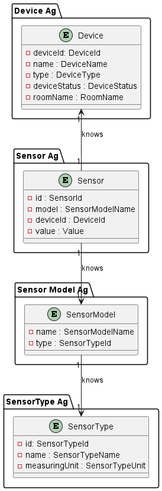

# US009 - Get a List of All Devices in a House Grouped by Device Functionality Types

### Table of Contents

- [1. Requirements](#1-requirements)
    - [Dependency on other User Stories](#dependency-of-other-user-stories)
- [2. Analysis](#2-analysis)
    - [Relevant domain model excerpt](#relevant-domain-model-excerpt)
- [3. Design](#3-design)
    - [Class Diagram](#class-diagram)
    - [Sequence Diagram](#sequence-diagram)
    - [Applied Design Patterns, Principles and Best Practices](#applied-design-patterns-principles-and-best-practices)
- [4. Test](#4-test)
    - [Acceptance Tests](#tests-of-acceptance)
    - [Unit Tests](#unit-tests)
    - [Integration Tests](#integration-tests)
- [5. Implementation](#5-implementation)
- [6. Conclusion](#6-conclusion)

## 1. Requirements

_As a Power User [or Administrator], I want to get a list of all devices in a house grouped by device functionality types. It must include device location._

Requirements for the functionality

- A device must be categorized based on their functionality (sensor, actuator, etc.).
- The list must include the location of each device.
- Ensure devices from all rooms within the house are included.

### Dependency on other User Stories

This UserStory leverages functionality from US005v2 (`DeviceMapper` class and `DeviceDTO`) for data transfer,
US006 (`DeviceRepository` class) for data persistence, US007 for the `SensorModelRepository`, `SensorTypeRepository` and `SensorRepository`
the notion that the addition of a `Sensor` of an existing `SensorType` to a `Device` corresponds to an increment in the concept of `Functionality`,
US010 and US011 (`SensorOfTemperature` and `SensorOfHumidity` implementations of `Sensor` interface) for testing.

## 2. Analysis

The primary focus is on aggregating devices by their functionality.
We considered that a `Functionality` of a `Device` would be determined by the `SensorType` of the `Sensor` instances attributed to that `Device`.
and presenting this information along with their locations (`RoomName`, saved as an attribute of `Device`).
In terms of persistance, a `Sensor` contains a `SensorModelName` attribute that allows the System to identify the `SensorModel` of such sensor.
The `SensorModel` contains a `SensorTypeId` attribute that allows the System to identify the `SensorType` of such sensor.

The following steps will be taken to aggregate `Devices` by their `Functionality`:

1. The Power User [or Administrator] will ask for the list of all devices in a house grouped by device functionality types.
2. The System will retrieve all `SensorType` from the `SensorTypeRepository`.
2. The System will retrieve all `Sensors` from the `SensorRepository`.
3. For each `Sensor` retrieved, using its `SensorModelName`, the System will retrieve the `SensorModel` from the `SensorModelRepository`.
4. Using the `SensorModel` retrieved, using its `SensorTypeId` attribute, the System will retrieve the `SensorType` from the `SensorTypeRepository`.
5. The System will group the `Devices` based on the `SensorType` of the `Sensor` instances attributed to that `Device`.
6. The System will transform these domain objects into Strings and DTOs and return them to the Power User [or Administrator].

### Relevant domain model excerpt

Below is the relevant excerpt of the domain model for this User Story:




## 3. Design

### Class Diagram

Below is the class diagram for this User Story:


### Sequence Diagram

Below is the sequence diagram for this User Story:


### Applied Design Patterns, Principles and Best Practices

* **Controller** - A design pattern that separates the user interface from the
  business logic. In this case, the controller is the `GetListOfDevicesByFunctionalityController` class
  that will receive the request to sort all the devices, calling the `getDevicesBySensorType()`
* **Information Expert** - A design principle that assigns responsibility to the class
  that has the most information required to fulfill it. In this case, 
the `Sensor` class will have information that will enable access to the `Device`, 
`SensorModel` classes, so it will own the responsability of its access. 
The `SensorModel` class will have information that will enable access to the `SensorType` class, 
so it will own the responsability of its access.
* **Repository Pattern** For accessing devices across the house in a decoupled manner. `DeviceRepository` is decoupled from `RoomRepository`, 
    `SensorRepository`, `SensorModelRepository`, `SensorTypeRepository` and `SensorModelRepository`, but I can access them to get the information I need to access the other ones.
* **Strategy Pattern** For categorizing devices based on their functionality, allowing for easy extension as new types are introduced. We considered that the `Functionality` of a `Device` would be determined by the `SensorType` of the `Sensor` instances attributed to that `Device`.
* **DTO Pattern** For transferring aggregated device information, including type and location. The `DeviceDTO` class is used to transfer device information between layers of the application, providing a simple, serializable representation of a device.
* **Single Responsibility Principle (SRP)** Ensuring classes have a single responsibility. For instance, the `Sensor` class is responsible for managing sensor data, while the `SensorModel` class is responsible for managing sensor model data.
* **Open/Closed Principle (OCP)** Designing the system in a way that new Sensors can be added without altering the existing code. The `Sensor` class can be extended to add new sensor types without modifying its existing code.
* **Low Coupling** - A design principle that aims to reduce the dependencies between classes. The `Sensor` class is only dependent on the `SensorModel` class, via its `SensorModelName` attribute. The `SensorModel` class is only dependent on the `SensorType` class, via its `SensorTypeId` attribute. This reduces the coupling between classes, making the system more flexible and easier to maintain.
* **High Cohesion** - A design principle that aims to keep the responsibilities of a class
  focused and related to a single concept. In this case, the `SensorModel`class is only responsible for accessing the `SensorType` of a `Sensor`. The `Sensor` class is only responsible for managing the `SensorModel` of a `Sensor`. This ensures that each class has a clear and focused responsibility, making the system easier to understand and maintain.
* **Value Object** - Elements like `DeviceId`, `SensorModelName`, and `RoomName` are value objects, representing simple
  pieces of data that are used to describe devices and sensors. They are immutable and can be shared between objects without risk of
  modification.
* **Mapper Pattern** - The `DeviceMapper` class is responsible for mapping device objects to and from their database
  representation. This ensures that the data is correctly stored and retrieved from the database, maintaining
  consistency and integrity.

## 4. Test

### Unit Tests

In this section I will provide tests for every unit involved in the processed to be further on tested in the integration tests.

 Test Case                                                                     | Expected Outcome                                                                                                      |
|-------------------------------------------------------------------------------|-----------------------------------------------------------------------------------------------------------------------|
| Test RepositoryLoader constructor with valid parameters.                      | The RepositoryLoader object is created. No Exception Should be Thrown.                                                |
| Test RepositoryLoader constructor with null filePathName.                     | Throws IllegalArgumentException.                                                                                      |
| Test RepositoryLoader constructor with null SensorTypeFactory.                | Throws IllegalArgumentException.                                                                                      |
| Test RepositoryLoader constructor with null SensorModelFactory.               | Throws IllegalArgumentException.                                                                                      |
| Test RepositoryLoader constructor with null ActuatorTypeFactory.              | Throws IllegalArgumentException.                                                                                      |
| Test RepositoryLoader constructor with null ActuatorModelFactory.             | Throws IllegalArgumentException.                                                                                      |
| Test RepositoryLoader loadSensorTypeRepository method with valid parameters.  | The SensorTypeRepository is loaded with the SensorTypes from the configuration file. No Exception Should be Thrown.   |
| Test RepositoryLoader loadSensorModelRepository method with valid parameters. | The SensorModelRepository is loaded with the SensorModels from the configuration file. No Exception Should be Thrown. |
| Test findAll() method of SensorTypeRepository                                 | Returns an Iterable with all SensorTypes in the SensorTypeRepository.                                                 |
| Test findAll() method of SensorRepository                                     | Returns an Iterable with all Sensors in the SensorRepository.                                                         |
| Test getDeviceId() method of Sensor                                           | Returns the DeviceId of the Sensor.                                                                                   |
| Test findById() method of DeviceRepository                                    | Returns the Device with the given DeviceId.                                                                           |
| Test getSensorModelName() method of Sensor                                    | Returns the SensorModelName of the Sensor.                                                                            |
| Test getSensorTypeId() method of SensorModel                                  | Returns the SensorTypeId of the SensorModel.                                                                          |
| Test findById() method of SensorTypeRepository                                | Returns the SensoprType with the given SensorTypeId.                                                                  |
| Test findById() method of SensorModelRepository                                | Returns the SensorModel with the given SensorModelName.                                                               |
| Test getSensorTypeName() method of SensorType                                 | Returns the SensorTypeName of the SensorType.                                                                         |
| Test getSensorTypeName() method of SensorTypeName                             | Returns the SensorTypeName as a String.                                                                               |

- Tests for RepositoryLoader class
```java
/**
 * The RepositoryLoaderTest class tests the RepositoryLoader class.
 */
class RepositoryLoaderTest {

    String filePathName;
    SensorTypeFactoryImp sensorTypeFactoryImp;
    SensorModelFactoryImp sensorModelFactoryImp;
    ActuatorTypeFactoryImpl actuatorTypeFactoryImp;
    ActuatorModelFactoryImp actuatorModelFactoryImp;
    RepositoryLoader repositoryLoader;

    /**
     * Sets up the RepositoryLoader instance for the tests.
     */
    @BeforeEach
    void setUp() throws InstantiationException {
        filePathName = "configTest.properties";
        sensorTypeFactoryImp = mock(SensorTypeFactoryImp.class);
        sensorModelFactoryImp = mock(SensorModelFactoryImp.class);
        actuatorTypeFactoryImp = mock(ActuatorTypeFactoryImpl.class);
        actuatorModelFactoryImp = mock(ActuatorModelFactoryImp.class);
        repositoryLoader = new RepositoryLoader(filePathName, sensorTypeFactoryImp, sensorModelFactoryImp,
                actuatorTypeFactoryImp, actuatorModelFactoryImp);
    }

    /**
     * Tests the constructor of the RepositoryLoader class does not throw an exception
     * when valid parameters are provided.
     */
    @Test
    void testConstructorDoesNotThrowExceptionForValidParameters() {
        //Act + assert
        assertDoesNotThrow(() -> new RepositoryLoader(filePathName, sensorTypeFactoryImp, sensorModelFactoryImp,
                actuatorTypeFactoryImp, actuatorModelFactoryImp));
    }

    /**
     * Tests the constructor of the RepositoryLoader class throws an exception
     * when an invalid FilePathName is provided.
     */
    @Test
    void testConstructorThrowsExceptionForInvalidFilePathName() {
        //Arrange
        String invalidFilePathName = "invalidPath.properties";
        //Act and Assert
        assertThrows(InstantiationException.class, () -> new RepositoryLoader(invalidFilePathName, sensorTypeFactoryImp,
                sensorModelFactoryImp, actuatorTypeFactoryImp, actuatorModelFactoryImp));
    }

    /**
     * Tests the constructor of the RepositoryLoader class throws an exception
     * when a null SensorTypeFactoryImpl is provided.
     */
    @Test
    void testConstructorThrowsExceptionForNullSensorTypeFactoryImp() {
        //Arrange
      SensorTypeFactoryImp nullSensorTypeFactoryImpl = null;
        //Act and Assert
      assertThrows(InstantiationException.class, () -> new RepositoryLoader(filePathName, nullSensorTypeFactoryImpl,
                sensorModelFactoryImp, actuatorTypeFactoryImp, actuatorModelFactoryImp));
    }

    /**
     * Tests the constructor of the RepositoryLoader class throws an exception
     * when a null SensorModelFactoryImpl is provided.
     */
    @Test
    void testConstructorThrowsExceptionForNullSensorModelFactoryImp() {
        //Arrange
      SensorModelFactoryImp nullSensorModelFactoryImpl = null;
        //Act and Assert
        assertThrows(InstantiationException.class, () -> new RepositoryLoader(filePathName, sensorTypeFactoryImp,
                nullSensorModelFactoryImpl, actuatorTypeFactoryImp, actuatorModelFactoryImp));
    }

    /**
     * Tests the constructor of the RepositoryLoader class throws an exception
     * when a null ActuatorTypeFactoryImp is provided.
     */
    @Test
    void testConstructorThrowsExceptionForNullActuatorTypeFactoryImp() {
        //Arrange
        ActuatorTypeFactoryImpl nullActuatorTypeFactoryImp = null;
        //Act and Assert
        assertThrows(InstantiationException.class, () -> new RepositoryLoader(filePathName, sensorTypeFactoryImp,
                sensorModelFactoryImp, nullActuatorTypeFactoryImp, actuatorModelFactoryImp));
    }

    /**
     * Tests the constructor of the RepositoryLoader class throws an exception
     * when a null ActuatorModelFactoryImpl is provided.
     */
    @Test
    void testConstructorThrowsExceptionForNullActuatorModelFactoryImp() {
        //Arrange
      ActuatorModelFactoryImp nullActuatorModelFactoryImpl = null;
        //Act and Assert
        assertThrows(InstantiationException.class, () -> new RepositoryLoader(filePathName, sensorTypeFactoryImp,
                sensorModelFactoryImp, actuatorTypeFactoryImp, nullActuatorModelFactoryImpl));
    }

    /**
     * Tests the loadSensorTypeRepository method of the RepositoryLoader class,
     * verifying that the save method is called twice.
     */
    @Test
    void testLoadSensorTypeRepository() {
        //Arrange
        SensorTypeRepository sensorTypeRepository = mock(SensorTypeRepository.class);
        //Act
        repositoryLoader.loadSensorTypeRepository(sensorTypeRepository);
        //Assert
        verify(sensorTypeRepository, times(2)).save(any());
    }

    /**
     * Tests the loadSensorModelRepository method of the RepositoryLoader class,
     * verifying that the save method is called twice.
     */
    @Test
    void testLoadSensorModelRepository() {
        //Arrange
        SensorModelRepository sensorModelRepository = mock(SensorModelRepository.class);
        //Act
        repositoryLoader.loadSensorModelRepository(sensorModelRepository);
        //Assert
        verify(sensorModelRepository, times(2)).save(any());
    }}
```

- Tests for SensorTypeRepository class
```java
 /**
     * Tests that findAll returns an empty list when the repository is empty.
     */
    @Test
    void testFindAllEmptyRepository() {
        //Act
        List<SensorType> result = new ArrayList<>();
        sensorTypeRepository.findAll().forEach(result::add);

        //Assert
        assertTrue(result.isEmpty());
    }

    /**
     * Tests that findAll returns all SensorTypes when the repository is non-empty.
     */
    @Test
    void testFindAllNonEmptyRepository() {
        //Arrange
        SensorTypeId sensorTypeId1 = mock(SensorTypeId.class);
        SensorType sensorType1 = mock(SensorType.class);
        when(sensorType1.getIdentity()).thenReturn(sensorTypeId1);
        SensorTypeId sensorTypeId2 = mock(SensorTypeId.class);
        SensorType sensorType2 = mock(SensorType.class);
        when(sensorType2.getIdentity()).thenReturn(sensorTypeId2);
        sensorTypeRepository.save(sensorType1);
        sensorTypeRepository.save(sensorType2);
        int expectedSize = 2;


        //Act
        List<SensorType> result = new ArrayList<>();
        sensorTypeRepository.findAll().forEach(result::add);

        //Assert
        assertEquals(expectedSize, result.size());
        assertTrue(result.contains(sensorType1));
        assertTrue(result.contains(sensorType2));
    }
```

-Tests for DeviceRepository class
```java
  /**
     * Test that the getByIdentity method returns an empty optional
     * when the repository is empty.
     */
    @Test
    void testGetByIdentityToAnEmptyRepository() {
        //Act
        Optional<Device> result = deviceRepository.getByIdentity(deviceIdDouble1);

        //Assert
        assertTrue(result.isEmpty());
    }

    /**
     * Test that the getByIdentity method returns the correct device
     * when the repository is non-empty.git stat
     */
    @Test
    void testGetByIdentityToANonEmptyRepository() {
        //Arrange
        deviceRepository.save(deviceDouble1);

        //Act
        Device result = deviceRepository.getByIdentity(deviceIdDouble1).get();

        //Assert
        assertEquals(result, deviceDouble1);
    }
```
- Tests for SensorRepository class
```java
 /**
     * Unit test: Finding all sensors on an empty repository should return an empty iterable.
     * This test verifies that the findAll method returns an empty iterable when the repository is empty.
     */
    @Test
    void testFindAllOnEmptyRepositoryShouldReturnAnEmptyIterable() {
        // Act
        Iterable<Sensor> sensors = sensorRepository.findAll();
        // Assert
        assertFalse(sensors.iterator().hasNext());
    }

    /**
     * Unit test: Finding all sensors on an empty repository should return an empty list.
     * This test verifies that the findAll method returns an empty list when the repository is empty.
     */
    @Test
    void testFindAllOnEmptyRepositoryShouldReturnAnEmptyList() {
        //Act
        List<Sensor> result = new ArrayList<>();
        sensorRepository.findAll().forEach(result::add);
        //Assert
        assertTrue(result.isEmpty());
    }

    /**
     * Unit test: Finding all sensors with entities in the repository should return an iterable with entities.
     * This test verifies that the findAll method returns an iterable that is not empty.
     */
    @Test
    void testFindAllOnNonEmptyRepositoryWithSingleModelShouldReturnNonEmptyIterable() {
        // Arrange
        sensorRepository.save(sensorMock);
        // Act
        Iterable<Sensor> sensors = sensorRepository.findAll();
        // Assert
        assertTrue(sensors.iterator().hasNext());
    }

    /**
     * Unit test: Finding all sensors on a non-empty repository should return an iterable with all sensors.
     * This test verifies that the findAll method returns an iterable containing all sensors stored in the repository.
     */
    @Test
    void testFindAllOnNonEmptyRepositoryWithMultipleModelsShouldReturnIterableWithAllSensors() {
        // Arrange
        sensorRepository.save(sensorMock);

        SensorId anotherSensorIdMock = mock(SensorId.class);
        Sensor anotherSensorMock = mock(Sensor.class);
        when(anotherSensorMock.getIdentity()).thenReturn(anotherSensorIdMock);
        sensorRepository.save(anotherSensorMock);

        int size = 2;
        // Act
        Iterable<Sensor> sensors = sensorRepository.findAll();
        List<Sensor> result = new ArrayList<>();
        sensors.forEach(result::add);
        // Assert
        assertEquals(size, result.size());
        assertTrue(sensors.iterator().hasNext());
    }

    /**
     * Unit test: Finding all sensors on a non-empty repository should return a list with all sensors.
     * This test verifies that the findAll method returns a list containing all sensors stored in the repository.
     */
    @Test
    void testFindAllOnNonEmptyRepositoryShouldReturnAListWithAllSensors() {
        // Arrange
        sensorRepository.save(sensorMock);

        SensorId anotherSensorIdMock = mock(SensorId.class);
        Sensor anotherSensorMock = mock(Sensor.class);
        when(anotherSensorMock.getIdentity()).thenReturn(anotherSensorIdMock);
        sensorRepository.save(anotherSensorMock);

        int size = 2;

        // Act
        List<Sensor> result = new ArrayList<>();
        sensorRepository.findAll().forEach(result::add);
        // Assert
        assertEquals(size, result.size());
        assertTrue(result.contains(sensorMock));
        assertTrue(result.contains(anotherSensorMock));
    }
``` 

- Tests for SensorModelRepository class
```java
  /**
     * Test that the getByIdentity method returns an empty optional
     * when the repository is empty.
     */
    @Test
    void testGetByIdentityToAnEmptyRepository() {
        //Arrange
        SensorModelName sensorModelName = mock(SensorModelName.class);

        //Act
        Optional<SensorModel> result = sensorModelRepository.getByIdentity(sensorModelName);

        //Assert
        assertTrue(result.isEmpty());
    }

    /**
     * Test that the getByIdentity method returns the correct SensorModel
     * when the repository is non-empty.git stat
     */
    @Test
    void testGetByIdentityToANonEmptyRepository() {
        //Arrange
        String validIdentity = "sensorModelName";
        SensorModelName sensorModelName = mock(SensorModelName.class);
        SensorModel sensorModel = mock(SensorModel.class);
        when(sensorModel.getIdentity()).thenReturn(sensorModelName);
        when(sensorModelName.getSensorModelName()).thenReturn(validIdentity);
        when(sensorModelName.sameAs(sensorModelName)).thenReturn(true);

        //Act
        sensorModelRepository.save(sensorModel);
        SensorModel result = sensorModelRepository.getByIdentity(sensorModelName).get();

        //Assert
        assertEquals(sensorModel, result);
    }
```

- Tests for Sensor class (we will use `SensorOfTemperature` and `SensorOfHumidity` classes for testing and only `SensorOfTemperature` in this example)
```java
 /**
     * Test that the getDeviceId method returns the correct device id
     * The method should return the device id
     */
    @Test
    void testGetDeviceIdReturnsCorrectDeviceId() {
        //Arrange
        SensorOfTemperature sensorOfTemperature = new SensorOfTemperature(deviceIdDouble, sensorModelNameDouble);

        //Act
        DeviceId deviceId = sensorOfTemperature.getDeviceId();

        //Assert
        assertTrue(deviceId.sameAs(deviceIdDouble));
    }

    /**
     * Test that the getSensorModelName method returns the correct sensor model name
     * The method should return the sensor model name
     */
    @Test
    void testGetSensorModelNameReturnsCorrectSensorModelName() {
      //Arrange
      SensorOfTemperature sensorOfTemperature = new SensorOfTemperature(deviceIdDouble, sensorModelNameDouble);

      //Act
      SensorModelName sensorModelName = sensorOfTemperature.getSensorModelName();

      //Assert
      assertTrue(sensorModelName.sameAs(sensorModelNameDouble));
    }
```

- Tests for SensorModel class
```java
  /**
 * Verifies that the getSensorTypeId method of SensorModel returns the correct SensorTypeId.
 *
 * This test ensures that the getSensorTypeId method of SensorModel returns the expected SensorTypeId.
 * It validates that the SensorModel object's getSensorTypeId method returns the same SensorTypeId object
 * that was set during initialization.
 */
@Test
void testGetSensorTypeIdReturnsCorrectValue() {
  // Act
  SensorTypeId result = sensorModel.getSensorTypeId();
  // Assert
  assertEquals(sensorTypeIdMock, result);
}

/**
 * Acceptance test for retrieving the correct SensorTypeId.
 *
 * Verifies that the getSensorTypeId() method returns the correct SensorTypeId
 * for a given SensorModel object, as expected by an end user.
 *
 * This test ensures that the getSensorTypeId method of SensorModel returns the same SensorTypeId object
 * that was set during initialization.
 */
@Test
void testGetSensorTypeIdReturnsSameObject() {
  SensorModel sensorModel = new SensorModel(sensorModelNameMock, sensorTypeIdMock);
  assertSame(sensorTypeIdMock, sensorModel.getSensorTypeId());
}
```

- Tests for SensorType class
```java
/**
 * This test case checks if the getSensorTypeName method returns the correct sensor type name.
 */
@Test
void testGetSensorTypeName() {
  //Act
  SensorTypeName result = sensorType.getSensorTypeName();
  //Assert
  assertEquals(sensorTypeName, result);
}
```

- Test for SensorTypeName class
```java
/**
     * Test if the getSensorTypeName method returns the correct sensor type name.
     */
    @Test
    void testGetSensorTypeName() {
        //Arrange
        String expected = "Temperature";
        SensorTypeName sensorTypeName = new SensorTypeName(expected);
        //Act
        String result = sensorTypeName.getSensorTypeName();
        //Assert
        assertEquals(expected, result);

    }
```


### Integration Tests

As this UserStory requires testing to the `GetListOfDevicesByFunctionalityController` controller, a class whose main function is
to generate indirection and delegate the logic to other classes, we will focus on testing the controller's constructor and its main method `getDevicesBySensorType()`.
The controller in itself is responsible for managing the flow of information between the repositories and the domain classes.
Below are some unit tests for this User Story, these tests are in `GetListOfDevicesByFunctionalityControllerTest` class:

| Test Case                                                                                            | Expected Outcome                                                                               |
|------------------------------------------------------------------------------------------------------|------------------------------------------------------------------------------------------------|
| Test constructor of GetListOfDevicesByFunctionalityController class with valid parameters.           | The GetListOfDevicesByFunctionalityController object is created. No Exception Should be Thrown |
| Test constructor of GetListOfDevicesByFunctionalityController class with null DeviceRepository.      | Throws IllegalArgumentException.                                                               |
| Test constructor of GetListOfDevicesByFunctionalityController class with null SensorRepository.      | Throws IllegalArgumentException.                                                               |
| Test constructor of GetListOfDevicesByFunctionalityController class with null SensorModelRepository. | Throws IllegalArgumentException.                                                               |
| Test constructor of GetListOfDevicesByFunctionalityController class with null SensorTypeRepository.  | Throws IllegalArgumentException.                                                               |
| Test constructor of GetListOfDevicesByFunctionalityController class with null DeviceMapper.          | Throws IllegalArgumentException.                                                               |
| Test categorization of devices by functionality in a House with 2 Devices and 2 Functionalities in 1 Room.                       | Returns a HashMap matching Strings with the `SensorTypeName` and a Set of`DeviceDTO`s (2 keys, 2 Sets with size=1 each)                                         |
| Test categorization of devices by functionality in a House with 1 Device that has 1 Functionalities in 1 Room.                   | Returns a HashMap matching Strings with the `SensorTypeName` and a Set of`DeviceDTO`s (1 key, 1 Set with size=1)                                                |
| Test categorization of devices by functionality in a House with 2 Device that have 1 Functionality in 1 Room.                    | Returns a HashMap matching Strings with the `SensorTypeName` and a Set of`DeviceDTO`s  (1 key, 1 Set with size=2)                                               |
| Test categorization of devices by functionality in a House with no Devices                                                       | Returns an empty HashMap<String, Set<DeviceDTO>>                                                                                                                |
| Test categorization of devices by functionality in a House with no Sensors in such Devices                                       | Returns an empty HashMap<String, Set<DeviceDTO>>                                                                                                                |
| Test categorization of devices by functionality in a House with 2 Devices and 2 Functionalities in 2 Rooms.                      | Returns a HashMap matching Strings with the `SensorTypeName` and a Set of`DeviceDTO`s (2 keys, 2 Sets with size=1 each, but `RoomName` differs between Devices) |
| Test categorization of devices by functionality in a House with 1 Device that has 2 Functionalities (and exists only in 1 Room). | Returns a HashMap matching Strings with the `SensorTypeName` and a Set of`DeviceDTO`s (2 keys, 2 Sets with size=1 each).                                        | 
| Test categorization of devices by functionality in a House with 2 Device that have 1 Functionalities in 2 Rooms.                 | Returns a HashMap matching Strings with the `SensorTypeName` and a Set of`DeviceDTO`s (1 key, 1 Set with 2 Devices with 2 different `RoomName`).                |

```java
/**
 * This class is responsible for testing the GetListOfDevicesByFunctionalityController class.
 * It tests the constructor and the getListOfDevicesByFunctionality method.
 */
class GetListOfDevicesByFunctionalityControllerTest {

  /**
   * The SensorRepository attribute.
   */
  SensorRepository sensorRepository;
  /**
   * The DeviceMapper attribute.
   */
  DeviceMapper deviceMapper;
  /**
   * The SensorTypeRepository attribute.
   */
  SensorTypeRepository sensorTypeRepository;
  /**
   * The SensorModelRepository attribute.
   */
  SensorModelRepository sensorModelRepository;
  /**
   * The DeviceRepository attribute.
   */
  DeviceRepository deviceRepository;
  /**
   * The RepositoryLoader attribute.
   */
  RepositoryLoader repositoryLoader;
  /**
   * The path to the configuration file.
   */
  String filePathName;
  /**
   * The SensorFactory attribute.
   */
  SensorFactory sensorFactory;

  /**
   * The SensorTypeFactory attribute.
   */
  SensorTypeFactoryImp sensorTypeFactory;
  /**
   * The SensorModelFactory attribute.
   */
  SensorModelFactoryImp sensorModelFactory;
  /**
   * The ActuatorTypeFactory attribute.
   */
  ActuatorTypeFactoryImpl actuatorTypeFactory;
  /**
   * The ActuatorModelFactory attribute.
   */
  ActuatorModelFactoryImp actuatorModelFactoryImp;
  /**
   * The DeviceName attribute.
   */
  DeviceName deviceName;

  /**
   * The DeviceType attribute.
   */
  DeviceType deviceType;
  /**
   * The DeviceId attribute.
   */
  DeviceId deviceId;
  /**
   * The RoomName attribute.
   */
  RoomName roomId;
  /**
   * The RoomName attribute.
   */
  String roomName1;
  /**
   * The SensorModelName attribute.
   */

  String sensorModelNameTemperature;

  /**
   * The SensorModelName attribute.
   */
  SensorModelName sensorModelNameTemperature1;

  /**
   * The SensorModelName attribute.
   */
  String sensorModelNameHumidity;

  /**
   * The SensorModelName attribute.
   */

  SensorModelName sensorModelNameHumidity1;

  /**
   * The DeviceFactory attribute.
   */
  DeviceFactory deviceFactory;


  /**
   * Sets up the testing environment by creating the necessary objects.
   */
  @BeforeEach
  void setUp() throws InstantiationException{
    filePathName = "configTest.properties";
    roomName1 = "Room1";
    roomId = new RoomName(roomName1);
    sensorTypeFactory = new SensorTypeFactoryImp();
    sensorModelFactory = new SensorModelFactoryImp();
    actuatorTypeFactory = new ActuatorTypeFactoryImpl();
    actuatorModelFactoryImp = new ActuatorModelFactoryImp();
    sensorModelRepository = new SensorModelRepository();
    sensorTypeRepository = new SensorTypeRepository();
    repositoryLoader = new RepositoryLoader(filePathName, sensorTypeFactory, sensorModelFactory, actuatorTypeFactory, actuatorModelFactoryImp);
    repositoryLoader.loadSensorModelRepository(sensorModelRepository);
    repositoryLoader.loadSensorTypeRepository(sensorTypeRepository);
    deviceRepository = new DeviceRepository();
    sensorRepository = new SensorRepository();
    deviceMapper = new DeviceMapper();
    deviceFactory = new DeviceFactoryImp();
    deviceName = new DeviceName("Device1");
    deviceType = new DeviceType("DeviceType1");
    sensorFactory = new SensorFactoryImp();
    sensorModelNameHumidity = "SensorOfHumidity";
    sensorModelNameHumidity1 = new SensorModelName(sensorModelNameHumidity);
    sensorModelNameTemperature = "SensorOfTemperature";
    sensorModelNameTemperature1 = new SensorModelName(sensorModelNameTemperature);
  }

  /**
   * Tests the constructor of the GetListOfDevicesByFunctionalityController class.
   * It should not throw an exception when valid parameters are given.
   */
  @Test
  void testConstructorValidParametersShouldNotThrowException(){
    //Assert
    assertDoesNotThrow(() -> new GetListOfDevicesByFunctionalityController(deviceMapper, sensorTypeRepository, sensorModelRepository, sensorRepository, deviceRepository));
  }

  /**
   * Tests the constructor of the GetListOfDevicesByFunctionalityController class.
   * It should throw an exception when null parameters are given.
   */
  @Test
  void testConstructorNullDeviceMapperShouldThrowException(){
    //Assert
    assertThrows(IllegalArgumentException.class, () -> new GetListOfDevicesByFunctionalityController(null, sensorTypeRepository, sensorModelRepository, sensorRepository, deviceRepository));
  }

  /**
   * Tests the constructor of the GetListOfDevicesByFunctionalityController class.
   * It should throw an exception when null parameters are given.
   */
  @Test
  void testConstructorNullSensorTypeRepositoryShouldThrowException(){
    //Assert
    assertThrows(IllegalArgumentException.class, () -> new GetListOfDevicesByFunctionalityController(deviceMapper, null, sensorModelRepository, sensorRepository, deviceRepository));
  }

  /**
   * Tests the constructor of the GetListOfDevicesByFunctionalityController class.
   * It should throw an exception when null parameters are given.
   */
  @Test
  void testConstructorNullSensorModelRepositoryShouldThrowException(){
    //Assert
    assertThrows(IllegalArgumentException.class, () -> new GetListOfDevicesByFunctionalityController(deviceMapper, sensorTypeRepository, null, sensorRepository, deviceRepository));
  }

  /**
   * Tests the constructor of the GetListOfDevicesByFunctionalityController class.
   * It should throw an exception when null parameters are given.
   */
  @Test
  void testConstructorNullSensorRepositoryShouldThrowException(){
    //Assert
    assertThrows(IllegalArgumentException.class, () -> new GetListOfDevicesByFunctionalityController(deviceMapper, sensorTypeRepository, sensorModelRepository, null, deviceRepository));
  }

  /**
   * Tests the constructor of the GetListOfDevicesByFunctionalityController class.
   * It should throw an exception when null parameters are given.
   */
  @Test
  void testConstructorNullDeviceRepositoryShouldThrowException(){
    //Assert
    assertThrows(IllegalArgumentException.class, () -> new GetListOfDevicesByFunctionalityController(deviceMapper, sensorTypeRepository, sensorModelRepository, sensorRepository, null));
  }

  /**
   * Tests the getListOfDevicesByFunctionality method of the GetListOfDevicesByFunctionalityController class.
   * It should return a HashMap of devices that have the given sensor type. In this case, the sensor types available in the house are Temperature and Humidity.
   * The HashMap of devices should contain the device with the sensor type Temperature and the device with the sensor type Humidity.
   * Each of them should be in a different room.
   */
  @Test
  void testGetListOfDevicesByFunctionalityInHouseWith2DevicesAnd2FunctionalitiesIn1Room(){
    //Arrange
    GetListOfDevicesByFunctionalityController getListOfDevicesByFunctionalityController = new GetListOfDevicesByFunctionalityController(deviceMapper, sensorTypeRepository, sensorModelRepository, sensorRepository, deviceRepository);
    Device device1 = deviceFactory.createDevice(deviceName, deviceType, roomId);
    RoomName roomName2 = new RoomName("Room2");
    Device device2 = deviceFactory.createDevice(deviceName, deviceType, roomName2);
    DeviceId deviceId1 = device1.getIdentity();
    DeviceId deviceId2 = device2.getIdentity();
    Sensor sensor1 = sensorFactory.createSensor(sensorModelNameTemperature1, deviceId1);
    Sensor sensor2 = sensorFactory.createSensor(sensorModelNameHumidity1, deviceId2);
    deviceRepository.save(device1);
    deviceRepository.save(device2);
    sensorRepository.save(sensor1);
    sensorRepository.save(sensor2);
    //Act
    HashMap<String, List<DeviceDTO>> result = getListOfDevicesByFunctionalityController.getListOfDevicesByFunctionality();
    List<DeviceDTO> devicesTemperature = result.get("Temperature");
    List<DeviceDTO> devicesHumidity = result.get("Humidity");
    DeviceDTO device1DTO = devicesTemperature.getFirst();
    DeviceDTO device2DTO = devicesHumidity.getFirst();
    //Assert
    assertFalse(result.isEmpty());
    assertTrue(result.containsKey("Temperature"));
    assertTrue(result.containsKey("Humidity"));
    assertEquals(1, result.get("Temperature").size());
    assertEquals(1, result.get("Humidity").size());
    assertEquals(device1.getIdentity().getIdentity(), device1DTO.getDeviceId());
    assertEquals(device1.getDeviceName().getDeviceName(), device1DTO.getDeviceName());
    assertEquals(device1.getDeviceType().getDeviceType(), device1DTO.getDeviceType());
    assertEquals(device1.getRoomName().getRoomName(), device1DTO.getRoomName());
    assertEquals(device1.getDeviceStatus().getStatus(), device1DTO.getDeviceStatus());
    assertEquals(device2.getIdentity().getIdentity(), device2DTO.getDeviceId());
    assertEquals(device2.getDeviceName().getDeviceName(), device2DTO.getDeviceName());
    assertEquals(device2.getDeviceType().getDeviceType(), device2DTO.getDeviceType());
    assertEquals(device2.getRoomName().getRoomName(), device2DTO.getRoomName());
    assertEquals(device2.getDeviceStatus().getStatus(), device2DTO.getDeviceStatus());
  }

  /**
   * Tests the getListOfDevicesByFunctionality method of the GetListOfDevicesByFunctionalityController class.
   * It should return a HashMap of devices that have the given sensor type. In this case, the sensor type available in the house is Temperature.
   * The HashMap of devices should contain the device with the sensor type Temperature and be in the same room.
   */
  @Test
  void testGetListOfDevicesByFunctionalityInHouseWith1DeviceThatHas1FunctionalitiesIn1Room(){
    //Arrange
    GetListOfDevicesByFunctionalityController getListOfDevicesByFunctionalityController = new GetListOfDevicesByFunctionalityController(deviceMapper, sensorTypeRepository, sensorModelRepository, sensorRepository, deviceRepository);
    Device device1 = deviceFactory.createDevice(deviceName, deviceType, roomId);
    DeviceId deviceId1 = device1.getIdentity();
    Sensor sensor1 = sensorFactory.createSensor(sensorModelNameTemperature1, deviceId1);
    deviceRepository.save(device1);
    sensorRepository.save(sensor1);
    //Act
    HashMap<String, List<DeviceDTO>> result = getListOfDevicesByFunctionalityController.getListOfDevicesByFunctionality();
    List<DeviceDTO> devices = result.get("Temperature");
    DeviceDTO device1DTO = devices.getFirst();
    DeviceDTO device2DTO = devices.getLast();
    //Assert
    assertFalse(result.isEmpty());
    assertTrue(result.containsKey("Temperature"));
    assertEquals(1, result.get("Temperature").size());
    assertFalse(result.containsKey("Humidity"));
    assertEquals(device1.getIdentity().getIdentity(), device1DTO.getDeviceId());
    assertEquals(device1.getDeviceName().getDeviceName(), device1DTO.getDeviceName());
    assertEquals(device1.getDeviceType().getDeviceType(), device1DTO.getDeviceType());
    assertEquals(device1.getRoomName().getRoomName(), device1DTO.getRoomName());
    assertEquals(device1.getDeviceStatus().getStatus(), device1DTO.getDeviceStatus());}

  /**
   * Tests the getListOfDevicesByFunctionality method of the GetListOfDevicesByFunctionalityController class.
   * It should return a HashMap of devices that have the given sensor type. In this case, the sensor type available in the house is Temperature.
   * The Map of devices should contain a Set<Device> containing both Devices with the SensorType Temperature and be in different rooms.
   */
  @Test
  void testGetListOfDevicesByFunctionalityInHouseWith2DevicesThatHave1FunctionalityIn1Room(){
    //Arrange
    GetListOfDevicesByFunctionalityController getListOfDevicesByFunctionalityController = new GetListOfDevicesByFunctionalityController(deviceMapper, sensorTypeRepository, sensorModelRepository, sensorRepository, deviceRepository);
    Device device1 = deviceFactory.createDevice(deviceName, deviceType, roomId);
    Device device2 = deviceFactory.createDevice(deviceName, deviceType, roomId);
    DeviceId deviceId1 = device1.getIdentity();
    DeviceId deviceId2 = device2.getIdentity();
    Sensor sensor1 = sensorFactory.createSensor(sensorModelNameTemperature1, deviceId1);
    Sensor sensor2 = sensorFactory.createSensor(sensorModelNameTemperature1, deviceId2);
    deviceRepository.save(device1);
    deviceRepository.save(device2);
    sensorRepository.save(sensor1);
    sensorRepository.save(sensor2);
    //Act
    HashMap<String, List<DeviceDTO>> result = getListOfDevicesByFunctionalityController.getListOfDevicesByFunctionality();
    List<DeviceDTO> devices = result.get("Temperature");
    DeviceDTO device1DTO = devices.getFirst();
    DeviceDTO device2DTO = devices.getLast();
    //Assert
    assertFalse(result.isEmpty());
    assertTrue(result.containsKey("Temperature"));
    assertEquals(2, result.get("Temperature").size());
    assertFalse(result.containsKey("Humidity"));
    assertEquals(device1DTO.getRoomName(), device2DTO.getRoomName());
  }

  /**
   * Tests the getListOfDevicesByFunctionality method of the GetListOfDevicesByFunctionalityController class.
   * It should return an empty HashMap because there are no devices in the house.
   */
  @Test
  void testGetListOfDevicesByFunctionalityInHouseWithNoDevices(){
    //Arrange
    GetListOfDevicesByFunctionalityController getListOfDevicesByFunctionalityController = new GetListOfDevicesByFunctionalityController(deviceMapper, sensorTypeRepository, sensorModelRepository, sensorRepository, deviceRepository);
    //Act
    HashMap<String, List<DeviceDTO>> result = getListOfDevicesByFunctionalityController.getListOfDevicesByFunctionality();
    //Assert
    assertTrue(result.isEmpty());
  }

  /**
   * Tests the getListOfDevicesByFunctionality method of the GetListOfDevicesByFunctionalityController class.
   * It should return an empty HashMap because there are no sensors in the devices in the house, meaning that the devices have no functionalities.
   */
  @Test
  void testGetListOfDevicesByFunctionalityInHouseWithNoSensorsInDevices(){
    //Arrange
    GetListOfDevicesByFunctionalityController getListOfDevicesByFunctionalityController = new GetListOfDevicesByFunctionalityController(deviceMapper, sensorTypeRepository, sensorModelRepository, sensorRepository, deviceRepository);
    Device device1 = deviceFactory.createDevice(deviceName, deviceType, roomId);
    DeviceId deviceId1 = device1.getIdentity();
    deviceRepository.save(device1);
    //Act
    HashMap<String, List<DeviceDTO>> result = getListOfDevicesByFunctionalityController.getListOfDevicesByFunctionality();
    //Assert
    assertTrue(result.isEmpty());
  }

  /**
   * Tests the getListOfDevicesByFunctionality method of the GetListOfDevicesByFunctionalityController class.
   * It should return a HashMap with the devices that have the given sensor type. In this case, the SensorTypes available in the house are Temperature and Humidity.
   * The HashMap of devices should contain the device with the sensor type Temperature and the device with the sensor type Humidity, which are in different rooms.
   */

  @Test
  void testGetListOfDevicesByFunctionalityInHouseWith2DevicesAnd2FunctionalitiesIn2Rooms(){
    //Arrange
    GetListOfDevicesByFunctionalityController getListOfDevicesByFunctionalityController = new GetListOfDevicesByFunctionalityController(deviceMapper, sensorTypeRepository, sensorModelRepository, sensorRepository, deviceRepository);
    Device device1 = deviceFactory.createDevice(deviceName, deviceType, roomId);
    RoomName roomName2 = new RoomName("Room2");
    Device device2 = deviceFactory.createDevice(deviceName, deviceType, roomName2);
    DeviceId deviceId1 = device1.getIdentity();
    DeviceId deviceId2 = device2.getIdentity();
    Sensor sensor1 = sensorFactory.createSensor(sensorModelNameTemperature1, deviceId1);
    Sensor sensor2 = sensorFactory.createSensor(sensorModelNameHumidity1, deviceId2);
    deviceRepository.save(device1);
    deviceRepository.save(device2);
    sensorRepository.save(sensor1);
    sensorRepository.save(sensor2);
    //Act
    HashMap<String, List<DeviceDTO>> result = getListOfDevicesByFunctionalityController.getListOfDevicesByFunctionality();
    List<DeviceDTO> devicesTemperature = result.get("Temperature");
    List<DeviceDTO> devicesHumidity = result.get("Humidity");
    DeviceDTO device1DTO = devicesTemperature.getFirst();
    DeviceDTO device2DTO = devicesHumidity.getFirst();
    //Assert
    assertFalse(result.isEmpty());
    assertTrue(result.containsKey("Temperature"));
    assertTrue(result.containsKey("Humidity"));
    assertEquals(1, result.get("Temperature").size());
    assertEquals(1, result.get("Humidity").size());
    assertEquals(device1.getIdentity().getIdentity(), device1DTO.getDeviceId());
    assertEquals(device1.getDeviceName().getDeviceName(), device1DTO.getDeviceName());
    assertEquals(device1.getDeviceType().getDeviceType(), device1DTO.getDeviceType());
    assertEquals(device1.getRoomName().getRoomName(), device1DTO.getRoomName());
    assertEquals(device1.getDeviceStatus().getStatus(), device1DTO.getDeviceStatus());
    assertEquals(device2.getIdentity().getIdentity(), device2DTO.getDeviceId());
    assertEquals(device2.getDeviceName().getDeviceName(), device2DTO.getDeviceName());
    assertEquals(device2.getDeviceType().getDeviceType(), device2DTO.getDeviceType());
    assertEquals(device2.getRoomName().getRoomName(), device2DTO.getRoomName());
  }

  /**
   * Tests the getListOfDevicesByFunctionality method of the GetListOfDevicesByFunctionalityController class.
   * It should return a HashMap with the devices that have the given sensor type. In this case, the SensorTypes available in the house are Temperature and Humidity.
   * The HashMap of devices should contain the device with the sensor type Temperature and the device with the sensor type Humidity, which are in the same room.
   */
  @Test
  void testGetListOfDevicesByFunctionalityInHouseWith1DeviceThatHas2FunctionalitiesIn1Room(){
    //Arrange
    GetListOfDevicesByFunctionalityController getListOfDevicesByFunctionalityController = new GetListOfDevicesByFunctionalityController(deviceMapper, sensorTypeRepository, sensorModelRepository, sensorRepository, deviceRepository);
    Device device1 = deviceFactory.createDevice(deviceName, deviceType, roomId);
    DeviceId deviceId1 = device1.getIdentity();
    Sensor sensor1 = sensorFactory.createSensor(sensorModelNameTemperature1, deviceId1);
    Sensor sensor2 = sensorFactory.createSensor(sensorModelNameHumidity1, deviceId1);
    deviceRepository.save(device1);
    sensorRepository.save(sensor1);
    sensorRepository.save(sensor2);
    //Act
    HashMap<String, List<DeviceDTO>> result = getListOfDevicesByFunctionalityController.getListOfDevicesByFunctionality();
    List<DeviceDTO> devicesTemperature = result.get("Temperature");
    List<DeviceDTO> devicesHumidity = result.get("Humidity");
    DeviceDTO device1DTO = devicesTemperature.getFirst();
    DeviceDTO device2DTO = devicesHumidity.getFirst();
    //Assert
    assertFalse(result.isEmpty());
    assertTrue(result.containsKey("Temperature"));
    assertTrue(result.containsKey("Humidity"));
    assertEquals(1, result.get("Temperature").size());
    assertEquals(1, result.get("Humidity").size());
    assertEquals(device1.getIdentity().getIdentity(), device1DTO.getDeviceId());
    assertEquals(device1.getDeviceName().getDeviceName(), device1DTO.getDeviceName());
    assertEquals(device1.getDeviceType().getDeviceType(), device1DTO.getDeviceType());
    assertEquals(device1.getRoomName().getRoomName(), device1DTO.getRoomName());
    assertEquals(device1.getDeviceStatus().getStatus(), device1DTO.getDeviceStatus());
    assertEquals(device1.getIdentity().getIdentity(), device2DTO.getDeviceId());
    assertEquals(device1.getDeviceName().getDeviceName(), device2DTO.getDeviceName());
    assertEquals(device1.getDeviceType().getDeviceType(), device2DTO.getDeviceType());
    assertEquals(device1.getRoomName().getRoomName(), device2DTO.getRoomName());
    assertEquals(device1.getDeviceStatus().getStatus(), device2DTO.getDeviceStatus());
  }

  /**
   * Tests the getListOfDevicesByFunctionality method of the GetListOfDevicesByFunctionalityController class.
   * It should return a HashMap with the devices that have the given sensor type. In this case, the SensorType available in the house is Temperature.
   * The HashMap of devices should contain the devices with the sensor type Temperature, which are in different rooms.
   */
  @Test
  void testGetListOfDevicesByFunctionalityInHouseWith2DevicesThatHave1FunctionalitiesIn2Rooms(){
    //Arrange
    GetListOfDevicesByFunctionalityController getListOfDevicesByFunctionalityController = new GetListOfDevicesByFunctionalityController(deviceMapper, sensorTypeRepository, sensorModelRepository, sensorRepository, deviceRepository);
    Device device1 = deviceFactory.createDevice(deviceName, deviceType, roomId);
    RoomName roomName2 = new RoomName("Room2");
    Device device2 = deviceFactory.createDevice(deviceName, deviceType, roomName2);
    DeviceId deviceId1 = device1.getIdentity();
    DeviceId deviceId2 = device2.getIdentity();
    Sensor sensor1 = sensorFactory.createSensor(sensorModelNameTemperature1, deviceId1);
    Sensor sensor2 = sensorFactory.createSensor(sensorModelNameTemperature1, deviceId2);
    deviceRepository.save(device1);
    deviceRepository.save(device2);
    sensorRepository.save(sensor1);
    sensorRepository.save(sensor2);
    //Act
    HashMap<String, List<DeviceDTO>> result = getListOfDevicesByFunctionalityController.getListOfDevicesByFunctionality();
    List<DeviceDTO> devices = result.get("Temperature");
    DeviceDTO device1DTO = devices.getFirst();
    DeviceDTO device2DTO = devices.getLast();
    //Assert
    assertFalse(result.isEmpty());
    assertTrue(result.containsKey("Temperature"));
    assertEquals(2, result.get("Temperature").size());
    assertNotEquals(device1DTO.getRoomName(), device2DTO.getRoomName());
    assertNotEquals(device1DTO.getDeviceId(), device2DTO.getDeviceId());
    assertEquals(device1DTO.getDeviceName(), device2DTO.getDeviceName());
    assertEquals(device1DTO.getDeviceType(), device2DTO.getDeviceType());
    assertFalse(result.containsKey("Humidity"));
  }
}
```

## 5. Implementation

- The `GetListOfDevicesByFunctionalityController` class is responsible for managing the flow of information between the repositories and the domain classes. It receives the request to get a list of all devices in a house grouped by device functionality types and calls the necessary methods to do so.

```java
/**
 * This class is responsible for getting a list of devices by functionality.
 * It is used to get a list of devices by sensor type.
 * It uses the DeviceMapper, SensorTypeRepository, SensorModelRepository, SensorRepository and DeviceRepository classes.
 * It has a method that returns a HashMap with a SensorType as key and a Set of DeviceDTO as value.
 */
public class GetListOfDevicesByFunctionalityController {
  /**
   * The DeviceMapper attribute.
   */
  DeviceMapper deviceMapper;
  /**
   * The SensorTypeRepository attribute.
   */

  SensorTypeRepository sensorTypeRepository;
  /**
   * The SensorModelRepository attribute.
   */
  SensorModelRepository sensorModelRepository;
  /**
   * The SensorRepository attribute.
   */
  SensorRepository sensorRepository;
  /**
   * The DeviceRepository attribute.
   */
  DeviceRepository deviceRepository;

  /**
   * Create an instance of GetListOfDevicesByFunctionalityController.
   * @param deviceMapper The DeviceMapper instance to be used in the controller to transform the given objects into DTOs
   * @param sensorTypeRepository The SensorTypeRepository instance to be used in the controller to access the SensorType objects
   * @param sensorModelRepository The SensorModelRepository instance to be used in the controller to access the SensorModel objects
   * @param sensorRepository The SensorRepository instance to be used in the controller to access the Sensor objects
   * @param deviceRepository The DeviceRepository instance to be used in the controller to access the Device objects
   */

  public GetListOfDevicesByFunctionalityController(DeviceMapper deviceMapper, SensorTypeRepository sensorTypeRepository, SensorModelRepository sensorModelRepository, SensorRepository sensorRepository, DeviceRepository deviceRepository) {
    if(!validParameters(deviceMapper, sensorTypeRepository, sensorModelRepository, sensorRepository, deviceRepository))
      throw new IllegalArgumentException();
    this.deviceMapper = deviceMapper;
    this.sensorTypeRepository = sensorTypeRepository;
    this.sensorModelRepository = sensorModelRepository;
    this.sensorRepository = sensorRepository;
    this.deviceRepository = deviceRepository;
  }

  /**
   * Tests if the parameters are valid.
   * @param deviceMapper The DeviceMapper instance to be used in the controller to transform the given objects into DTOs
   * @param sensorTypeRepository The SensorTypeRepository instance to be used in the controller to access the SensorType objects
   * @param sensorModelRepository The SensorModelRepository instance to be used in the controller to access the SensorModel objects
   * @param sensorRepository The SensorRepository instance to be used in the controller to access the Sensor objects
   * @param deviceRepository The DeviceRepository instance to be used in the controller to access the Device objects
   * @return true if the parameters are valid, false otherwise
   */
  private boolean validParameters(DeviceMapper deviceMapper, SensorTypeRepository sensorTypeRepository, SensorModelRepository sensorModelRepository, SensorRepository sensorRepository, DeviceRepository deviceRepository) {
    return deviceMapper != null && sensorTypeRepository != null && sensorModelRepository != null && sensorRepository != null && deviceRepository != null;}

  /**
   * Returns a HashMap with a SensorTypeName String as key and a Set of DeviceDTO as value.
   * @return a HashMap with a SensorTypeName String as key and a Set of DeviceDTO as value
   */
  public HashMap<String, List<DeviceDTO>> getListOfDevicesByFunctionality() {
    if(!deviceRepository.findAll().iterator().hasNext()){return new HashMap<>();}
    Iterable<SensorType> sensorTypes = sensorTypeRepository.findAll();
    HashMap<String,List<Device>> map = new HashMap<>();
    for(SensorType sensorType : sensorTypes){
      map.put(sensorType.getSensorTypeName().getSensorTypeName(), new ArrayList<>());}
    HashMap<String,List<Device>> map1 = fillHashMap(map);
    return deviceMapper.toMapDTO(clearHashMap(map1));}

  /**
   * Fills the HashMap with the devices.
   * @param map The HashMap to be filled
   * @return the filled HashMap
   */
  private HashMap<String,List<Device>> fillHashMap(HashMap<String,List<Device>> map){
    Iterable<Sensor> sensors = sensorRepository.findAll();
    if(!sensors.iterator().hasNext()){return new HashMap<>();}
    for(Sensor sensor: sensors){
      SensorModel sensorModel = sensorModelRepository.getByIdentity(sensor.getSensorModelName()).get();
      SensorType sensorType = sensorTypeRepository.getByIdentity(sensorModel.getSensorTypeId()).get();
      Device device = deviceRepository.getByIdentity(sensor.getDeviceId()).get();
      if(setContainsDevice(map.get(sensorType.getSensorTypeName().getSensorTypeName()),device)){continue;}
      map.get(sensorType.getSensorTypeName().getSensorTypeName()).add(device);}
    return clearHashMap(map);}

  /**
   * Tests if the List already contains the Device.
   * @param set The List of Device objects
   * @param device The Device object to be tested
   * @return true if the List already contains the Device, false otherwise
   */
  private boolean setContainsDevice(List<Device> set, Device device){
    for(Device device1: set){
      if(device1.getIdentity().sameAs(device.getIdentity())){return true;}}
    return false;}

  /**
   * Clears the HashMap from empty Lists.
   * @param map The HashMap to be cleared
   * @return the cleared HashMap
   */
  private HashMap<String,List<Device>> clearHashMap(HashMap<String,List<Device>> map){
    for(String sensorType: map.keySet()){
      List<Device> devices = map.get(sensorType);
      if(devices.isEmpty()){map.remove(sensorType);}}
    return map;}


}


```

- The `SensorRepository` class is responsible for managing the persistence of sensor objects, providing methods for storing and retrieving sensors. These are the methods used to retrieve all sensors from the repository (used in this US).

```java
/**
 * The SensorRepository class represents a repository for managing Sensor entities.
 * It provides methods to save, retrieve, and manipulate Sensor objects.
 * This repository is backed by an in-memory HashMap data structure.
 *
 * SensorId representing the identity of Sensor entities.
 * Sensor   representing Sensor entities.
 */
public class SensorRepository implements Repository<SensorId, Sensor> {

    // Internal storage for Sensor entities using a HashMap
    private final Map<SensorId, Sensor> DATA = new HashMap<>();

    /**
     * Retrieves all Sensor entities stored in the repository.
     *
     * @return An Iterable collection containing all Sensor entities.
     */
    @Override
    public Iterable<Sensor> findAll() {
        return DATA.values();
    }
    
}

````
- The `DeviceRepository` class is responsible for managing the persistence of device objects, providing methods for storing and retrieving devices. These are the methods used to retrieve specific Devices from the repository (used in this US).

```java
/**
 * Repository for devices.
 */
public class DeviceRepository implements Repository<DeviceId, Device> {

    private final Map<DeviceId, Device> DATA = new HashMap<>();

    /**
     * Finds a device by its identity.
     *
     * @param id the identity of the device
     * @return the device with the given identity or an empty optional
     * if no such device exists
     */
    @Override
    public Optional<Device> getByIdentity(DeviceId id) {
        for(Device device : DATA.values()){
            if(device.getIdentity().sameAs(id)){
                return Optional.of(device);
            }
        }
        return Optional.empty();
    }
}


```
- The `SensorModelRepository` class is responsible for managing the persistence of sensor model objects, providing methods for storing and retrieving sensor models. These are the methods used to retrieve specific SensorModels from the repository (used in this US).

```java
/**
 * SensorModelRepository is a class that implements the IRepository interface.
 * It provides methods to interact with the SensorModel data.
 */
public class SensorModelRepository implements Repository<SensorModelName, SensorModel> {
    /**
     * The data structure used to store the SensorModel entities.
     */
    private final Map<SensorModelName, SensorModel> DATA = new HashMap<>();
    

    /**
     * Get a SensorModel entity by its identity.
     * @param id The identity of the SensorModel entity.
     * @return An Optional that may contain the SensorModel entity if it exists.
     */
    @Override
    public Optional<SensorModel> getByIdentity(SensorModelName id) {
        for(SensorModel sensorModel : DATA.values()){
            if(sensorModel.getSensorModelName().sameAs(id)){
                return Optional.of(sensorModel);
            }
        }
      return Optional.empty();
    }
    
}

```
- The `SensorTypeRepository` class is responsible for managing the persistence of sensor type objects, providing methods for storing and retrieving sensor types. These are the methods used to retrieve, firstly, all available SensorTypes and, secondly, specific SensorTypes from the repository (both used in this US).
```java
/**
 * This class represents a repository for SensorType objects.
 * It provides methods to save, find all, get by identity, and check if a SensorType exists in the repository.
 */
public class SensorTypeRepository implements Repository<SensorTypeId, SensorType> {

    private final Map<SensorTypeId, SensorType> DATA = new HashMap<>();
    /**
     * Finds all SensorType objects in the repository.
     *
     * @return an Iterable of all SensorType objects in the repository
     */
    @Override
    public Iterable<SensorType> findAll() {
        return DATA.values();
    }

    /**
     * Finds a SensorType object by its identity.
     *
     * @param id the identity of the SensorType object to find
     * @return an Optional containing the found SensorType object, or an empty Optional if no such SensorType exists
     */
    @Override
    public Optional<SensorType> getByIdentity(SensorTypeId id) {
        for(SensorType sensorType : DATA.values()){
            if(sensorType.getIdentity().sameAs(id)){
                return Optional.of(sensorType);
            }
        }
        return Optional.empty();
    }
    
}
```

- The `DeviceMapper` class is responsible for mapping device objects to and from their database representation. It transforms the domain objects into DTOs and returns them to the Power User [or Administrator].These are the
methods used to map the devices to DTOs and to create a map of devices by functionality (`SensorType`).
```java
public DeviceDTO toDeviceDTO(Device device) {
  String deviceId = device.getIdentity().getIdentity();
  String deviceName = device.getDeviceName().getDeviceName();
  String deviceType = device.getDeviceType().getDeviceType();
  String roomId = device.getRoomName().getRoomName();
  boolean status = device.getDeviceStatus().getStatus();
  return new DeviceDTO(deviceId, deviceName, deviceType, roomId, status);
}

/**
 * Converts a map of Devices by functionality (sensor type) to a map of DeviceDTOs
 *
 * @param map the map of devices to be converted
 * @return the map of DeviceDTOs
 */
public HashMap<String, Set<DeviceDTO>> toMapDTO(HashMap<SensorType, Set<Device>> map) {
  HashMap<String, Set<DeviceDTO>> devicesBySensorType = new HashMap<>();
  for(Map.Entry<SensorType, Set<Device>> entry : map.entrySet()) {
    Set<DeviceDTO> devicesDTO = new HashSet<>();
    for (Device device : entry.getValue()) {
      devicesDTO.add(toDeviceDTO(device));}
    devicesBySensorType.put(entry.getKey().getSensorTypeName().getSensorTypeName(),devicesDTO);}
  return devicesBySensorType;}
```

- The `DeviceDTO` class is used to transfer device information between layers of the application, providing a simple, serializable representation of a device.

```java
/**
 * This class represents a Data Transfer Object (DTO) for a Device.
 * It is used to transfer data between different layers of the application.
 */
public class DeviceDTO {
    private final String roomId;
    private final String deviceName;
    private final String deviceType;
    private String deviceId;
    private boolean deviceStatus;

    /**
     * Constructs a new DeviceDTO with the given parameters.
     * This constructor is used when the device is already created and therefore has an id and a status.
     *
     *
     * @param deviceId       the unique identifier of the device
     * @param deviceName     the name of the device
     * @param deviceType     the type of the device
     * @param roomId the location of the device
     * @param deviceStatus   the status of the device
     */
    public DeviceDTO(String deviceId, String deviceName, String deviceType, String roomId, boolean deviceStatus) {
        this.deviceId = deviceId;
        this.deviceName = deviceName;
        this.deviceType = deviceType;
        this.roomId = roomId;
        this.deviceStatus = deviceStatus;
    }

    /**
     * Constructs a new DeviceDTO with the given parameters.
     * This constructor is used when the device is not yet created and therefore does not have an id and a status.
     *
     * @param deviceName the name of the device
     * @param deviceType the type of the device
     * @param roomId   the location of the device
     */
    public DeviceDTO(String deviceName, String deviceType, String roomId) {
        this.deviceName = deviceName;
        this.deviceType = deviceType;
        this.roomId = roomId;
    }

    /**
     * Returns the unique identifier of the device.
     *
     * @return the unique identifier of the device
     */
    public String getDeviceId() {
        return deviceId;
    }

    /**
     * Returns the name of the device.
     *
     * @return the name of the device
     */
    public String getDeviceName() {
        return deviceName;
    }

    /**
     * Returns the type of the device.
     *
     * @return the type of the device
     */
    public String getDeviceType() {
        return deviceType;
    }

    /**
     * Returns the location of the device.
     *
     * @return the location of the device
     */
    public String getRoomName() {
        return roomId;
    }

    /**
     * Returns the status of the device.
     *
     * @return the status of the device
     */
    public boolean getDeviceStatus() {
        return deviceStatus;
    }
}
```


## 6. Conclusion

To summarize, this User Story focused on getting a list of all devices in a house grouped by device functionality types. The `GetListOfDevicesByFunctionalityController` class was created to manage the flow of information between the repositories and the domain classes. It receives the request to get a list of all devices in a house grouped by device functionality types and calls the necessary methods to do so. The `SensorRepository`, `DeviceRepository`, `SensorModelRepository`, and `SensorTypeRepository` classes were updated to provide methods for storing and retrieving sensor, device, sensor model, and sensor type objects, respectively. The `DeviceMapper` class was created to map device objects to and from their database representation. The `DeviceDTO` class was created to transfer device information between layers of the application, providing a simple, serializable representation of a device. The implementation of this User Story allows the Power User [or Administrator] to get a list of all devices in a house grouped by device functionality types, including the location of each device (`RoomName`).

[Back to top](#us008---deactivate-a-device)