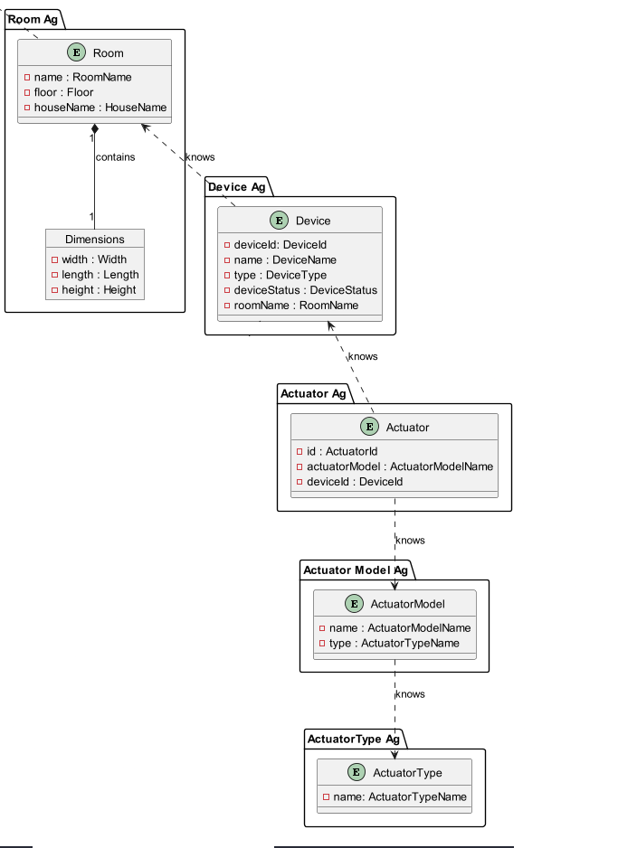
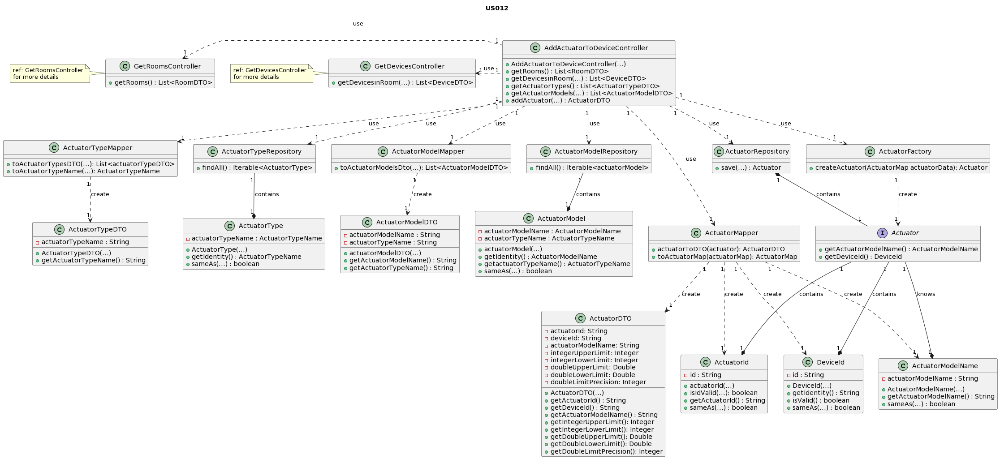

# UC012 - Add Actuator to Device

### Table of Contents

1. [Requirements](#1-requirements)
    - [Dependency on other user stories](#dependency-on-other-user-stories)
2. [Analysis](#2-analysis)
    - [Relevant domain model excerpt](#relevant-domain-model-excerpt)
3. [Design](#3-design)
    - [Class diagram](#class-diagram)
    - [Sequence diagram](#sequence-diagram)
    - [Applied design patterns and principles](#applied-design-patterns-and-principles)
4. [Tests](#4-tests)
    - [Acceptance tests](#acceptance-tests)
    - [Unit tests](#unit-tests)
    - [Integration tests](#integration-tests)
5. [Implementation](#5-implementation)
6. [Conclusion](#6-conclusion)

## 1. Requirements

_As a Power User [or Administrator], I want to add an actuator to an existing
device in a room. The actuator must be of a model of an existing type of actuator.

Requirements for the actuator:

- The system should allow the addition of an actuator to an existing device.
- The actuator must belong to an existing type of actuator.
- The actuator should be associated with a specific device.
- The actuator should be added to a room where the device is located.

### Dependency on other user stories

This user story depends on the following user stories:

1. **US003 - List of Existing Rooms for Administrators:** As an Administrator, I want to have a list of existing rooms,
   so that I can choose one to edit it.
   This dependency arises because adding an actuator to a device involves associating it with a device in a specific
   room.
   Therefore, the availability of existing rooms is necessary for the user to choose the appropriate room for adding the
   actuator.

2. **US006 - List of Devices in a Room:** As a Room Owner [or Power User, or Administrator], I want to get a list of all
   devices in a room, so that I can configure them.
   This dependency exists because adding an actuator to a device requires selecting the device to which the actuator
   will be added.
   Therefore, having a list of devices in the room is essential for the user to choose the device correctly.

These dependencies indicate the necessity of implementing the functionalities described in US003 and US006 to facilitate
the implementation and usability of this user story.

## 2. Analysis

The addition of a actuator to an existing device involves interactions between various components of the system. These
interactions ensure that the actuator is correctly validated, associated with the device, and added to the specified
room.

The following steps outline the key interactions that occur when adding a actuator to an existing device in a room:

| Attribute               | Rules                                                                                                                |
|-------------------------|----------------------------------------------------------------------------------------------------------------------|
| actuatorTypeMapper      | Responsible for mapping objects of type ActuatorType between the application domain and the data persistence layer.  |
| actuatorTypeRepository  | Responsible for interacting with the data persistence layer to retrieve and store objects of type ActuatorType.      |
| actuatorModelMapper     | Responsible for mapping objects of type ActuatorModel between the application domain and the data persistence layer. |
| actuatorModelRepository | Responsible for interacting with the data persistence layer to retrieve and store objects of type ActuatorModel.     |
| actuatorRepository      | Responsible for interacting with the data persistence layer to retrieve and store objects of type Actuator.          |
| actuatorFactory         | Responsible for creating new objects of type Actuator.                                                               |
| actuatorMapper          | Responsible for mapping objects of type Actuator between the application domain and the data persistence layer.      |
| getRoomsController      | Responsible for providing functionality related to obtaining the list of available rooms.                            |
| getDevicesController    | Responsible for providing functionality related to obtaining the list of available devices.                          |

### Relevant domain model excerpt



## 3. Design

### Class diagram



### Sequence diagram


### Applied design patterns and principles

- **Controller:** The AddActuatorToDeviceController class separates the logic of adding an actuator to an existing
  device from the user interface.
- **Information Expert:** The Actuator class holds all necessary information about actuators and is responsible for
  actuator-related operations.
- **Creator:** The ActuatorFactory class is responsible for creating Actuator objects and ensuring they are correctly
  initialized.
- **Low Coupling:** The AddActuatorToDeviceController interacts with other classes such as DeviceRepository,
  DeviceMapper, and ActuatorFactory with minimal knowledge of their internal implementations.
- **High Cohesion**: Each class is focused on a single responsibility, such as device management, actuator creation, or
  repository operations.
- **Single Responsibility Principle (SRP):** Each class follows SRP by managing a specific aspect of the system without
  unnecessary dependencies.
- **Repository:** The ActuatorRepository class manages the persistence of actuator objects.
- **Aggregate Root:** The Device entity serves as the aggregate root, ensuring consistency and integrity within the
  domain.
- **Value Object:** Objects such as ActuatorTypeName represent immutable value objects representing simple pieces of
  data.

## 4. Tests

### Acceptance tests

- **Scenario 1**: Adding Actuator with Valid Data
    - **Given** the actuator addition process,
    - **When** a power user or administrator provides valid data to add an actuator to a device,
    - **Then** the actuator should be successfully added to the device without errors, indicating a successful addition.

- **Scenario 2**: Adding Actuator with Invalid Data
    - **Given** the actuator addition process,
    - **When** a power user or administrator provides invalid data while adding an actuator to a device (e.g., selecting
      an invalid model),
    - **Then** the actuator addition should fail, and an appropriate error message should be displayed indicating the
      failure.

- **Scenario 3**: Adding Actuator with Null Data
    - **Given** the actuator addition process,
    - **When** a power user or administrator attempts to add an actuator with null data,
    - **Then** the actuator addition should fail, and an appropriate error message should be displayed indicating the
      failure.

### Integration tests

### **Scenario 1: Constructor Validation**

| Test Case                                                                                   | Expected Outcome                                                    |
|---------------------------------------------------------------------------------------------|---------------------------------------------------------------------|
| Test the constructor throws an exception when the ActuatorTypeMapper is null.               | Should throw `IllegalArgumentException`.                            |
| Test the constructor throws an exception when the ActuatorTypeRepository is null.           | Should throw `IllegalArgumentException`.                            |
| Test the constructor throws an exception when the ActuatorModelMapper is null.              | Should throw `IllegalArgumentException`.                            |
| Test the constructor throws an exception when the ActuatorModelRepository is null.          | Should throw `IllegalArgumentException`.                            |
| Test the constructor throws an exception when the ActuatorRepository is null.               | Should throw `IllegalArgumentException`.                            |
| Test the constructor throws an exception when the ActuatorFactory is null.                  | Should throw `IllegalArgumentException`.                            |
| Test the constructor throws an exception when the ActuatorMapper is null.                   | Should throw `IllegalArgumentException`.                            |
| Test the constructor throws an exception when the GetRoomsController is null.               | Should throw `IllegalArgumentException`.                            |
| Test the constructor throws an exception when the GetDevicesController is null.             | Should throw `IllegalArgumentException`.                            |
| Test the constructor does not throw an exception when all parameters are not null.          | Should not throw any exceptions.                                    |
| Test creating an instance of AddActuatorToDeviceController when all dependencies are valid. | Should create a non-null instance of AddActuatorToDeviceController. |

### **Scenario 2: Test AddActuator Method**

| Test Case                                                     | Expected Outcome                      |
|---------------------------------------------------------------|---------------------------------------|
| Test adding an actuator with valid data.                      | Should successfully add the actuator. |
| Test adding an actuator with invalid data (null).             | Should fail and return null.          |
| Test adding an actuator with invalid data (exception thrown). | Should fail and return null.          |

For more information on unit testing and validation, please refer
to
the [AddActuatorToDeviceControllerTest](https://github.com/Departamento-de-Engenharia-Informatica/2023-2024-switch-dev-project-assignment-switch-project-2023-2024-grupo6/blob/main/src/test/java/smarthome/controller/AddActuatorToDeviceControllerTest.java)

## 5. Implementation

The `AddActuatorToDeviceController` class is responsible for adding an actuator to a device:

```java

public class AddActuatorToDeviceController {
    // Attributes and dependencies

    public AddActuatorToDeviceController(GetRoomsController getRoomsController, GetDevicesController getDevicesController, ActuatorTypeRepository actuatorTypeRepository, ActuatorModelRepository actuatorModelRepository, ActuatorModelMapper actuatorModelMapper, ActuatorTypeMapper actuatorTypeMapper, ActuatorFactory actuatorFactory, ActuatorRepository actuatorRepository, ActuatorMapper actuatorMapper) {
        // Constructor implementation
    }

    public ActuatorDTO addActuator(ActuatorDTO actuatorDTO) {
        // Method implementation
    }

    // Other methods
}
}
```

The `ActuatorMapper ` class is responsible for mapping between DTOs and domain entities for actuators:

```java

public class ActuatorMapper {
    public ActuatorDTO toDTO(Actuator actuator) {
        // Implementation to map Actuator entity to ActuatorDTO
    }

    public ActuatorMap toActuatorMap(ActuatorDTO actuatorDTO) {
        // Implementation to map ActuatorDTO to ActuatorMap
    }
}
}
```

The `ActuatorRepository ` class is responsible for storing and retrieving actuator data:

```java

public class ActuatorRepository {
    private final Map<ActuatorId, Actuator> actuatorData = new HashMap<>();

    public void save(Actuator actuator) {
        // Implementation to save actuator data
    }

    public List<Actuator> findAll() {
        // Implementation to retrieve all actuators
    }
}
```

The `ActuatorDTO ` class represents the Data Transfer Object (DTO) for actuators:

```java

public class ActuatorDTO {
    public ActuatorDTO(String actuatorId, String deviceId, String actuatorModelName, Integer integerUpperLimit, Integer integerLowerLimit, Double decimalUpperLimit, Double decimalLowerLimit, Integer precision) {
        // Implementation details
    }

    public String getActuatorId() {
        // Implementation details
    }
}
```

For more information on the implementation of this user story, please refer to the
[AddActuatorToDeviceController](https://github.com/Departamento-de-Engenharia-Informatica/2023-2024-switch-dev-project-assignment-switch-project-2023-2024-grupo6/blob/main/src/main/java/smarthome/controller/AddActuatorToDeviceController.java),
[ActuatorMapper](https://github.com/Departamento-de-Engenharia-Informatica/2023-2024-switch-dev-project-assignment-switch-project-2023-2024-grupo6/blob/main/src/main/java/smarthome/dto/mappers/ActuatorMapper.java),
[ActuatorRepository](https://github.com/Departamento-de-Engenharia-Informatica/2023-2024-switch-dev-project-assignment-switch-project-2023-2024-grupo6/blob/main/src/main/java/smarthome/repository/ActuatorRepository.java),
[ActuatorDTO](https://github.com/Departamento-de-Engenharia-Informatica/2023-2024-switch-dev-project-assignment-switch-project-2023-2024-grupo6/blob/main/src/main/java/smarthome/dto/ActuatorDTO.java),

These classes and components work together to fulfill the requirements of adding an actuator to a device.

## 6. Conclusion

The implementation of this user story has added significant functionality to the system, allowing a power user or
administrator to add an actuator to an existing device in a room.
This functionality is crucial for the system's ability to manage and control devices in a smart home environment.
The successful completion of this user story marks a significant step forward in the development of the system.