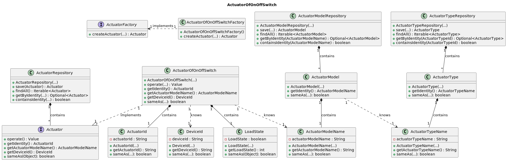

# US013 - Actuator that switches a load on/off

### Table of Contents

1. [Requirements](#1-requirements)
    - [Dependency on other User Stories](#dependency-on-other-user-stories)
2. [Analysis](#2-analysis)
    - [Relevant domain model excerpt](#relevant-domain-model-excerpt)
3. [Design](#3-design)
    - [Class diagram](#class-diagram)
    - [Sequence diagram](#sequence-diagram)
    - [Applied design patterns and principles](#applied-design-patterns-and-principles)
4. [Tests](#4-tests)
    - [Acceptance Tests](#acceptance-tests)
    - [Unit tests](#unit-tests)
    - [Integration tests](#integration-tests)
5. [Implementation](#5-implementation)
6. [Conclusion](#6-conclusion)

## 1. Requirements

_As Product Owner, I want the system to have a type of actuator that switches a
load ON/OFF.

This requirement focuses on introducing a new type of actuator to the system, capable of switching a load ON/OFF.
The actuator should be able to receive a command to turn the load either ON or OFF.

### Dependency on other User Stories

Although this User Story does not have a direct dependency on other user stories, it is worth noting that User Story 12
is about **adding an actuator to a device.**
In the context of **US012**, the actuator implemented could be the one described in this user story (US013).
Therefore, while not a dependency, there is a relevant relationship between the two user stories.

## 2. Analysis

The ActuatorOfOnOffSwitch is composed by the following attributes:

| Attribute             | Rules                                                                          |
|-----------------------|--------------------------------------------------------------------------------|
| **ActuatorId**        | Must be a unique identifier. It is generated automatically.                    |
| **ActuatorModelName** | Must not be null or empty. Must correspond to a model of an existing type.     |
| **DeviceId**          | Must not be null or empty. Must correspond to an existing device in the house. |
| **LoadState**         | Must be able to switch between ON and OFF states.                              |

The interaction with the binary switch sensor involves:

1. Detecting the status of a binary switch (ON/OFF).
2. Associating the sensor with a specific device in the house.
3. Reading the status of the binary switch using the sensor.

### Relevant domain model excerpt

The following domain model excerpt illustrates the core components related to the actuator for load ON/OFF:


## 3. Design

### Class diagram

Below is the class diagram representing the design for the actuator of load ON/OFF:


### Sequence diagram

A sequence diagram for US013 has not been provided due to the straightforward nature of operating an actuator for load
ON/OFF.

### Applied design patterns and principles

## Applied design patterns and principles

* **Command Pattern** - The actuator utilizes the command pattern to encapsulate requests as objects, allowing the
  parameterization of clients with requests, queuing of requests, and logging of requests, thereby facilitating the
  switching of the load ON/OFF.
* **Single Responsibility Principle (SRP)** - The ActuatorOfOnOffSwitch class adheres to SRP by focusing solely on
  managing the state of the load, ensuring that it maintains a clear and comprehensible responsibility.
* **Open/Closed Principle (OCP)** - The design allows for extension without modification, enabling future enhancements
  or additions to actuator functionality without altering existing code.
* **Abstraction** - The Actuator interface abstracts the common behavior of all actuators in the system, promoting
  flexibility and code reuse.
* **Encapsulation** - The actuator encapsulates the behavior of switching the load ON/OFF, shielding clients from the
  complexities of the implementation details.
* **Dependency Injection** - Dependency injection is employed in the ActuatorOfOnOffSwitch constructor to inject the
  necessary dependencies, promoting loose coupling and testability.

## 4. Tests

### Acceptance Tests

- **Scenario 1**: Turning the load ON
    - **Given** the system contains an actuator for load ON/OFF.
    - **When** a command is issued to turn the load ON.
    - **Then** the actuator should switch the load ON successfully.

- **Scenario 2**: Turning the load OFF
    - **Given** the system contains an actuator for load ON/OFF.
    - **When** a command is issued to turn the load OFF.
    - **Then** the actuator should switch the load OFF successfully.

### Unit tests

Below are some relevant unit tests for the actuator of load ON/OFF, focusing on its behavior:

| Test Case                                                                                                                         | Expected Outcome                                  |
|-----------------------------------------------------------------------------------------------------------------------------------|---------------------------------------------------|
| Test the creation of a `ActuatorOfOnOffSwitch` object with a **valid actuator model name** and **device ID**                      | The object should be created successfully.        |
| Test the creation of a `ActuatorOfOnOffSwitch` object with an **invalid actuator model name** and/or **device ID** (null objects) | The object should not be created.                 |
| The `ActuatorOfOnOffSwitch`  object should be able to **return a valid the actuator ID**                                          | The object should return the actuator ID.         |
| The `ActuatorOfOnOffSwitch`  object should be able to **return a valid actuator model name**                                      | The object should return the actuator model name. |
| The `ActuatorOfOnOffSwitch`  object should be able to **return a valid the device ID**                                            | The object should return the device ID.           |

Below are some relevant unit tests for the `LoadState` class:

| Test Case                                                                         | Expected Outcome                           |
|-----------------------------------------------------------------------------------|--------------------------------------------|
| Test the creation of a `LoadState` object                                         | The object should be created successfully. |
| Test the `switchState` method of `LoadState` object when the initial state is OFF | The state should be switched to ON.        |
| Test the `switchState` method of `LoadState` object when the initial state is ON  | The state should be switched to OFF.       |
| Test the `isOn` method of `LoadState` object when the state is ON                 | The method should return true.             |
| Test the `isOn` method of `LoadState` object when the state is OFF                | The method should return false.            |
| Test the `isOff` method of `LoadState` object when the state is OFF               | The method should return true.             |
| Test the `isOff` method of `LoadState` object when the state is ON                | The method should return false.            |

[OnOffSwitchTest](https://github.com/Departamento-de-Engenharia-Informatica/2023-2024-switch-dev-project-assignment-switch-project-2023-2024-grupo6/blob/main/src/test/java/smarthome/domain/actuator/ActuatorOfOnOffSwitchTest.java)
and
[LoadStateTest](https://github.com/Departamento-de-Engenharia-Informatica/2023-2024-switch-dev-project-assignment-switch-project-2023-2024-grupo6/blob/main/src/test/java/smarthome/domain/actuator/vo/LoadStateTest.java)
classes.

### Integration tests

Integration tests are not specified for US013 at this time.
This is because the scope of US013 is confined to creating an actuator that switches a load ON/OFF.
As such, the actuator's behavior can be adequately tested through unit tests.

## 5. Implementation

The implementation of the `ActuatorOfOnOffSwitch` class that implements the `Actuator` interface is as follows:

```java 

public class ActuatorOfOnOffSwitch implements Actuator {

    private final ActuatorId actuatorId;
    private final DeviceId deviceId;
    private final ActuatorModelName actuatorModelName;

    LoadState loadState;

    public ActuatorOfOnOffSwitch(DeviceId deviceId, ActuatorModelName actuatorModelName) {
        //implementation

        public ActuatorId getIdentity () {
            //implementation
        }

        public boolean sameAs (Object object){
            //implementation

            public Value operate (Value Value){
                //implementation

                private boolean isValidValue (Value value){
                    //implementation


                    public ActuatorModelName getActuatorModelName () {
                        //implementation

                        @Override public DeviceId getDeviceId () {
                            //implementation
```

The `LoadState` class is responsible for managing the state of the load (ON/OFF), which is a key functionality of the
actuator.

```java

public class LoadState {
    private boolean state;

    public LoadState() {
        //implementation
    }

    public void switchState() {
        //implementation
    }

    public boolean isOn() {
        //implementation
    }

    public boolean isOff() {
        //implementation
    }


```

[ActuatorOfOnOffSwitch](https://github.com/Departamento-de-Engenharia-Informatica/2023-2024-switch-dev-project-assignment-switch-project-2023-2024-grupo6/blob/main/src/main/java/smarthome/domain/actuator/ActuatorOfOnOffSwitch.java)
and
[LoadState](https://github.com/Departamento-de-Engenharia-Informatica/2023-2024-switch-dev-project-assignment-switch-project-2023-2024-grupo6/blob/main/src/main/java/smarthome/domain/actuator/vo/LoadState.java)
classes.

## 6. Conclusion

This user story outlines the requirements, analysis, design, testing, and implementation for an actuator of load ON/OFF.
Through a structured approach, it addresses the necessary components, relationships, and behaviors for successful
integration into the system.

[Back to Top](#US013---Actuator-that-switches-a-load-onoff)

