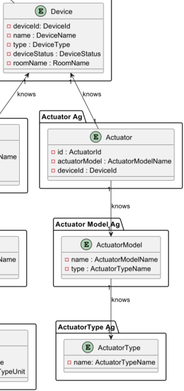
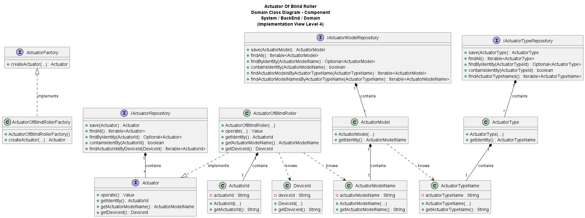

# US021 - Actuator that open/closes a blind roller

### Table of Contents

1. [Requirements](#1-requirements)
    - [Dependency on other user stories](#dependency-on-other-user-stories)
2. [Analysis](#2-analysis)
    - [Relevant domain model excerpt](#relevant-domain-model-excerpt)
3. [Design](#3-design)
    - [Class diagram](#class-diagram)
    - [Sequence diagram](#sequence-diagram)
    - [Applied design patterns and principles](#applied-design-patterns-and-principles)
4. [Tests](#4-tests)
    - [Acceptance Tests](#acceptance-tests)
    - [Unit tests](#unit-tests)
    - [Integration tests](#integration-tests)
5. [Implementation](#5-implementation)
6. [Conclusion](#6-conclusion)

## 1. Requirements

_As Product Owner, I want the system to have a type of actuator that open/closes
a blind roller (0% closed, 100% fully open)._

Requirements for the actuator that open/closes a blind roller:

- The actuator should have a unique identifier.
- The actuator should have a model name that corresponds to an existing actuator model.
- The actuator should be associated with a device in the house.
- The actuator should be able to operate a blind roller with a value between 0 and 100.
- The actuator should be able to open/close a blind roller, but for now it is only necessary to create the actuator,
so the method to operate the actuator will be implemented in the future, currently requiring validation for values between 0 and 100


### Dependency on other user stories

This User Story (US014) does not directly depend on other user stories.
However, it is related to User Story 12 (US012), which involves adding an actuator to a device.
The actuator described in US014 could be implemented as part of US012.
Thus, there is a relevant relationship between the two user stories, although not a direct dependency.

## 2. Analysis

The Actuator of Blind Roller needs the following attributes:

| Attribute         | Rules                                                                            |
|-------------------|----------------------------------------------------------------------------------|
| Unique Identifier | Each actuator must have a unique identifier                                      |
| Model Name        | The actuator must have a model name corresponding to an existing actuator model. |
| Device Identifier | The actuator must be associated with a device in the house.                      |

Initially, the focus is on creating the actuator and associating it with a device.
A method to operate the actuator will be implemented in the future,
currently requiring validation for values between 0 and 100.

To implement a new actuator of the blind roller, **the system must receive a specific factory** (implements the `ActuatorFactory` interface).
This new factory (`ActuatorOfBlindRollerFactory`) will be called by the `ActuatorFactoryImpl` class, which will be responsible for creating the new actuator.

The interaction with the actuator of the blind roller involves:
1. The actuator is created by the factory, which receives the device identifier and the actuator model name.
2. Can call the operate method, but for now it is only necessary to create the actuator, so the method to operate returns if the value is
in the range defined by \[0, 100]. Otherwise, the system returns null.

   
### Relevant domain model excerpt



## 3. Design

### Class diagram

Below is the class diagram for this user story:



### Sequence diagram

A sequence diagram for US014 has not been provided due to the straightforward nature of operating an actuator for opening
and closing a blind roller.

### Applied design patterns and principles

* **Information Expert** - The ActuatorOfBlindRoller class manages the actuator's operations and attributes.
* **Factory Method** - In this design, the `ActuatorFactory` serves as the general factory interface for creating
  actuators, and it delegates the creation of specific actuator types, such as `ActuatorOfBlindRoller`, to the
  specialized `ActuatorFactoryImpl` that implement `ActuatorFactory`, this can determinate which specific factory will be used. In 
this case, the `ActuatorOfBlindRollerFactory` is responsible for creating instances of `ActuatorOfBlindRoller`.
  This allows the `ActuatorOfBlindRollerFactory` to encapsulate all the knowledge and specific steps required to create an
  `ActuatorOfBlindRoller`, following the Factory Method design pattern. This pattern enables the system to introduce new
  types of actuators without altering the existing factory infrastructure `ActuatorFactoryImpl` and `ActuatorFactory`.
* **Creator** -  The `ActuatorOfBlindRollerFactory` specifically embodies the Creator role in this context, taking
  responsibility for constructing instances of `ActuatorOfBlindRoller`. It ensures that each actuator is properly initialized with its unique
  identifier, associated device, and model information, as well as configured with the correct parameter limits. The `ActuatorOfBlindRollerFactory` implements the `ActuatorFactory` interface, which defines the contract for creating actuators.
* **Low Coupling** - The `ActuatorOfBlindRoller` class has minimal dependencies on other classes.
* **High Cohesion** - The class is focused solely on actuator management.
* **Single Responsibility Principle** - The `ActuatorOfBlindRoller` has one responsibility, managing the actuator's operations.
* **Repository Pattern** -  The `ActuatorRepository` manage actuator-related data.
* **Interface Segregation Principle (ISP)** - The design includes interfaces that define contracts for actuator
  behaviors without enforcing unnecessary methods on implementing classes. For example, the `Actuator` interface declares methods
  relevant to all actuators, ensuring that classes like `ActuatorOfBlindRoller` only need to implement methods pertinent to
  their specific function. Other case, the `ActuatorFactory` interface defines a contract for creating actuators, which
    can be implemented by specialized factories like `ActuatorOfBlindRollerFactory` and the infrastructure class `ActuatorFactoryImpl` that manages the creation of actuators.
* * **Value Object** - The `ActuatorId` , `ActuatorModelName`, and `DeviceId` classes are value objects that represent the unique identifier, model name, and device identifier of the actuator, respectively.


## 4. Tests

### Acceptance Tests

- **Scenario 1**: The actuator is created with valid attributes.
   - **Given** that the actuator is created with a unique identifier, model name, and device identifier.
   - **When** the actuator is created.
   - **Then** the actuator should be successfully created.
  
- **Scenario 2**: The actuator of the blind roller operate when the blind roller value is between 0 and 100.
    - **Given** that the blind roller value is between 0 and 100.
    - **When** the actuator of the blind roller called to operate.
    - **Then** the actuator should operate the blind roller, but now returning the value.

- **Scenario 3**: The actuator of the blind roller operate when the blind roller value is lower than 0.
    - **Given** that the blind roller value is lower than 0.
    - **When** the actuator of the blind roller called to operate.
    - **Then** the actuator should not operate the blind roller, returning null.

- **Scenario 4**: The actuator of the blind roller operate when the blind roller value is greater than 100.
  - **Given** that the blind roller value is greater than 100.
  - **When** the actuator of the blind roller called to operate.
  - **Then** the actuator should not operate the blind roller, returning null.

### Unit tests
Below are relevant unit tests for this user story, focusing on the behavior of the `ActuatorOfBlindRoller` class:

| Test Case                                                                                                                         | Expected Outcome                                  |
|-----------------------------------------------------------------------------------------------------------------------------------|---------------------------------------------------|
| Test the creation of a `ActuatorOfBlindRoller` object with a **valid actuator model name** and **device ID**                      | The object should be created successfully.        |
| Test the creation of a `ActuatorOfBlindRoller` object with an **invalid actuator model name** and/or **device ID** (null objects) | The object should not be created.                 |
| The `ActuatorOfBlindRoller` object should be able to **return a valid the actuator ID**                                           | The object should return the actuator ID.         |
| The `ActuatorOfBlindRoller` object should be able to **return a valid actuator model name**                                       | The object should return the actuator model name. |
| The `ActuatorOfBlindRoller` object should be able to **return a valid the device ID**                                             | The object should return the device ID.           |


For more information on unit testing and validation, please refer to
the [ActuatorOfBlindRollerTest](https://github.com/Departamento-de-Engenharia-Informatica/2023-2024-switch-dev-project-assignment-switch-project-2023-2024-grupo6/blob/main/src/test/java/smarthome/domain/actuator/ActuatorOfBlindRollerTest.java).


### Integration tests

Integration tests are not specified for US014 at this time. This is because US014's scope is confined to creating an actuator that opens/closes a blind roller.
As such, the actuator's behavior can be tested through unit tests.
The **factory method** for creating the actuator can be tested through integration tests in the user story that requires the actuator's creation (e.g., **US012)**.
It should be noted that the actuator's operation will be implemented in the future, and integration tests will be developed at that time.

## 5. Implementation

The interface `Actuator` is as follows (not new methods were added):

```java
public interface Actuator extends AggregateRoot<ActuatorId> {
    
    ActuatorModelName getActuatorModelName();
    
    DeviceId getDeviceId();
}
```

The implementation of the `ActuatorOfBlindRoller` class that implements the `Actuator` interface is as follows:

```java
public class ActuatorOfBlindRoller implements Actuator {

    private final ActuatorId actuatorId;
    private final DeviceId deviceId;
    private final ActuatorModelName actuatorModelName;

    
    public ActuatorOfBlindRoller(DeviceId deviceId, ActuatorModelName actuatorModelName) {
        // Implementation
    }

    public Value operate(Value value) {
        // Implementation
    }
    
    @Override
    public ActuatorId getIdentity() {
        // Implementation
    }
    
    @Override
    public ActuatorModelName getActuatorModelName() {
        // Implementation
    }
    
    @Override
    public DeviceId getDeviceId() {
        // Implementation
    }
    
    @Override
    public boolean sameAs(Object object) {
        // Implementation
    }
}
```

For the factory method, the interface `ActuatorFactory` is as follows (not new methods were added):

```java
public interface ActuatorFactory {
    
    public Actuator createActuator(ActuatorMap actuatorData) throws IllegalAccessException;

}
```


The implementation of the `ActuatorOfBlindRollerFactory` class that implements the `ActuatorFactory` interface is as follows:
    
```java
public class ActuatorOfBlindRollerFactory implements ActuatorFactory {

    @Override
    public Actuator createActuator(ActuatorMap actuatorData) {
    // Implementation
    }
}
```
For more information on the implementation of this user story, please refer to the
[ActuatorFactory](https://github.com/Departamento-de-Engenharia-Informatica/2023-2024-switch-dev-project-assignment-switch-project-2023-2024-grupo6/blob/main/src/main/java/smarthome/domain/actuator/ActuatorFactory.java),
[ActuatorFactoryImpl](https://github.com/Departamento-de-Engenharia-Informatica/2023-2024-switch-dev-project-assignment-switch-project-2023-2024-grupo6/blob/main/src/main/java/smarthome/domain/actuator/ActuatorFactoryImpl.java),
[ActuatorOfBlindRollerFactory](https://github.com/Departamento-de-Engenharia-Informatica/2023-2024-switch-dev-project-assignment-switch-project-2023-2024-grupo6/blob/main/src/main/java/smarthome/domain/actuator/ActuatorOfBlindRollerFactory.java),
[Actuator](https://github.com/Departamento-de-Engenharia-Informatica/2023-2024-switch-dev-project-assignment-switch-project-2023-2024-grupo6/blob/main/src/main/java/smarthome/domain/actuator/Actuator.java),
and
[ActuatorOfBlindRoller](https://github.com/Departamento-de-Engenharia-Informatica/2023-2024-switch-dev-project-assignment-switch-project-2023-2024-grupo6/blob/main/src/main/java/smarthome/domain/actuator/ActuatorOfBlindRoller.java)
classes.


## 6. Conclusion

This user story outlines the requirements, analysis, design, testing, and implementation for an actuator capable of opening and closing a blind roller. Through a structured approach, it addresses the necessary components, relationships, and behaviors.
To achieve this, the design leverages the Factory Method pattern to create actuators, ensuring that the actuator of the blind roller can be instantiated and managed effectively. The ActuatorOfBlindRoller class encapsulates the actuator's attributes and operations, providing a clear interface for interacting with the actuator.


