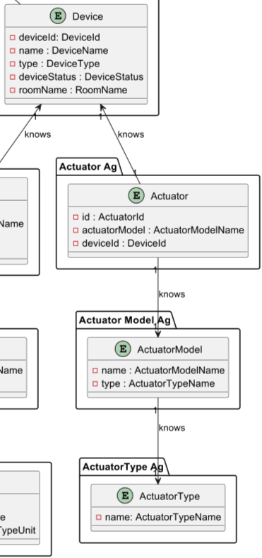

# US015 - Actuator of Limiter

### Table of Contents

1. [Requirements](#1-requirements)
    - [Dependency on other user stories](#dependency-on-other-user-stories)
2. [Analysis](#2-analysis)
    - [Relevant domain model excerpt](#relevant-domain-model-excerpt)
3. [Design](#3-design)
    - [Class diagram](#class-diagram)
    - [Sequence diagram](#sequence-diagram)
    - [Applied design patterns and principles](#applied-design-patterns-and-principles)
4. [Tests](#4-tests)
    - [Acceptance Tests](#Acceptance-tests)
    - [Unit tests](#unit-tests)
    - [Integration tests](#integration-tests)
5. [Implementation](#5-implementation)
6. [Conclusion](#6-conclusion)

## 1. Requirements

_As Product Owner, I want the system to have a type of actuator that sets an
integer value in the range defined by \[lower limit, upper limit]._

Requirements for the Actuator of Limiter:

- The actuator should be able to set a value in the range defined by lower and upper limit.
- The actuator should be associated with a model, corresponding to a predefined actuator model in the system, indicating
  its specifications.
- The actuator should be associated with a device in the house.

### Dependency on other user stories

Although this User Story does not have a direct dependency on other user stories, it is worth noting that User Story 12
is about adding an actuator to a device.
In the context of **US012**, the actuator implemented could be the one described in this user story (US015).
Therefore, while not a dependency, there is a relevant relationship between the two user stories.

## 2. Analysis

The ActuatorOflLimiter class is composed by the following attributes:

| Attribute             | Rules                                                                          |
|-----------------------|--------------------------------------------------------------------------------|
| **ActuatorId**        | Must be a unique identifier. It is generated automatically.                    |
| **ActuatorModelName** | Must not be null or empty. Must correspond to a model of an existing type.     |
| **DeviceId**          | Must not be null or empty. Must correspond to an existing device in the house. |
| **LowerLimit**        | Must not be null, empty or upper than UpperLimit. Must be a positive integer.  |
| **UpperLimit**        | Must not be null, empty or lower than LowerLimit. Must be a positive integer.  |

The interaction with the actuator of limiter involves:

1. Requesting to set a value in the range defined by \[lower limit, upper limit].
2. For now, the actuator sets the decimal value as requested.
3. The system returns the decimal value if it is within the range defined by \[lower limit, upper limit].
   Otherwise, the system returns null.

### Relevant domain model excerpt

Below is the relevant domain model excerpt for this user story:



## 3. Design

### Class diagram

Below is the class diagram for this user story:


### Sequence diagram

A sequence diagram for US015 is not provided, since the only requirement is for the system to have an actuator that sets
an integer value in the range defined by \[lower limit, upper limit]. So, there is no interaction with other components
or actors in the system.

### Applied Design Patterns and Principles

* **Information Expert** - The `ActuatorOfLimiter` class is designed to encapsulate the knowledge about how to manage
  its identity, model, value range (lower and upper limits) and associated device. This encapsulation ensures that the
  logic
  related to the actuator's operations is kept within the class itself.

* **Factory Method** - In this design, the `ActuatorFactory` serves as the general factory interface for creating
  actuators,
  and it delegates the creation of specific actuator types, such as `ActuatorOfLimiter`, to the
  specialized `ActuatorOfLimiterCreator`.
  This allows the `ActuatorOfLimiterCreator` to encapsulate all the knowledge and specific steps required to create an
  `ActuatorOfLimiter`, following the Factory Method design pattern. This pattern enables the system to introduce new
  types
  of actuators without altering the existing factory infrastructure.

* **Creator** - The ActuatorOfLimiterCreator specifically embodies the Creator role in this context, taking
  responsibility
  for constructing instances of ActuatorOfLimiter. It ensures that each actuator is properly initialized with its unique
  identifier, associated device, and model information, as well as configured with the correct parameter limits.

* **Low Coupling** - The creation process for `ActuatorOfLimiter` instances is centralized in
  the `ActuatorOfLimiterCreator`,
  which helps decouple the instantiation process from the actuator's operational responsibilities and interactions with
  other components like the `ActuatorRepository`. This separation allows for changes in the creation process without
  affecting
  the core functionalities of the actuators, thereby enhancing the system's flexibility.

* **High Cohesion** - Each class in the system is designed to focus on a single responsibility, which ensures that
  classes
  are comprehensible and maintainable. For example, the `ActuatorRepository` is dedicated solely to storing and
  retrieving
  actuator information, avoiding the mixing of concerns and promoting high cohesion within the system.

* **Single Responsibility Principle (SRP)** - The `ActuatorOfLimiter` class is tasked with managing the specific details
  and operations of limit-based actuators, separate from the `ActuatorRepository`, which handles data storage and
  retrieval.
  This clear separation helps ensure that modifications in one area, such as data management, do not impact the core
  functionality
  of the actuators.

* **Repository** - The `ActuatorRepository`, along with any specific repositories like `ActuatorModelRepository`,
  implement
  the Repository pattern. These repositories provide an abstraction layer for accessing actuator objects from the domain
  model, effectively hiding the complexities of the underlying data access mechanisms.

* **Interface Segregation Principle (ISP)** - The design includes interfaces that define contracts for actuator
  behaviors
  without enforcing unnecessary methods on implementing classes. For example, the `Actuator` interface declares methods
  relevant to all actuators, ensuring that classes like `ActuatorOfLimiter` only need to implement methods pertinent to
  their specific function.

* **Value Object** - The upper and lower limits of the actuator are represented as value objects in the system.
  This design choice adheres to the Value Object pattern, as these objects encapsulate the specific range values (lower
  and upper limits) and treat them as immutable objects, ensuring their integrity throughout the system's operation.

## 4. Tests

### Acceptance Tests

- **Scenario 1**: Test for Valid Range Configuration
  - **Given** an actuator configuration process,
  - **When** an actuator is configured with a lower limit set lower than the upper limit, both being integer values,
  - **Then** the configuration should be successfully accepted without errors, indicating a valid range configuration.


- **Scenario 2**: Test for Invalid Range Configuration
  - **Given** an actuator configuration process,
  - **When** an actuator is configured with the upper limit set lower than the lower limit,
  - **Then** the configuration should be rejected, and an error message should be raised indicating an invalid range
    configuration.


- **Scenario 3**: Test for Value Within Range
  - **Given** a configured actuator with a lower limit and an upper limit,
  - **When** the actuator is set to an integer value within the specified range,
  - **Then** the actuator should successfully accept and return the value.


- **Scenario 4**: Test for Value Below Lower Limit
  - **Given** a configured actuator with a lower limit and an upper limit,
  - **When** the actuator is set to an integer value below the lower limit,
  - **Then** the actuator should reject the value and raise an error indicating the value is below the lower limit.


- **Scenario 5**: Test for Value Above Upper Limit
  - **Given** a configured actuator with a lower limit of an integer minimum and an upper limit of an integer maximum,
  - **When** the actuator is set to an integer value above the upper limit,
  - **Then** the actuator should reject the value and raise an error indicating the value is above the upper limit.

### Unit Tests

Below are some relevant unit tests for this user story, focusing on the validation of actuator data:

| Test Case                                                                           | Expected Outcome                                                                                       |
|-------------------------------------------------------------------------------------|--------------------------------------------------------------------------------------------------------|
| Test initializing an actuator of limiter with valid integer lower and upper limits. | The actuator instance should be created with the specified integer limits without errors.              |
| Test initializing an actuator of limiter with lower limit greater than upper limit. | The actuator instance should not be created, and the system should return an error message.            |
| Test initializing an actuator of limiter with invalid parameters.                   | The actuator instance should not be created, and the system should return an error message.            |
| Test setting a value within the defined integer range in the actuator.              | The actuator should correctly accept and set the value to be within the integer range without errors.  |
| Test setting a value below the integer lower limit in the actuator.                 | The actuator should reject the value and throw an error indicating the value is below the lower limit. |
| Test setting a value above the integer upper limit in the actuator.                 | The actuator should reject the value and throw an error indicating the value is above the upper limit. |

For more information on the unit tests, please refer to
the [ActuatorOfLimiterTest](https://github.com/Departamento-de-Engenharia-Informatica/2023-2024-switch-dev-project-assignment-switch-project-2023-2024-grupo6/blob/main/src/test/java/smarthome/domain/actuator/ActuatorOfLimiterTest.java)
class.

### Integration tests

Integration tests are not specified for US015 at this time. This is because US015's scope is confined to set a value in
the range defined by \[lower limit, upper limit], a process that currently does not involve intricate interactions
between multiple system components or external dependencies.

## 5. Implementation

The `ActuatorOfLimiter` class implements the `Actuator` interface, specializing in adjusting and managing values within
a predefined range. Below is the relevant code excerpt for the `ActuatorOfLimiter` class:

```java
public class ActuatorOfLimiter {

    public ActuatorOfLimiter(DeviceId deviceId, ActuatorModelName actuatorModelName, IntLimiter lowerLimit, IntLimiter upperLimit) {
        // Implementation of the constructor
    }

    public Value operate(Value value) {
        // Implementation of the method
    }
}
```

For more information on the implementation, please refer to
the [ActuatorOfLimiter](https://github.com/Departamento-de-Engenharia-Informatica/2023-2024-switch-dev-project-assignment-switch-project-2023-2024-grupo6/blob/main/src/main/java/smarthome/domain/actuators/ActuatorOfLimiter.java)
class.

The `ActuatorOfLimiterFacotry` class is responsible for creating instances of the `ActuatorOfLimiter` class. Below is
the:

```java
public class ActuatorOfLimiterFactory {

    public Actuator createActuator(ActuatorMap actuatorData) {
        // Implementation of the method to create an actuator    
    }
}
```

For more information on the implementation, please refer to
the [ActuatorOfLimiterFactory](https://github.com/Departamento-de-Engenharia-Informatica/2023-2024-switch-dev-project-assignment-switch-project-2023-2024-grupo6/blob/main/src/main/java/smarthome/domain/actuator/ActuatorOfLimiterFactory.java)
class.

## 6. Conclusion

To summarize, this User Story introduces a mechanism for setting integer values within a specified limits in the system,
using the `ActuatorOfLimiter` class. The system ensures that all values managed by this actuator fall within the
defined range, maintaining the system's reliability and consistency. The implementation relies on key attributes such as
predefined limits, which are vital for the accurate adjustment and management of the values.

[Back to top](#us015---actuator-of-limiter)


