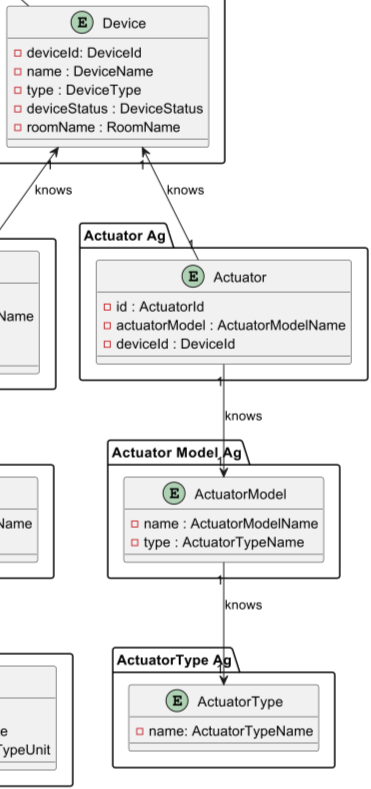
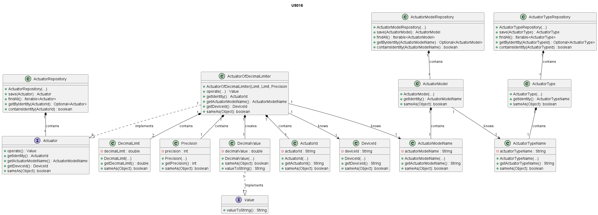

# US016 - Actuator Of Decimal Limiter

### Table of Contents

1. [Requirements](#1-requirements)
    - [Dependency on other user stories](#dependency-on-other-user-stories)
2. [Analysis](#2-analysis)
    - [Relevant domain model excerpt](#relevant-domain-model-excerpt)
3. [Design](#3-design)
    - [Class diagram](#class-diagram)
    - [Sequence diagram](#sequence-diagram)
    - [Applied design patterns and principles](#applied-design-patterns-and-principles)
4. [Tests](#4-tests)
    - [Acceptance Tests](#acceptance-tests)
    - [Unit tests](#unit-tests)
    - [Integration tests](#integration-tests)
5. [Implementation](#5-implementation)
6. [Conclusion](#6-conclusion)

## 1. Requirements

_As Product Owner, I want the system to have a type of actuator that sets a decimal value in the range defined by
[lower limit, upper limit] and predefined precision._

Requirements for the actuator of decimal limiter:

- The actuator should be able to set a decimal value in the range defined by [lower limit, upper limit] and predefined 
precision.
- The actuator should be associated with a model, corresponding to a predefined actuator model in the system, indicating
its specifications.
- The actuator should be associated with a device in the house.


### Dependency on other User Stories

Although this User Story does not exhibit a direct dependence on other User Stories, it is pertinent to mention that
User Story 12 focuses on the addition of an actuator to a device. Within the scope of US012, the actuator implemented
might correspond to the one described in this story (US016). Thus, despite not constituting a dependency, there is a
significant relation between the two User Stories.

## 2. Analysis

The ActuatorOfDecimalLimiter class is composed by the following attributes:

| Attribute              | Rules                                                                          |
|------------------------|--------------------------------------------------------------------------------|
| **ActuatorId**         | Must be a unique identifier. It is generated automatically.                    |
| **ActuatorModelName**  | Must not be null or empty. Must correspond to a model of an existing type.     |
| **DeviceId**           | Must not be null or empty. Must correspond to an existing device in the house. |
| **LowerLimit**         | Must not be null or empty or higher than UpperLimit. Must be a decimal number. |
| **UpperLimit**         | Must not be null or empty or lower than LowerLimit. Must be a decimal number.  |
| **Precision**          | Must not be null or empty. Must be a positive integer.                         |                                                          

The DecimalValue, which is created in the context of the ActuatorOfDecimalLimiter class, is composed by the following attributes:

| Attribute        | Rules                                                                           |
|------------------|---------------------------------------------------------------------------------|
| **DecimalValue** | Must not be null or empty. Must be a decimal number.                            |

The interaction with the actuator of decimal limiter involves:

1. Requesting to set a decimal value in the range defined by [lower limit, upper limit] and predefined precision
2. For now, the actuator sets the decimal value as requested, returning the value formatted according to limits and precision.


### Relevant domain model excerpt

Below is the relevant domain model excerpt for this user story:



## 3. Design

### Class diagram

Below is the class diagram for this user story:



### Sequence diagram

A sequence diagram for US016 is not provided, since the only requirement is for the system to have an actuator that  
sets a decimal value in the range defined by [lower limit, upper limit] and predefined precision. So, there is no 
interaction with other components or actors in the system.

### Applied design patterns and principles

* **Information Expert** - The `ActuatorOfDecimalLimiter` class is responsible for managing its identity, value, and the
  limits within which this value can vary, encapsulating this logic within the class itself. This approach ensures that 
  the knowledge about how to manipulate and validate the decimal value within the established limits is contained in the
  most logical place.
* **Creator** - The `ActuatorFactory` plays a crucial role in the creation of actuators, including `ActuatorOfDecimalLimiter`. 
  It encapsulates the logic required to instantiate an actuator, ensuring that each one is created and associated with 
  the correct device and actuator model. This pattern aids in maintaining the consistency and integrity of actuator 
  creation across the system.
* **Low Coupling** - The `ActuatorFactory` plays a central role in this User Story by centralizing the instantiation of 
  `ActuatorOfDecimalLimiter` instances. By decoupling the creation process from the actuator's operational and data management 
  responsibilities, the system gains flexibility. 
  Adjustments to how actuators are created or initialized can be made independently of their core functionalities and 
  interactions with the ActuatorRepository.
* **High Cohesion** - Each class is focused on a single responsibility. For example, the `ActuatorRepository` is solely 
  concerned with storing and retrieving device information, ensuring that classes are focused and understandable.
* **Single Responsibility Principle (SRP)** - The `ActuatorOfDecimalLimiter` class concentrates on managing decimal 
  actuator data, distinct from the `ActuatorRepository` which deals with data storage and retrieval. This separation ensures
  that changes in data management don't interfere with actuator functionality, simplifying maintenance and scalability.
* **Repository** - The `ActuatorRepository`, along with potential `ActuatorTypeRepository` and `ActuatorModelRepository`,
  act as Repository patterns. They provide a collection-like interface for accessing actuator, actuator type, and 
  actuator model objects from the domain model, abstracting away the details of the data access layer.
* **Interface Segregation** - The Actuator interface defines a contract for actuator behavior without imposing any 
* unnecessary methods on the implementing classes, such as `ActuatorOfDecimalLimiter`. 
  This follows the Interface Segregation Principle, ensuring that implementing classes only need to provide implementations 
  for methods that make sense for their specific type of actuator.
* **Value Object** - The `DecimalValue` class is a value object that encapsulates the decimal value adjusted by the 
  actuator within defined limits and with predefined precision. By treating the decimal value as a value object, the 
  system ensures that it is immutable and can be shared without risk of modification.


## 4. Tests

### Acceptance Tests

- **Scenario 1**: Test for Valid Range Configuration
    - **Given** an actuator configuration process,
    - **When** an actuator is configured with a lower limit set lower than the upper limit, both being decimal values and an integer precision,
    - **Then** the configuration should be successfully accepted without errors, indicating a valid range configuration.

- **Scenario 2**: Test for Invalid Range Configuration
    - **Given** an actuator configuration process,
    - **When** an actuator is configured with the upper limit set lower than the lower limit and a valid precision,
    - **Then** the configuration should be rejected, and an error message should be raised indicating an invalid range
      configuration.

- **Scenario 3**: Test for Value Within Range
    - **Given** a configured actuator with a lower limit, an upper limit and a precision,
    - **When** the actuator is set to a decimal value within the specified range,
    - **Then** the actuator should successfully accept and return the value.

- **Scenario 4**: Test for Value Below Lower Limit
    - **Given** a configured actuator with a lower limit, an upper limit and a precision,
    - **When** the actuator is set to a decimal value below the lower limit,
    - **Then** the actuator should reject the value and raise an error indicating the value is below the lower limit.

- **Scenario 5**: Test for Value Above Upper Limit
    - **Given** a configured actuator with a lower limit, an upper limit and a precision,
    - **When** the actuator is set to a decimal value above the upper limit,
    - **Then** the actuator should reject the value and raise an error indicating the value is above the upper limit.

- **Scenario 6**: Test for Value Precision
    - **Given** a configured actuator with a lower limit, an upper limit and a precision,
    - **When** the actuator is set to a decimal value,
    - **Then** the actuator should adjust and set the value, adhering to the predefined precision.

### Unit tests

Below are some relevant unit tests for this user story, focusing on the validation of actuator data:

| Test Case                                                                                     | Expected Outcome                                                                                                      |
|-----------------------------------------------------------------------------------------------|-----------------------------------------------------------------------------------------------------------------------|
| Test initializing `ActuatorOfDecimalLimiter` with valid lower and upper limits and precision. | The `ActuatorofDecimalLimiter` instance should be created with the specified limits and precision without errors.     |
| Test setting a value within the defined range in `ActuatorOfDecimalLimiter`.                  | The actuator should correctly accept and adjust the value to be within the range, following the predefined precision. |
| Test setting a value below the lower limit in `ActuatorOfDecimalLimiter`.                     | The actuator should reject the value and throw an error indicating the value is below the lower limit.                |
| Test setting a value above the upper limit in `ActuatorOfDecimalLimiter`.                     | The actuator should reject the value and throw an error indicating the value is above the upper limit.                |
| Test adjusting a value to match the predefined precision in `ActuatorOfDecimalLimiter`.       | The actuator should adjust and set the value to match the predefined precision accurately.                            |
| Test setting the actuator to the lower limit value in `ActuatorOfDecimalLimiter`.             | The actuator's value should be successfully set to the lower limit without errors.                                    |
| Test setting the actuator to the upper limit value in `ActuatorOfDecimalLimiter`.             | The actuator's value should be successfully set to the upper limit without errors.                                    |

Below are some relevant unit tests for this user story, focusing on the creation of decimal value:


| Test Case                                                  | Expected Outcome                          |
|------------------------------------------------------------|-------------------------------------------|
| Test creating a decimal value with a valid decimal number. | The system should return a decimal value. |

For more information on testing and validation, please refer to the
[ActuatorOfDecimalLimiterTest](https://github.com/Departamento-de-Engenharia-Informatica/2023-2024-switch-dev-project-assignment-switch-project-2023-2024-grupo6/blob/main/src/test/java/smarthome/domain/actuator/ActuatorOfDecimalLimiterTest.java)
and
[DecimalValueTest](https://github.com/Departamento-de-Engenharia-Informatica/2023-2024-switch-dev-project-assignment-switch-project-2023-2024-grupo6/blob/main/src/test/java/smarthome/domain/actuator/vo/DecimalValueTest.java)
classes.

### Integration tests

Integration tests are not specified for US016 at this time. This is because US016's scope is confined to set a decimal 
value in the range defined by [lower limit, upper limit] and predefined precision, a process that currently does not 
involve intricate interactions between multiple system components or external dependencies.

## 5. Implementation

The `ActuatorOfDecimalLimiter` class implements the `Actuator` interface, specializing in adjusting and managing 
decimal values within a defined range and with predefined precision.

```java
public ActuatorOfDecimalLimiter(DeviceId deviceId, ActuatorModelName actuatorModelName, DecimalLimit lowerLimit, DecimalLimit upperLimit, Precision precision) {
    // Implementation of the method
}

public Value operate(Value value) {
    // Implementation of the method
}

public ActuatorId getIdentity() {
        // Implementation of the method
}

public ActuatorModelName getActuatorModelName() {
        // Implementation of the method
}

public DeviceId getDeviceId() {
        // Implementation of the method
}

public boolean sameAs(Object) {
        // Implementation of the method
}

```

The `DecimalValue` class, implementing the `Value` interface, encapsulates the decimal value adjusted by the actuator.

```java
public DecimalValue(double DecimalValue) {
    // Implementation of the method
}

public boolean sameAs(Object) {
        // Implementation of the method
}

public String valueToString() {
    // Implementation of the method
}
```

For more information on the implementation of this user story, please refer to the
[ActuatorOfDecimalLimiter](https://github.com/Departamento-de-Engenharia-Informatica/2023-2024-switch-dev-project-assignment-switch-project-2023-2024-grupo6/blob/main/src/main/java/smarthome/domain/actuator/ActuatorOfDecimalLimiter.java)
and
[DecimalValue](https://github.com/Departamento-de-Engenharia-Informatica/2023-2024-switch-dev-project-assignment-switch-project-2023-2024-grupo6/blob/main/src/main/java/smarthome/domain/actuator/vo/DecimalValue.java)
classes.

## 6. Conclusion

To conclude, the technical report on US016 - Actuator Of Decimal Limiter successfully introduces a mechanism for managing
decimal values within specified limits and precision in the system. By employing the ActuatorOfDecimalLimiter and 
DecimalValue classes, the system efficiently handles and represents decimal values. 
This precision in managing values ensures the system's reliability and consistency. 
The execution of this feature is supported by critical attributes, such as predefined limits and precision settings, 
which are vital for the accurate adjustment and management of decimal values.

[Back to top](#us016---actuator-of-decimal-limiter)