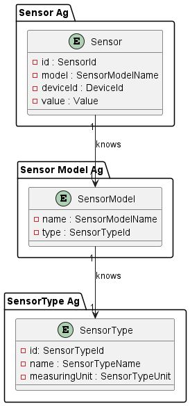
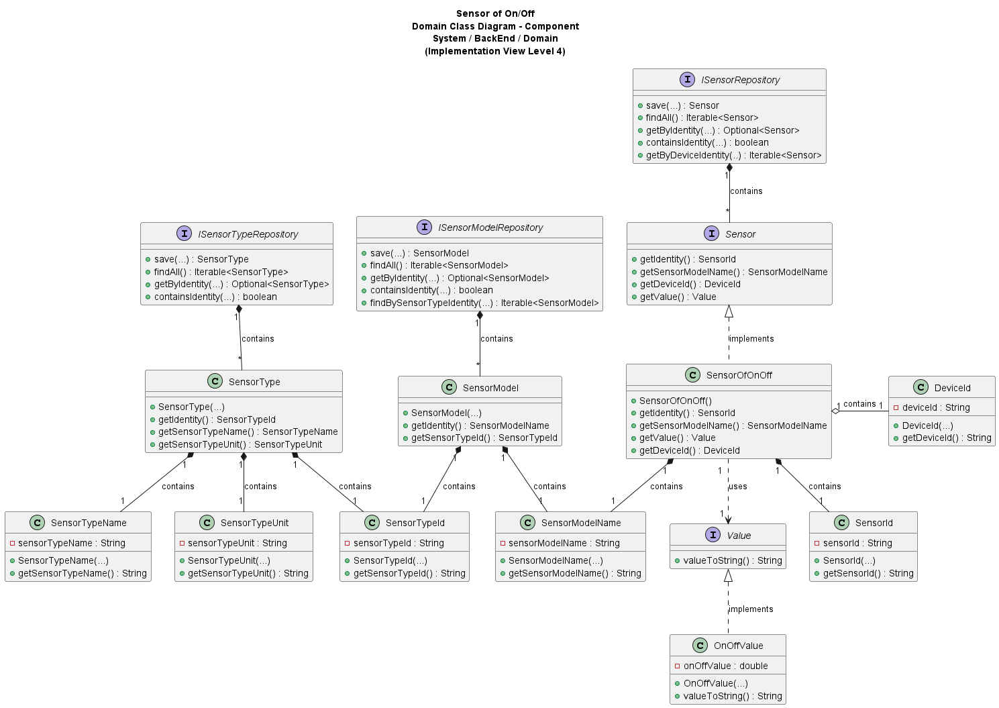

# US017 - Sensor of On/Off (Binary)

### Table of Contents

1. [Requirements](#1-requirements)
    - [Dependency on other User Stories](#dependency-on-other-user-stories)
2. [Analysis](#2-analysis)
    - [Relevant Domain Model excerpt](#relevant-domain-model-excerpt)
3. [Design](#3-design)
    - [Class diagram](#class-diagram)
    - [Sequence diagram](#sequence-diagram)
    - [Applied design patterns and principles](#applied-design-patterns-and-principles)
4. [Tests](#4-tests)
    - [Acceptance Tests](#acceptance-tests)
    - [Unit tests](#unit-tests)
    - [Integration tests](#integration-tests)
5. [Implementation](#5-implementation)
6. [Conclusion](##6-conclusion)

## 1. Requirements

_As Product Owner, I want the system to have a type of sensor that gives the
status of a binary switch (ON/OFF)._

Requirements for a sensor of On/Off:

- The sensor must know the device that it belongs to.
- The sensor must be able to provide the current status of a binary switch.

### Dependency on other User Stories

Although the **US017** does not have a direct dependency on other user stories, it is worth noting that **US007**(... I want to add a sensor to an existing device in
a room. The sensor must be of a model of an existing type of sensor) is deeply connected to this user story. In the context 
of the **US007**, the sensor added to the device could be the one described in this user story.

Also, it´s important to mention that a `SensorOfOnOff` returns a specific value, `OnOffValue`, and a class was created to represent
this value in the system as well.

## 2. Analysis

The SensorOfOnOff class is composed by the following attributes:

| Attribute           | Rules                                                                                                                                          |
|---------------------|------------------------------------------------------------------------------------------------------------------------------------------------|
| **SensorId**        | Must be a unique identifier. It is generated automatically.                                                                                    |
| **DeviceId**        | Must not be null or empty. Must correspond to an existing device identity saved in the system.                                                 |
| **SensorModelName** | Must not be null or empty. Must correspond to an existing model saved in the system.                                                           |
| **Value**           | Must be a OnOffValue object that represents the current status of a binary switch. At the moment this is a default value for testing purposes. |

The OnOffValue, which is created in the context of the SensorOfOnOff class, is composed by the following attributes:

| Attribute      | Rules                                                                     |
|----------------|---------------------------------------------------------------------------|
| **onOffValue** | Must be a boolean that represents the current status of a binary switch.  |

The interaction with the sensor of On/Off involves:

1. Requesting the current status of a binary switch (for now the system generates a default value, as
there is not yet a connection to the hardware that provides this information).
2. The system returns the current status of a binary switch in a binary(true/false) format.

### Relevant Domain Model excerpt

Below is the relevant domain model excerpt for this user story:



## 3. Design

### Class Diagram

Below is the class diagram for this user story:



### Sequence Diagram

A sequence diagram for **US017** is not provided, since the only requirement is for the system to have a sensor that provides
the current status of a binary switch. So, there is no interaction with other components or actors in the system at the moment.

### Applied Design Patterns and Principles

* **Information Expert and Single Responsibility** - Each created class is focused on a single responsibility. Also each class knows how to manage its own data and responsibilities encapsulating the logic within the class itself.


* **Creator** - The _SensorFactory_ class plays a crucial role in the creation of sensors, including _SensorOfOnOff_.
  It encapsulates the logic required to instantiate any sensor, ensuring that each sensor is created with a valid state
  and associated with the correct device and sensor model.


* **Low Coupling** - By decoupling the creation process from the _SensorOfOnOff_ class responsibilities, the system gains flexibility. Adjustments to how sensors are created or initialized can be made
  independently of their core functionalities.


* **High Cohesion** - The _SensorOfOnOff_ class is responsible for managing the status of a binary switch data, while the 
  _SensorRepository_ class is solely concerned with storing and retrieving sensor information and the _SensorFactory_ 
  class is responsible for creating sensors. This separation ensures that classes are focused and understandable.


* **Repository** - The _SensorRepository_, _SensorTypeRepository_, and _SensorModelRepository_ classes act as Repository
  patterns, providing a way to store and retrieve sensor data, sensor types, and sensor models, respectively.


* **Interface Segregation Principle(ISP)** - The _Sensor_ interface defines a contract for sensor behavior without imposing any
  unnecessary methods on the implementing classes, such as _SensorOfOnOff_. This follows the ISP by ensuring that implementing classes only need to provide implementations for methods that make sense for their
  specific type of sensor.


* **Value Object** - The _OnOffValue_ class is a value object that encapsulates the current status of a binary switch. 
  By treating the binary switch value as a value object, the system ensures that the value is immutable and can be shared without risk of modification.

## 4. Tests

### Acceptance Tests

- `Scenario 1:` Create and associate a sensor of on/off with a device.
    - **Given** the system is equipped with devices.
    - **When** a user requests to add a sensor of on/off to a device.
    - **Then** the system should be able to create and save a sensor of on/off.


- `Scenario 2:` Retrieving the current status of a binary switch from a device.
    - **Given** the system is equipped with devices that have on/off sensors.
    - **When** a user requests the current status of a binary switch from a device(sensor).
    - **Then** the system should provide the current status of a binary switch.

### Unit Tests

Below are some relevant unit tests for the class `SensorOfOnOff`:

| Test Case                                                        | Expected Outcome                                                             |
|------------------------------------------------------------------|------------------------------------------------------------------------------|
| Test creating a on/off sensor with the provided device identity. | The system should correctly return a on/off sensor associated to the device. |
| Test retrieving the sensor identity.                             | The system should return the accurate sensor identity.                       |
| Test retrieving the associated device identity.                  | The system should return the accurate device identity.                       | 
| Test retrieving the default on/off value.                        | The system should return the default on/off value defined in the system      |

Below are some relevant unit tests for the class `OnOffValue`:

| Test Case                                                                          | Expected Outcome                                                                            |
|------------------------------------------------------------------------------------|---------------------------------------------------------------------------------------------|
| Test creating a on/off value with the provided value.                              | The system should return a on/off value, value object.                                      |
| Verify the accessibility of the current positive(true) status of a binary switch.  | The system should return the current positive(true) status of a binary switch as a string.  |
| Verify the accessibility of the current negative(false) status of a binary switch. | The system should return the current negative(false) status of a binary switch as a string. |

For more information, please refer to the
[SensorOfOnOffTest](https://github.com/Departamento-de-Engenharia-Informatica/2023-2024-switch-dev-project-assignment-switch-project-2023-2024-grupo6/blob/main/src/test/java/smarthome/domain/sensor/SensorOfOnOffTest.java)
and
[OnOffValueTest](https://github.com/Departamento-de-Engenharia-Informatica/2023-2024-switch-dev-project-assignment-switch-project-2023-2024-grupo6/blob/main/src/test/java/smarthome/domain/sensor/vo/values/OnOffValueTest.java)
classes.

### Integration Tests

Integration tests are not specified for **US017** at this time.

## 5. Implementation

The `SensorOfOnOff` class implements the `Sensor` interface and encapsulates the logic for managing the current status of a binary switch:

```java
public class SensorOfOnOff implements Sensor {
    // Implementation of the class
}

protected SensorOfOnOff(DeviceId deviceId, SensorModelName sensorModelName) {
    // Implementation of the constructor
    this.value = new OnOffValue(false); //Default value
}

@Override
public Value getValue() {
    // Implementation of the method
}
```

The `OnOffValue` class, implements the `Value` interface and encapsulates the current status of a binary switch, ensuring immutability and
data integrity.

```java
public class OnOffValue implements Value {
    // Implementation of the class
}

public OnOffValue(boolean onOffValue) {
    // Implementation of the constructor
}

@Override
public String valueToString() {
    // Implementation of the method
}
```

For more information, please refer to the
[SensorOfOnOff](https://github.com/Departamento-de-Engenharia-Informatica/2023-2024-switch-dev-project-assignment-switch-project-2023-2024-grupo6/blob/main/src/main/java/smarthome/domain/sensor/SensorOfOnOff.java)
and
[OnOffValue](https://github.com/Departamento-de-Engenharia-Informatica/2023-2024-switch-dev-project-assignment-switch-project-2023-2024-grupo6/blob/main/src/main/java/smarthome/domain/sensor/vo/values/OnOffValue.java)
classes.

## 6. Conclusion

In conclusion, this User Story introduces the functionality of providing the current status of a binary switch into the system, utilizing
the `SensorOfOnOff` and `OnOffValue` classes for effective management of binary switch data.

[Back to Top](#us017---sensor-of-onoff-binary)