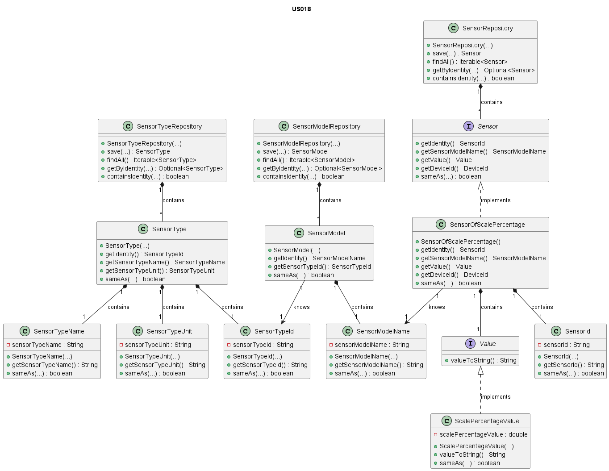

# US018 - Sensor of Scale Percentage

### Table of Contents

1. [Requirements](#1-requirements)
    - [Dependency on other user stories](#dependency-of-other-user-stories)
2. [Analysis](#2-analysis)
    - [Relevant domain model excerpt](#relevant-domain-model-excerpt)
3. [Design](#3-design)
    - [Class diagram](#class-diagram)
    - [Sequence diagram](#sequence-diagram)
    - [Applied design patterns and principles](#applied-design-patterns-and-principles)
4. [Tests](#4-tests)
    - [Acceptance Tests](#acceptance-tests)
    - [Unit tests](#unit-tests)
    - [Integration tests](#integration-tests)
5. [Implementation](#5-implementation)
6. [Conclusion](#6-conclusion)

## 1. Requirements

_As Product Owner, I want the system to have a type of sensor that gives the current value/position in a scale (%)._

Requirements for the sensor of scale percentage:

- The sensor should be able to provide the current value/position in a scale as a percentage.
- The sensor should have a unique identifier.
- The sensor should have a model name that corresponds to an existing sensor model.
- The sensor should have a value that represents the current scale percentage.
- The sensor should be associated with a device in the house.
- The system should be able to retrieve the current scale percentage value from the sensor.

### Dependency on other user stories

Although this User Story does not have a direct dependency on other user stories, it is worth noting that User Story 7
is about **adding a sensor to a device.**
In the context of **US007**, the sensor implemented could be the one described in this user story (US018).
Therefore, while not a dependency, there is a relevant relationship between the two user stories.


## 2. Analysis

The Sensor of Scale Percentage needs the following attributes:

| Attribute              | Rules                                                                                |
|------------------------|--------------------------------------------------------------------------------------|
| **Sensor Id**          | Must be a unique identifier. It is generated automatically. Must not be null or black. |
| **Sensor Model Name**  | Must not be null. Must correspond to a model of an existing type.               |
| **Device Id**          | Must not be null. Must correspond to an existing device in the house.                |
| **Value (Percentage)** | Must be a `ScalePercentageValue` object that represents the percentage value in a scale. |

The `ScalePercentageValue`, which is created in the context of the `SensorOfScalePercentage` class, is composed by the following attributes:

| Attribute                 | Rules                                                                                  |
|---------------------------|----------------------------------------------------------------------------------------|
| **Scale Percentage** | Must not be null and should be represented as numeric  |

The interaction with the sensor of scale percentage involves:

1. Requesting the percentage value from the sensor.
2. For now, the system generates a default value, as there is not yet a connection to the hardware that provides this
   information.
3. The system returns the percentage.

### Relevant domain model excerpt

Below is the relevant domain model excerpt for this user story:


## 3. Design

### Class diagram

Below is the class diagram for this user story:



### Sequence diagram

A sequence diagram for US018 is not provided, reflecting the straightforward process of retrieving a scale percentage value, which
does not involve intricate system interactions typically depicted in sequence diagrams.

### Applied design patterns and principles

* **Information Expert** - The `SensorOfScalePercentage` class knows how to manage its identity, value, and associated device,
  encapsulating this logic within the class itself.
* **Creator** - The `SensorFactory` plays a crucial role in the creation of sensors, including `SensorOfScalePercentage` class.
  It encapsulates the logic required to instantiate a sensor, ensuring that each sensor is created with a proper state
  and associated with the correct device and sensor model. This pattern helps in maintaining the consistency and
  integrity of sensor creation across the system.
* **Low Coupling** - The `SensorFactory` plays a pivotal role in this User Story by centralizing the instantiation of
  `SensorOfScalePercentage` instances. By decoupling the creation process from the sensor's operational
  responsibilities, the system gains flexibility. Adjustments to how sensors are created or initialized can be made
  independently of their core functionalities and interactions with the `SensorRepository`.
* **High Cohesion** - Each class is focused on a single responsibility. For instance, the `SensorRepository` is solely
  concerned with storing and retrieving sensor information, ensuring that classes are focused and understandable.
* **Single Responsibility Principle (SRP)** - The `SensorOfScalePercentage` class focuses on managing the current scale percentage data,
  distinct from the `SensorRepository` which deals with data storage and retrieval. This separation ensures that changes
  in data management don't interfere with sensor functionality, simplifying maintenance and scalability.
* **Repository** - The `SensorRepository`, `SensorTypeRepository`, and `SensorModelRepository` act as Repository
  patterns.
  They provide a collection-like interface for accessing sensor, sensor type, and sensor model objects from the domain
  model, abstracting away the details of the data access layer.
* **Interface Segregation** - The `Sensor` interface defines a contract for sensor behavior without imposing any
  unnecessary methods on the implementing classes, such as `SensorOfScalePercentage`. This follows the **Interface Segregation
  Principle** by ensuring that implementing classes only need to provide implementations for methods that make sense for their
  specific type of sensor.
* **Value Object** - The `ScalePercentageValue` class is a value object that encapsulates the percentage. By treating the scale percentage
  as a value object, the system ensures that the percentage is immutable and can be shared without risk of modification.

## 4. Tests

### Acceptance Tests

- **Scenario 1**: Retrieving the scale percentage value from the sensor.
  **Given** a sensor of scale percentage.
  **When** the system requests the scale percentage value from the sensor.
  **Then** the system should return the current scale percentage value.

- **Scenario 2**: The sensor of scale percentage is created with valid attributes.
  **Given** a sensor of scale percentage.
  **When** the sensor is created.
  **Then** the sensor should have a unique identifier, a model name, a value, and a device ID.


### Unit tests

Below are some relevant unit tests for this user story, focusing on the behavior of the `SensorOfScalePercentage` class and the `ScalePercentageValue` value object.

Begin by testing the creation of a `ScalePercentageValue` object:

| Test Case                                                                                                                                                                                        | Expected Outcome                                                                                     |
|--------------------------------------------------------------------------------------------------------------------------------------------------------------------------------------------------|------------------------------------------------------------------------------------------------------|
| Test the creation of a `ScalePercentageValue` object with a **valid scale percentage value** (positive, negative and equals to zero)                                                      | The object should be created successfully with the specified scale percentage value.                 
| Test the creation of a `ScalePercentageValeu` that can convert the scale percentage **value to a string** (positive, negative and equals to zero)                                                              | The object should be able to convert the scale percentage value to a string representation.          |
| Test the creation of a  `ScalePercentageValue` object that can **check** if two scale percentage values are **equal** (positive, negative and equals to zero) differenting different values and objects or null | The object should be able to compare two scale percentage values and return true if they are equal, false otherwise. |

Next, test the creation of a `SensorOfScalePercentage` object:

| Test Case                                                                                                                         | Expected Outcome                                      |
|-----------------------------------------------------------------------------------------------------------------------------------|-------------------------------------------------------|
| Test the creation of a `SensorOfScalePercentage` object with a **valid sensor model name** and **device ID**                      | The object should be created successfully.            |
| Test the creation of a `SensorOfScalePercentage` object with an **invalid sensor model name** and/or **device ID** (null objects) | The object should not be created.                     |
| The `SensorOfScalePercentage` object should be able to **return a valid scale percentage value**                                  | The object should return the scale percentage value.  |     
| The `SensorOfScalePercentage` object should be able to **return a valid the sensor ID**                                           | The object should return the sensor ID.               |
| The `SensorOfScalePercentage` object should be able to **return a valid sensor model name**                                       | The object should return the sensor model name.       |
| The `SensorOfScalePercentage` object should be able to **return a valid the device ID**                                           | The object should return the device ID.               |

For more information on unit testing and validation, please refer to
the [SensorOfScalePercentageTest](https://github.com/Departamento-de-Engenharia-Informatica/2023-2024-switch-dev-project-assignment-switch-project-2023-2024-grupo6/blob/main/src/test/java/smarthome/domain/sensor/SensorOfScalePercentageTest.java)
and [ScalePercentageValueTest](https://github.com/Departamento-de-Engenharia-Informatica/2023-2024-switch-dev-project-assignment-switch-project-2023-2024-grupo6/blob/main/src/test/java/smarthome/domain/sensor/vo/values/ScalePercentageValueTest.java) classes.
        
### Integration tests

Integration tests are not specified for US018 at this time. This is because US018's scope is confined to displaying
percentage values based on existing sensor data, a process that does not involve intricate interactions between multiple
system components or external dependencies. The functionality is straightforward and primarily focused on data retrieval
and presentation, areas typically covered by unit tests. Should the integration landscape of the system evolve to
include more complex interactions relevant to US018, the need for integration tests will be revisited.

## 5. Implementation

The implementation of the `SensorOfScalePercentage` class is straightforward, focusing on encapsulating the scale percentage value and providing methods to access this value. The `ScalePercentageValue` class is a value object that represents the scale percentage value and ensures that it is immutable and consistently represented. The `SensorFactory` class centralizes the creation of sensors, ensuring that each sensor is correctly initialized and associated with the appropriate device and sensor model.


The implementatio of the `Sensor` interface is as follows (no changes were made):
```java
public interface Sensor extends AggregateRoot<SensorId> {
    
    SensorModelName getSensorModelName();
    
    DeviceId getDeviceId();
    
    Value getValue();
}
```

The implementation of the `SensorOfScalePercentage` class that implements the `Sensor` interface is as follows:
```java
public class SensorOfScalePercentage implements Sensor {

    private final SensorId sensorId;
    private final DeviceId deviceId;
    private final SensorModelName sensorModelName;
    private final Value value;
    
    protected SensorOfScalePercentage(DeviceId deviceId, SensorModelName sensorModelName) {
        // Implementation of the method
    }

    @Override
    public SensorId getIdentity() {
        // Implementation of the method
    }

    @Override
    public boolean sameAs(Object object) {
        // Implementation of the method
    }

    @Override
    public SensorModelName getSensorModelName() {
        // Implementation of the method
    }

    @Override
    public DeviceId getDeviceId() {
        // Implementation of the method
    }

    @Override
    public Value getValue() {
        // Implementation of the method
    }
}
```

The implementation of the `Value` interface is as follows (no changes were made):

```java
public interface Value extends ValueObject {
    
    String valueToString();
}
```


The implementation of the `ScalePercentageValue` class that implements the `Value` interface is as follows:
```java
public class ScalePercentageValue implements Value {

    private final double scalePercentageValue;

    public ScalePercentageValue(double scalePercentageValue) {
        // Implementation of the method
    }

    @Override
    public boolean sameAs(Object object) {
        // Implementation of the method
    }

    @Override
    public String valueToString() {
        // Implementation of the method
    }
}
```

For more information on the implementation of this user story, please refer to the
[Sensor](https://github.com/Departamento-de-Engenharia-Informatica/2023-2024-switch-dev-project-assignment-switch-project-2023-2024-grupo6/blob/main/src/main/java/smarthome/domain/sensor/Sensor.java),
[SensorOfScalePercentage](https://github.com/Departamento-de-Engenharia-Informatica/2023-2024-switch-dev-project-assignment-switch-project-2023-2024-grupo6/blob/main/src/main/java/smarthome/domain/sensor/SensorOfScalePercentage.java),
[Value](https://github.com/Departamento-de-Engenharia-Informatica/2023-2024-switch-dev-project-assignment-switch-project-2023-2024-grupo6/blob/main/src/main/java/smarthome/domain/sensor/vo/values/Value.java) and
[ScalePercentageValue](https://github.com/Departamento-de-Engenharia-Informatica/2023-2024-switch-dev-project-assignment-switch-project-2023-2024-grupo6/blob/main/src/main/java/smarthome/domain/sensor/vo/values/ScalePercentageValue.java)
classes.

## 6. Conclusion

The `SensorOfScalePercentage` class provides a straightforward implementation for a sensor that returns the current scale percentage value. By encapsulating the scale percentage value within a `ScalePercentageValue` object, the system ensures that the value is represented consistently and immutably. The `SensorFactory` class centralizes the creation of sensors, ensuring that each sensor is correctly initialized and associated with the appropriate device and sensor model. The system design adheres to key design principles, such as the **Information Expert**, **Creator**, **Low Coupling**, **High Cohesion**, **Single Responsibility Principle (SRP)**, **Repository**, **Interface Segregation**, and **Value Object** patterns, which contribute to a well-structured and maintainable system. The tests of acceptance and unit tests provide comprehensive coverage for the sensor of scale percentage, validating its behavior and ensuring that it meets the specified requirements.


