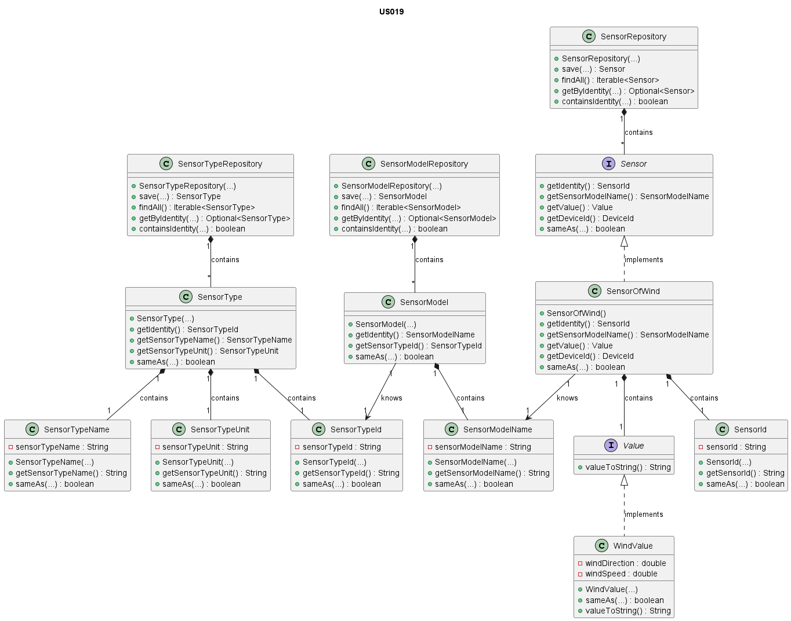

# US019 - Sensor of Wind

### Table of Contents

1. [Requirements](#1-requirements)
    - [Dependency on other user stories](#dependency-on-other-user-stories)
2. [Analysis](#2-analysis)
    - [Relevant domain model excerpt](#relevant-domain-model-excerpt)
3. [Design](#3-design)
    - [Class diagram](#class-diagram)
    - [Sequence diagram](#sequence-diagram)
    - [Applied design patterns and principles](#applied-design-patterns-and-principles)
4. [Tests](#4-tests)
    - [Acceptance Tests](#acceptance-tests)
    - [Unit tests](#unit-tests)
    - [Integration tests](#integration-tests)
5. [Implementation](#5-implementation)
6. [Conclusion](##6-conclusion)

## 1. Requirements

As Product Owner, I want the system to have a type of sensor that gives the wind
speed (km/h) and direction (8 cardinal points).

Requirements for the sensor of wind:

- The sensor should be capable of providing the wind speed and direction.
- Wind speed should be measured in kilometers per hour (km/h).
- Wind direction should be indicated either using the 8 cardinal points or in radians.

### Dependency on other User Stories

Although this User Story does not have a direct dependency on other user stories, it is worth noting that User Story 7
is about adding a sensor to a device.
In the context of **US007**, the sensor implemented could be the one described in this user story (US019).
Therefore, while not a dependency, there is a relevant relationship between the two user stories.

## 2. Analysis

The SensorOfWind class is composed by the following attributes:

| Attribute           | Rules                                                                                               |
|---------------------|-----------------------------------------------------------------------------------------------------|
| **SensorId**        | Must be a unique identifier. It is generated automatically.                                         |
| **SensorModelName** | Must not be null or empty. Must correspond to a model of an existing type.                          |
| **Value**           | Must be a **WindValue** object that represents the wind speed and direction. It should not be null; |
| **DeviceId**        | Must not be null or empty. Must correspond to an existing device in the house.                      |

The WindValue, which is created in the context of the SensorOfWind class, is composed by the following attributes:

| Attribute          | Rules                                                          |
|--------------------|----------------------------------------------------------------|
| **directionValue** | Must be a non-negative double representing wind speed in km/h. |
| **speedValue**     | Must be expressed in radians within the range of 0 to 2π.      |

The interaction with the sensor of wind involves:

1. Requesting the wind speed and direction.
2. The system retrieves the current wind data.
3. The system returns the wind speed and direction in the specified format.

### Relevant domain model excerpt

Below is the relevant domain model excerpt for this user story:


## 3. Design

### Class diagram

Below is the class diagram for this user story:



### Sequence diagram

A sequence diagram for US19 is not provide as the functionality primarily involves retrieving wind data from the sensor. 
So, there is no interaction with other components or actors in the system.

### Applied design patterns and principles

* **Information Expert** - The `SensorOfWind` class knows how to manage its identity, value, and associated device,
  encapsulating this logic within the class itself.
* **Creator** - The `SensorFactory` plays a crucial role in the creation of sensors, including SensorOfWind.
  It encapsulates the logic required to instantiate a sensor, ensuring that each sensor is created with a proper state
  and associated with the correct device and sensor model. This pattern helps in maintaining the consistency and
  integrity of sensor creation across the system.
* **Low Coupling** - The `SensorFactory` plays a pivotal role in this User Story by centralizing the instantiation of
  `SensorOfWind` instances. By decoupling the creation process from the sensor's operational and data management
  responsibilities, the system gains flexibility. Adjustments to how sensors are created or initialized can be made
  independently of their core functionalities and interactions with the `SensorRepository`.
* **High Cohesion** - Each class is focused on a single responsibility. For instance, the `SensorRepository` is solely
  concerned with storing and retrieving sensor information, ensuring that classes are focused and understandable.
* **Single Responsibility Principle (SRP)** - The SensorOfWind class focuses on managing wind sensor data,
  distinct from the SensorRepository which deals with data storage and retrieval. This separation ensures that changes
  in data management don't interfere with sensor functionality, simplifying maintenance and scalability.
* **Repository** - The `SensorRepository`, `SensorTypeRepository`, and `SensorModelRepository` act as Repository
  patterns.
  They provide a collection-like interface for accessing sensor, sensor type, and sensor model objects from the domain
  model,
  abstracting away the details of the data access layer.
* **Interface Segregation** - The `Sensor` interface defines a contract for sensor behavior without imposing any
  unnecessary methods on the implementing classes, such as `SensorOfWind`. This follows the Interface Segregation
  Principle
  by ensuring that implementing classes only need to provide implementations for methods that make sense for their
  specific type of sensor.
* **Value Object** - The `WindValue` class is a value object encapsulating wind speed and direction data. 
By treating wind data as a value object, the system ensures immutability and facilitates sharing without risking modification.

## 4. Tests

### Acceptance Tests

- **Scenario 1**: Retrieving wind speed and direction
    - **Given** the system is equipped with wind sensors.
    - **When** a user requests the current wind speed and direction.
    - **Then** the system should display the current wind speed and direction in the specified format.

### Unit Tests

Below are some relevant unit tests for the class `SensorOfWind`:

| Test Case                                                             | Expected Outcome                                                                  |
|-----------------------------------------------------------------------|-----------------------------------------------------------------------------------|
| Test creating a wind sensor with null DeviceId.                      | The system should throw an IllegalArgumentException.                             |
| Test creating a wind sensor with null SensorModelName.                | The system should throw an IllegalArgumentException.                             |
| Test creating a wind sensor with valid arguments.                     | The system should not throw any exceptions.                                       |
| Test retrieving the sensor identity.                                  | The system should return the accurate sensor identity.                            |
| Test retrieving the associated device identity.                       | The system should return the accurate device identity.                            |
| Test retrieving the sensor model name.                                | The system should return the accurate sensor model name.                          |
| Test retrieving the wind value.                                       | The system should return the correct wind value.                                  |
| Test retrieving the default wind value.                               | The system should return the correct default wind value defined in the system.     |
| 


Below are some relevant unit tests for the class `WindValue`:

| Test Case                                                           | Expected Outcome                                                            |
|---------------------------------------------------------------------|-----------------------------------------------------------------------------|
| Test creating a wind value with valid parameters.                   | The system should return a wind value object.                               |
| Test creating a wind value with negative direction.                 | The system should throw an IllegalArgumentException.                      |
| Test creating a wind value with direction greater than 2*PI.        | The system should throw an IllegalArgumentException.                      |
| Test creating a wind value with negative speed.                     | The system should throw an IllegalArgumentException.                      |
| Test creating a wind value with speed and direction equal to zero.  | The system should not throw any exceptions.                                |
| Test creating a wind value with direction equal to 2*PI.            | The system should not throw any exceptions.                                |

For more information, please refer to the
[SensorOfWindTest](https://github.com/Departamento-de-Engenharia-Informatica/2023-2024-switch-dev-project-assignment-switch-project-2023-2024-grupo6/blob/main/src/test/java/smarthome/domain/sensor/SensorOfWindTest.java)
and
[WindValueTest](https://github.com/Departamento-de-Engenharia-Informatica/2023-2024-switch-dev-project-assignment-switch-project-2023-2024-grupo6/blob/main/src/test/java/smarthome/domain/sensor/vo/values/WindValueTest.java)
classes.
### Integration tests

Integration tests are not specified for **US019** at this time.

## 5. Implementation

The `SensorOfWind` class implements the `Sensor` interface, specializing in managing wind sensor data.

```java
public class SensorOfWind implements Sensor {
    // Implementation of the class
}

    
public SensorOfWind(SensorModelName sensorModelName, DeviceId deviceId) {
    // Implementation of the constructor
    this.value = new WindValue(Math.PI / 2, 25.0);

    }
    
    @Override 
    public SensorId getIdentity() {
        // Implementation of the method
    }


    @Override
    public boolean sameAs(Object object) {
        // Implementation of the method
    }

  
    @Override
    public SensorModelName getSensorModelName() {
        // Implementation of the method
    }

  
    @Override
    public DeviceId getDeviceId() {
        // Implementation of the method
    }

    
    @Override
    public Value getValue() {
        // Implementation of the method
    }

```

The `WindValue` class, implementing the `Value` interface, encapsulates wind speed and direction data, ensuring immutability and data integrity.


```java
public class WindValue implements Value {
    // Implementation of the class
    
    
    public WindValue(double direction, double speed) {
        // Implementation of the constructor
    }
    
    @Override
    public boolean sameAs(Object object) {
        // Implementation of the method
    }
    
    @Override
    public String valueToString() {
        // Implementation of the method
    }

}
```
For more information, please refer to the
[SensorOfWind](https://github.com/Departamento-de-Engenharia-Informatica/2023-2024-switch-dev-project-assignment-switch-project-2023-2024-grupo6/blob/main/src/main/java/smarthome/domain/sensor/SensorOfWind.java)
and
[WindValue](https://github.com/Departamento-de-Engenharia-Informatica/2023-2024-switch-dev-project-assignment-switch-project-2023-2024-grupo6/blob/main/src/main/java/smarthome/domain/sensor/vo/values/WindValue.java)
classes.
## 6. Conclusion

To summarize, this User Story integrates the functionality of providing wind speed and direction data into the system, utilizing the
`SensorOfWind` and `WindValue` classes for effective data management and representation. Validation of wind data
ensures the reliability and accuracy of the information provided, maintaining system integrity. The implementation
involves key attributes, such as the `sensorModelName` and `value`, which are essential for the accurate representation
and retrieval of wind data.