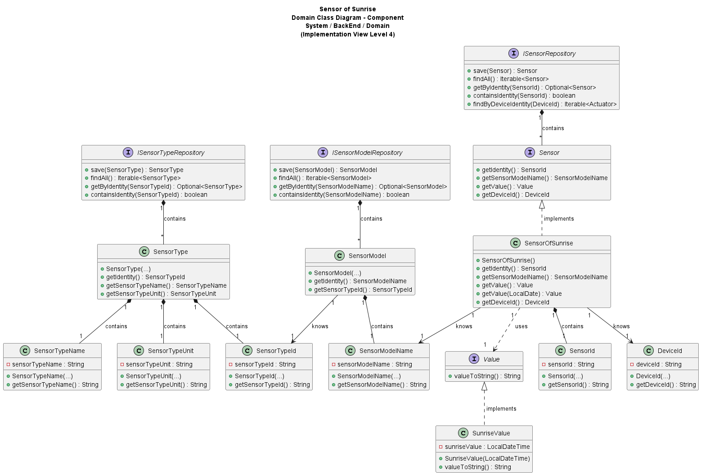

# US020 - Sensor of Sunrise

### Table of Contents

1. [Requirements](#1-requirements)
    - [Dependency on other User Stories](#dependency-on-other-user-stories)
2. [Analysis](#2-analysis)
    - [Relevant domain model excerpt](#relevant-domain-model-excerpt)
3. [Design](#3-design)
    - [Class diagram](#class-diagram)
    - [Sequence diagram](#sequence-diagram)
    - [Applied design patterns and principles](#applied-design-patterns-and-principles)
4. [Tests](#4-tests)
    - [Acceptance Tests](#acceptance-tests)
    - [Unit tests](#unit-tests)
    - [Integration tests](#integration-tests)
5. [Implementation](#5-implementation)
6. [Conclusion](#6-conclusion)

## 1. Requirements

_As Product Owner, I want the system to have a type of sensor that gives the sunrise instant for a given calendar date._

Requirements for the sensor of sunrise:

- The sensor should be able to provide the sunrise time for a specific calendar date.
- The sensor should provide the sunrise time in standard date and time format.

### Dependency on other User Stories

Although this User Story does not exhibit a direct dependence on other User Stories, it is pertinent to mention that 
User Story 7 focuses on the addition of a sensor to a device. Within the scope of US007, the sensor implemented 
might correspond to the one described in this story (US020). Thus, despite not constituting a dependency, there is a 
significant relation between the two User Stories.

## 2. Analysis

The SensorOfSunrise class is composed by the following attributes:

| Attribute           | Rules                                                                                                                                      |
|---------------------|--------------------------------------------------------------------------------------------------------------------------------------------|
| **SensorId**        | Must be a unique identifier. It is generated automatically.                                                                                |
| **SensorModelName** | Must not be null or empty. Must correspond to a model of an existing type.                                                                 |
| **Value**           | Must be a SunriseValue object that represents the sunrise time. It should not be null and should be calculated based on the calendar date. |
| **DeviceId**        | Must not be null or empty. Must correspond to an existing device in the house.                                                             |

The SunriseValue, which is created in the context of the SensorOfSunrise class, is composed by the following attributes:

| Attribute        | Rules                                                                                   |
|------------------|-----------------------------------------------------------------------------------------|
| **sunriseValue** | Must be a LocalDateTime object that represents the sunrise time. It should not be null. |

The interaction with the sensor of sunrise involves:

1. Requesting the sunrise time for a specific calendar date.
2. For now, the system generates a default value, as there is not yet a connection to the weather service that provides this
   information.
3. The system returns the sunrise time in standard date and time format.

### Relevant domain model excerpt

Below is the relevant domain model excerpt for this user story:


## 3. Design

### Class diagram

Below is the class diagram for this user story:



### Sequence diagram

A sequence diagram for US20 is not provided, since the only requirement is for the system to have a sensor that
provides the sunrise time for a given calendar date. So, there is no interaction with other components or actors in the system.

### Applied design patterns and principles

* **Information Expert** - The `SensorOfSunrise` class knows how to manage its identity, value, and associated device,
  encapsulating this logic within the class itself.
* **Creator** - The `SensorFactory` plays a crucial role in the creation of sensors, including `SensorOfSunrise`.
  It encapsulates the logic required to instantiate a sensor, ensuring that each sensor is created with a proper state
  and associated with the correct device and sensor model. This pattern helps in maintaining the consistency and
  integrity of sensor creation across the system.
* **Low Coupling** - The `SensorFactory` plays a pivotal role in this User Story by centralizing the instantiation of
  `SensorOfSunrise instances`. By decoupling the creation process from the sensor's operational and data management
  responsibilities, the system gains flexibility. Adjustments to how sensors are created or initialized can be made
  independently of their core functionalities and interactions with the `SensorRepository`.
* **High Cohesion** - Each class is focused on a single responsibility. For instance, the `SensorRepository` is solely
  concerned with storing and retrieving device information, ensuring that classes are focused and understandable.
* **Single Responsibility Principle (SRP)** - The `SensorOfSunrise` class focuses on managing sunrise sensor data,
  distinct from the SensorRepository which deals with data storage and retrieval. This separation ensures that changes
  in data management don't interfere with sensor functionality, simplifying maintenance and scalability.
* **Repository** - The `SensorRepository`, `SensorTypeRepository`, and `SensorModelRepository` act as Repository
  patterns.
  They provide a collection-like interface for accessing sensor, sensor type, and sensor model objects from the domain
  model, abstracting away the details of the data access layer.
* **Interface Segregation** - The `Sensor` interface defines a contract for sensor behavior without imposing any
  unnecessary methods on the implementing classes, such as `SensorOfSunrise`. This follows the Interface Segregation
  Principle by ensuring that implementing classes only need to provide implementations for methods that make sense for their
  specific type of sensor.
* **Value Object** - The `SunriseValue` class is a value object that encapsulates the sunrise time. By treating the sunrise
  time as a value object, the system ensures that the time is immutable and can be shared without risk of modification.

## 4. Tests

### Acceptance Tests

- **Scenario 1**: Retrieving sunrise time for a given date
    - **Given** the system is equipped with sunrise sensors.
    - **When** a user requests the sunrise time for a specific date.
    - **Then** the system should display the sunrise time for that date.

- **Scenario 2**: Retrieving sunrise time without specifying a date
    - **Given** the system is equipped with sunrise sensors.
    - **When** a user requests the sunrise time without specifying a date.
    - **Then** the system should automatically use the current date.
    - **And** the system should display the sunrise time for the current date.

### Unit tests

Below are some relevant unit tests for this user story, focusing on the retrieval and validation of sunrise times:

| Test Case                                                                        | Expected Outcome                                                                                      |
|----------------------------------------------------------------------------------|-------------------------------------------------------------------------------------------------------|
| Test retrieving the sunrise time for the current date when no date is specified. | The system should return the sunrise time for the current date, using system defaults when necessary. |
| Test retrieving the sunrise time for a specified date.                           | The system should return the accurate sunrise time for the specified date.                            |
| Test retrieving the sunrise time with an invalid date.                           | The system should return an error message.                                                            |

Below are some relevant unit tests for this user story, focusing on the creation of sunrise values:

| Test Case                                           | Expected Outcome                                                         |
|-----------------------------------------------------|--------------------------------------------------------------------------|
| Test creating a sunrise value with a valid date.    | The system should return a sunrise value with the correct date and time. |
| Test creating a sunrise value with an invalid date. | The system should return an error message.                               |

For more information on testing and validation, please refer to the
[SensorOfSunriseTest](https://github.com/Departamento-de-Engenharia-Informatica/2023-2024-switch-dev-project-assignment-switch-project-2023-2024-grupo6/blob/main/src/test/java/smarthome/domain/sensor/SensorOfSunriseTest.java)
and
[SunriseValueTest](https://github.com/Departamento-de-Engenharia-Informatica/2023-2024-switch-dev-project-assignment-switch-project-2023-2024-grupo6/blob/main/src/test/java/smarthome/domain/sensor/vo/values/SunriseValueTest.java)
classes.

### Integration tests

Integration tests are not specified for US20 at this time. This is because US20's scope is confined to displaying
sunrise times based on existing sensor data, a process that currently does not involve intricate interactions between multiple
system components or external dependencies. 

## 5. Implementation

The `SensorOfSunrise` class implements the `Sensor` interface, specializing in managing sunrise time data.

```java
public SensorOfSunrise(DeviceId deviceId, SensorModelName sensorModelName) {
    // Implementation of the method
}

public SunriseValue getValue() {
    // Implementation of the method
}

public void getValue(LocalDate date) {
    // Implementation of the method
}
```

The `SunriseValue` class, implementing the `Value` interface, encapsulates the sunrise time, ensuring immutability and
data integrity.

```java
public SunriseValue(LocalDateTime sunriseTime) {
    // Implementation of the method
}

public String valueToString() {
    // Implementation of the method
}
```

For more information on the implementation of this user story, please refer to the
[SensorOfSunrise](https://github.com/Departamento-de-Engenharia-Informatica/2023-2024-switch-dev-project-assignment-switch-project-2023-2024-grupo6/blob/main/src/main/java/smarthome/domain/sensor/SensorOfSunrise.java)
and
[SunriseValue](https://github.com/Departamento-de-Engenharia-Informatica/2023-2024-switch-dev-project-assignment-switch-project-2023-2024-grupo6/blob/main/src/main/java/smarthome/domain/sensor/vo/values/SunriseValue.java)
classes.

## 6. Conclusion

To summarize, this User Story integrates the functionality of providing sunrise times into the system, utilizing the
`SensorOfSunrise` and `SunriseValue` classes for effective data management and representation. Validation of sunrise data
ensures the reliability and accuracy of the information provided, maintaining system integrity. The implementation
involves key attributes, such as the `sensorModelName` and `value`, which are essential for the accurate representation
and retrieval of sunrise times.

[Back to top](#us020---sensor-of-sunrise)