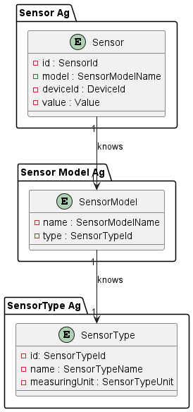

# US021 - Sensor of Sunset

### Table of Contents

1. [Requirements](#1-requirements)
    - [Dependency on other user stories](#dependency-on-other-user-stories)
2. [Analysis](#2-analysis)
    - [Relevant domain model excerpt](#relevant-domain-model-excerpt)
3. [Design](#3-design)
    - [Class diagram](#class-diagram)
    - [Sequence diagram](#sequence-diagram)
    - [Applied design patterns and principles](#applied-design-patterns-and-principles)
4. [Tests](#4-tests)
    - [Acceptance tests](#acceptance-tests)
    - [Unit tests](#unit-tests)
    - [Integration tests](#integration-tests)
5. [Implementation](#5-implementation)
6. [Conclusion](#6-conclusion)

## 1. Requirements

_As Product Owner, I want the system to have a type of sensor that gives the sunset instant for a given calendar date._

Requirements for the sensor of sunset:

- The sensor should be able to provide the sunset time for a specific calendar date.
- The sensor should provide the sunset time in standard date and time format.

### Dependency on other user stories

Although this User Story does not have a direct dependency on other user stories, it is worth noting that User Story 7
is about adding a sensor to a device.
In the context of **US007**, the sensor implemented could be the one described in this user story (US021).
Therefore, while not a dependency, there is a relevant relationship between the two user stories.

## 2. Analysis

The `SensorOfSunset` class is composed by the following attributes:

| Attribute           | Rules                                                                                                                                    |
|---------------------|------------------------------------------------------------------------------------------------------------------------------------------|
| **SensorId**        | Must be a unique identifier. It is generated automatically.                                                                              |
| **SensorModelName** | Must not be null or empty. Must correspond to a model of an existing type.                                                               |
| **Value**           | Must be a SunsetValue object that represents the sunset time. It should not be null and should be calculated based on the calendar date. |
| **DeviceId**        | Must not be null or empty. Must correspond to an existing device in the house.                                                           |

The `SunsetValue`, which is created in the context of the `SensorOfSunset` class, is composed by the following
attributes:

| Attribute       | Rules                                                                                  |
|-----------------|----------------------------------------------------------------------------------------|
| **sunsetValue** | Must be a LocalDateTime object that represents the sunset time. It should not be null. |

The interaction with the sensor of sunset involves:

1. Requesting the sunset time for a specific calendar date.
2. For now, the system generates a default value, as there is not yet a connection to the weather service that provides
   this information.
3. The system returns the sunset time in standard date and time format.

### Relevant domain model excerpt

Below is the relevant domain model excerpt for this user story:



## 3. Design

### Class diagram

Below is the class diagram for this user story:


### Sequence diagram

A sequence diagram for US21 is not provided, since the only requirement is for the system to have a sensor that provides
the sunset time for a given calendar date. So, there is no interaction with other components or actors in the system.

### Applied design patterns and principles

* **Information Expert** - The `SensorOFSunset` class knows how to manage its identity, value, and associated device,
  encapsulating this logic within the class itself.
* **Creator** - The `SensorFactory` plays a crucial role in the creation of sensors, including SensorOfSunset.
  It encapsulates the logic required to instantiate a sensor, ensuring that each sensor is created with a proper state
  and associated with the correct device and sensor model. This pattern helps in maintaining the consistency and
  integrity of sensor creation across the system.
* **Low Coupling** - The `SensorFactory` plays a pivotal role in this User Story by centralizing the instantiation of
  `SensorOfSunset instances`. By decoupling the creation process from the sensor's operational and data management
  responsibilities, the system gains flexibility. Adjustments to how sensors are created or initialized can be made
  independently of their core functionalities and interactions with the `SensorRepository`.
* **High Cohesion** - Each class is focused on a single responsibility. For instance, the `SensorRepository` is solely
  concerned with storing and retrieving sensor information, ensuring that classes are focused and understandable.
* **Single Responsibility Principle (SRP)** - The SensorOfSunset class focuses on managing sunset sensor data,
  distinct from the SensorRepository which deals with data storage and retrieval. This separation ensures that changes
  in data management don't interfere with sensor functionality, simplifying maintenance and scalability.
* **Repository** - The `SensorRepository`, `SensorTypeRepository`, and `SensorModelRepository` act as Repository
  patterns.
  They provide a collection-like interface for accessing sensor, sensor type, and sensor model objects from the domain
  model,
  abstracting away the details of the data access layer.
* **Interface Segregation** - The `Sensor` interface defines a contract for sensor behavior without imposing any
  unnecessary methods on the implementing classes, such as `SensorOfSunset`. This follows the Interface Segregation
  Principle
  by ensuring that implementing classes only need to provide implementations for methods that make sense for their
  specific type of sensor.
* **Value Object** - The `SunsetValue` class is a value object that encapsulates the sunset time. By treating the sunset
  time as a value object, the system ensures that the time is immutable and can be shared without risk of modification.

## 4. Tests

### Acceptance tests

- **Scenario 1:** Creating a Sunset Sensor
    - **When** a user wants to add a Sunset Sensor to the system,
    - **Then** the system should enable the user to add a Sunset Sensor,
    - **And** the system should validate and save the parameters to configure the Sunset Sensor,
    - **And** the system should generate a unique `SensorId` for the Sunset Sensor.


- **Scenario 2**: Retrieving sunset time for a given date
    - **Given** the system is equipped with sunset sensors.
    - **When** a user requests the sunset time for a specific date.
    - **Then** the system should display the sunset time for that date.


- **Scenario 3**: Retrieving sunset time without specifying a date
    - **Given** the system is equipped with sunset sensors.
    - **When** a user requests the sunset time without specifying a date.
    - **Then** the system should automatically use the current date.
    - **And** the system should display the sunset time for the current date.

### Unit tests

Below are some relevant unit tests for this user story, focusing on the creation of sunset times:

| Test Case                                          | Expected Outcome                                                      |
|----------------------------------------------------|-----------------------------------------------------------------------|
| Test creating a sunset sensor with a valid data.   | The system should return created sunset sensor with the correct data. |
| Test creating a sunset value with an invalid data. | The system should return an error message.                            |

Below are some relevant unit tests for this user story, focusing on the retrieval and validation of sunset times:

| Test Case                                                                       | Expected Outcome                                                                                     |
|---------------------------------------------------------------------------------|------------------------------------------------------------------------------------------------------|
| Test retrieving the sunset time for the current date when no date is specified. | The system should return the sunset time for the current date, using system defaults when necessary. |
| Test retrieving the sunset time for a specified date.                           | The system should return the accurate sunset time for the specified date.                            |
| Test retrieving the sunset time with an invalid date.                           | The system should return an error message.                                                           |

Below are some relevant unit tests for this user story, focusing on the creation of sunset values:

| Test Case                                          | Expected Outcome                                               |
|----------------------------------------------------|----------------------------------------------------------------|
| Test creating a sunset value with a valid date.    | The system should create a sunset value with the correct date. |
| Test creating a sunset value with an invalid date. | The system should return an error message.                     |

For more information on testing and validation, please refer to the
[SensorOfSunsetTest](https://github.com/Departamento-de-Engenharia-Informatica/2023-2024-switch-dev-project-assignment-switch-project-2023-2024-grupo6/blob/main/src/test/java/smarthome/domain/sensor/SensorOfSunsetTest.java)
and
[SunsetValueTest](https://github.com/Departamento-de-Engenharia-Informatica/2023-2024-switch-dev-project-assignment-switch-project-2023-2024-grupo6/blob/main/src/test/java/smarthome/domain/sensor/vo/values/SunsetValueTest.java)
classes.

### Integration tests

Integration tests are not specified for US21 at this time. This is because US21's scope is confined to displaying
sunset times based on existing sensor data, a process that does not involve intricate interactions between multiple
system components or external dependencies. The functionality is straightforward and primarily focused on data retrieval
and presentation, areas typically covered by unit tests. Should the integration landscape of the system evolve to
include more complex interactions relevant to US21, the need for integration tests will be revisited.

## 5. Implementation

The `SensorOfSunset` class implements the `Sensor` interface, specializing in managing sunset time data. Below is the
relevant code snippet for the `SensorOfSunset` class:

```java
public class SensorOfSunset implements Sensor {
    // Attributes

    public SensorOfSunset(DeviceId deviceId, SensorModelName sensorModelName) {
        // Implementation of the constructor
    }

    public SunsetValue getValue() {
        // Implementation of the method
    }

    public void getValue(LocalDate date) {
        // Implementation of the method
    }
}
```

The `SunsetValue` class, implementing the `Value` interface, encapsulates the sunset time, ensuring immutability and
data integrity. Below is the relevant code snippet for the `SunsetValue` class:

```java
public class SunsetValue implements Value {
    // Attributes

    public SunsetValue(LocalDateTime sunsetTime) {
        // Implementation of the constructor
    }

    public String valueToString() {
        // Implementation of the method
    }
}
```

For more information on the implementation of this user story, please refer to the
[SensorOfSunset](https://github.com/Departamento-de-Engenharia-Informatica/2023-2024-switch-dev-project-assignment-switch-project-2023-2024-grupo6/blob/main/src/main/java/smarthome/domain/sensor/SensorOfSunset.java)
and
[SunsetValue](https://github.com/Departamento-de-Engenharia-Informatica/2023-2024-switch-dev-project-assignment-switch-project-2023-2024-grupo6/blob/main/src/main/java/smarthome/domain/sensor/vo/values/SunsetValue.java)
classes.

## 6. Conclusion

To summarize, this User Story integrates the functionality of providing sunset times into the system, utilizing the
`SensorOfSunset` and `SunsetValue` classes for effective data management and representation. Validation of sunset data
ensures the reliability and accuracy of the information provided, maintaining system integrity. The implementation
involves key attributes, such as the `sensorModelName` and `value`, which are essential for the accurate representation
and retrieval of sunset times.

[Back to top](#us021---sensor-of-sunset)