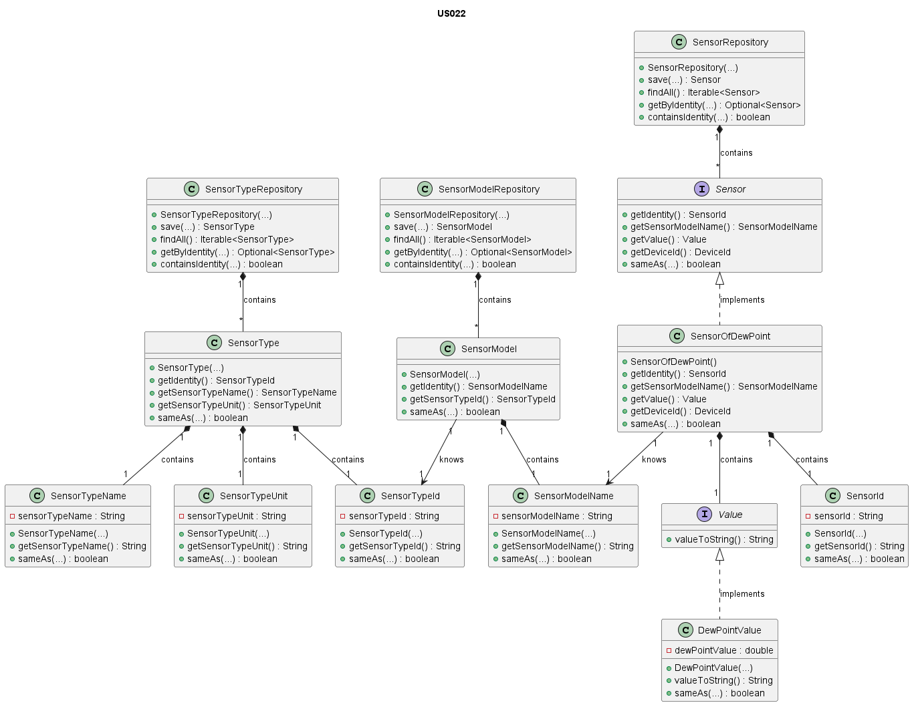

# US022 - Sensor of Dew Point

### Table of Contents

1. [Requirements](#1-requirements)
    - [Dependency of other user stories](#dependency-of-other-user-stories)
2. [Analysis](#2-analysis)
    - [Relevant domain model excerpt](#relevant-domain-model-excerpt)
3. [Design](#3-design)
    - [Class diagram](#class-diagram)
    - [Sequence diagram](#sequence-diagram)
    - [Applied design patterns and principles](#applied-design-patterns-and-principles)
4. [Tests](#4-tests)
    - [Tests of acceptance](#tests-of-acceptance)
    - [Unit tests](#unit-tests)
    - [Integration tests](#integration-tests)
5. [Implementation](#5-implementation)
6. [Conclusion](##6-conclusion)

## 1. Requirements

_As Product Owner, I want the system to have a type of sensor that gives the dew
point (C)._

Requirements for a sensor of dew point:

- The sensor should be able to provide the current dew point.
- The sensor should provide the dew point value in Percentage of Relative Humidity (%RH).

### Dependency on other User Stories

Although the **US022** does not have a direct dependency on other user stories, it is worth noting that **US007**(... I want to add a sensor to an existing device in
a room. The sensor must be of a model of an existing type of sensor) is deeply connected to this user story. In the context
of the **US007**, the sensor added to the device could be the one described in this user story.

Also, it´s important to mention that a `SensorOfDewPoint` returns a specific value, `DewPointValue`, and a class was created to represent
this value in the system as well.

## 2. Analysis

The SensorOfDewPoint class is composed by the following attributes:

| Attribute           | Rules                                                                                                                            |
|---------------------|----------------------------------------------------------------------------------------------------------------------------------|
| **SensorId**        | Must be a unique identifier. It is generated automatically.                                                                      |
| **DeviceId**        | Must not be null or empty. Must correspond to an existing device identity saved in the system.                                   |
| **SensorModelName** | Must not be null or empty. Must correspond to an existing model saved in the system.                                             |
| **Value**           | Must be a DewPointValue object that represents the current dew point. At the moment this is a default value for testing purposes. |

The DewPointValue, which is created in the context of the SensorOfDewPoint class, is composed by the following attributes:

| Attribute         | Rules                                                                                   |
|-------------------|-----------------------------------------------------------------------------------------|
| **DewPointValue** | Must be a double that represents the current dew point and handles from 0 to 100 values. |

The interaction with the Sensor of dew point involves:

1. Requesting the current dew point (for now the system generates a default value, as
   there is not yet a connection to the hardware that provides this information).
2. The system returns the current dew point value in a decimal format(Percentage).

### Relevant Domain Model excerpt

Below is the relevant domain model excerpt for this user story:


## 3. Design

### Class Diagram

Below is the class diagram for this user story:



### Sequence Diagram

A sequence diagram for **US022** is not provided, since the only requirement is for the system to have a sensor that provides
the current dew point. So, there is no interaction with other components or actors in the system at the moment.

### Applied Design Patterns and Principles

* **Information Expert and Single Responsibility** - Each created class is focused on a single responsibility. Also each class knows how to manage its own data and responsibilities encapsulating the logic within the class itself.


* **Creator** - The _SensorFactory_ class plays a crucial role in the creation of sensors, including _SensorOfDewPoint_.
  It encapsulates the logic required to instantiate any sensor, ensuring that each sensor is created with a valid state
  and associated with the correct device and sensor model.


* **Low Coupling** - By decoupling the creation process from the _SensorOfDewPoint_ class responsibilities, the system gains flexibility. Adjustments to how sensors are created or initialized can be made
  independently of their core functionalities.


* **High Cohesion** - The _SensorOfDewPoint_ class is responsible for managing dew point sensor data, while the
  _SensorRepository_ class is solely concerned with storing and retrieving sensor information and the _SensorFactory_
  class is responsible for creating sensors. This separation ensures that classes are focused and understandable.


* **Repository** - The _SensorRepository_, _SensorTypeRepository_, and _SensorModelRepository_ classes act as Repository
  patterns, providing a way to store and retrieve sensor data, sensor types, and sensor models, respectively.


* **Interface Segregation Principle(ISP)** - The _Sensor_ interface defines a contract for sensor behavior without imposing any
  unnecessary methods on the implementing classes, such as _SensorOfDewPoint_. This follows the ISP by ensuring that implementing classes only need to provide implementations for methods that make sense for their
  specific type of sensor.


* **Value Object** - The _DewPointValue_ class is a value object that encapsulates the current dew point value.
  By treating the dew point value as a value object, the system ensures that the value is immutable and can be shared without risk of modification.

## 4. Tests

### Tests of Acceptance

- `Scenario 1:` Create and associate a sensor of dew point with a device.
    - **Given** the system is equipped with devices.
    - **When** a user requests to add a sensor of dew point to a device.
    - **Then** the system should be able to create and save a sensor of dew point.


- `Scenario 2:` Retrieving the current dew point from a device.
    - **Given** the system is equipped with devices that have dew point sensors.
    - **When** a user requests the current dew point from a device(sensor).
    - **Then** the system should provide the current dew point.

### Unit Tests

Below are some relevant unit tests for the class `SensorOfDewPoint`:

| Test Case                                                          | Expected Outcome                                                               |
|--------------------------------------------------------------------|--------------------------------------------------------------------------------|
| Test creating a dew point sensor with the provided device identity. | The system should correctly return a dew point sensor associated to the device. |
| Test retrieving the sensor identity.                               | The system should return the accurate sensor identity.                         |
| Test retrieving the associated device identity.                    | The system should return the accurate device identity.                         | 
| Test retrieving the default dew point value.                        | The system should return the default dew point value defined in the system      |

Below are some relevant unit tests for the class `DewPointValue`:

| Test Case                                                        | Expected Outcome                                                         |
|------------------------------------------------------------------|--------------------------------------------------------------------------|
| Test creating a dew point value with the provided value.          | The system should return a dew point value, value object.                 |
| Verify the accessibility of the current positive dew point value. | The system should return the current positive dew point value as a string |
| Verify the accessibility of the current negative dew point value. | The system should return the current negative dew point value as a string |

### Integration Tests

Integration tests are not specified for **US022** at this time.

## 5. Implementation

The `SensorOfDewPoint` class implements the `Sensor` interface and encapsulates the logic for managing the current dew point:

```java
public class SensorOfDewPoint implements Sensor {
    // Implementation of the class
}

protected SensorOfDewPoint(DeviceId deviceId, SensorModelName sensorModelName) {
    // Implementation of the constructor
    this.value = new DewPointValue(27.0); //Default value
}

@Override
public Value getValue() {
    // Implementation of the method
}
```

The `DewPointValue` class, implements the `Value` interface and encapsulates the current dew point value, ensuring immutability and
data integrity.

```java
public class DewPointValue implements Value {
    // Implementation of the class
}

public DewPointValue(double DewPointValue) {
    // Implementation of the constructor
}

@Override
public String valueToString() {
    // Implementation of the method
}
```

## 6. Conclusion

In conclusion, this User Story introduces the functionality of providing the current dew point into the system, utilizing
the `SensorOfDewPoint` and `DewPointValue` classes for effective management of dew point data.

[Back to top](#US022---Sensor-of-Dew-Point)
