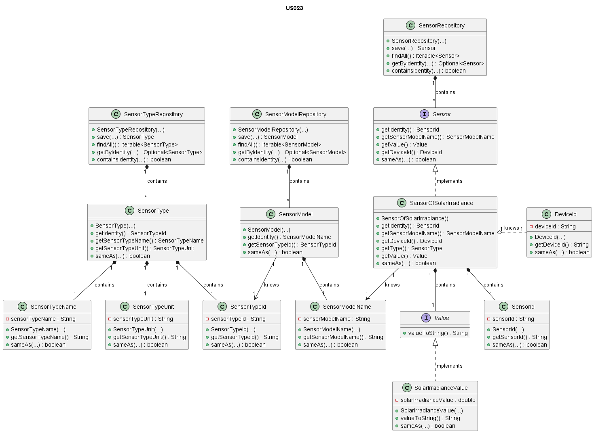

# US023 - Sensor of Solar Irradiance

# Table of Contents

1. [Requirements](#requirements)
    - [Dependency on other user stories](#dependency-on-other-user-stories)
2. [Analysis](#analysis)
    - [Relevant domain model excerpt](#relevant-domain-model-excerpt)
3. [Design](#design)
    - [Class diagram](#class-diagram)
    - [Sequence diagram](#sequence-diagram)
    - [Applied design patterns and principles](#applied-design-patterns-and-principles)
4. [Tests](#tests)
    - [Acceptance Tests](#Acceptance-tests)
    - [Unit tests](#unit-tests)
    - [Integration tests](#integration-tests)
5. [Implementation](#implementation)
6. [Observations](#observations)

# 1. Requirements

_As Product Owner, I want the system to have a type of sensor that gives the solar
irradiance (W/m2)._

Requirements to configure the location of the house:

-The sensor should be capable of providing the solar irradiance value for a given geographical location and time.

-It should offer the solar irradiance value in watts per square meter.

-The sensor should be configurable to work with different geographical locations.

-The system should have the capability to integrate with external sources or models for accurate solar irradiance
calculations.

## Dependency on other user stories

Although this User Story does not have a direct dependency on other user stories, it is worth noting that User Story 7
is about adding a sensor to a device.
In the context of **US007**, the sensor implemented could be the one described in this user story (US023).
Therefore, while not a dependency, there is a relevant relationship between the two user stories.

# 2. Analysis

The SensorOfSolarIrradiance class is composed of the following attributes:

| Attribute           | Rules                                                                                                                                                             |
|---------------------|-------------------------------------------------------------------------------------------------------------------------------------------------------------------|
| **SensorId**        | Must be a unique identifier. It is generated automatically.                                                                                                       |
| **SensorModelName** | Must not be null or empty. Must correspond to a model of an existing type.                                                                                        |
| **Value**           | Must be a numerical value representing solar irradiance in watts per square meter. It should not be null and should be calculated based on the location and time. |
| **DeviceId**        | Must not be null or empty. Must correspond to an existing device in the house.                                                                                    |
|

The SolarIrradianceValue, which is created in the context of the SensorOfSolarIrradiance class, is composed by the
following attributes:

| Attribute                | Rules                                                                                                     |
|--------------------------|-----------------------------------------------------------------------------------------------------------|
| **solarIrradianceValue** | Must be a numerical value representing solar irradiance in watts per square meter. It should not be null. |

The interaction with the sensor of solar irradiance involves:

1. Requesting the solar irradiance value for a specific geographical location and time.
2. The system calculates or retrieves the solar irradiance value based on the provided location and time.
3. The system returns the solar irradiance value in watts per square meter.

### Relevant domain model excerpt

Below is the relevant domain model excerpt for this user story:


## 3. Design

### Class diagram

Below is the class diagram for this user story:



### Sequence diagram

A sequence diagram for US023 is not provided, as the user story mainly involves the retrieval of solar irradiance values
based on location and time, without intricate interactions with other components or actors in the system.

### Applied design patterns and principles

* **Information Expert** - The `SensorOfSolarIrradiance` class encapsulates the logic for managing solar irradiance
  data,
* ensuring that the class itself handles the operations related to solar irradiance measurement.
* **Creator** - Similar to other sensor types, the `SensorFactory` is responsible for creating instances of
* `SensorOfSolarIrradiance`, ensuring proper initialization and association with the device and sensor model.
* **Low Coupling** - The creation process of `SensorOfSolarIrradiance` is decoupled from its operational logic,
* allowing flexibility in how sensors are instantiated or initialized without affecting their core functionalities.
* **High Cohesion** - Each class maintains a single responsibility, with `SensorOfSolarIrradiance` focused on managing
* solar irradiance data and `SensorRepository` handling data storage and retrieval, ensuring clarity and
  maintainability.
* **Single Responsibility Principle (SRP)** - `SensorOfSolarIrradiance` adheres to the SRP by focusing solely on
  managing
* solar irradiance data, separate from concerns related to data persistence or retrieval.
* **Repository** - The `SensorRepository`, `SensorTypeRepository`, and `SensorModelRepository` act as Repository
  patterns.
  They provide a collection-like interface for accessing sensor, sensor type, and sensor model objects from the domain
  model,
  abstracting away the details of the data access layer.
* **Interface Segregation** - The `Sensor` interface defines methods relevant to sensor behavior, allowing implementing
* classes such as `SensorOfSolarIrradiance` to provide specific implementations without unnecessary method requirements.
* **Value Object** - The solar irradiance value is treated as a value object, encapsulating its representation
* and ensuring immutability and integrity.

## 4. Tests

### Acceptance Tests

- `Scenario 1:` Create and associate a sensor of solar irradiance with a device.
    - **Given** the system is equipped with devices.
    - **When** a user requests to add a sensor of solar irradiance to a device.
    - **Then** the system should be able to create and save a sensor of solar irradiance.


- `Scenario 2:` Retrieving the current solar irradiance from a device.
    - **Given** the system is equipped with devices that have solar irradiance sensors.
    - **When** a user requests the current solar irradiance from a device(sensor).
    - **Then** the system should provide the current solar irradiance.

### Unit tests

Below are some relevant unit tests for this user story, focusing on the retrieval and validation of
class `SensorOfSolarIrradiance`:

| Test Case                                                                  | Expected Outcome                                                                       |
|----------------------------------------------------------------------------|----------------------------------------------------------------------------------------|
| Test creating a solar irradiance sensor with the provided device identity. | The system should correctly return a solar irradiance sensor associated to the device. |
| Test retrieving the sensor identity.                                       | The system should return the accurate sensor identity.                                 |
| Test retrieving the associated device identity.                            | The system should return the accurate device identity.                                 | 
| Test retrieving the default solar irradiance value.                        | The system should return the default solar irradaince value defined in the system      |

For more information on the unit tests, please refer to
the [US023Test](https://github.com/Departamento-de-Engenharia-Informatica/2023-2024-switch-dev-project-assignment-switch-project-2023-2024-grupo6/blob/main/src/test/java/smarthome/domain/sensor/SensorOfSolarIrradianceTest.java)

Below are some relevant unit tests for this user story, focusing on the creation of class `SolarIrradianceValue`:

| Test Case                                                                | Expected Outcome                                                                 |
|--------------------------------------------------------------------------|----------------------------------------------------------------------------------|
| Test creating a solar irradiance value with the provided value.          | The system should return a solar irradiance value, value object.                 |
| Verify the accessibility of the current positive solar irradiance value. | The system should return the current positive solar irradiance value as a string |
| Verify the accessibility of the current negative solar irradiance value. | The system should return the current negative solar irradiance value as a string |

For more information on the unit tests, please refer to
the [US023Test](https://github.com/Departamento-de-Engenharia-Informatica/2023-2024-switch-dev-project-assignment-switch-project-2023-2024-grupo6/blob/main/src/test/java/smarthome/domain/sensor/vo/values/SolarIrradianceValueTest.java)
class.

### Integration tests

Integration tests are not specified for US023 at this time. This is because US023's scope is primarily focused
on the functionality of the sensor itself, and the integration with external sources or models for solar irradiance
calculations is not within the current scope of this user story. As the system evolves and integration points become
more relevant, the need for integration tests will be revisited and addressed accordingly.

## 5. Implementation

The `SensorOfSolarIrradiance` class implements the `Sensor` interface, specializing in managing solar irradiance.

```java
public class SensorOfSolarIrradiance implements Sensor {
    //Implementation of the class
}

protected SensorOfSolarIrradiance(SensorModelName sensorModelName, DeviceId deviceId) {
    // Implementation of the method
}

@Override
public SensorId getIdentity() {
    // Implementation of the method
}

@Override
public SensorModelName getSensorModelName() {
    // Implementation of the method
}

@Override
public DeviceId getDeviceId() {
    // Implementation of the method
}

@Override
public Value getValue() {
    // Implementation of the method
}

@Override
public boolean sameAs(Object o) {
    // Implementation of the method
}
```

For more information on the implementation, please refer to
the [SensorOfSolarIrradiance](https://github.com/Departamento-de-Engenharia-Informatica/2023-2024-switch-dev-project-assignment-switch-project-2023-2024-grupo6/blob/main/src/main/java/smarthome/domain/sensor/SensorOfSolarIrradiance.java)
classes.

The `SolarIrradianceValue` class, implementing the `Value` interface, and encapsulates the current solar irradiance
value,
ensuring immutability and data integrity.

```java
public class SolarIrradianceValue implements Value {
    // Implementation of the method
}

public SolarIrradianceValue(double solarIrradianceValue) {
    // Implementation of the method   
}

@Override
public boolean sameAs(Object object) {
    // Implementation of the method
}

@Override
public String valueToString() {
    // Implementation of the method
}
```

For more information on the implementation, please refer to
the [SolarIrradianceValue](https://github.com/Departamento-de-Engenharia-Informatica/2023-2024-switch-dev-project-assignment-switch-project-2023-2024-grupo6/blob/main/src/main/java/smarthome/domain/sensor/vo/values/SolarIrradianceValue.java)
classes.

## 6. Conclusion

In conclusion, the `SensorOfSolarIrradiance` is a crucial component of the system, providing accurate solar irradiance
values for specific locations and times. Through proper design and adherence to design patterns and principles,
the system ensures reliability, maintainability, and extensibility in managing solar irradiance data.

[Back to top](#us023---sensor-of-solar-irradiance)


