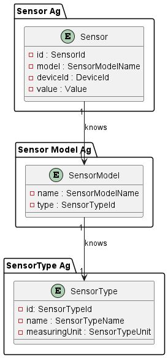
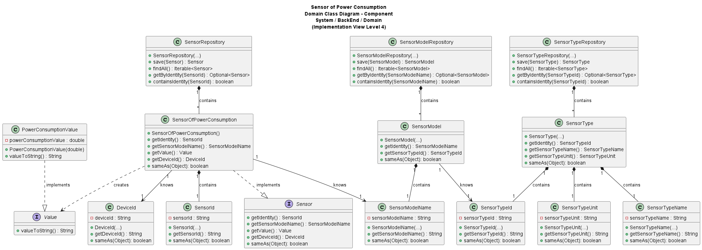

# US024 - Sensor of Power Consumption

# Table of Contents

1. [Requirements](#1-requirements)
    - [Dependency on other user stories](#dependency-of-other-user-stories)
2. [Analysis](#2-analysis)
    - [Relevant domain model excerpt](#relevant-domain-model-excerpt)
3. [Design](#3-design)
    - [Class diagram](#class-diagram)
    - [Sequence diagram](#sequence-diagram)
    - [Applied design patterns and principles](#applied-design-patterns-and-principles)
4. [Tests](#4-tests)
    - [Acceptance Tests](#tests-of-acceptance)
    - [Unit tests](#unit-tests)
    - [Integration tests](#integration-tests)
5. [Implementation](#5-implementation)
6. [Observations](#6-observations)

# 1. Requirements

_As Product Owner, I want the system to have a type of sensor that gives the
power consumption in a given instant (W)._

Requirements for the sensor of Power Consumption:

- The sensor should be able to provide the current instant power consumption.
- The sensor should provide the given unit (W) with the adequate format.

## Dependency on other user stories

None.

# 2. Analysis

The SensorOfSunset class is composed by the following attributes:

| Attribute           | Rules                                                                                                                     |
|---------------------|---------------------------------------------------------------------------------------------------------------------------|
| **SensorId**        | Must be a unique identifier. It is generated automatically.                                                               |
| **SensorModelName** | Must not be null or empty. Must correspond to a model of an existing type.                                                |
| **Value**           | Must be a PowerConsumptionValue object that represents the current instant power consumption. It should not be null. |
| **DeviceId**        | Must not be null or empty. Must correspond to an existing device in the house.                                            |

The PowerConsumptionValue, which was created in the context of the SensorOfPowerConsumption class, is composed by the following attributes:

| Attribute | Rules                                                                                       |
|-----------|---------------------------------------------------------------------------------------------|
| **value** | Must be a double primitive that represents the power consumption. It should not be negative |

The interaction with the sensor of power consumption involves:

1. Requesting the current power consumption value.
2. For now, the system generates a default value, as there is not yet a connection to the hardware that provides this
   information.
3. The system returns the power consumption value in the desired format.

## Relevant domain model excerpt


# 3. Design

## Class diagram



## Sequence diagram

(Non-Applicable, non-dynamic feature)

## Applied design patterns and principles

* **Aggregate Root** - The `SensorOfPowerConsumption` class is an implementation of the aggregate root of the sensor entity.
* **Value Object** - The `PowerConsumptionValue` class is an example of the Value Object pattern. This pattern is used for objects that represent a value without an identity, are immutable, and can be compared based on their values rather than their memory addresses. PowerConsumptionValue holds a value for power consumption and defines equality (sameAs) based on this value. It's immutable, indicated by the final modifier on its field, and it provides a method for value comparison.
* **Factory Method Pattern (Implied)** - The constructor of `SensorOfPowerConsumption` acts as a Factory Method in the sense that it encapsulates the creation of SensorId with a unique UUID. While not a full-blown factory pattern since it's not creating instances of multiple classes based on input parameters, it does encapsulate object creation logic within the constructor, hinting towards the Factory Method pattern's concept of creating objects without exposing the instantiation logic to the client.
* **Strategy Patter (Implied)** - The use of the `Value interface`, implemented by `PowerConsumptionValue`, hints at the Strategy pattern. This pattern is about defining a family of algorithms, encapsulating each one, and making them interchangeable. Here, the "algorithm" is how values are represented and interacted with.
* **Interface Segregation Principle** - we use interfaces (e.g., Value) for specific functionalities adheres to ISP. Noo client should be forced to depend on methods it does not use. By creating a focused Value interface, we ensure that classes implementing this interface only need to provide functionalities related to value operations, thus adhering to ISP.

# 4. Tests

## Unit tests

Below are some relevant unit tests for this user story, focusing on the retrieval and validation of SensorOfPowerConsumption and PowerConsumptionValue:

| Test Case                                                                      | Expected Outcome                                                                 |
|--------------------------------------------------------------------------------|----------------------------------------------------------------------------------|
| Test constructing a SensorOfPowerConsumption with Valid Parameters             | The system should construct the object without throwing an exception             |
| Test constructing a SensorOfPowerConsumption with Null DeviceId                | The system should not construct the object and Throw an IllegalArgumentException |
| Test constructing a SensorOfPowerConsumption with Null SensorModelName         | The system should not construct the object and Throw an IllegalArgumentException |
| Test retrieving the SensorId of a SensorOfPowerConsumption object              | The system should return the SensorId of the object                              |
| Test retrieving the SensorModelName of a SensorOfPowerConsumption object       | The system should return the SensorModelName of the object                       |
| Test retrieving the DeviceId of a SensorOfPowerConsumption object              | The system should return the DeviceId of the object                              |
| Test retrieving the PowerConsumptionValue of a SensorOfPowerConsumption object | The system should return the PowerConsumptionValue of the object                 |
| Test comparing two SensorOfPowerConsumption objects with the same values       | The system should return true if the objects are the same or have the same value |
| Test comparing two SensorOfPowerConsumption objects with different values      | The system should return false if the objects are different                      |
| Test comparing a SensorOfPowerConsumption object with a different class         | The system should return false if the object is not an instance of SensorOfPowerConsumption |
| Test comparing a SensorOfPowerConsumption object with a null object             | The system should return false if the object is null                             |
| Test comparing two SensorOfPowerConsumption objects with the same SensorId, SensorModelName, and DeviceId | The system should return true if the objects are the same or have the same value |
| Test construction a PowerConsumptionValue object with valid parameters         | The system should construct the object without throwing an exception             |
| Test construction a PowerConsumptionValue object with a negative value         | The system should not construct the object and throw an IllegalArgumentException |
| Test comparing two PowerConsumptionValue objects with the same value           | The system should return true if the objects are the same or have the same value |
| Test comparing two PowerConsumptionValue objects with different values         | The system should return false if the objects are different                      |
| Test comparing a PowerConsumptionValue object with a different class            | The system should return false if the object is not an instance of PowerConsumptionValue |
| Test comparing a PowerConsumptionValue object with a null object                | The system should return false if the object is null                             |
| Test retrieving the value of a PowerConsumptionValue object as a String        | The system should return the value of the object as a String                     |

- Tests to SensorOfPowerConsumption class
```java
 /**
 * Test of the constructor of the SensorOfPowerConsumption class, of class SensorOfPowerConsumption.
 * The constructor should create a new instance of SensorOfPowerConsumption.
 * The sensorModelName, deviceId should be the same as the ones passed as arguments.
 * The sensorId should be a new SensorId (the first on the mocked construction), same rule for the PowerConsumptionValue.
 */
@Test
void testConstructorValid() {
    // Arrange
    try (MockedConstruction<SensorId> sensorIdMocked = mockConstruction(SensorId.class);
         MockedConstruction<PowerConsumptionValue> powerConsumptionValueDouble = mockConstruction(PowerConsumptionValue.class)) {
        SensorOfPowerConsumption sensor = new SensorOfPowerConsumption(sensorModelName, deviceId);
        SensorId sensorId = sensorIdMocked.constructed().getFirst();
        when(sensorId.sameAs(sensorId)).thenReturn(true);
        PowerConsumptionValue powerConsumptionValue = powerConsumptionValueDouble.constructed().getFirst();
        when(powerConsumptionValue.sameAs(powerConsumptionValue)).thenReturn(true);
        // Act
        SensorModelName sensorModelName = sensor.getSensorModelName();
        DeviceId deviceId = sensor.getDeviceId();
        // Assert
        assertEquals(sensorModelNameValid, sensorModelName.getSensorModelName());
        assertEquals(deviceIdValid, deviceId.getIdentity());
        assertEquals(sensorId, sensor.getIdentity());
        assertEquals(powerConsumptionValue, sensor.getValue());
    }
}

/**
 * Test of the constructor of the SensorOfPowerConsumption class, of class SensorOfPowerConsumption.
 * The constructor should throw an IllegalArgumentException if the sensorModelName is null.
 */
@Test
void testConstructorNullSensorModelNameShouldThrowIllegalArgumentException() {
    // Assert
    assertThrows(IllegalArgumentException.class, () -> new SensorOfPowerConsumption(null, deviceId));
}

/**
 * Test of the constructor of the SensorOfPowerConsumption class, of class SensorOfPowerConsumption.
 * The constructor should throw an IllegalArgumentException if the deviceId is null.
 */
@Test
void testConstructorNullDeviceIdShouldThrowIllegalArgumentException() {
    // Assert
    assertThrows(IllegalArgumentException.class, () -> new SensorOfPowerConsumption(sensorModelName, null));
}

/**
 * Test of the getIdentity() method, of class SensorOfPowerConsumption.
 * The method should return the sensorId.
 * The sensorId should be the same as the one created in the constructor.
 */
@Test
void testGetIdentityShouldReturnSensorId() {
    try (MockedConstruction<SensorId> sensorIdMocked = mockConstruction(SensorId.class)
    ) {
        // Arrange
        SensorOfPowerConsumption sensor = new SensorOfPowerConsumption(sensorModelName, deviceId);
        SensorId sensorId = sensorIdMocked.constructed().getFirst();
        when(sensorId.sameAs(sensorId)).thenReturn(true);
        // Act
        SensorId sensorIdReturned = sensor.getIdentity();
        // Assert
        assertEquals(sensorId, sensorIdReturned);
    }
}

@Test
void testgetSensorModelName() {
    try (MockedConstruction<SensorId> sensorIdMocked = mockConstruction(SensorId.class)
    ) {
        // Arrange
        SensorOfPowerConsumption sensor = new SensorOfPowerConsumption(sensorModelName, deviceId);
        SensorId sensorId = sensorIdMocked.constructed().getFirst();
        when(sensorId.sameAs(sensorId)).thenReturn(true);
        // Act
        SensorModelName sensorModelNameReturned = sensor.getSensorModelName();
        // Assert
        assertEquals(sensorModelName, sensorModelNameReturned);
    }
}

/**
 * Test of the getDeviceId() method, of class SensorOfPowerConsumption.
 * The method should return the deviceId.
 */
@Test
void testGetDeviceId() {
    try (MockedConstruction<SensorId> sensorIdMocked = mockConstruction(SensorId.class)
    ) {
        // Arrange
        SensorOfPowerConsumption sensor = new SensorOfPowerConsumption(sensorModelName, deviceId);
        SensorId sensorId = sensorIdMocked.constructed().getFirst();
        when(sensorId.sameAs(sensorId)).thenReturn(true);
        // Act
        DeviceId deviceIdReturned = sensor.getDeviceId();
        // Assert
        assertEquals(deviceId, deviceIdReturned);
    }
}

/**
 * Test of the getValue() method, of class SensorOfPowerConsumption.
 * The method should return the value.
 * The value should be the same as the one created in the constructor.
 */
@Test
void testGetValue() {
    try (MockedConstruction<SensorId> sensorIdMocked = mockConstruction(SensorId.class);
         MockedConstruction<PowerConsumptionValue> powerConsumptionValueDouble = mockConstruction(PowerConsumptionValue.class)
    ) {
        // Arrange
        SensorOfPowerConsumption sensor = new SensorOfPowerConsumption(sensorModelName, deviceId);
        SensorId sensorId = sensorIdMocked.constructed().getFirst();
        when(sensorId.sameAs(sensorId)).thenReturn(true);
        // Act
        Value powerConsumptionConstructed = powerConsumptionValueDouble.constructed().getFirst();
        Value powerConsumptionValueReturned = sensor.getValue();
        // Assert
        assertEquals(powerConsumptionConstructed, powerConsumptionValueReturned);
    }
}

/**
        * Test of the sameAs method, of class SensorOfPowerConsumption.
        * The method should return true if the object is the same as the object being compared.
        */
@Test
void testsameAsSameObjectShouldReturnTrue() {
    try (MockedConstruction<SensorId> sensorIdMocked = mockConstruction(SensorId.class)
    ) {
        // Arrange
        SensorOfPowerConsumption sensor = new SensorOfPowerConsumption(deviceId, sensorModelName);
        SensorId sensorId = sensorIdMocked.constructed().getFirst();
        when(sensorId.sameAs(sensorId)).thenReturn(true);
        // Act
        boolean result = sensor.sameAs(sensor);
        // Assert
        assertTrue(result);
    }
}

/**
 * Test of the sameAs method, of class SensorOfPowerConsumption.
 * The method should return false if the object is not an instance of SensorOfPowerConsumption.
 */
@Test
void testSameAsDifferentClassShouldReturnFalse() {
    //Arrange
    try (MockedConstruction<SensorId> sensorIdMocked = mockConstruction(SensorId.class)
    ) {
        SensorOfPowerConsumption sensor = new SensorOfPowerConsumption(deviceId, sensorModelName);
        SensorId sensorId = sensorIdMocked.constructed().getFirst();
        when(sensorId.sameAs(sensorId)).thenReturn(true);
        //Act
        boolean result = sensor.sameAs(sensorModelName);
        //Assert
        assertFalse(result);
    }

}

/**
 * Test of the sameAs method, of class SensorOfPowerConsumption.
 * The method should return false if the object is null.
 */
@Test
void testSameAsNullObjectShouldReturnFalse() {
    //Arrange
    try (MockedConstruction<SensorId> sensorIdMocked = mockConstruction(SensorId.class)) {
        SensorOfPowerConsumption sensor = new SensorOfPowerConsumption(deviceId, sensorModelName);
        SensorId sensorId = sensorIdMocked.constructed().getFirst();
        when(sensorId.sameAs(sensorId)).thenReturn(true);
        //Act
        boolean result = sensor.sameAs(null);
        //Assert
        assertFalse(result);
    }

}

/**
 * Test of the sameAs method, of class SensorOfPowerConsumption.
 * The method should return false if the sensorId is different.
 */
@Test
void testSameAsDifferentSensorIdShouldReturnFalse() {
    //Arrange
    try (MockedConstruction<SensorId> sensorIdMocked = mockConstruction(SensorId.class)) {
        SensorOfPowerConsumption sensor = new SensorOfPowerConsumption(deviceId, sensorModelName);
        SensorId sensorId = sensorIdMocked.constructed().getFirst();
        when(sensorId.sameAs(sensorId)).thenReturn(false);
        //Act
        SensorOfPowerConsumption sensor2 = new SensorOfPowerConsumption(deviceId, sensorModelName);
        boolean result = sensor.sameAs(sensor2);
        //Assert
        assertFalse(result);
    }
}

/**
 * Test of the sameAs method, of class SensorOfPowerConsumption.
 * The method should return false if the sensorModelName is different.
 */
@Test
void testSameAsDifferentSensorModelNameShouldReturnFalse() {
    //Arrange
    try (MockedConstruction<SensorId> sensorIdMocked = mockConstruction(SensorId.class)) {
        SensorOfPowerConsumption sensor = new SensorOfPowerConsumption(deviceId, sensorModelName);
        SensorId sensorId = sensorIdMocked.constructed().getFirst();
        when(sensorId.sameAs(any(SensorId.class))).thenReturn(true);
        //Act
        SensorModelName sensorModelName2 = mock(SensorModelName.class);
        when(sensorModelName2.sameAs(sensorModelName)).thenReturn(false);
        SensorOfPowerConsumption sensor2 = new SensorOfPowerConsumption(deviceId, sensorModelName2);
        boolean result = sensor.sameAs(sensor2);
        //Assert
        assertFalse(result);
    }
}

/**
 * Test of the sameAs method, of class SensorOfPowerConsumption.
 * The method should return false if the deviceId is different.
 */
@Test
void testSameAsDifferentDeviceIdShouldReturnFalse() {
    //Arrange
    try (MockedConstruction<SensorId> sensorIdMocked = mockConstruction(SensorId.class)) {
        SensorOfPowerConsumption sensor = new SensorOfPowerConsumption(deviceId, sensorModelName);
        SensorId sensorId = sensorIdMocked.constructed().getFirst();
        when(sensorId.sameAs(any(SensorId.class))).thenReturn(true);
        //Act
        DeviceId deviceId2 = mock(DeviceId.class);
        when(deviceId2.getIdentity()).thenReturn("deviceId2");
        when(deviceId2.sameAs(deviceId)).thenReturn(false);
        SensorOfPowerConsumption sensor2 = new SensorOfPowerConsumption(deviceId2, sensorModelName);
        boolean result = sensor.sameAs(sensor2);
        //Assert
        assertFalse(result);
    }
}

/**
 * Test of the sameAs method, of class SensorOfPowerConsumption.
 * The method should return true if the sensorId, sensorModelName and deviceId are the same.
 */

@Test
void testSameAsSameSensorIdSensorModelNameAndDeviceIdShouldReturnTrue() {
    //Arrange
    try (MockedConstruction<SensorId> sensorIdMocked = mockConstruction(SensorId.class);
         MockedConstruction<PowerConsumptionValue> powerConsumptionValueDouble = mockConstruction(PowerConsumptionValue.class)
    ) {
        SensorOfPowerConsumption sensor = new SensorOfPowerConsumption(deviceId, sensorModelName);
        SensorId sensorId = sensorIdMocked.constructed().getFirst();
        when(sensorId.sameAs(any(SensorId.class))).thenReturn(true);
        PowerConsumptionValue powerConsumptionValue = powerConsumptionValueDouble.constructed().getFirst();
        when(powerConsumptionValue.sameAs(any(PowerConsumptionValue.class))).thenReturn(true);
        when(sensorModelName.sameAs(sensorModelName)).thenReturn(true);
        when(deviceId.sameAs(deviceId)).thenReturn(true);
        //Act
        SensorOfPowerConsumption sensor2 = new SensorOfPowerConsumption(deviceId, sensorModelName);
        boolean result = sensor.sameAs(sensor2);
        //Assert
        assertTrue(result);
    }
}

```

- Tests to PowerConsumptionValue class
```java
/**
 * Test the constructor of the PowerConsumptionValue class.
 * The value is valid, so it should not throw an exception.
 */
@Test
void testConstructorValidShouldNotThrowException() {
    //Arrange
    double expectedNumber = 15.0;
    String expected = "15.0";
    //Act
    PowerConsumptionValue powerConsumptionValue = new PowerConsumptionValue(expectedNumber);
    //Assert
    assertEquals(expected, powerConsumptionValue.valueToString());
}

/**
 * Test the constructor of the PowerConsumptionValue class.
 * The value is invalid, so it should throw an exception.
 */
@Test
void testConstructorInvalidShouldThrowException() {
    //Arrange
    double expectedNumber = -2.0;
    //Act & Assert
    assertThrows(IllegalArgumentException.class, () -> new PowerConsumptionValue(expectedNumber));
}

@Test
void testConstructorValidBorderShouldNotThrowException(){
    //Arrange
    double expectedNumber = 0.0;
    String expected = "0.0";
    //Act
    PowerConsumptionValue powerConsumptionValue = new PowerConsumptionValue(expectedNumber);
    //Assert
    assertEquals(expected, powerConsumptionValue.valueToString());
}

/**
 * Test the sameAs method of the PowerConsumptionValue class.
 * The object is null, so it should return false.
 */
@Test
void sameAsNullObjectShouldReturnFalse() {
    //Arrange
    double expectedNumber = 15.0;
    PowerConsumptionValue powerConsumptionValue = new PowerConsumptionValue(expectedNumber);
    //Act
    boolean result = powerConsumptionValue.sameAs(null);
    // Assert
    assertFalse(result);
}

/**
 * Test the sameAs method of the PowerConsumptionValue class.
 * The object is of a different class, so it should return false.
 */
@Test
void sameAsDifferentObjectShouldReturnFalse() {
    //Arrange
    double expectedNumber = 15.0;
    String temperature = "Temperature";
    //Act
    PowerConsumptionValue powerConsumptionValue = new PowerConsumptionValue(expectedNumber);
    SensorTypeName sensorTypeName = new SensorTypeName(temperature);
    boolean result = powerConsumptionValue.sameAs(sensorTypeName);
    // Assert
    assertFalse(result);
}

/**
 * Test the sameAs method of the PowerConsumptionValue class.
 * The value inside the object is different, so it should return false.
 */
@Test
void sameAsDifferentValueShouldReturnFalse() {
    //Arrange
    double expectedNumber = 15.0;
    double expectedNumber1 = 20.0;
    PowerConsumptionValue powerConsumptionValue = new PowerConsumptionValue(expectedNumber);
    PowerConsumptionValue powerConsumptionValue2 = new PowerConsumptionValue(expectedNumber1);
    //Act
    boolean result = powerConsumptionValue.sameAs(powerConsumptionValue2);
    // Assert
    assertFalse(result);
}

/**
 * Test the sameAs method of the PowerConsumptionValue class.
 * The value inside the object is the same, so it should return true.
 */
@Test
void sameAsSameValueShouldReturnTrue() {
    //Arrange
    double expectedNumber = 15.0;
    PowerConsumptionValue powerConsumptionValue = new PowerConsumptionValue(expectedNumber);
    PowerConsumptionValue powerConsumptionValue2 = new PowerConsumptionValue(expectedNumber);
    //Act
    boolean result = powerConsumptionValue.sameAs(powerConsumptionValue2);
    // Assert
    assertTrue(result);
}

/**
 * Test the sameAs method of the PowerConsumptionValue class.
 * The object is the same, so it should return true.
 */
@Test
void sameAsSameObjectShouldReturnTrue() {
    //Arrange
    double expectedNumber = 15.0;
    PowerConsumptionValue powerConsumptionValue = new PowerConsumptionValue(expectedNumber);
    //Act
    boolean result = powerConsumptionValue.sameAs(powerConsumptionValue);
    // Assert
    assertTrue(result);}

/**
 * Test the valueToString method of the PowerConsumptionValue class.
 * It should return the value as a string.
 */
@Test
void valueToString() {
    //Arrange
    double expectedNumber = 15.0;
    String expected = "15.0";
    //Act
    PowerConsumptionValue powerConsumptionValue = new PowerConsumptionValue(expectedNumber);
    //Assert
    assertEquals(expected, powerConsumptionValue.valueToString());
}
```

## Integration tests

Integration tests are not specified for US24 at this time. This is because US24's scope is confined to displaying
power consumption values, a process that does not involve intricate interactions between multiple
system components or external dependencies. The functionality is straightforward and primarily focused on data retrieval
and presentation, areas typically covered by unit tests. Should the integration landscape of the system evolve to
include more complex interactions relevant to US24, the need for integration tests will be revisited.


# 5. Implementation

The `SensorOfPowerConsumption` class implements the `Sensor` interface, specializing in managing Power Consumption values.

```java
package smarthome.domain.sensor;

import smarthome.domain.sensor.vo.values.PowerConsumptionValue;
import smarthome.domain.sensor.vo.values.Value;
import smarthome.domain.device.vo.DeviceId;
import smarthome.domain.sensor.vo.SensorId;
import smarthome.domain.sensormodel.vo.SensorModelName;

import java.util.UUID;

/**
 * Represents a sensor of power consumption.
 * It is a value object and mutable object, an implementation of the Sensor interface.
 */
public class SensorOfPowerConsumption implements Sensor {

   /**
    * The name of the Sensor.
    */
   private final SensorModelName sensorModelName;

   /**
    * The DeviceId of the Sensor.
    */
   private final DeviceId deviceId;

   /**
    * The Value of the Sensor.
    */
   private final Value value = new PowerConsumptionValue(15.0);

   /**
    * The SensorId of the Sensor.
    */
   private final SensorId sensorId;

   /**
    * Creates a new SensorOfPowerConsumption.
    * @param sensorModelName the name of the Sensor
    * @param deviceId the DeviceId of the Sensor
    */
   protected SensorOfPowerConsumption(SensorModelName sensorModelName, DeviceId deviceId) {
      if (sensorModelName == null || deviceId == null) {
         throw new IllegalArgumentException();
      }
      this.sensorModelName = sensorModelName;
      this.deviceId = deviceId;
      this.sensorId = new SensorId(UUID.randomUUID().toString());
   }

   /**
    * Returns the identity of the Sensor.
    * @return the sensorId
    */
   @Override
   public SensorId getIdentity() {
      return sensorId;
   }


   /**
    * Returns the name of the Sensor.
    *
    * @return the name of the Sensor
    */
   @Override
   public SensorModelName getSensorModelName() {
      return sensorModelName;
   }

   /**
    * Returns the DeviceId of the Sensor.
    *
    * @return the DeviceId of the Sensor
    */
   @Override
   public DeviceId getDeviceId() {
      return deviceId;
   }

   /**
    * Returns the Value of the Sensor.
    *
    * @return the Value of the Sensor
    */
   @Override
   public Value getValue() {
      return value;
   }

   /**
    * Compares the sensor with another object.
    * @param object the object to compare with
    * @return true if the objects are the same or have the same value, false otherwise
    */
   @Override
   public boolean sameAs(Object object) {
      if (this == object) return true;
      if (object == null || getClass() != object.getClass()) return false;
      SensorOfPowerConsumption that = (SensorOfPowerConsumption) object;
      return sensorId.sameAs(that.sensorId) &&
              sensorModelName.sameAs(that.sensorModelName) &&
              deviceId.sameAs(that.deviceId) &&
              value.sameAs(that.value);
   }
}

```

The `PowerConsumptionValue` class implements the `Value` interface, specializing in Power Consumption values.

```java
package smarthome.domain.sensor.vo.values;

import java.util.Objects;

/**
 * Represents the value of a power consumption.
 * It is a value object and an immutable object, an implementation of the Value interface.
 */
public class PowerConsumptionValue implements Value {
    /**
     * The value of the power consumption.
     */
    private final double value;

    /**
     * Creates a new PowerConsumptionValue.
     * @param value the value of the power consumption
     */
    public PowerConsumptionValue(double value) {
        if (value < 0) {
            throw new IllegalArgumentException();
        }
        this.value = value;
    }

    /**
     * Compares the value with another object.
     * @param object the object to compare with
     * @return true if the objects are the same or have the same value, false otherwise
     */
    @Override
    public boolean sameAs(Object object) {
        if (this == object) return true;
        if (object == null || getClass() != object.getClass()) return false;
        PowerConsumptionValue that = (PowerConsumptionValue) object;
        return Objects.equals(that.value, value);
    }

    /**
     * Converts the value to a string representation.
     *
     * @return A string representation of the value.
     */
    @Override
    public String valueToString() {
        return Double.toString(value);
    }
}

```

# 6. Observations

To summarize, this User Story integrates the functionality of providing Power Consumption value into the system, utilizing the
`SensorOfPowerConsumption` and `PowerConsumptionValue` classes for effective data management and representation. Validation of the input parameters of Power Consumption
ensures the reliability and accuracy of the information provided, maintaining system integrity. The implementation
involves key attributes, such as the `sensorModelName` and `value`, which are essential for the accurate representation
and retrieval of power consumption values.

[Back to Top](#us024---sensor-of-power-consumption)

