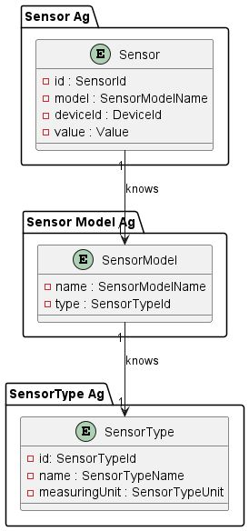
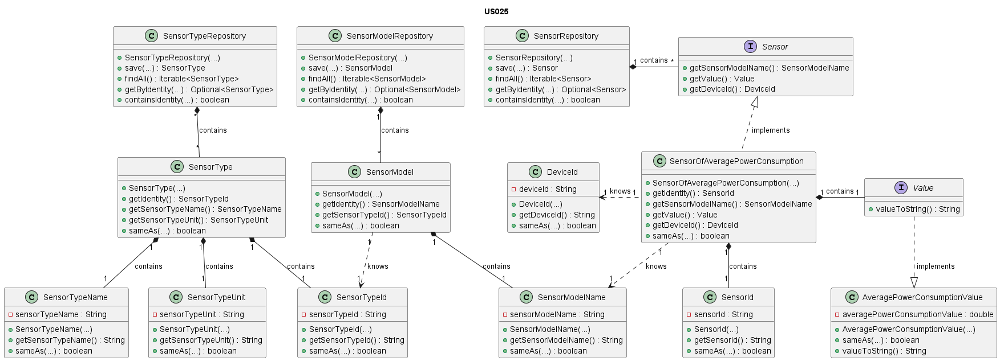

# US025 - Sensor of Average Power Consumption

### Table of Contents

1. [Requirements](#1-requirements)
    - [Dependency on other user stories](#dependency-of-other-user-stories)
2. [Analysis](#2-analysis)
    - [Relevant domain model excerpt](#relevant-domain-model-excerpt)
3. [Design](#3-design)
    - [Class diagram](#class-diagram)
    - [Sequence diagram](#sequence-diagram)
    - [Applied design patterns and principles](#applied-design-patterns-and-principles)
4. [Tests](#4-tests)
    - [TAcceptance tests](#acceptance-tests)
    - [Unit tests](#unit-tests)
    - [Integration tests](#integration-tests)
5. [Implementation](#5-implementation)
6. [Conclusion](#6-conclusion)

## 1. Requirements

_As Product Owner, I want the system to have a type of sensor that gives the
average power consumption over a period (W)._

Requirements for the sensor

- The sensor should be able to provide the average power consumption over a period in watts.

### Dependency of other User Stories

Although this user story does not depend on any other user story, it is important to note that this sensor type
will be available for the user to choose when adding a sensor to a device. This dependency is from **US007**.

## 2. Analysis

The `SensorOfAveragePowerConsumption` class is composed by the following attributes:

| Attribute           | Rules                                                                                                                 |
|---------------------|-----------------------------------------------------------------------------------------------------------------------|
| **SensorId**        | Must be a unique identifier. It is generated automatically.                                                           |
| **SensorModelName** | Must not be null or empty. Must correspond to a model of an existing type.                                            |
| **Value**           | Must be a `AveragePowerConsumptionValue` object that represents the average power consumption. It should not be null. |
| **DeviceId**        | Must not be null or empty. Must correspond to an existing device in the house.                                        |                                                                          

The `AveragePowerConsumptionValue`, which is created class is composed by the following attributes:

| Attribute                        | Rules                                                                                                                   |
|----------------------------------|-------------------------------------------------------------------------------------------------------------------------|
| **AveragePowerConsumptionValue** | Must be a double value that represents the average power consumption over a period in watts. It should not be negative. |

The interaction with the sensor of average power consumption involves:

1. Requesting the average power consumption over a period in watts.
2. For the time being, the system generates a default value, as there is no connection to a real sensor.
3. The system will be able to provide the average power consumption over a period in watts.

### Relevant domain model excerpt

Below is the relevant excerpt of the domain model for this User Story:



## 3. Design

### Class Diagram

Below is the class diagram for this User Story:



### Sequence Diagram

A sequence diagram for US025 is not provided, since the only requirement is for the system to have a sensor that provides
the average power consumption over a period in watts. So, there is no interaction with other components or actors in the system.

### Applied design patterns and principles

* **Information Expert** - The `SensorOfAveragePowerConsumption` class knows how to manage its identity, value, and
  associated device, encapsulating this logic within the class itself.
* **Creator** - The `SensorFactory` plays a crucial role in the creation of sensors, including `SensorOfAveragePowerConsumption`.
  It encapsulates the logic required to instantiate a sensor, ensuring that each sensor is created with a proper state
  and associated with the correct device and sensor model. This pattern helps in maintaining the consistency and
  integrity of sensor creation across the system.
* **Low Coupling** - The `SensorFactory` plays a pivotal role in this User Story by centralizing the instantiation of
  `SensorOfAveragePowerConsumption` instances. By decoupling the creation process from the sensor's operational and data
  management responsibilities, the system gains flexibility. Adjustments to how sensors are created or initialized can
  be made independently of their core functionalities and interactions with the `SensorRepository`.
* **High Cohesion** - Each class is focused on a single responsibility. For instance, the `SensorRepository` is solely
  concerned with storing and retrieving sensor information, ensuring that classes are focused and understandable.
* **Single Responsibility Principle (SRP)** - The `SensorOfAveragePowerConsumption` class focuses on managing average
  power consumption sensor data,
  distinct from the `SensorRepository` which deals with data storage and retrieval. This separation ensures that changes
  in data management don't interfere with sensor functionality, simplifying maintenance and scalability.
* **Repository** - The `SensorRepository`, `SensorTypeRepository`, and `SensorModelRepository` act as Repository
  patterns. They provide a collection-like interface for accessing sensor, sensor type, and sensor model objects from
  the domain model, abstracting away the details of the data access layer.
* **Interface Segregation** - The `Sensor` interface defines a contract for sensor behavior without imposing any
  unnecessary methods on the implementing classes, such as `SensorOfAveragePowerConsumption`. This follows the Interface
  Segregation Principle by ensuring that implementing classes only need to provide implementations for methods that make
  sense for their specific type of sensor.
* **Value Object** - The `AveragePowerConsumptionValue` class is a value object that encapsulates the average power
  consumption value. By representing this value as an object, the system can ensure that the value is always valid and
  consistent, preventing accidental misuse or modification.

## 4. Tests

### Acceptance tests

- **Scenario 1:** The user wants to be able to create a Sensor of Average Power Consumption
    - **When** the user wants to have a `SensorOfAveragePowerConsumption` available in the system
    - **Then** the system must enable a Sensor of Average Power Consumption to the user.
  - **And** the system must save the parameters given to construct such a sensor.
    - **And** the system must generate a unique `SensorId` for the Sensor.

- **Scenario 2:** The user wants to be able to get the average power consumption over a period in watts
    - **Given** that the user has a `SensorOfAveragePowerConsumption` available in the system
    - **When** the user requests the average power consumption over a period in watts
    - **Then** the system must provide the average power consumption over a period in watts.

### Unit tests

Below are some relevant unit tests for this user story, focusing on the creation of average power consumption sensors:

| Test Case                                                                  | Expected Outcome                                                                                                 |
|----------------------------------------------------------------------------|------------------------------------------------------------------------------------------------------------------|
| Test creating an average power consumption sensor with valid parameters.   | The system should create an average power consumption sensor with the specified device ID and sensor model name. |
| Test creating an average power consumption sensor with invalid parameters. | The system should return an error message.                                                                       |

Below are some relevant unit tests for this user story, focusing on the retrieval and validation of average power consumption readings:

| Test Case                                           | Expected Outcome                                                                         |
|-----------------------------------------------------|------------------------------------------------------------------------------------------|
| Test retrieving the average power consumption value | The system should return the average power consumption value associated with the sensor. |

Below are some relevant unit tests for this user story, focusing on the creation of average power consumption values:

| Test Case                                                                     | Expected Outcome                                                                      |
|-------------------------------------------------------------------------------|---------------------------------------------------------------------------------------|
| Test creating an average power consumption value with a valid value (>= 0).   | The system should create an average power consumption value with the specified value. |
| Test creating an average power consumption value with an invalid value (< 0). | The system should return an error message.                                            |

For more information on the unit tests, please refer to
the [SensorOfAveragePowerConsumptionTest](https://github.com/Departamento-de-Engenharia-Informatica/2023-2024-switch-dev-project-assignment-switch-project-2023-2024-grupo6/blob/main/src/test/java/smarthome/domain/sensor/SensorOfAveragePowerConsumptionTest.java),
and [AveragePowerConsumptionValueTest](https://github.com/Departamento-de-Engenharia-Informatica/2023-2024-switch-dev-project-assignment-switch-project-2023-2024-grupo6/blob/main/src/test/java/smarthome/domain/sensor/vo/values/AveragePowerConsumptionValueTest.java)
classes.

### Integration tests

Integration tests are not specified for US025 at this time. This is because US025's scope is confined to
displaying average power consumption based on existing sensor data, a process that does not involve intricate interactions
between multiple system components or external dependencies. Should the integration landscape of the
system evolve to include more complex interactions relevant to US025, the need for integration tests will be revisited.

## 5. Implementation

The `SensorOfAveragePowerConsumption` class implements the `Sensor` interface, specializing in the management of average
power consumption data. Below are the relevant methods of this class:

```java


public class SensorOfAveragePowerConsumption implements Sensor {
    // Attributes

    protected SensorOfAveragePowerConsumption(DeviceId deviceId, SensorModelName sensorModelName) {
        // Implementation of the constructor
    }
}
```

The `AveragePowerConsumptionValue` class, implementing the `Value` interface, encapsulates the average power
consumption, ensuring immutability and data integrity. Below are the relevant methods of this class:

```java
public class AveragePowerConsumptionValue implements Value {
    // Attributes

    public AveragePowerConsumptionValue(double value) {
        // Implementation of the method
    }
}
```

For more information on the implementation, please refer to the
[SensorOfAveragePowerConsumption](https://github.com/Departamento-de-Engenharia-Informatica/2023-2024-switch-dev-project-assignment-switch-project-2023-2024-grupo6/blob/main/src/main/java/smarthome/domain/sensor/SensorOfAveragePowerConsumption.java),
and [AveragePowerConsumptionValue](https://github.com/Departamento-de-Engenharia-Informatica/2023-2024-switch-dev-project-assignment-switch-project-2023-2024-grupo6/blob/main/src/main/java/smarthome/domain/sensor/vo/values/AveragePowerConsumptionValue.java)
classes.

## 6. Conclusion

To summarize, this User Story integrates the functionality of displaying average power consumption into the system,
using the `SensorOfAveragePowerConsumption` and `AveragePowerConsumptionValue` classes for effective data management
and representation. The implementation involves key attributes, such as the `sensorModelName` and `value`, which
are essential for the accurate representation and retrieval of average power consumption data.

[Back to Top](#us025---sensor-of-average-power-consumption)