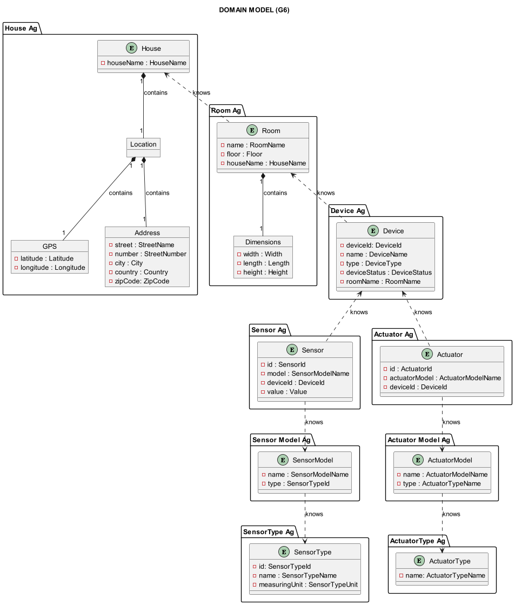
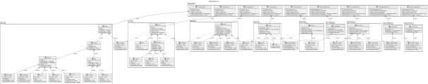

# US030 - Implementation of DDD

### Table of Contents

1. [Requirements](#1-requirements)
2. [Design](#2-design)
    - [Domain model](#domain-model)
    - [Class diagram](#class-diagram)
    - [Applied design patterns and principles](#applied-design-patterns-and-principles)
3. [Implementation](#3-implementation)
4. [Conclusion](#4-conclusion)

## 1. Requirements

_As a Product Owner, I want to implement the Domain-Driven Design (DDD) to the project._

Requirements for DDD:

- The system must be organized under aggregates.
- Each aggregate must have one root entity.
- Each aggregate may have more than one entity.
- Each aggregate must have a repository.
- Each aggregate must have a factory.
- Each entity must have value objects.

## 2. Design

### Architecture

The Domain-Driven Design (DDD) approach is a software design methodology that focuses on modeling the domain of the system.
It emphasizes the importance of aligning the software design with the real-world domain, making the system more intuitive and efficient.

In our project, we organized the code to separate concerns into different layers, each responsible for specific tasks.

The layers identified include:

* **Controller Layer**: This layer represents the outermost layer which deals with input and output mechanisms. Controllers receive input from the user interface or external systems and delegate tasks to the inner layers. They are part of the interface adapters that translate requests into a format understandable by the application.

* **DTO Layer**: The DTO layer is responsible for mapping data between different representations, such as entity objects and data transfer objects (DTOs). Mappers ensure that data is transformed correctly between layers of the application. Mappers can be seen as part of the interface adapters, converting data between the domain model and external formats without affecting the business rules.

* **Domain Layer**: This layer contains the core business logic and domain entities of the application. It encapsulates the rules and behavior that govern the application's functionality. The domain layer is at the center of the architecture, independent of external concerns. It represents the highest level of abstraction and should not depend on external frameworks or technologies.

* **Repository Layer**: The repository layer is responsible for interacting with the data storage mechanisms, such as databases or external services. It provides an abstraction over the data access logic and allows the inner layers of the application to work with domain objects without needing to know the details of data persistence. Repositories are part of the interface adapters that bridge the domain layer with the external data sources and do not influence the core business logic.


This architecture promotes separation of concerns, modularity, and maintainability by organizing code into distinct layers with well-defined responsibilities. It enables easier testing, scalability, and flexibility in evolving the application over time.


### Domain model

Below is the domain model for the project that has been designed using Domain-Driven Design (DDD) principles:



### Class diagram

Below is the class diagram for the project that has been designed using Domain-Driven Design (DDD) principles:



### Applied design patterns and principles

To effectively implement Domain-Driven Design (DDD) in our project, we've focused on several foundational patterns that
are central to DDD. These patterns help in accurately reflecting the complexities and nuances of the business domain,
thus enabling a more intuitive and efficient software design and development process.

In our project, we have adopted the DDD approach to design the core domain model, which consists of entities, value objects, and aggregates. These concepts are fundamental to accurately representing the business domain and ensuring that the software design is aligned with the real-world domain.

Here's a brief overview of these
essential DDD patterns:

* **Entities** are objects that have a distinct identity that runs through time and different states.
  They are crucial for representing real-world concepts in the domain that undergo changes while maintaining their
  identity.


* **Value Objects** are objects that do not possess an identity and are immutable.
  They describe certain characteristics and attributes within the domain.
  Their equality is determined by the values they hold.


* **Aggregates** are clusters of domain objects that are treated as a single unit for the purpose of data changes.
  Each Aggregate has an Aggregate Root, which acts as the gateway for accessing and manipulating the objects within the
  Aggregate.
  It is within Aggregates that we enforce invariants—the essential consistency rules that must hold true for the system
  to be in a valid state. By ensuring these invariants are maintained, Aggregates play a crucial role in maintaining the
  integrity and consistency of the domain model.

We also defined other layers and patterns that are essential for a well-structured domain model:

* **Factories** are responsible for the creation of complex domain objects and Aggregates.
  They ensure that these objects are created with a valid state and all necessary dependencies are properly initialized.


* **Repositories** provide a collection-like interface for accessing domain objects.
  They abstract the details of how data is persisted and retrieved, managing the collection of domain objects.

These DDD patterns and concepts are fundamental in creating a model that accurately represents the business domain and
its complexities. By adhering to these patterns, we can ensure that our software design is aligned with the real-world
domain, making it more intuitive, maintainable, and scalable.

## 3. Implementation

To illustrate the implementation of some core Domain-Driven Design (DDD) concepts, the following Java interface
definitions are provided. Each snippet demonstrates a foundational pattern within the DDD framework, essential for
constructing a robust and scalable domain model.

The `AggregateRoot` interface marks an entity as the root of an aggregate, encapsulating the aggregate's boundary and
ensuring its consistency.

```java
public interface AggregateRoot<ID extends DomainId> extends DomainEntity<ID> {
}
```

The `DomainEntity` interface defines the basic characteristics of an entity in the domain, emphasizing the importance of
a unique identity and the ability to compare entities.

```java
public interface DomainEntity<ID extends DomainId> {

    ID getIdentity();

    boolean sameAs(Object object);
}
```

The `ValueObject` interface captures the essence of a value object in DDD, focusing on immutability and comparison based
on attributes rather than identity.

```java
public interface ValueObject {

    boolean sameAs(Object object);

}
```

The `DomainId` interface extends the `ValueObject` interface and represents a unique identifier within the domain,
serving as a marker interface for all ID types and ensuring consistency across entities.

```java
public interface DomainId extends ValueObject {
}
```

The `Repository` interface defines the contract for a repository in DDD, outlining the methods necessary for storing,
retrieving, and querying aggregate roots within the domain.

```java
public abstract interface Repository<ID extends DomainId, T extends AggregateRoot<ID>> {

    T save(T entity);

    Iterable<T> findAll();

    Optional<T> getByIdentity(ID id);

    boolean containsIdentity(ID id);
}
```

## 4. Conclusion

Transitioning from a traditional project to a Domain-Driven Design (DDD) project offers numerous advantages and benefits, including better alignment with the business domain, improved maintainability and flexibility, enhanced collaboration and communication, focus on core business logic, increased testability and quality assurance, and adaptability to changing requirements. 
By embracing DDD principles and practices, we thrive to build a software solution that is more intuitive, effective, and resilient, ultimately delivering greater value to the project and its end users.

