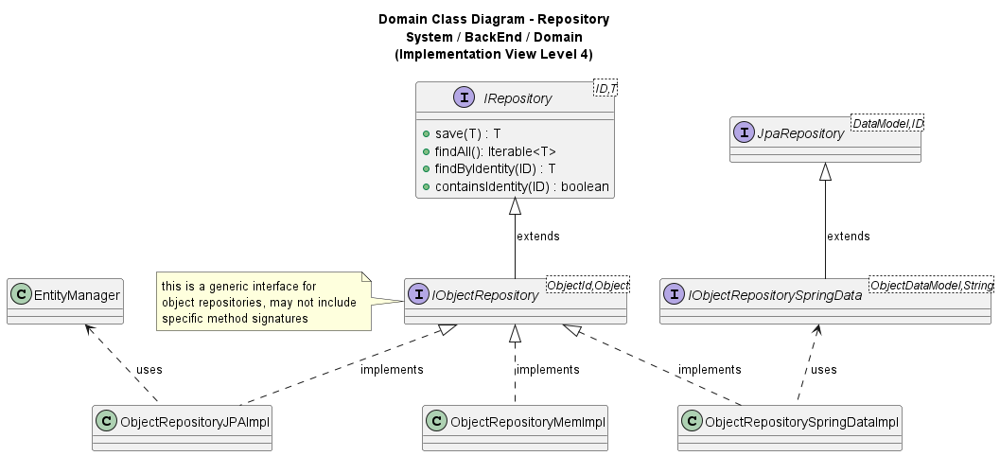

# US032 - Data Persistence using Spring.

### Table of Contents

1. [Requirements](#1-requirements)
2. [Design](#2-design)
  - [Architecture](#architecture)
  - [Class Diagram](#class-diagram)
  - [Applied Design Patterns and Principles](#applied-design-patterns-and-principles)
3. [Implementation](#3-implementation)
  - [Repository](#repository)
  - [Data Model](#data-model)
4. [Conclusion](#4-conclusion)

## 1. Requirements

_As Product Owner, I want the system to support data persistence using Spring._

Requirements for data persistence using Spring:

- The system must use JPA (Java Persistence API) for data persistence.
- The system must use Spring Data JPA to interact with the database.
- The system shall support the creation of a new entity.
- The system shall support the retrieval of an entity by its ID.
- The system shall support the retrieval of all entities.
- The system shall support the update of an entity if needed.
- The system shall support the retrieval of all entities by a specific attribute.

Although it is generally considered an anti-pattern to use JPA for storing only a single instance of an entity, in this
specific case, we have chosen to persist the 'House' entity uniquely given the emphasis and importance this class holds
in the business logic and requirements of the present project.
This decision was made to ensure that the system adheres to the business rule that stipulates only one 'House' per
system.
This approach simplifies the management of data related to the 'House', such as its location and ensures data integrity
by preventing any duplicities or inconsistencies that might arise from multiple instances. Therefore, the use of this
anti-pattern was a deliberate choice to align the system design with the strategic needs of the business, providing
an effective and tailored solution for the current context.

## 2. Design

### Architecture

Spring is a Java framework that provides comprehensive infrastructure support for developing Java applications.
It offers a wide range of features, including dependency injection, aspect-oriented programming, transaction management,
and data access.
Spring Data JPA is a part of the Spring Data project that provides a set of abstractions and utilities for working with
JPA in a Spring application.
It simplifies the development of data access layers by providing common functionality and reducing boilerplate code.

In our project, we use Spring Data JPA to interact with the database and manage the persistence of entities.
Spring Data JPA provides a repository abstraction that allows developers to define repositories for entities and perform
common CRUD operations without needing to write repetitive code.
Repositories are interfaces that extend the `JpaRepository` interface and provide methods for saving, updating,
deleting, and querying entities.
Spring Data JPA generates the implementation of the repository at runtime, based on the methods defined in the
interface.

The Spring Data JPA architecture consists of the following components:

- **Entity**: An entity is a Java class that represents a database table. It is annotated with the `@Entity` annotation
  to indicate that it is a persistent entity. Each entity class must have a primary key field annotated with the `@Id`
  annotation.
- **Id**: The `@Id` annotation is used to mark the primary key field of an entity. It indicates that the field is the
  unique identifier of the entity.
- **Repository**: A repository is an interface that extends the `JpaRepository` interface and provides methods for
  interacting with entities. It defines common CRUD operations, such as `save`, `findById`, `findAll`, `delete`, and
  custom queries.
- **JpaRepository**: The `JpaRepository` interface is a part of the Spring Data JPA project and provides generic CRUD
  operations for entities. It extends the `PagingAndSortingRepository` interface and adds additional methods for
  querying entities.

### Class Diagram



### Applied Design Patterns and Principles

* **Repository Pattern**: The Repository pattern is a design pattern that separates the logic that retrieves data from
  the underlying data source from the business logic that operates on the data. It provides a way to access data
  without directly interacting with the data source, such as a database or web service. In our project, we use the
  Repository pattern to define interfaces that provide methods for interacting with entities. These interfaces extend
  the `JpaRepository` interface and define common CRUD operations for entities. Spring Data automatically implements
  these interfaces at runtime, eliminating the need for manual boilerplate code.


* **Data Model Pattern**: The Data Model pattern is a design pattern that separates the domain model from the data
  model.
  It provides a way to represent entities in a format that can be stored in a database. In our project, we use Data
  Model
  objects to represent entities in a format that can be stored in the database. These Data Model objects contain all the
  information necessary for the entity to be persisted in the database. We use Data Model objects to map domain objects
  to Data Model objects that represent entities.


* **Data Mapper Pattern**: The Data Mapper pattern is a design pattern that separates the domain model from the
  persistence layer. It provides a way to map domain objects to data models that can be stored in a database. In our
  project, we use Data Mapper objects to map domain objects to DataModel objects that represent entities. These
  DataModel objects contain all the information necessary for the entity to be stored in the database.

## 3. Implementation

### Repository

Considering our Class Diagram above, IRepository is an interface representing a generic repository. This interface
defines the shared methods that all repositoriesJPA classes must implement. The shared methods include:

- `save`: This method is used to save a new entity to the database. It takes an entity as a parameter and returns the
  saved entity.
- `findAll`: This method is used to retrieve all entities of a specific type from the database. It returns an iterable
  collection of entities.
- `getByIdentity`: This method is used to retrieve an entity by its identity. It takes an identity object as a parameter
  and returns an optional entity.
- `containsIdentity`: This method is used to check if an entity with a specific identity exists in the database. It
  takes
  an identity object as a parameter and returns a boolean value indicating whether the entity exists.

All the SpringData repositories in the project are implemented using the `Spring Data JPA` framework. The repositories
are interfaces that extend the `JpaRepository` interface and provide methods for interacting with entities. These
interfaces should be implemented according to individual repository needs in order to obtain the expected results
in each implementation.

These interfaces should be implemented according to individual repository needs in order to obtain the expected results
in each implementation. Since they all implement the generic `IObjectRepository` interface, they all have the same basic
methods listed above, but they can also have additional methods specific to the entity they are working with.

This next code snippet exemplifies one implementation of a `SpringData` repository, in this
case, the `SensorRepositorySpringData` implementation:

```java
public class SensorRepositorySpringData implements ISensorRepository {
  // Attributes

    public SensorRepositorySpringData(SensorDataModelMapper sensorDataModelMapper, ISensorRepositorySpringData sensorRepositorySpringData) {
      // Implementation of the constructor
    }

    @Override
    public Sensor save(Sensor sensor) {
        //implementing the method
    }

    @Override
    public Iterable<Sensor> findAll() {
        //implementing the method
    }

    @Override
    public Optional<Sensor> getByIdentity(SensorId id) {
        //implementing the method
    }

    @Override
    public boolean containsIdentity(SensorId id) {
        //implementing the method
    }

  @Override
  public Iterable<Sensor> getByDeviceIdentity(DeviceId deviceId) {
    //implementation of the method
  }

  @Override
  public Iterable<Sensor> getByDeviceIdentityAndSensorModel(DeviceId deviceId, SensorModelName sensorModelName) {
    //implementation of the method
  }
}
```


All `SpringData` implementations implement an `IObjectRepository` interface, which is a generic interface that provides
basic operations for entities, exemplified in this code snippet from the `IRoomRepository` interface:

```java
public interface IRoomRepository extends Repository<RoomId, Room> {
}
````

Some `SpringData` implementations carry additional methods that are specific to the entity they are working with,
exemplified in the following code snippets:

- `IActuatorModelRepository` interface:

```java
public interface IActuatorModelRepository extends Repository<ActuatorModelName, ActuatorModel> {

    public Iterable<ActuatorModel> findByActuatorTypeIdentity(ActuatorTypeName actuatorTypeName);
}
````

- `IActuatorRepository` interface:

```java
public interface IActuatorRepository extends Repository<ActuatorId, Actuator> {

    Iterable<Actuator> findByDeviceIdentity(DeviceId deviceId);
}
```

- `IDeviceRepository` interface:

```java
public interface IDeviceRepository extends Repository<DeviceId, Device> {

    Iterable<Device> findByRoomIdentity(RoomId roomId);

    Device update(Device device);

    Map<SensorTypeName, List<Device>> groupDevicesBySensorType();
}
```

- `IHouseRepository` interface:

```java
public interface IHouseRepository extends UniqueEntityRepository<HouseName, House> {

    House update(House theHouse);
}
```

- `IReadingRepository` interface:

```java
public interface IReadingRepository extends Repository<ReadingId, Reading> {

    Iterable<Reading> findBySensorIDInAGivenPeriod(SensorId sensorId, LocalDateTime start, LocalDateTime end);
}
```

- `ISensorModelRepository` interface:

```java
public interface ISensorModelRepository extends Repository<SensorModelName, SensorModel> {

    public Iterable<SensorModel> findBySensorTypeIdentity(SensorTypeId sensorTypeId);
}
````

- `ISensorRepository` interface:

```java

public interface ISensorRepository extends Repository<SensorId, Sensor> {

    Iterable<Sensor> getByDeviceIdentity(DeviceId Id);

    Iterable<Sensor> getByDeviceIdentityAndSensorModel(DeviceId deviceId, SensorModelName sensorModelName);
}
```

All `SpringData` implementations carry one dependency to a `IObjectRepositorySpringData` interface, that
extends `JpaRepository` (from Java Library). The `IObjectRepositorySpringData` interface is a generic interface that
provides basic operations for entities, exemplified in this code snippet from the `IActuatorTypeRepositorySpringData`
interface:

```java
public interface IActuatorTypeRepositorySpringData extends JpaRepository<ActuatorTypeDataModel, String> {
}
````

Some `SpringData` implementations carry additional methods that are specific to the entity they are working with,
exemplified in the following code snippets:

- `IActuatorRepositorySpringData` interface:

```java
public interface IActuatorRepositorySpringData extends JpaRepository<ActuatorDataModel, String> {
    Iterable<ActuatorDataModel> findByDeviceId(String deviceId);
}
````

- `IDeviceRepositorySpringData` interface:

```java
public interface IDeviceRepositorySpringData extends JpaRepository<DeviceDataModel, String> {

    Iterable<DeviceDataModel> findByRoomIdentity(RoomId roomId);
}
````

- `ISensorModelSpringData` interface:

```java
public interface ISensorModelSpringData extends JpaRepository<SensorModelDataModel, String> {

    List<SensorModelDataModel> findBySensorTypeId(String sensorTypeId);
}
````

- `ISensorRepositorySpringData` interface:

```java
public interface ISensorRepositorySpringData extends JpaRepository<SensorDataModel, String> {

    List<SensorDataModel> findByDeviceId(String identity);

    List<SensorDataModel> findByDeviceIdAndSensorModelName(String deviceId, String sensorModelName);
}
````

For more information on the implementation of the Spring Data repositories, please refer to the following classes:

[ActuatorModelRepositorySpringDataImpl](https://github.com/Departamento-de-Engenharia-Informatica/2023-2024-switch-dev-project-assignment-switch-project-2023-2024-grupo6/blob/main/src/main/java/smarthome/persistence/spring/impl/ActuatorModelRepositorySpringDataImpl.java)

[ActuatorRepositorySpringDataImpl](https://github.com/Departamento-de-Engenharia-Informatica/2023-2024-switch-dev-project-assignment-switch-project-2023-2024-grupo6/blob/main/src/main/java/smarthome/persistence/spring/impl/ActuatorRepositorySpringDataImpl.java)

[ActuatorTypeRepositorySpringDataImpl](https://github.com/Departamento-de-Engenharia-Informatica/2023-2024-switch-dev-project-assignment-switch-project-2023-2024-grupo6/blob/main/src/main/java/smarthome/persistence/spring/impl/ActuatorTypeRepositorySpringDataImpl.java)

[DeviceRepositorySpringDataImpl](https://github.com/Departamento-de-Engenharia-Informatica/2023-2024-switch-dev-project-assignment-switch-project-2023-2024-grupo6/blob/main/src/main/java/smarthome/persistence/spring/impl/DeviceRepositorySpringDataImpl.java)

[HouseRepositorySpringDataImpl](https://github.com/Departamento-de-Engenharia-Informatica/2023-2024-switch-dev-project-assignment-switch-project-2023-2024-grupo6/blob/main/src/main/java/smarthome/persistence/spring/impl/HouseRepositorySpringDataImpl.java)

[ReadingRepositorySpringDataImpl](https://github.com/Departamento-de-Engenharia-Informatica/2023-2024-switch-dev-project-assignment-switch-project-2023-2024-grupo6/blob/main/src/main/java/smarthome/persistence/spring/impl/ReadingRepositorySpringDataImpl.java)

[RoomRepositorySpringDataImpl](https://github.com/Departamento-de-Engenharia-Informatica/2023-2024-switch-dev-project-assignment-switch-project-2023-2024-grupo6/blob/main/src/main/java/smarthome/persistence/spring/impl/RoomRepositorySpringDataImpl.java)

[SensorModelRepositorySpringDataImpl](https://github.com/Departamento-de-Engenharia-Informatica/2023-2024-switch-dev-project-assignment-switch-project-2023-2024-grupo6/blob/main/src/main/java/smarthome/persistence/spring/impl/SensorModelRepositorySpringDataImpl.java)

[SensorRepositorySpringData](https://github.com/Departamento-de-Engenharia-Informatica/2023-2024-switch-dev-project-assignment-switch-project-2023-2024-grupo6/blob/main/src/main/java/smarthome/persistence/spring/impl/SensorRepositorySpringData.java)

[SensorTypeRepositorySpringDataImpl](https://github.com/Departamento-de-Engenharia-Informatica/2023-2024-switch-dev-project-assignment-switch-project-2023-2024-grupo6/blob/main/src/main/java/smarthome/persistence/spring/impl/SensorTypeRepositorySpringDataImpl.java)

### Data Model

In order for Domain objects to be stored in the persistences (Databases) and to be further on retrieved from such DB's,
an object that saves the whole information necessary for the object to be stored in the DB is created. This object is
called a DataModel.

Below is an example of a DataModel object:

```java

@Entity
@Table(name = "DEVICE")
public class DeviceDataModel {

  @Id
  private String deviceId;

  private String roomId;
  private String deviceName;
  private String deviceType;
  private boolean deviceStatus;

  public DeviceDataModel() {
    // Implementation of the constructor
  }

  public DeviceDataModel(Device device) {
    // Implementation of the constructor
  }

  public String getDeviceId() {
    // Implementation of the method
  }

  public String getDeviceName() {
    // Implementation of the method
  }

  public String getDeviceType() {
    // Implementation of the method
  }

  public String getRoomId() {
    // Implementation of the method
  }

  public boolean getDeviceStatus() {
    // Implementation of the method
  }

  public boolean updateDeviceFromDomain(Device device) {
    // Implementation of the method
  }
}
```

For more information on the implementation of the Data Models, please refer to the following classes:

[ActuatorDataModel](https://github.com/Departamento-de-Engenharia-Informatica/2023-2024-switch-dev-project-assignment-switch-project-2023-2024-grupo6/blob/main/src/main/java/smarthome/persistence/datamodel/ActuatorDataModel.java)

[ActuatorModelDataModel](https://github.com/Departamento-de-Engenharia-Informatica/2023-2024-switch-dev-project-assignment-switch-project-2023-2024-grupo6/blob/main/src/main/java/smarthome/persistence/datamodel/ActuatorModelDataModel.java)

[ActuatorTypeDataModel](https://github.com/Departamento-de-Engenharia-Informatica/2023-2024-switch-dev-project-assignment-switch-project-2023-2024-grupo6/blob/main/src/main/java/smarthome/persistence/datamodel/ActuatorTypeDataModel.java)

[DeviceDataModel](https://github.com/Departamento-de-Engenharia-Informatica/2023-2024-switch-dev-project-assignment-switch-project-2023-2024-grupo6/blob/main/src/main/java/smarthome/persistence/datamodel/DeviceDataModel.java)

[HouseDataModel](https://github.com/Departamento-de-Engenharia-Informatica/2023-2024-switch-dev-project-assignment-switch-project-2023-2024-grupo6/blob/main/src/main/java/smarthome/persistence/datamodel/HouseDataModel.java)

[ReadingDataModel](https://github.com/Departamento-de-Engenharia-Informatica/2023-2024-switch-dev-project-assignment-switch-project-2023-2024-grupo6/blob/main/src/main/java/smarthome/persistence/datamodel/ReadingDataModel.java)

[RoomDataModel](https://github.com/Departamento-de-Engenharia-Informatica/2023-2024-switch-dev-project-assignment-switch-project-2023-2024-grupo6/blob/main/src/main/java/smarthome/persistence/datamodel/RoomDataModel.java)

[SensorDataModel](https://github.com/Departamento-de-Engenharia-Informatica/2023-2024-switch-dev-project-assignment-switch-project-2023-2024-grupo6/blob/main/src/main/java/smarthome/persistence/datamodel/SensorDataModel.java)

[SensorModelDataModel](https://github.com/Departamento-de-Engenharia-Informatica/2023-2024-switch-dev-project-assignment-switch-project-2023-2024-grupo6/blob/main/src/main/java/smarthome/persistence/datamodel/SensorModelDataModel.java)

[SensorTypeDataModel](https://github.com/Departamento-de-Engenharia-Informatica/2023-2024-switch-dev-project-assignment-switch-project-2023-2024-grupo6/blob/main/src/main/java/smarthome/persistence/datamodel/SensorTypeDataModel.java)

## 4. Conclusion

The integration of Spring into our project has effectively simplified our database interactions, automating
many aspects of data handling and reducing the need for extensive manual coding. This setup has not only improved our
development efficiency but also ensured that our data management practices are consistent and reliable across the
application. By implementing Spring’s repository pattern, we have separated our business logic from data access
concerns, leading to cleaner and more maintainable code. Our strategic decision to uniquely persist the 'House' entity
has proved beneficial, keeping our data model aligned with specific business rules and enhancing data integrity.
Overall, the use of Spring Data JPA has provided a robust framework for our data persistence needs, supporting our
current functionality and preparing us for future system expansions.

[Back to top](#us032---data-persistence-using-spring)