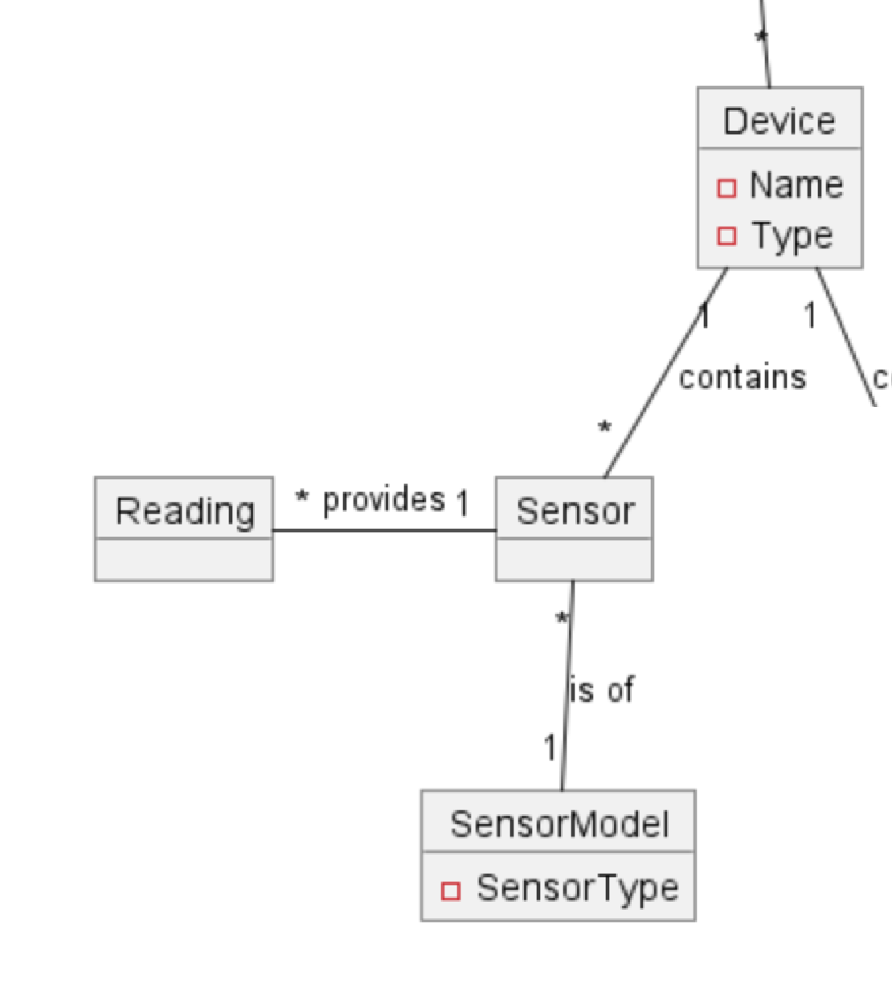
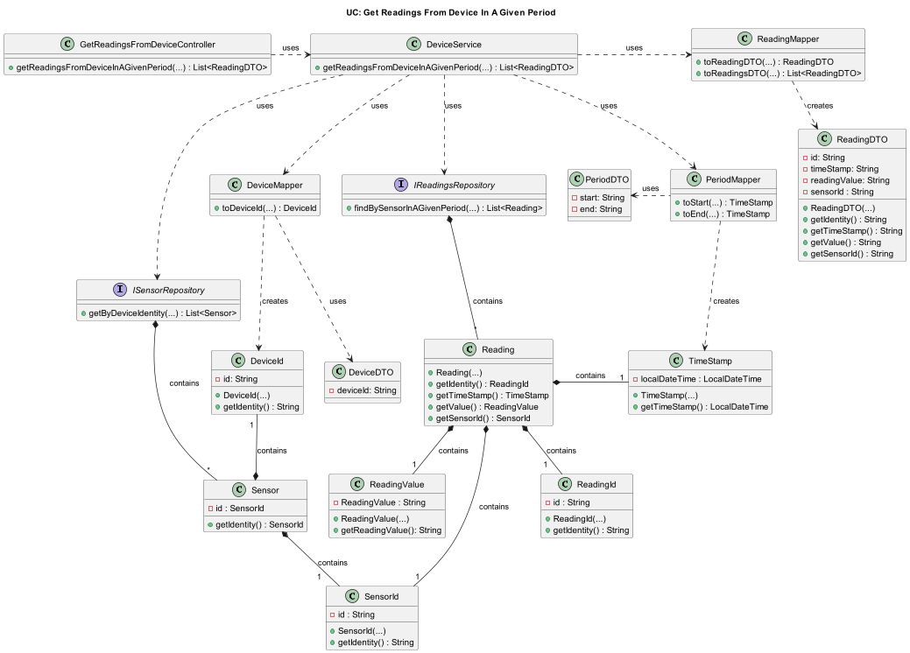
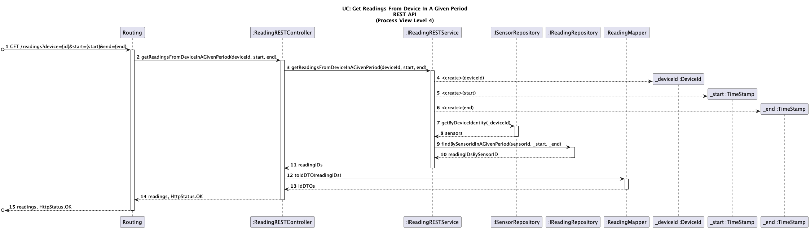

# US033 - Get a list of all readings of a device in a room, in a given period.

### Table of Contents

1. [Requirements](#1-requirements)
  - [Dependency on Other Use Cases](#dependency-on-other-use-cases)
2. [Analysis](#2-analysis)
  - [Relevant Domain Model](#relevant-domain-model-excerpt)
3. [Design](#3-design)
  - [Class Diagram](#class-diagram)
  - [Sequence Diagram](#sequence-diagram)
  - [Applied Design Patterns and Principles](#applied-design-patterns-and-principles)
4. [Tests](#4-tests)
    - [Acceptance Tests](#acceptance-tests)
   - [Unit Tests](#unit-tests)
   - [Integration Tests](#integration-tests)
5. [Implementation](#5-implementation)
6. [Conclusion](#6-conclusion)

## 1. Requirements

_As a Room Owner [or Power User, or Administrator], I want to get a list of all readings of a device in a room, in a
given period._

Requirements for this user story are as follows:

- The user must be able to get a list of all readings of a device in a room.
- The user must be able to specify a period for the readings.
- The user must be able to view the readings in a list format.
- The period for the readings must be valid.
    - The start date must be before the end date.
    - The end date must be before the current date.

The user story can be broken down into the following tasks:

1. Allow the user to specify a period for the readings.
2. Get a list of all readings of a device in a room.
3. Display the readings in a list format.

## Dependency on Other Use Cases

The user story depends on the following use cases that have already been implemented:

- UC: Get Rooms
- UC: Get Devices

These use cases are necessary because users need the ability to choose both a room and a device in order to retrieve a
list of readings associated with that device within the chosen room.

# 2. Analysis

## Relevant Domain Model Excerpt

Below is the relevant domain model excerpt for this user story, showing the relationship between
the `Device`, `Sensor`, `SensorModel` and `Reading` classes:



# 3. Design

The `Reading` class is an entity that represents a reading obtained from a device. It has the following attributes:

- `readingId` - The unique identifier of the reading.
- `value` - The value of the reading.
- `timestamp` - The timestamp of the reading.
- `deviceId` - The device that the reading belongs to.

The `IReadingRepository` provides methods to retrieve readings from the data source:

- `findBySensorIdInAGivenPeriod` - Retrieves readings for a sensor within a specified period.

## Class Diagram

Below is the class diagram for this user story:



## Sequence Diagram

Below is the sequence diagram for this user story:


## Applied Design Patterns and Principles

* **Controller** - The `GetReadingsFromDeviceController` serves as a Controller, handling incoming user requests and
  delegating operations to the `DeviceService`. This pattern helps in separating the web request handling from the
  business logic, ensuring that the controller remains lean and focused only on request routing.
* **Service** - The `DeviceServiceImpl` acts as a Service Layer, orchestrating the flow of data between the controller
  and the repositories. It centralizes business logic involving operations on devices and readings, making it
  independent of the UI logic. This encapsulation aids in maintaining a clean architecture where business rules can be
  modified without affecting other layers.
* **Aggregate Root**  The `Reading` class serves as an Aggregate Root within the context of reading data management.
  This class acts as the main point of interaction for operations related to individual readings, ensuring that all
  related data, such as time stamps, values, and sensor identities, are accessed and modified through it. By serving as
  the aggregate root, Reading encapsulates all the operations on the reading data, maintaining the integrity and the
  rules of the domain model concerning how readings are handled and stored.
* **Value Object** - The `ReadingValue` class exemplifies a Value Object, as it is used to represent the reading
  value of a reading without an identity of its own. It is completely immutable and is defined only by its attributes.
* **Repository** - The Repository Pattern is clear in `ISensorRepository` and `IReadingRepository`.
  It provides a clean separation of the data access logic from the business logic by abstracting data retrieval
  mechanisms.
  Each repository interfaces with the data source to fetch data related to sensors and readings, respectively, and
  presents it in a manner that the domain logic expects.

# 4. Tests

## Acceptance Tests

- **Scenario 1:**
    - **Given** the user is a Room Owner, Power User, or Administrator.
  - **When** the user requests a list of all readings of a device in a room.
  - **And** the user specifies a valid period for the readings.
  - **Then** the system should give a list of all readings of the device in the room.


- **Scenario 2:**
    - **Given** the user is a Room Owner, Power User, or Administrator.
  - **When** the user requests a list of all readings of a device in a room.
  - **And** the user specifies a period for the readings.
  - **If** there are no readings in the specified period.
  - **Then** the system should give an empty list of readings.


- **Scenario 3:**
    - **Given** the user is a Room Owner, Power User, or Administrator.
  - **When** the user requests a list of all readings of a device in a room.
  - **And** he user gives an invalid period for the readings (start date after end date/ end date after current
    date/ same start and end date).
    - **Then** the system should not give a list of all readings of the device in the room.


- **Scenario 4:**
    - **Given** the user is a Room Owner, Power User, or Administrator.
  - **When** the user requests a list of all readings of a device in a room.
    - **And** the user specifies a device without any associated sensors.
  - **Then** the system should not give a list of all readings of the device in the room.

## Unit Tests

Below are the unit tests for the sensor's repository, reading's repository, and reading management:

| Test Case                          | Expected Outcome                                             |
|------------------------------------|--------------------------------------------------------------|
| Test retrieving value from reading | The system should return the value of the specified reading. |

For more information on unit testing and validation, please refer
to [ReadingTest](https://github.com/Departamento-de-Engenharia-Informatica/2023-2024-switch-dev-project-assignment-switch-project-2023-2024-grupo6/blob/main/src/test/java/smarthome/domain/reading/ReadingTest.java).

## Integration Tests

Below are the integration tests based on the acceptance scenarios for this user story:

| Scenario                                            | Test Case                                                                   | Expected Outcome                                                                        |
|-----------------------------------------------------|-----------------------------------------------------------------------------|-----------------------------------------------------------------------------------------|
| **Scenario 1: Valid Reading Retrieval**             | Retrieve readings for a device in a room within a valid period.             | The system should return a list of all readings for the device in the specified period. |
| **Scenario 2: No Readings in the Specified Period** | Retrieve readings for a device in a room within a period with no readings.  | The system should return an empty list of readings.                                     |
| **Scenario 3: Invalid Details**                     | Attempt to retrieve readings for a device in a room with an invalid period. | The system should reject the request and not return any readings.                       |
| **Scenario 4: No Sensors for the Device**           | Attempt to retrieve readings for a device without any associated sensors.   | The system should reject the request and not return any readings.                       |
| **Other scenarios**                                 | Attempt to retrieve readings for a non-existent device.                     | The system should reject the request and not return any readings.                       |
|                                                     | Attempt to retrieve readings with invalid data.                             | The system should reject the request and not return any readings.                       |                                                                                  

For more information on integration testing and validation, please refer to
[GetReadingsFromDeviceControllerTest](https://github.com/Departamento-de-Engenharia-Informatica/2023-2024-switch-dev-project-assignment-switch-project-2023-2024-grupo6/blob/main/src/test/java/smarthome/controller/GetReadingsFromDeviceControllerTest.java).

# 5. Implementation

The `GetReadingsFromDeviceController` class is responsible for handling incoming requests to retrieve readings for a
device in a room within a specified period.

```java
public class GetReadingsFromDeviceController {
    // Attributes

    public GetReadingsFromDeviceController(IDeviceService deviceService) {
        // Implementation of the constructor
    }

    public List<ReadingDTO> getReadingsFromDeviceInAGivenPeriod(DeviceDTO deviceDTO, PeriodDTO periodDTO) {
        // Implementation of the method
    }
}
```

The controller delegates the request to an implementation of the `IDeviceService` interface, which contains the business
logic for retrieving readings for a device in a room within a specified period.

```java
public interface IDeviceService {

    List<ReadingDTO> getReadingsFromDeviceInAGivenPeriod(DeviceDTO deviceDTO, PeriodDTO periodDTO);

}
```

The service layer interacts with the repositories to fetch the required data and performs the necessary operations to
retrieve the readings for the specified device within the given period. The `IReadingRepository` interface provides
the necessary methods to interact with the data source to retrieve readings.

```java
public interface IReadingRepository extends Repository<ReadingId, Reading> {

    Iterable<Reading> findBySensorIdInAGivenPeriod(SensorId sensorId, LocalDateTime start, LocalDateTime end);

}
```

The `Reading` class represents a reading of a device and contains the necessary attributes to store the id, value,
timestamp, and sensor ID associated with the reading.

```java
public class Reading implements AggregateRoot<ReadingId> {
    // Attributes

    protected Reading(ReadingValue value, SensorId sensorId, TimeStamp timeStamp) {
        // Implementation of the constructor
    }

    protected Reading(ReadingId readingId, ReadingValue value, SensorId sensorId, TimeStamp timeStamp) {
        // Implementation of the constructor
    }

    public ReadingId getIdentity() {
        // Implementation of the method
    }

    public ReadingValue getValue() {
        // Implementation of the method
    }

    public SensorId getSensorId() {
        // Implementation of the method
    }

    public TimeStamp getTimeStamp() {
        // Implementation of the method
    }
}
```

For more information on the implementation of this user story, please refer to the
[GetReadingsFromDeviceController](https://github.com/Departamento-de-Engenharia-Informatica/2023-2024-switch-dev-project-assignment-switch-project-2023-2024-grupo6/blob/main/src/main/java/smarthome/controller/GetReadingsFromDeviceController.java),
[DeviceServiceImpl](https://github.com/Departamento-de-Engenharia-Informatica/2023-2024-switch-dev-project-assignment-switch-project-2023-2024-grupo6/blob/main/src/main/java/smarthome/service/impl/DeviceServiceImpl.java),
and [Reading](https://github.com/Departamento-de-Engenharia-Informatica/2023-2024-switch-dev-project-assignment-switch-project-2023-2024-grupo6/blob/main/src/main/java/smarthome/domain/reading/Reading.java)
classes.

# 6. Conclusion

In conclusion, this user story outlines the process for obtaining readings from a specific device in a given period.
It integrates essential software design principles and patterns to ensure a robust and scalable architecture. Through
structured analysis, design, and testing, the implementation ensures efficient data handling and retrieval. This
approach meets all requirements and prepares the system for future enhancements with minimal disruption.

[Back to top](#us033---get-a-list-of-all-readings-of-a-device-in-a-room-in-a-given-period)
