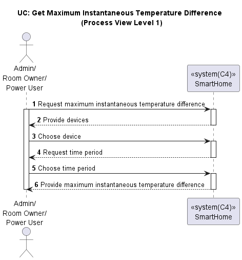
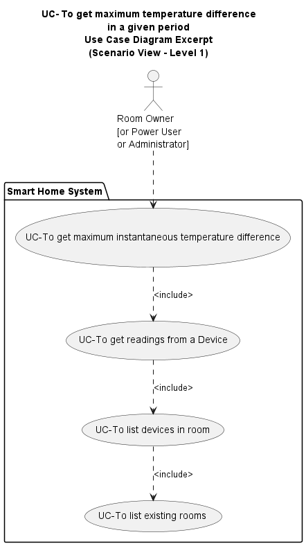
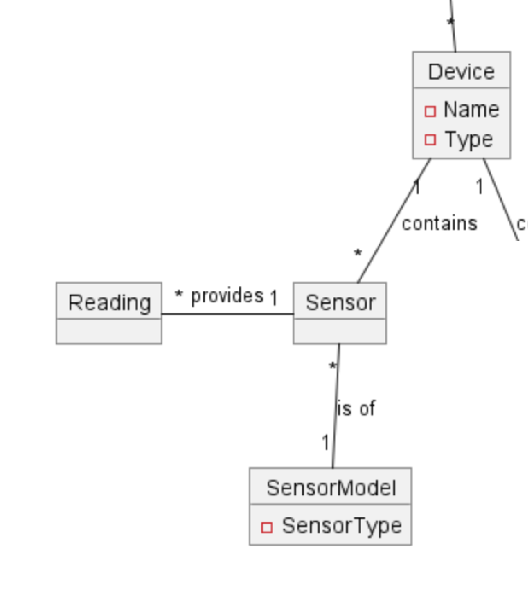
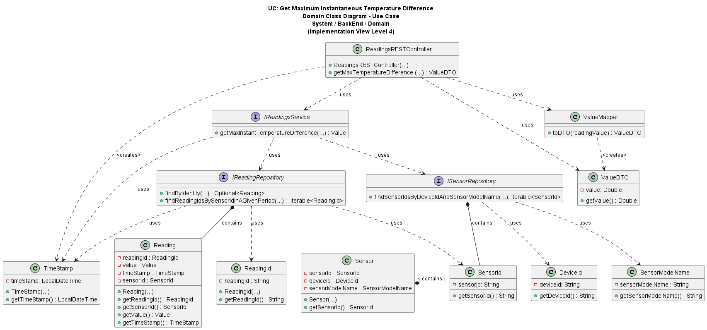
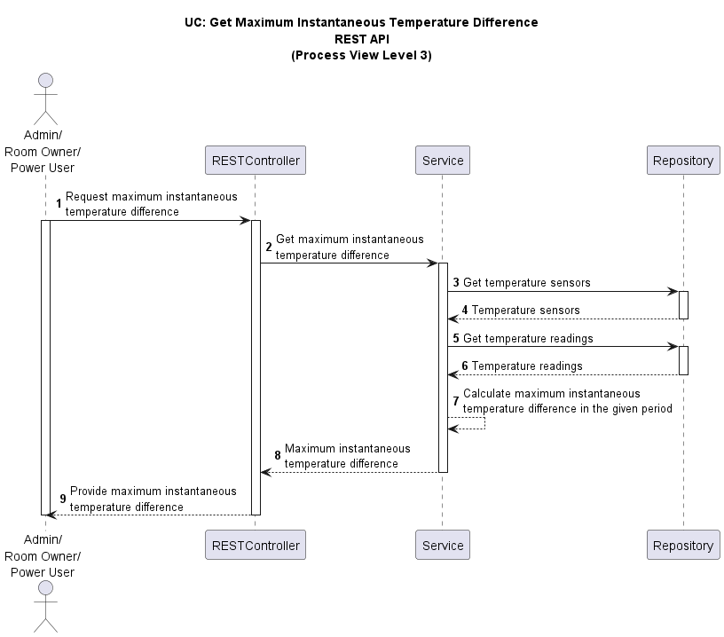
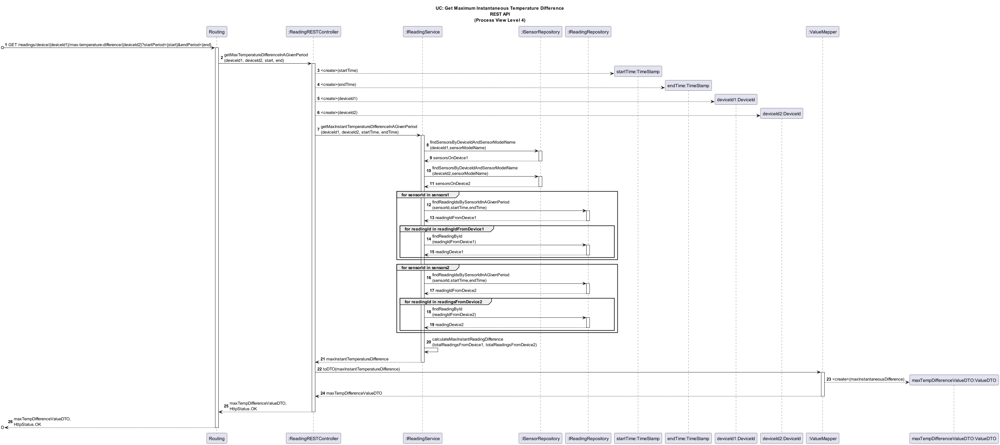

# US034 - Get the maximum instantaneous temperature difference between a device in the room and the outside, in a given period.

### Table of Contents

1. [Requirements](#1-requirements)

- [Dependency on Other Use Cases](#dependency-on-other-use-cases)

2. [Analysis](#2-analysis)

- [Relevant Domain Model](#relevant-domain-model-excerpt)

3. [Design](#3-design)

- [Class Diagram](#class-diagram)
- [Sequence Diagram](#sequence-diagram)
- [Applied Design Patterns and Principles](#applied-design-patterns-and-principles)

4. [Tests](#4-tests)

- [Acceptance Tests](#acceptance-tests)
- [Unit Tests](#unit-tests)
- [Integration Tests](#integration-tests)

5. [Implementation](#5-implementation)
6. [Conclusion](#6-conclusion)

## 1. Requirements

_As a Room Owner [or Power User, or Administrator], I want to get the maximum instantaneous temperature difference
between a device in the room and the outside, in a given period._

Requirements for this user story are as follows:

- The house must have a device that measures the temperature inside the room and another device that measures the
  temperature outside of the house.
- The devices must have sensors that measure the temperature.
- The sensors must have readings of the temperature in the specified period.
- The period for the measurements must be valid.
    - The start date must be before the end date.
    - The end date must be before the current date.
- Need to exist a delta time to consider if a reading can be compared with other readings.
- The delta should not be given by Room Owner [or Power User, or Administrator] but should be available to be changed.

- The user story can be broken down into the following tasks:



### Dependency on existing use cases and system components

- **UC: Get Rooms** - The user needs to select a room to close the blind roller in. This User Story depends on the
  existence of rooms and the ability to retrieve the rooms.

- **UC: Get Devices in Room** - The user needs to select a device in the room to close the blind roller. This User Story
  depends on the existence of devices in the room and the ability to retrieve the devices in the room.

- **UC: Get Readings from a Device** - The user needs to specify a period in which to get all the readings for. This
  User Story depends on the existence of readings from specific devices and the ability to retrieve and present this
  data in a list.

- **System Component: Sensor of Temperature** - The system needs to interact with a Temperature Sensor to access all its
  readings in a given period This User Story depends on the existence of the sensor of temperature and the ability to
  retrieve the temperature readings.

#### Relevant Use Case dependencies diagram:



# 2. Analysis

## Relevant Domain Model Excerpt

Below is the relevant domain model excerpt for this user story, showing the relationship between the Device and Reading
classes:



# 3. Design

The Reading class is an entity that represents a reading of a device. It has the following attributes:

- `readingId` - The unique identifier of the reading.
- `readingValue` - The value of a sensor reading.
- `timestamp` - The timestamp of the reading.
- `deviceId` - The device that the reading belongs to.

The `IReadingService` provides methods to interact with the database and calculate the maximum instantaneous temperature

- `maxInstantTemperatureDifference` - Calculates the maximum instantaneous temperature difference between a device in
  the
  room and the outside.

The `ISensorRepository` provides methods to interact with the database to save and retrieve sensors:

- `getByDeviceIdentityAndSensorModel` - Retrieves sensors by device identity and sensor model.

## Class Diagram

Below is the class diagram for this user story:



## Sequence Diagram

Level 3 of the process view for this user story is shown below:



Level 4 of the process view for this user story is shown below:



## Applied Design Patterns and Principles

* **Controller** - The `ReadingRESTController` class is a controller that handles the incoming HTTP requests to get the
  maximum instantaneous temperature difference between a device in the room and the outside in a given period.


* **Information Expert** - The `ReadingRESTController` instructs `Service` classes
  to perform certain actions with `Domain` objects. The controller is an Information Expert about which Service can
  perform certain actions. The `Service` classes are Information Experts about the `Domain` objects they manipulate.


* **Service** - The `ReadingService` class is responsible for performing the business logic of calculating the maximum
  instantaneous temperature difference between a device in the room and the outside in a given period, using
  the `Repository` classes to fetch the required data.


* **Repository** - The `Repository` classes are responsible for interacting with the database to save and retrieve
  `Domain` objects using the `DataModel` objects.


* **Creator** - `Mapper` classes are responsible for creating `Domain` ValueObjects from `DTO` objects and vice versa.


* **Low Coupling** - The `ReadingRESTController` class has low coupling with the `Domain` classes, as it only interacts
  with them through `Services`. The `Service` classes have low coupling with the `Repository` classes as they only
  interact with them via interfaces and do not depend on the concrete implementations.


* **High Cohesion** - The `Repository` classes have high cohesion as they only interact with the database and do not
  perform any other actions. The `Service` classes have high cohesion as they only perform actions related to the
  business logic of the application, in this case, calculating the maximum instantaneous temperature difference between
  a device in the room and the outside in a given period. The `Controller` classes have high cohesion as they only
  handle user requests.


* **Single Responsibility Principle (SRP)** - The `Service` classes have a single responsibility, which is to perform
  actions related to the business logic of the application. The `Repository` classes have a single responsibility, which
  is to interact with the database. The `Controller` classes have a single responsibility, which is to handle user
  requests.


* **Aggregate Root** - `Reading` is an aggregate root contains the `ReadingId`, `ReadingValue`, and `TimeStamp`
  value objects and the `SensorId` entity.


* **Value Object** - The `TimeStamp`, `ReadingValue` and `ReadingId` are ValueObjects of the `Reading` entity.


* **DTO** - `ValueDTO` is a DataTransfferObject that holds the information to be returned to the user.

* **Dependency Injection** - The `ReadingRESTController` class uses constructor injection to inject an instance of the
  `ReadingService` class. The `ReadingService` class uses constructor injection to inject an instance of the
  `IReadingRepository` and `ISensorRepository` and interfaces.

# 4. Tests

## Acceptance Tests

**Scenario 1:**

- **Given** the user is a Room Owner, Power User, or Administrator.
- **When** the user requests the maximum instantaneous temperature difference between a device in the room and the
  outside.
- **And** the user specifies a valid period for the measurements.
- **And** there are measurements in the specified period.
- **Then** the system should give the maximum instantaneous temperature difference between a device in the room and
  the outside.

**Scenario 2:**

- **Given** the user is a Room Owner, Power User, or Administrator.
- **When** the user requests the maximum instantaneous temperature difference between a device in the room and the
  outside.
- **And** the user specifies a valid period for the measurements.
- **If** there are no measurements in the specified period.
- **Then** the system should not give any values.

**Scenario 3:**

- **Given** the user is a Room Owner, Power User, or Administrator.
- **When** the user requests the maximum instantaneous temperature difference between a device in the room and the
  outside.
- **And** he user gives an invalid period for the measurements
    - **As** Start date after end date.
    - **As** End date after current date.
    - **As** Invalid date format.
    - **As** Start date and end date are the same.
- **Then** the system should not give any values.

**Scenario 4:**

- **Given** the user is a Room Owner, Power User, or Administrator.
- **When** the user requests the maximum instantaneous temperature difference between a device in the room and the
  outside.
- **And** the user specifies a valid period for the measurements.
- **And** there are measurements in the specified period.
- **And** the user specifies a invalid device.
  - **As** The device does not exist in the database.
    - **As** The device does not have sensor of type temperature.
- **Then** the system should not give any values.

## Unit tests

Below are the unit tests for the readings service class to calculate the maximum instantaneous temperature difference:

| Test Case                                                                                                                                 | Expected Outcome                                                                                            |
|-------------------------------------------------------------------------------------------------------------------------------------------|-------------------------------------------------------------------------------------------------------------|
| Calculate the maximum instantaneous temperature difference between two values when the readings are equal, positive, and negative values. | The Reading Service should calculate the maximum instantaneous temperature difference between two readings. |
| Calculate the maximum instantaneous temperature difference when there are no readings for the devices in the specified period.            | The Reading Service should not return any values.                                                           |
| Calculate the maximum instantaneous temperature difference when the start date is after the end date, or in the future or equals          | The Reading Service should not return any values.                                                           |
| Calculate the maximum instantaneous temperature difference when the device does not exist or does not have a sensor of type temperature.  | The Reading Service should not return any values.                                                           |
| Calculate the maximum instantaneous temperature difference when the device does not have any readings.                                    | The Reading Service should not return any values.                                                           |

## Integration Tests

Integration tests will ensure that the `ReadingService` class works seamlessly with the `ReadingRepository` and
`SensorRepository` classes to calculate the maximum instantaneous temperature difference. This tests should be
implemented
at controller level.

| Scenario                                                                                                                                                        | Test Case                                                                                                                    | Expected Outcome                                                                                   |
|-----------------------------------------------------------------------------------------------------------------------------------------------------------------|------------------------------------------------------------------------------------------------------------------------------|----------------------------------------------------------------------------------------------------|
| **Scenario 1: Get the maximum instantaneous temperature difference between a device in the room and the outside, in a given period with valid data**            | Test when there is one reading in each device in the specified period. (equals/different positive/negative values)           | The system should return the maximum instantaneous temperature difference between the two devices. |
|                                                                                                                                                                 | Test when there is more than one reading in each device in the specified period. (equals/different positive/negative values) | The system should return the maximum instantaneous temperature difference between the two devices. |
| **Scenario 2: Get the maximum instantaneous temperature difference between a device in the room and the outside, in a given period when there is no data**      | Test when there are no readings in the specified period.                                                                     | The system should not return any values.                                                           |
| **Scenario 3: Get the maximum instantaneous temperature difference between a device in the room and the outside, in a given period when the period is invalid** | Test when the start date is after the end date.                                                                              | The system should not return any values.                                                           |
|                                                                                                                                                                 | Test when the end date is after current date.                                                                                | The system should not return any values.                                                           |
|                                                                                                                                                                 | Test when is with an invalid date format.                                                                                    | The system should not return any values.                                                           |
|                                                                                                                                                                 | Test when the start date and end date are the same.                                                                          | The system should not return any values.                                                           |
| **Scenario 4: Get the maximum instantaneous temperature difference between a device in the room and the outside, in a given period with invalid device data**   | Test when the device does not exist.                                                                                         | The system should not return any values.                                                           |
|                                                                                                                                                                 | Test when the device does not have sensor of type temperature.                                                               | The system should not return any values.                                                           |
|                                                                                                                                                                 | Test when the device does not have any readings.                                                                             | The system should not return any values.                                                           |

# 5. Implementation

The `ReadingRESTController` class is responsible for handling incoming requests to
get the maximum instantaneous temperature difference between a device in the room and the outside in a given period.

```java

@RestController
@RequestMapping("/readings")
public class ReadingRESTController {

  private final IReadingService readingService;
  private final ReadingMapper readingMapper;
  private final ValueMapper valueMapper;

  public ReadingRESTController(IReadingService readingService, ReadingMapper readingMapper, ValueMapper valueMapper) {
    // Implementation of the constructor

  }

  @GetMapping("/device/{deviceId}/max-temperature-difference/{deviceId2}")
  public ResponseEntity<ValueDTO> getMaxTemperatureDifference(@PathVariable("deviceId") String deviceId,
                                                              @PathVariable("deviceId2") String deviceId2,
                                                              @RequestParam("startPeriod") String startPeriod, @RequestParam("endPeriod") String endPeriod) {
    // Implementation of the method
  }

  @GetMapping("/{id}")
  public ResponseEntity<ReadingDTO> getReading(@PathVariable("id") String id) {
    // Implementation of the method
  }
}
```

The controller delegates the request to an implementation of the `IReadingService` interface, which contains the
business
logic for calculating the maximum instantaneous temperature difference between the two devices in the specified period.

```java
public interface IReadingService {

  Value getMaxInstantTemperatureDifference(DeviceId deviceId1, DeviceId deviceId2, TimeStamp startTime,
                                           TimeStamp endTime);
}
```

The service layer interacts with the repositories to fetch the required data and performs the necessary operations to
retrieve the measurements for the specified device within the given period.

The `IReadingRepository` interface provides the necessary methods to interact with the data source to retrieve readings.

```java
public interface IReadingRepository extends Repository<ReadingId, Reading> {

  Iterable<ReadingId> findReadingIdsBySensorIdInAGivenPeriod(SensorId sensorId, TimeStamp start, TimeStamp end);

}
```

The 'IReadingRepositorySpringData' class that extends the 'JpaRepository' class is responsible for interacting with the
database to get the readings.

```java

public interface ISensorRepositorySpringData extends JpaRepository<SensorDataModel, String> {

  @Query("SELECT r.readingId FROM ReadingDataModel r WHERE r.sensorId = :sensorId AND r.timeStamp BETWEEN :start " +
          "AND " + ":end")
  List<String> findIdsBySensorIdAndTimeStampBetween(@Param("sensorId") String sensorId,
                                                    @Param("start") LocalDateTime start,
                                                    @Param("end") LocalDateTime end);
}

```

The `ISensorRepository` interface provides the necessary method to retrieve sensors by device identity and sensor model.

```java
public interface ISensorRepository extends Repository<SensorId, Sensor> {

  // Rest of the methods

  Iterable<Sensor> getByDeviceIdentityAndSensorModel(DeviceId deviceId, SensorModelName sensorModelName);
}
```

The 'ISensorRepositorySpringData' class that extends the 'JpaRepository' class is responsible for interacting with the
database to get the sensors.

```java
public interface ISensorRepositorySpringData extends JpaRepository<SensorDataModel, String> {

  @Query("SELECT s FROM SensorDataModel s WHERE s.deviceId = :deviceId AND s.sensorModelName = :sensorModelName")
  List<SensorDataModel> findByDeviceIdAndSensorModelName(@Param("deviceId") String deviceId, @Param("sensorModelName") String sensorModelName);

}
```

The `Reading` class represents a reading of a device and contains the necessary attributes to store the id, value,
timestamp, and sensor ID associated with the reading.

```java
public class Reading implements AggregateRoot<ReadingId> {
  // Attributes

  protected Reading(ReadingValue value, SensorId sensorId, TimeStamp timeStamp) {
    // Implementation of the constructor
  }

  protected Reading(ReadingId readingId, ReadingValue value, SensorId sensorId, TimeStamp timeStamp) {
    // Implementation of the constructor
  }

  public ReadingId getIdentity() {
    // Implementation of the method
  }

  public ReadingValue getValue() {
    // Implementation of the method
  }

  public SensorId getSensorId() {
    // Implementation of the method
  }

  public TimeStamp getTimeStamp() {
    // Implementation of the method
  }
}
```

# 6. Conclusion

In this user story, we've introduced functionality to determine the maximum instantaneous temperature difference between
a device located in a specific room and the outdoor temperature within a defined timeframe. Users can specify the
desired period for the readings and the system will retrieve the maximum temperature difference observed between the two
devices. Additionally, the system validates the specified period, ensuring that the start date and end date are in
chronological order (with the start date and time preceding the end date), and verifies that the end date occurs before
the current date to maintain data integrity. Furthermore, the system checks that the readings fall within the specified
system delta time.


