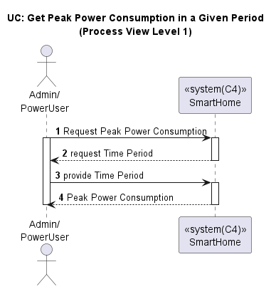
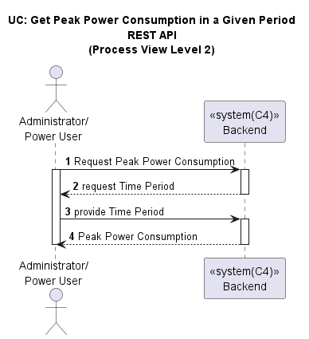
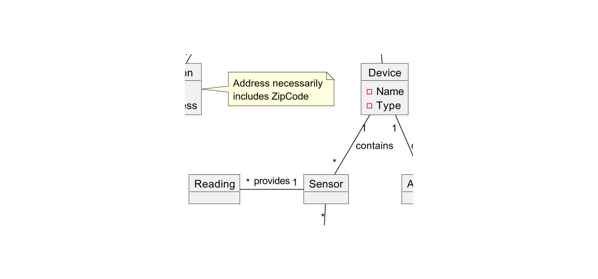
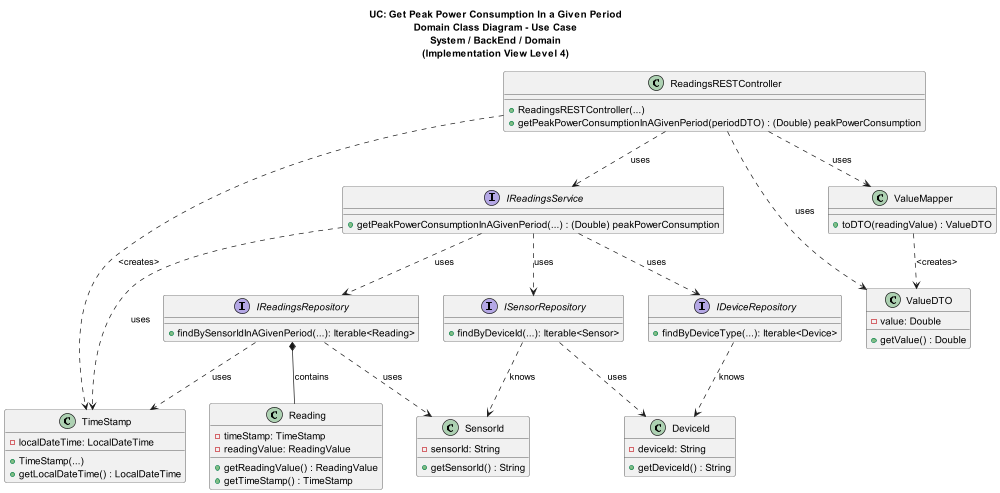
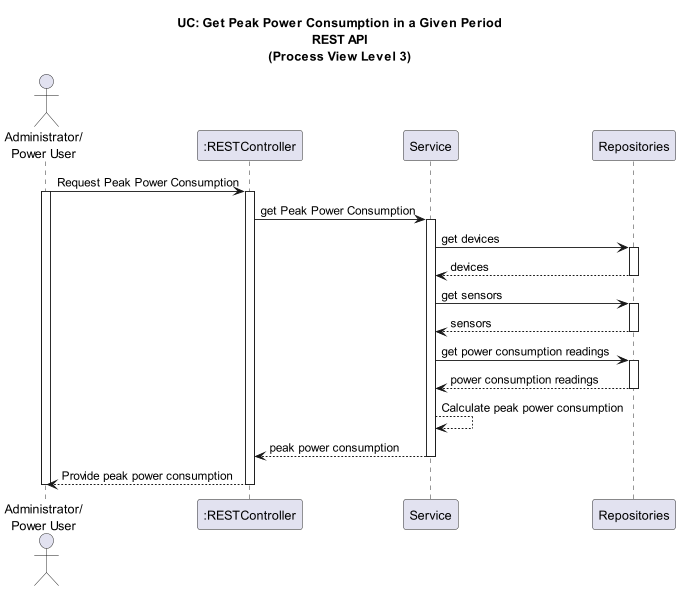
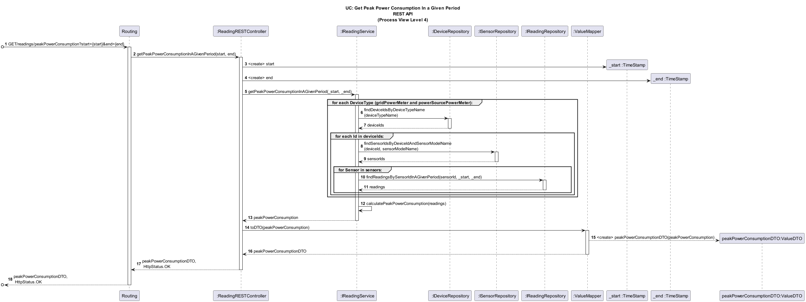

# US036 - Get the Peak Power Consumption of the House in a Given Period

## Table of Contents

1. [Requirements](#1-requirements)
    - [Dependency on existing use cases and system components](#dependency-on-existing-use-cases-and-system-components)
2. [Analysis](#2-analysis)
    - [Relevant Domain Model](#relevant-domain-model-excerpt)
3. [Design](#3-design)
    - [Class Diagram](#class-diagram)
    - [Sequence Diagram](#sequence-diagram)
    - [Applied Design Patterns and Principles](#applied-design-patterns-and-principles)
4. [Tests](#4-tests)
    - [Acceptance Tests](#acceptance-tests)
    - [Unit Tests](#unit-tests)
    - [Integration Tests](#integration-tests)
5. [Implementation](#5-implementation)
6. [Conclusion](#6-conclusion)

## 1. Requirements

As a Power User or Administrator, I want to get the peak power consumption of the house in a given period. The house has
a device acting as the grid power meter and may have several devices metering power sources (e.g. solar panel array).

Requirements for this user story are as follows:

- The house must have a device that measures the power consumption from the grid (DeviceType `gridPowerMeter`).
- The house may have several devices that measure power generation from power sources (DeviceType `powerSourcePowerMeter`).
- The user must be able to specify a period for the measurements.
- The user must be able to get the peak power consumption of the house in the specified period in Watts.
- The period for the measurements must be valid:
    - The start date must be before the end date.
    - The end date must be before the current date.

The user story can be broken down into the following tasks:

1. The user requests the peak power consumption of the house
2. The system allows the user to specify a period for the measurements
3. Get a list of all devices in the house identified as DeviceType `gridPowerMeter` and `powerSourceMeter`.
4. Get the readings from those devices made by `SensorOfPowerConsumption` Sensors, in the specified period
5. Calculate the peak power consumption of the house in the specified period, considering both the grid power meter and power source meters.
6. This calculation considers power consumption and power generation, subtracting the power generation from power
   consumption.

### Dependency on existing use cases and system components

The successful implementation of this user story didn't depend on other user stories.

- **System Component: Sensor of Power Consumption** -
  The system needs to identify each power consumption sensor associated with a Power Meter Device in order to retrieve
  all its power consumption readings. This User Story depends on the existence of a power consumption sensor and the
  ability to retrieve its readings.

## 2. Analysis

To get the peak power consumption of the house in a given period:

- The system must ensure the period for the measurements to ensure that the start date and the end date are valid.
- The system must retrieve the readings from the devices that measure power consumption and generation.
- The system must calculate the peak power consumption by considering both the grid power meter and power source meters.

#### Key entities involved:

- Device: Represents a device in the house associated with power consumption and generation.
- DeviceType: Represents the type of device associated with the grid power meter and power source meters.
- Sensor: Represents a sensor that measures a specific value associated with power consumption.
- Reading: Represents a reading of a sensor associated with the sensor of power consumption.




### Relevant Domain Model Excerpt

Below is the relevant domain model excerpt for this user story, showing the relationship between the `Device`, 
`DeviceType` and `Reading` classes:



## 3. Design

The `Reading` class is an entity that represents a reading of a device. It has the following attributes:

- `readingId` - The unique identifier of the reading.
- `readingValue` - The value of a sensor reading (in this case, power).
- `timestamp` - The timestamp of the reading.
- `deviceId` - The device that the reading belongs to.

The `IReadingService` provides methods to interact with the database and calculate the peak power consumption:

- `getPeakPowerConsumption` - Calculates the peak power consumption of the house in the given period.

The `IDeviceService` provides methods to interact with the database to retrieve devices:

- `getDevicesByType` - Retrieves devices by their type (e.g. grid power meter, solar panel meter).

### Class Diagram

Below is the class diagram for this user story:


### Sequence Diagram

According to C4 and 4+1 architectural view models, below are the level 3 and 4 process views for this user story:



### Applied Design Patterns and Principles

- **Controller**: The `ReadingsRESTController` class handles the user's request to get the peak power consumption of the house.
- **Information Expert**: The `ReadingsRESTController` delegates to `Service` classes that implement
  the `IReadingService` interface and perform actions with `Domain` objects. The `Service` classes are experts about
  the `Domain` objects they manipulate.
- **Creator**: `Mapper` classes create `Domain` ValueObjects from `DTO` objects and vice versa. The `ReadingFactory` creates `Reading` objects. 
- **Low Coupling**: The `ReadingsRESTController` interacts with `Domain` classes through `Services`, and `Service` classes interact with `Repository` classes via interfaces. This loose coupling allows for easier maintenance and testing.
- **High Cohesion**: `Repository` classes interact with the database, `Service` classes handle business logic, and `Controller` classes handle user requests.
- **Single Responsibility Principle (SRP)**: `Service` classes manage business logic, `Repository` classes manage database interactions, and `Controller` classes handle user requests.
- **Repository**: `Repository` classes interact with the database to save and retrieve `Domain` objects using `DataModel` objects. The `ReadingRepository` and `DeviceRepository` classes implement the `IReadingRepository` and `IDeviceRepository` interfaces, respectively.
- **Aggregate Root**: `Reading` is an aggregate root that contains the `ReadingId`, `ReadingValue`, and `TimeStamp` value objects. It is the main entity that is saved and retrieved from the database.
- **Value Object**: `TimeStamp`, `ReadingValue`, and `ReadingId` are ValueObjects of the `Reading` entity. They are immutable and can be shared between entities.
- **DTO**: `PeriodDTO` holds the start and end dates of the period, and `DeviceDTO` holds the `DeviceId` of the `Device` objects to get the Readings from. 

## 4. Tests

### Acceptance Tests

**Scenario 1:**

- **Given** the user is a Power User or Administrator.
- **When** the user requests the peak power consumption of the house in a given period.
- **And** the user specifies a valid period for the measurements.
- **And** there are measurements in the specified period.
- **Then** the system should give the peak power consumption of the house.

**Scenario 2:**

- **Given** the user is a Power User or Administrator.
- **When** the user requests the peak power consumption of the house in a given period.
- **And** the user specifies a valid period for the measurements.
- **If** there are no measurements in the specified period.
- **Then** the system should not give any values.

**Scenario 3:**

- **Given** the user is a Power User or Administrator.
- **When** the user requests the peak power consumption of the house in a given period.
- **And** the user specifies an invalid period for the measurements (e.g., start date after end date, end date after current date, invalid date format, start date and end date are the same).
- **Then** the system should not give any values.

**Scenario 4:**

- **Given** the user is a Power User or Administrator.
- **When** the user requests the peak power consumption of the house in a given period.
- **And** the user specifies a valid period for the measurements.
- **And** there is no device acting as the grid power meter.
- **Then** the system should not give any values.

### Unit Tests

Below are the unit tests for the readings management:

| Test Case                          | Expected Outcome                                                                           |
|------------------------------------|--------------------------------------------------------------------------------------------|
| Test retrieving value from reading | The system should return the value of the specified reading, in order to compare readings. |

### Integration Tests

| Scenario                                                                                                                                                       | Test Case                                                                                                                    | Expected Outcome                                                                                   |
|----------------------------------------------------------------------------------------------------------------------------------------------------------------|------------------------------------------------------------------------------------------------------------------------------|----------------------------------------------------------------------------------------------------|
| **Scenario 1: Get the peak power consumption of the house in a given period with valid data**                                                                  | Test when there is one reading in the specified period. (equals/different positive/negative values)                          | The system should return the peak power consumption of the house in the specified period.          |
|                                                                                                                                                                | Test when there is more than one reading in the specified period. (equals/different positive/negative values)                | The system should return the peak power consumption of the house in the specified period.          |
| **Scenario 2: Get the peak power consumption of the house in a given period when there is no data**                                                            | Test when there are no readings in the specified period.                                                                     | The system should not return any values.                                                           |
| **Scenario 3: Get the peak power consumption of the house in a given period when the period is invalid**                                                       | Test when the start date is after the end date.                                                                              | The system should not return any values.                                                           |
|                                                                                                                                                                | Test when the end date is after current date.                                                                                | The system should not return any values.                                                           |
|                                                                                                                                                                | Test when is with an invalid date format.                                                                                    | The system should not return any values.                                                           |
|                                                                                                                                                                | Test when the start date and end date are the same.                                                                          | The system should not return any values.                                                           |
| **Scenario 4: Get the peak power consumption of the house in a given period without a grid power meter**                                                       | Test when the grid power meter device does not exist.                                                                        | The system should not return any values.                                                           |


For more information on the tests for this user story, please refer to the
[ReadingRESTControllerTest](https://github.com/Departamento-de-Engenharia-Informatica/2023-2024-switch-dev-project-assignment-switch-project-2023-2024-grupo6/blob/main/src/test/java/smarthome/controller/ReadingRESTControllerTest.java)
and
[ReadingServiceImplTest](https://github.com/Departamento-de-Engenharia-Informatica/2023-2024-switch-dev-project-assignment-switch-project-2023-2024-grupo6/blob/main/src/test/java/smarthome/service/impl/ReadingServiceImplTest.java)
classes.

## 5. Implementation

The `ReadingsRESTController` class is responsible for handling incoming requests to get the peak power consumption of the house in a given period.

```java

/**
 * REST Controller for managing readings.
 */
@RestController
@RequestMapping("/readings")
public class ReadingRESTController {

    // Attributes
    
    public ReadingRESTController(IReadingService readingService, ReadingMapper readingMapper, ValueMapper valueMapper) {

        // Method implementation
    }

    @GetMapping(value="/peakPowerConsumption", produces={"application/hal+json"})
    public ResponseEntity<ValueDTO> getPeakPowerConsumptionInAGivenPeriod(
            @RequestParam("start") String start, @RequestParam("end") String end) {

        // Method implementation
    }
}
```

The controller delegates the request to implementations of the `IReadingService`,dingServiceImpl` class.

```java
/**
 * IReadingService interface for methods related to the Reading entity.
 */
public interface IReadingService {
    

    DecimalValue getPeakPowerConsumptionInAGivenPeriod(TimeStamp start, TimeStamp end);
}
```

The `ReadingServiceImpl` class implements the `IReadingService` interface and contains the business logic to calculate the peak power consumption of the house in the specified period.

```java

public class ReadingServiceImpl implements IReadingService {


    // Attributes

    public ReadingServiceImpl(IReadingRepository readingRepository, ISensorRepository sensorRepository,
                              IDeviceRepository deviceRepository, String filePathName, String filePathModels) throws ConfigurationException {
        
        // Method implementation
        
    }

    public DecimalValue getPeakPowerConsumptionInAGivenPeriod(TimeStamp start, TimeStamp end) {
        
        // Method implementation
        
    }

    private Double calculatePeakPowerConsumption(Iterable<SensorId> sensorIdsGrid, Iterable<SensorId>sensorIdsPowerSource, TimeStamp start, TimeStamp end){
        
        // Method implementation
        
    }

    public List<TimeStamp[]> splitTimePeriod(TimeStamp start, TimeStamp end) {
        
        // Method implementation
        
    }

    private HashMap<SensorId,Double> getAveragePowerConsumptionInPeriodBySensorId(TimeStamp start, TimeStamp end, Iterable<SensorId> sensorIdsGrid, Iterable<SensorId> sensorIdsPowerSource){

            // Method implementation
        
    }

    private Double sumPowerConsumptionDoubles(HashMap<SensorId,Double> powerConsumptionReadingsBySensorId){
        
        // Method implementation
            
    }

    private Double calculateAveragePowerConsumption(Iterable<Reading> readings){
        
        // Method implementation
            
    }

    
}


```


The service layer interacts with the repositories to fetch the required data and performs the necessary operations to retrieve the measurements for the specified devices within the given period.

The `DeviceRepositorySpringData` class implements the `IDeviceRepository` interface and provides the necessary methods to interact with the database to retrieve devices.

```java

@Repository
public class DeviceRepositorySpringDataImpl implements IDeviceRepository {

    // Attributes
    
    public DeviceRepositorySpringDataImpl(DeviceDataModelMapper deviceDataModelMapper,
                                          IDeviceRepositorySpringData deviceSpringDataRepository) {
        
        // Method implementation
        
    }
    
    public Iterable<Device> getByDeviceTypeName(DeviceTypeName deviceType) {
        
    // Method implementation
        
    }
}

```

The `SensorRepositorySpringDataImpl` class implements the `ISensorRepository` interface and provides the necessary methods to interact with the database to retrieve sensors.
It has a dependency on the `ISensorRepositorySpringData` interface, which provides the necessary methods to interact with the database using Spring Data JPA (extends JpaRepository).

```java
/**
 * This class provides a concrete implementation of the ISensorRepository interface using Spring Data JPA for
 * database operations.
 * It uses a SensorDataModelMapper to map between Sensor objects and SensorDataModel entities.
 */
@Repository
public class SensorRepositorySpringDataImpl implements ISensorRepository {

    // Attributes

    public SensorRepositorySpringData(SensorDataModelMapper sensorDataModelMapper,
                                      ISensorRepositorySpringData sensorRepoSpringData) {
       
        // Method implementation
        
    }
    
    public Iterable<Sensor> getByDeviceIdentityAndSensorModel(DeviceId deviceId, SensorModelName sensorModelName) {
       
        // Method implementation
        
    }

}

```
The ` ReadingRepositorySpringDataImpl` class implements the `IReadingRepository` interface and provides the necessary methods to interact with the database to retrieve readings.
The class has a dependency on the `IReadingRepositorySpringData` interface, which provides the necessary methods to interact with the database using Spring Data JPA (extends JpaRepository).
```java 

@Repository
public class ReadingRepositorySpringDataImpl implements IReadingRepository {
    
    // Attributes
    
    public ReadingRepositorySpringDataImpl(ReadingDataModelMapper readingModelMapper, IReadingRepositorySpringData readingSpringDataRepository) {

        // Method implementation
        
    }
    
    public Iterable<Reading> findBySensorIdInAGivenPeriod(SensorId sensorId, TimeStamp start, TimeStamp end) {
        
        // Method implementation
        
    }
    
}
```

The `DeviceRepositorySpringDataImpl` class implements the `IDeviceRepository` interface and provides the necessary methods to interact with the database to retrieve devices.

```java
public class DeviceRepositorySpringDataImpl implements IDeviceRepository {

    // Attributes
    
    public DeviceRepositorySpringDataImpl(IDeviceRepositorySpringData deviceRepositorySpringData, DeviceDataModelMapper deviceDataModelMapper) {
        
        // Method implementation
        
    }
    
    public Iterable<DeviceId> findDeviceIdsByDeviceTypeName(DeviceTypeName deviceTypeName) {
       
            // Method implementation
        
    }
}
```

The `Reading` class represents a reading of a device and contains the necessary attributes to store the id, value, timestamp, and device ID associated with the reading.

```java
public class Reading implements AggregateRoot<ReadingId> {
    
    // Attributes

    protected Reading(ReadingValue value, DeviceId deviceId, TimeStamp timeStamp) {
        
        // Method implementation
        
    }

    protected Reading(ReadingId readingId, ReadingValue value, DeviceId deviceId, TimeStamp timeStamp) {
        
        // Method implementation
        
    }

    public ReadingId getIdentity() {
       
        // Method implementation
        
    }

    public ReadingValue getValue() {
        
        // Method implementation
        
    }

    public DeviceId getDeviceId() {
       
        // Method implementation
        
    }

    public TimeStamp getTimeStamp() {
       
        // Method implementation
        
    }
}
```

For more information on the implementation of this user story, please refer to the
[ReadingRESTController](https://github.com/Departamento-de-Engenharia-Informatica/2023-2024-switch-dev-project-assignment-switch-project-2023-2024-grupo6/blob/main/src/main/java/smarthome/controller/ReadingRESTController.java), 
[IReadingService](https://github.com/Departamento-de-Engenharia-Informatica/2023-2024-switch-dev-project-assignment-switch-project-2023-2024-grupo6/blob/main/src/main/java/smarthome/service/IReadingService.java), 
[ReadingServiceImpl](https://github.com/Departamento-de-Engenharia-Informatica/2023-2024-switch-dev-project-assignment-switch-project-2023-2024-grupo6/blob/main/src/main/java/smarthome/service/impl/ReadingServiceImpl.java), 
[DeviceRepositorySpringDataImpl](https://github.com/Departamento-de-Engenharia-Informatica/2023-2024-switch-dev-project-assignment-switch-project-2023-2024-grupo6/blob/main/src/main/java/smarthome/persistence/spring/impl/DeviceRepositorySpringDataImpl.java), 
[SensorRepositorySpringDataImpl](https://github.com/Departamento-de-Engenharia-Informatica/2023-2024-switch-dev-project-assignment-switch-project-2023-2024-grupo6/blob/main/src/main/java/smarthome/persistence/spring/impl/SensorRepositorySpringDataImpl.java), 
[ReadingRepositorySpringDataImpl](https://github.com/Departamento-de-Engenharia-Informatica/2023-2024-switch-dev-project-assignment-switch-project-2023-2024-grupo6/blob/main/src/main/java/smarthome/persistence/spring/impl/ReadingRepositorySpringDataImpl.java), 
[DeviceRepositorySpringDataImpl](https://github.com/Departamento-de-Engenharia-Informatica/2023-2024-switch-dev-project-assignment-switch-project-2023-2024-grupo6/blob/main/src/main/java/smarthome/persistence/spring/impl/DeviceRepositorySpringDataImpl.java) 
and
[Reading](https://github.com/Departamento-de-Engenharia-Informatica/2023-2024-switch-dev-project-assignment-switch-project-2023-2024-grupo6/blob/main/src/main/java/smarthome/domain/reading/Reading.java)
classes.


## 6. Conclusion

The implementation of US036 marks a significant step forward in energy management for households. By enabling users to determine peak power consumption over a specified period, the system provides essential insights that can lead to more efficient energy usage and cost savings. The modular design, extensive validation, and comprehensive testing ensure a reliable and robust solution that meets user needs while laying the groundwork for future enhancements. This functionality not only meets current user requirements but also positions the system for continuous improvement and adaptation to emerging energy management trends and technologies.