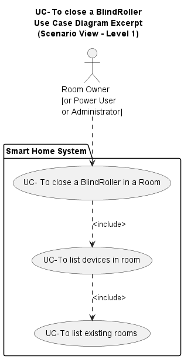
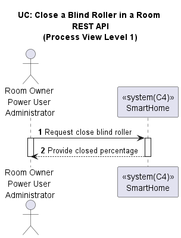
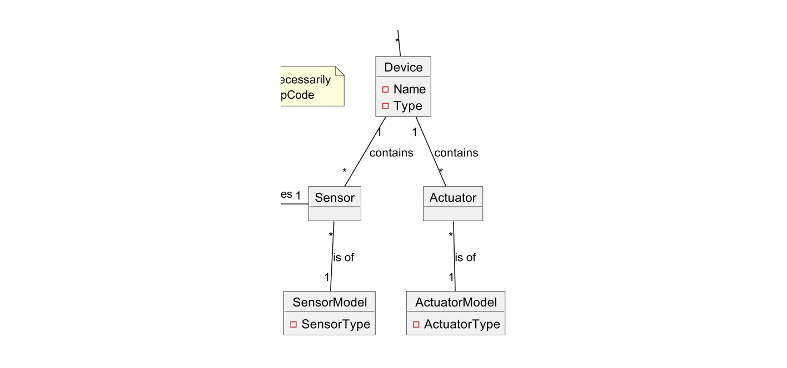
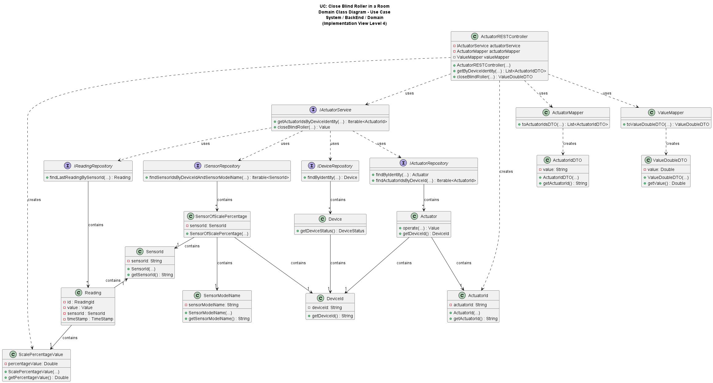
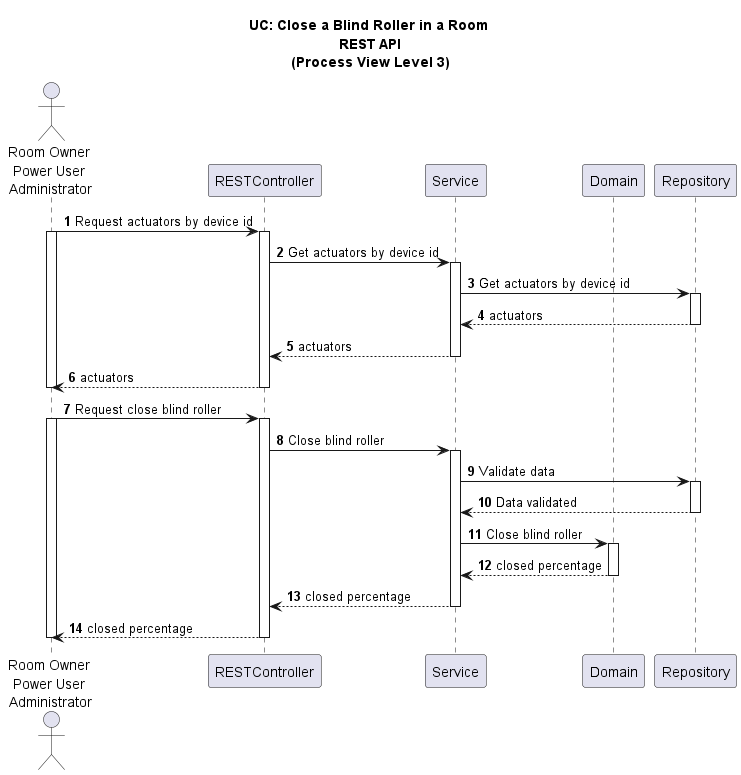
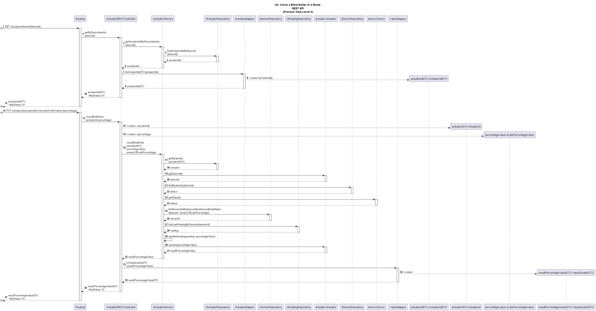

# US037 - Close a Blind Roller in a Room

### Table of Contents

1. [Requirements](#1-requirements)
    - [Dependency on existing use cases and system components](#dependency-on-existing-use-cases-and-system-components)
2. [Analysis](#2-analysis)
    - [Relevant domain model excerpt](#relevant-domain-model-excerpt)
3. [Design](#3-design)
    - [Class diagram](#class-diagram)
    - [Sequence diagram](#sequence-diagram)
    - [Applied design patterns and principles](#applied-design-patterns-and-principles)
4. [Tests](#4-tests)
    - [Acceptance Tests](#acceptance-tests)
    - [Unit tests](#unit-tests)
    - [Integration tests](#integration-tests)
5. [Implementation](#5-implementation)
6. [Conclusion](#6-conclusion)

## 1. Requirements

_As a Room Owner [or Power User, or Administrator], I want to close a blind roller that is in a room._

Requirements for closing a blind roller:

- The user must select the actuator that closes the blind roller.
- The user must specify the percentage to which the blind roller should be closed (0% fully closed, 100% fully open).
- The system must validate that the actuator can be operated.
- The system must validate that the closing percentage goal is viable.
- The system must close the blind roller to the specified percentage.
- The system must provide feedback to the user about the success or failure of the operation.

### Dependency on existing use cases and system components

- **UC: Get Rooms** -
  The user needs to select a room to close the blind roller in. This User Story (US037) depends on the existence of
  rooms
  and the ability to retrieve the rooms.


- **UC: Get Devices in Room** -
  The user needs to select a device in the room to close the blind roller. This User Story (US037) depends on the
  existence
  of devices in the room and the ability to retrieve the devices in the room.


- **System Component: Actuator of Blind Roller** -
  The system needs to interact with the actuator of the blind roller to close it. This User Story (US037) depends on the
  existence of the actuator of the blind roller and the ability to operate the actuator.


- **System Component: Sensor of Scale Percentage** -
  The system needs to interact with the sensor of the blind roller to get the current position of the blind roller. This
  User Story (US037) depends on the existence of the sensor of the blind roller and the ability to retrieve the current
  position of the blind roller.

#### Relevant Use Case dependencies diagram:



## 2. Analysis

To close a blind roller, the system needs to:

1. Show the user the rooms available in the system so that the user can select a room (uc Get Rooms).
2. Show the user the devices in the selected room so that the user can select the device that closes the blind
   roller (uc Get Devices in Room).
3. Allow the user to select the percentage to which it should be closed (0% fully closed, 100% fully open).
4. Validate that the actuator can be operated, the closing percentage goal is viable, and the closing percentage is
   within a logical range.
5. Close the blind roller to the specified percentage.
6. Confirm that the operation was successful or not.

#### Key entities involved:

- **Sensor** : Associated with the blind roller in the room, to get the current position of the blind roller.
- **Actuator**: Associated with the blind roller in the room, to close the blind roller.
- **Device**: Contains the actuator that closes the blind roller and the sensor that gets the current position of the
  blind roller.




### Relevant Domain Model Excerpt



## 3. Design

### Class Diagram

Below is the class diagram for this user story:



### Sequence Diagram

According to C4 and 4+1 architectural view models, below are the level 3 and 4 process views for the user story.





### Applied Design Patterns and Principles

- **Information Expert** - The `ActuatorOfBlindRoller` is responsible for controlling the closing of the blind roller,
  as it contains the necessary information and methods to execute this functionality.


- **High Cohesion** - Each class focuses on a single responsibility, improving maintainability and readability. For
  example, the `ActuatorOfBlindRoller` class is responsible for closing the blind roller, while the
  `ScalePercentageValue` class is responsible for representing the percentage value of the blind roller.


- **Low Coupling** - The system is designed to minimize dependencies between classes. This is achieved by using
  interfaces and dependency injection, allowing components to be easily replaced or updated without affecting the entire
  system.


- **Repository Pattern** - This pattern is used to manage data access related to actuators and sensors. It abstracts the
  data layer, providing a clear separation between business logic and data access code.


- **Controller** - The `ActuatorRESTController` handles HTTP requests and orchestrates interactions between the frontend
  and backend, ensuring separation of concerns and a clear entry point for requests.


- **Service Layer** - The `ActuatorServiceImpl` class contains the business logic for closing the blind roller. It
  validates the input data, interacts with the actuator and sensor, and returns the result to the controller.


- **Value Object** - The `Value` class is used to represent the percentage value of the blind roller. It encapsulates
  the
  value and provides methods for validation and manipulation.


- **DTO (Data Transfer Object)** - The `ValueDTO` and `ActuatorIdDTO` classes are used to transfer the percentage value
  between the frontend and backend. It provides a standardized format for data exchange and decouples the internal
  representation from the external interface.


- **Dependency Injection** - The `ActuatorRESTController` class uses constructor injection to receive instances of
  services and mappers. This allows for easy testing and decouples the controller from its dependencies.

## 4. Tests

### Acceptance Tests

**User:** Room Owner or Administrator or Power User

- **Scenario 1:** The user wants to close a blind roller with a valid percentage value.
    - **When** the user provides a valid percentage value to close the blind roller.
    - **And** the blind roller is not closed more than the specified percentage value.
    - **Then** the system must be able to close the blind roller to the provided percentage value.
    - **And** the system should confirm the blind roller was successfully closed by returning the updated percentage
      value.


- **Scenario 2:** The user attempts to close a blind roller to a percentage higher than it already is closed.
    - **When** the user provides a valid percentage value to close the blind roller.
    - **And** the blind roller is closed more than the specified percentage value.
    - **Then** the system must return the current percentage value without updating.


- **Scenario 3:** The user attempts to close a blind roller that's already closed.
    - **When** the user provides a valid percentage value to close the blind roller.
    - **And** the blind roller is already closed.
    - **Then** the system must return the current percentage value without updating.


- **Scenario 4:** The user wants to close a blind roller with a negative percentage value.
    - **When** the user provides a negative percentage value to close the blind roller.
    - **Then** the system should deny the request and return an error status code.


- **Scenario 5:** The user wants to close a blind roller with an invalid format percentage value.
    - **When** the user provides a percentage value in an invalid format to close the blind roller.
    - **Then** the system should deny the request and return an error status code.

### Unit Tests

Below are some unit tests, focusing on the validation of input data:

| Test Case                                                                   | Expected Outcome                                                        |
|-----------------------------------------------------------------------------|-------------------------------------------------------------------------|
| Test closing a blind roller to a valid percentage                           | The system should return the confirmed percentage value.                |
| Test closing a blind roller that is already closed                          | The system should confirm the blind roller is closed.                   |
| Test closing a blind roller to a lower percentage than the current position | The system should return the current percentage value without updating. |
| Test attempting to close a blind roller with an invalid closing percentage  | The system should deny the request.                                     |

Below are some unit tests, focusing on the validation of the actuator, device and sensor:

| Test Case                                              | Expected Outcome                                                                  |
|--------------------------------------------------------|-----------------------------------------------------------------------------------|
| Test if the associated device is active                | The system should confirm the device is active.                                   |
| Test if the actuator can be operated                   | The system should confirm the actuator can be operated to close the blind roller. |

### Integration Tests

Integration tests will ensure that the `Close Blind Roller` functionality works seamlessly within the broader system.

| Scenario                                                                          | Test case                                          | Expected Outcome                                         |
|-----------------------------------------------------------------------------------|----------------------------------------------------|----------------------------------------------------------|
| Scenario 1: The user wants to close a blind roller with a valid percentage value. | Test closing a blind roller to a valid percentage  | The system should return the confirmed percentage value. |
| Scenario 2: The user attempts to close a blind roller to a higher percentage.     | Test closing a blind roller that is already closed | The system should confirm the blind roller is closed.    |
| Scenario 3: The user attempts to close a blind roller that's already closed.      | Test closing a blind roller to a lower percentage  | The system should return the current percentage value.   |
| Scenario 4: The user wants to close a blind roller with a negative percentage.    | Test closing a blind roller with an invalid format | The system should deny the request.                      |
| Scenario 5: The user wants to close a blind roller with an invalid format.        | Test closing a blind roller with an invalid format | The system should deny the request.                      |

For more information on the tests for this user story, please refer to the
[ActuatorRESTControllerTest](https://github.com/Departamento-de-Engenharia-Informatica/2023-2024-switch-dev-project-assignment-switch-project-2023-2024-grupo6/blob/main/src/test/java/smarthome/controller/ActuatorRESTControllerTest.java)
and
[ActuatorServiceImplTest](https://github.com/Departamento-de-Engenharia-Informatica/2023-2024-switch-dev-project-assignment-switch-project-2023-2024-grupo6/blob/main/src/test/java/smarthome/service/impl/ActuatorServiceImplTest.java)
classes.

## 5. Implementation

The `ActuatorRESTController` is responsible for handling the HTTP requests to close the blind roller. Here is an
excerpt of the implementation:

```java

@RestController
@RequestMapping("/actuators")
public class ActuatorRESTController {
    // Attributes

    public ActuatorRESTController(IActuatorService actuatorService, ActuatorMapper actuatorMapper, ValueMapper valueMapper) {
        // Constructor
    }

    @GetMapping("/device/{id}")
    public ResponseEntity<List<ActuatorIdDTO>> getByDeviceIdentity(@PathVariable("id") String id) {
        // Method implementation
    }

    @PutMapping("/{actuatorId}/close-blind-roller")
    public ResponseEntity<ValueDTO> closeBlindRoller(@PathVariable("actuatorId") String actuatorId, @RequestParam("percentage") String percentage) {
        // Method implementation
    }
} 
```

The `IActuatorService` interface defines the methods that the `ActuatorService` class must implement. Here is an
excerpt of the implementation:

```java
public interface IActuatorService {
    Iterable<ActuatorId> getActuatorIdsByDeviceIdentity(DeviceId deviceId);

    Value closeBlindRoller(ActuatorId id, Value value);
}
```

The `ActuatorOfBlindRoller` class is responsible for closing the blind roller. Here is an excerpt of the implementation:

```java
public class ActuatorOfBlindRoller implements Actuator {
    // Attributes

    protected ActuatorOfBlindRoller(ActuatorId actuatorId, DeviceId deviceId, ActuatorModelName actuatorModelName) {
        // Constructor
    }

    public Value operate(Value value) {
        // Method implementation
    }
}
```

The `SensorOfScalePercentage` class is responsible for getting the current position of the blind roller. Here is an
excerpt of the implementation:

```java
public class SensorOfScalePercentage implements Sensor {
    // Attributes

    protected SensorOfScalePercentage(SensorId sensorId, DeviceId deviceId, SensorModelName sensorModelName) {
        // Constructor
    }

    @Override
    public Value getValue() {
        // Method implementation
    }
}
```

The `Reading` class is responsible for storing the value of the blind roller. Here is an excerpt of the implementation:

```java
public class Reading implements AggregateRoot<ReadingId> {
    // Attributes

    protected Reading(ReadingId readingId, Value value, SensorId sensorId, TimeStamp timeStamp) {
        // Constructor
    }

    public Value getValue() {
        // Method implementation
    }

    public SensorId getSensorId() {
        // Method implementation
    }

    public TimeStamp getTimeStamp() {
        // Method implementation
    }
}
```

For more information on the implementation of this user story, please refer to the
[ActuatorRESTController](https://github.com/Departamento-de-Engenharia-Informatica/2023-2024-switch-dev-project-assignment-switch-project-2023-2024-grupo6/blob/main/src/main/java/smarthome/controller/ActuatorRESTController.java),
[ActuatorServiceImpl](https://github.com/Departamento-de-Engenharia-Informatica/2023-2024-switch-dev-project-assignment-switch-project-2023-2024-grupo6/blob/main/src/main/java/smarthome/service/impl/ActuatorServiceImpl.java),
[ActuatorOfBlindRoller](https://github.com/Departamento-de-Engenharia-Informatica/2023-2024-switch-dev-project-assignment-switch-project-2023-2024-grupo6/blob/main/src/main/java/smarthome/domain/actuator/ActuatorOfBlindRoller.java),
[SensorOfScalePercentage](https://github.com/Departamento-de-Engenharia-Informatica/2023-2024-switch-dev-project-assignment-switch-project-2023-2024-grupo6/blob/main/src/main/java/smarthome/domain/sensor/SensorOfScalePercentage.java),
and
[Reading](https://github.com/Departamento-de-Engenharia-Informatica/2023-2024-switch-dev-project-assignment-switch-project-2023-2024-grupo6/blob/main/src/main/java/smarthome/domain/reading/Reading.java)
classes.

## 6. Conclusion

In this user story, we have detailed the requirements, analysis, design, testing, and implementation
for the functionality to close a blind roller in a room. This feature allows a user to specify a desired
closing percentage for the blind roller, ensuring that the operation is performed accurately and providing
feedback on the success or failure of the operation. The design is built using well-established design
patterns to ensure high cohesion, low coupling, and clear separation of concerns. Comprehensive tests,
including acceptance, unit, and integration tests, ensure the robustness and reliability of the feature.
This approach ensures that the system is maintainable, extensible, and reliable, providing a solid foundation
for further enhancements and functionalities.

[Back to top](#us037---close-a-blind-roller-in-a-room)