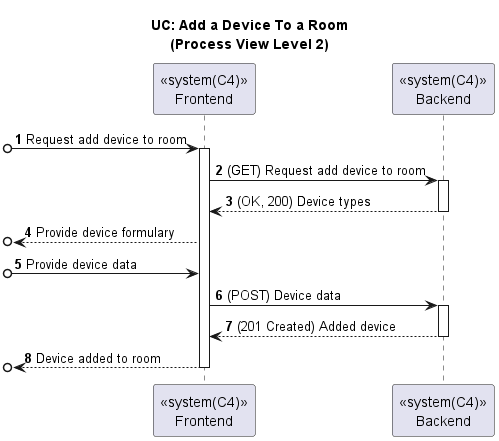

# US040 - Add new device to room (Web App)

### Table of Contents

1. [Requirements](#1-requirements)
    - [Dependency on existing use cases and system components](#dependency-on-existing-use-cases-and-system-components)
2. [Acceptance Criteria](#2-acceptance-criteria)
3. [Design](#3-design)
4. [Backend and External Services Integration](#4-backend-and-external-services-integration)
5. [Input validation](#5-input-validation)
6. [Application Screenshots and Navigation Flow](#6-application-screenshots-and-navigation-flow)
7. [Conclusion](#7-conclusion)

## 1. Requirements

_As a Power User, I want to add a new device to a room using the Web App._

Requirements:

- The Web App should allow the user to select a room from a list.
- The Web App should allow the user to add a new device to the selected room.
- The Web App should display the updated list of devices in the selected room.
- The Web App should validate the input data before adding the new device.

### Dependency on existing use cases and system components

- **UC Get Rooms**: The Web App should use the existing use case to get the list of rooms.
- **UC Add Device To Room**: The Web App should use the existing use case to add a new device to a room.

## 2. Acceptance Criteria

- **Steps to follow:**
    - **Given** The user has opened the app and is in the main page
    - **When** the user presses the "Rooms" button
    - **Then** the user can see a list of rooms
    - **And** the user can click on "View More" to see the devices in the room

- **Scenario 1:** The user wants to add a new device to the room
    - **Given** The user can see a list of devices in the previously chosen room
    - **When** the user clicks on "Add Device"
    - **Then** the user can see fill in the device name and choose the device type from a dropdown list
    - **And** the user can click on "Save" to add the device to the room

## 3. Design

Below is the process view diagram for adding a new device to a room in the Web App, which shows the interaction between
the frontend and backend components.

## 4. Backend and External Services Integration

To add a device, the frontend validates the input and then sends a POST request to the backend with the device details.
The endpoint for adding a device is:
`POST http://10.9.24.232:8080/switch2023project_g6-1.0-SNAPSHOT/devices/room/${roomId}`. If successful, the new device is
added to the application's state and displayed to the user.

## 5. Input validation

Input validation ensures that users provide the correct information when adding a new device.
The following validation rules and behaviors were implemented:

- **Device Name Validation:**
  If the device name is invalid (i.e., empty or only whitespace), an error message _Please enter a valid device name_
  is displayed to the user.

- **Device Type Validation:**
  If the device type is not selected, an error message _Please select a device type_ is displayed to the user.

- **Successful Validation:**
  When both the device name and device type are valid, the `Save` button works as expected.
  The device is added to the list, and the list of devices is updated accordingly.

## 6. Application Screenshots and Navigation Flow

The following screenshots show the navigation flow for adding a new device to a room in the Web App.
After selecting a room and clicking on `View More`, the user can see the list of devices in the room.
The user can then click on `Add Device` to add a new device to the room:

After clicking on `Add Device`, the user can fill in the device name and select the device type from a dropdown list:

If the user tries to add a device without providing the required information, error messages are displayed:

Finally, when the user successfully adds a new device, the device is displayed in the list of devices in the room:

## 7. Conclusion

The Web App now allows users to add new devices to a room, enhancing the functionality and usability of the application.
The input validation ensures that users provide the correct information when adding a new device, improving the overall
user experience. The integration with the backend API ensures that the new device is successfully added to the room and
displayed to the user.

[Back to Top](#us038---sunset-and-sunrise-web-app)