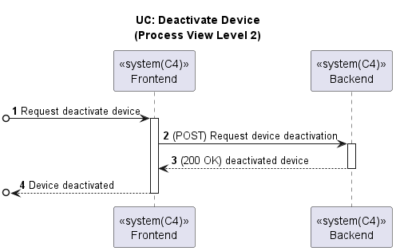
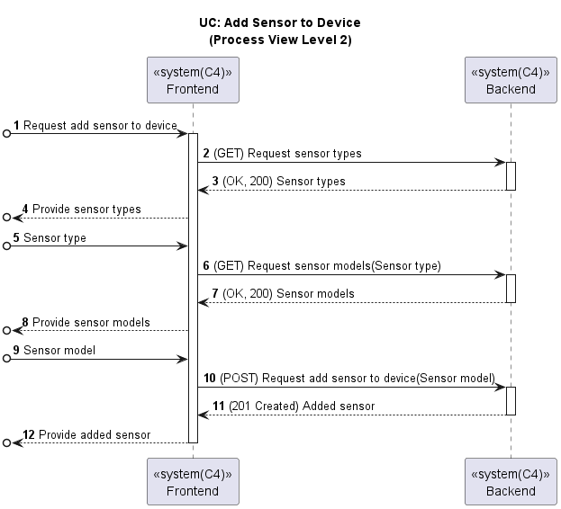
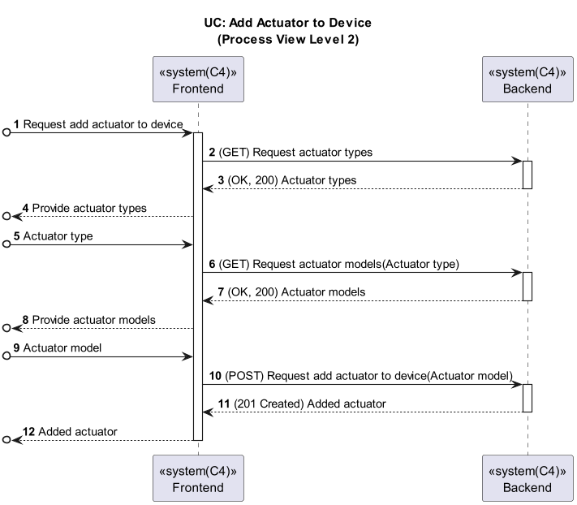

# US041 - Configure a device in the room (Web App)

### Table of Contents

1. [Requirements](#1-requirements)
    - [Dependency on existing use cases and system components](#dependency-on-existing-use-cases-and-system-components)
2. [Acceptance Criteria](#2-acceptance-criteria)
3. [Design](#3-design)
4. [Backend and External Services Integration](#4-backend-and-external-services-integration)
5. [Input validation](#5-input-validation)
6. [Application Screenshots and Navigation Flow](#6-application-screenshots-and-navigation-flow)
7. [Conclusion](#7-conclusion)

## 1. Requirements

_As a Power User, I want to configure a device in a room using the Web App.

Requirements:

- The Web App should allow the user to select a room from a list.
- The Web App should allow the user to select a device from a list
- The Web App should display the device details of the chosen device.
- The Web App should allow the user to deactivate the device if it is still active.
- The Web App should display the list of sensors and actuators of the chosen device.
- The Web App should allow the user to add a sensor or actuator to the device.
- The Web App should validate the input data before adding the new sensor or actuator.

### Dependency on existing use cases and system components

- **UC Get Rooms**: The Web App should use the existing use case to get the list of rooms.
- **UC Get Devices in a Room**: The Web App should use the existing use case to get the list of devices in a room.

## 2. Acceptance Criteria

- **Steps to follow:**
    - **Given** The user has opened the app and is in the main page
    - **When** the user presses the "Rooms" button
    - **Then** the user can see a list of rooms
    - **When** the user clicks on "View More"
    - **Then** the user can see a list of devices of the previously chosen room
    - **And** the user can click on "View More" to see the device details

- **Scenario 1:** The user wants to configure a device in the room to deactivate it if it is still active
    - **Given** The user can see the device details
    - **And** the device is currently active
    - **When** the user slides the "Deactivate Device" button
    - **Then** the device is deactivated and its status is updated to "Inactive"

- **Scenario 2:** The user wants to configure a device in the room to add a sensor
    - **Given** The user can see the device details
    - **When** the user clicks on "Add Sensor"
    - **Then** the user can choose the sensor type from a dropdown list
    - **When** the user chooses the sensor type
    - **Then** the user can choose the sensor model from a dropdown list
    - **When** the user chooses the sensor model
    - **Then** the user can click on "Save" to add the sensor to the device

- **Scenario 3:** The user wants to configure a device in the room to add an actuator,
  specifically if the actuator type is Blinds Roller or On/Off Switch
    - **Given** The user can see the device details
    - **When** the user clicks on "Add Actuator"
    - **Then** the user can choose the actuator type from a dropdown list
    - **When** the user chooses the actuator type
    - **Then** the user can choose the actuator model from a dropdown list
    - **When** the user chooses the actuator model
    - **Then** the user can click on "Save" to add the actuator to the device

- **Scenario 4:** The user wants to configure a device in the room to add an actuator,
  specifically if the actuator type is Limiter
    - **Given** The user can see the device details
    - **When** the user clicks on "Add Actuator"
    - **Then** the user can choose the actuator type from a dropdown list
    - **When** the user chooses the actuator type
    - **Then** the user can choose the actuator model from a dropdown list
    - **When** the user chooses the actuator model
    - **Then** the user can fill in the upper and lower limit values
    - **And** the user can click on "Save" to add the actuator to the device

- **Scenario 5:** The user wants to configure a device in the room to add an actuator,
  specifically if the actuator type is Decimal Limiter
    - **Given** The user can see the device details
    - **When** the user clicks on "Add Actuator"
    - **Then** the user can choose the actuator type from a dropdown list
    - **When** the user chooses the actuator type
    - **Then** the user can choose the actuator model from a dropdown list
    - **When** the user chooses the actuator model
    - **Then** the user can fill in the upper and lower limit and precision values
    - **And** the user can click on "Save" to add the actuator to the device

## 3. Design

Below are the process view diagrams for configuring a device (including deactivating a device, adding a sensor, and
adding an actuator to a device) in the Web App, which shows the interaction between the frontend and backend components.

## 4. Backend and External Services Integration

To deactivate a device, the frontend sends a PUT request to the backend with the device ID and the new status.
The endpoint for deactivating a device is:
`PUT http://10.9.24.232:8080/switch2023project_g6-1.0-SNAPSHOT/devices/${deviceId}/deactivate`
If successful, the device status is updated in the application's state and displayed to the user.

To add a sensor, the frontend validates the input and then sends a POST request to the backend with the sensor details.
The endpoint for adding a sensor is:
`POST http://10.9.24.232:8080/switch2023project_g6-1.0-SNAPSHOT/sensors/device/${device.deviceId}`. If successful, the
new sensor is
added to the application's state and displayed to the user.

To add an actuator, the frontend validates the input and then sends a POST request to the backend with the actuator
details.
The endpoint for adding an actuator is:
`POST http://10.9.24.232:8080/switch2023project_g6-1.0-SNAPSHOT/actuators/device/${device.deviceId}`. If successful, the
new actuator is
added to the application's state and displayed to the user.

## 5. Input validation

Input validation ensures that users provide the correct information when adding a new sensor.
The following validation rules and behaviors were implemented:

- **Sensor Type Validation:**
  If the sensor type is not selected, an error message _Please select a sensor type_ is displayed to the user.

- **Sensor Model Validation:**
  If the sensor model is not selected, an error message _Please select a sensor model_ is displayed to the user.

- **Successful Validation:**
  When both the sensor type and sensor model are valid, the `Save` button works as expected.
  The sensor is added to the list, and the list of sensors is updated accordingly.

Input validation ensures that users provide the correct information when adding a new actuator:

The following validation rules and behaviors were implemented if the actuator type is Blinds Roller or On/Off Switch.

- **Actuator Type Validation:**
  If the actuator type is not selected, an error message _Please select an actuator type_ is displayed to the user.

- **Actuator Model Validation:**
  If the actuator model is not selected, an error message _Please select an actuator model_ is displayed to the user.

- **Successful Validation:**
  When both the actuator type and actuator model are valid, the `Save` button works as expected.
  The actuator is added to the list, and the list of actuators is updated accordingly.

The following validation rules and behaviors were implemented if the actuator type is Limiter.

- **Actuator Type Validation:**
  If the actuator type is not selected, an error message _Please select an actuator type_ is displayed to the user.

- **Actuator Model Validation:**
  If the actuator model is not selected, an error message _Please select an actuator model_ is displayed to the user.

- **Upper and Lower Limit Value Validation:**
  If the upper limit value is less than the lower limit value, an error message _Upper limit value must be greater than
  lower limit value_ is displayed to the user.

- **Successful Validation:**
  When both the actuator type and actuator model are valid and limits are correct, the `Save` button works as expected.
  The actuator is added to the list, and the list of actuators is updated accordingly.

The following validation rules and behaviors were implemented if the actuator type is Decimal Limiter.

- **Actuator Type Validation:**
  If the actuator type is not selected, an error message _Please select an actuator type_ is displayed to the user.

- **Actuator Model Validation:**
  If the actuator model is not selected, an error message _Please select an actuator model_ is displayed to the user.

- **Upper and Lower Limit Value Validation:**
  If the upper limit value is less than the lower limit value, an error message _Invalid input. Please check the values_
  is displayed to the user.
  If the upper or lower limit value is not filled, an error message _Please fill in all fields._ is displayed to the
  user.

- **Precision Value Validation:**
  If the precision value is less than or equal to 0, an error message _Invalid input. Please check the values_ is
  displayed to the user.
  If the precision value is not filled, an error message _Please fill in all fields._ is displayed to the user.

- **Successful Validation:**
  When both the actuator type and actuator model are valid and limits and precision are correct, the `Save` button works
  as expected.
  The actuator is added to the list, and the list of actuators is updated accordingly.

## 6. Application Screenshots and Navigation Flow

The following screenshots show the navigation flow for adding a new sensor to a device in the Web App.
After selecting a device and clicking on `View More`, the user can see the device details and the list of sensors in the
device.
The user can then click on `Add Sensor` to add a new actuator to the device:

After clicking on `Add Sensor`, the user can select the sensor type from a dropdown list:

After the sensor type is selected, the user can select the sensor model from a dropdown list:

If the user tries to add a sensor without providing the required information, error messages are displayed:

Finally, when the user successfully adds a new sensor, the sensor is displayed in the list of sensors in the device:

The following screenshots show the navigation flow for adding a new actuator to a device in the Web App.
After selecting a device and clicking on `View More`, the user can see the device details and the list of actuators in
the device.
The user can then click on `Add Actuator` to add a new actuator to the device:

After clicking on `Add Actuator`, the user can select the sensor type from a dropdown list:

After the sensor type is selected, the user can select the sensor model from a dropdown list:

If the user tries to add a sensor without providing the required information, error messages are displayed:

If the actuator type is Decimal Limiter, the user can fill in the upper and lower limit and precision values:

If the user chooses wrong values for the limits or precision, error messages are displayed:

If the user tries to add an actuator without providing the required information, error messages are displayed:

If the actuator type is Limiter, the user can fill in the upper and lower limit values:

If the user chooses wrong values for the limits, error messages are displayed:

If the user tries to add an actuator without providing the required information, error messages are displayed:

Finally, when the user successfully adds a new actuator, the actuator is displayed in the list of actuators in the
device:

The user can then slide the "Deactivate Device" to deactivate the device:

## 7. Conclusion

The Web App now allows users to configure a device, inactivating a device or adding new sensors or actuators to the
device,
enhancing the functionality and usability of the application.
The input validation ensures that users provide the correct information when adding a new sensor or actuator, improving
the overall
user experience. The integration with the backend API ensures that the new sensor or actuator is successfully added to
the device and
displayed to the user.

[Back to Top](#us041---configure-a-device-in-the-room-web-app)