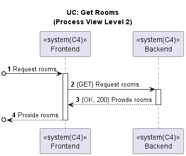

# US042 - Get a list of all Rooms (Web App)

### Table of Contents

1. [Requirements](#1-requirements)
    - [Dependency on existing use cases and system components](#dependency-on-existing-use-cases-and-system-components)
2. [Acceptance Criteria](#2-acceptance-criteria)
3. [Design](#3-design)
4. [Backend and External Services Integration](#4-backend-and-external-services-integration)
5. [Input validation](#5-input-validation)
6. [Application Screenshots and Navigation Flow](#6-application-screenshots-and-navigation-flow)
7. [Conclusion](#7-conclusion)

## 1. Requirements

_As a User, I want to have a list of all rooms in the house in my Web App._

Requirements:

- The Web App should display the list of all rooms in the house.
- The Web App should display an empty list when there are no rooms in the house.

### Dependency on existing use cases and system components

- This user story doesn't depend on any existing use cases.

## 2. Acceptance Criteria

- **Scenario 1:** The user wants to view the list of rooms in the house
    - **Given** The user has opened the app and is in the main page
    - **When** the user presses the "Rooms" button
    - **Then** the user can see a list of rooms

- **Scenario 2:** The user wants to view the list of rooms in the house
    - **Given** The user has opened the app and is in the main page
    - **When** the user presses the "Rooms" button
    - **And** there are no rooms in the house
    - **Then** the user can see an empty list of rooms

## 3. Design

Below is the process view diagram for getting a list of all rooms in the Web App, which shows the interaction between
the frontend and backend components.

## 4. Backend and External Services Integration

When we want to get the list of all rooms in the house, we make a GET request to our 
Backend server API endpoint: `GET http://10.9.24.232:8080/switch2023project_g6-1.0-SNAPSHOT/rooms`

The Backend server fetches the list of Rooms from the database and returns it to the frontend component. The 
frontend component then displays the list of Rooms on the Rooms page of the Web Application.

## 5. Input Validation

- This feature does not require any input validation as it is a read-only operation.

## 6. Application Screenshots and Navigation Flow

The following screenshots shows the Rooms page of the Web Application with the list of rooms displayed:

The rooms of the house are displayed in a list format.

## 7. Conclusion

The Web Application now displays the list of all rooms in the house. The user can view the list of rooms by clicking on the "Rooms" button on the 
main page. The Web Application displays an empty list when there are no rooms in the house.

[Back to Top](#us042---get-a-list-of-all-rooms-web-app)