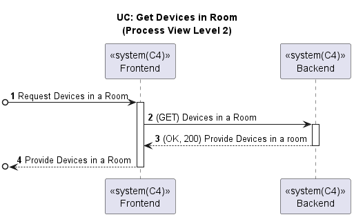

# US043 - Get a list of all Devices in a room in order to configure them (Web App)

### Table of Contents

1. [Requirements](#1-requirements)
  - [Dependency on existing use cases and system components](#dependency-on-existing-use-cases-and-system-components)
2. [Acceptance Criteria](#2-acceptance-criteria)
3. [Design](#3-design)
4. [Backend and External Services Integration](#4-backend-and-external-services-integration)
5. [Input validation](#5-input-validation)
6. [Application Screenshots and Navigation Flow](#6-application-screenshots-and-navigation-flow)
7. [Conclusion](#7-conclusion)

## 1. Requirements

_As a Room Owner [or Power User, or Administrator], I want to get a list of all
devices in a room, so that I can configure them in my Web App._

Requirements:

- The Web App should display the list of all devices in a room when the user selects a room.
- The Web App should display an empty list when there are no devices in the room.

### Dependency on existing use cases and system components

- **UC Get Rooms**: The Web App should use the existing use case to get the list of rooms.

## 2. Acceptance Criteria

- **Scenario 1:** The user wants to view the list of all devices in a room
    - **Given** The user has opened the app and is in the main page
    - **When** the user presses the "Rooms" button
    - **Then** the user can see a list of rooms
    - **And** the user can choose a room from the list
    - **When** the user clicks on "View More" to see the devices of the previously chosen room
    - **Then** the user can see a list of devices of that room

- **Scenario 2:** The user wants to view the list of all devices in a room
    - **Given** The user has opened the app and is in the main page
    - **When** the user presses the "Rooms" button
    - **Then** the user can see a list of rooms
    - **And** the user can choose a room from the list
    - **When** the user clicks on "View More" to see the devices of the previously chosen room
    - **When** the user presses the "Devices"
    - **When** the room has no devices
    - **Then** the user can see an empty list of devices

## 3. Design

Below is the process view diagram for getting a list of all devices in a room in the Web App, which shows the interaction between
the frontend and backend components.

## 4. Backend and External Services Integration

When we want to get the list of all devices in a room, we make a GET request to our
Backend server API endpoint: `GET http://10.9.24.232:8080/switch2023project_g6-1.0-SNAPSHOT/devices/room/${room.roomId}`

The Backend server fetches the list of devices in a room from the database and
returns the list of devices in the room.

## 5. Input Validation

- This feature does not require any input validation as it is a read-only operation.

## 6. Application Screenshots and Navigation Flow

The following screenshots shows the Devices page of the Web Application.

The devices of the chosen room are displayed in a list format.

## 7. Conclusion

The Web Application now displays the list of devices in a room when the user selects a room.
The user is then able to configure the devices in the room per example add an actuator or
a sensor to the device.

[Back to Top](#us043---get-a-list-of-all-devices-in-a-room-in-order-to-configure-them-web-app)