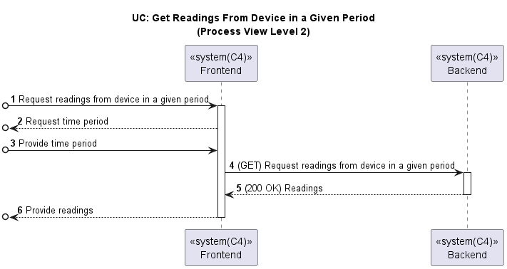

# US044 - View Device Measurements (Web App)

### Table of Contents

1. [Requirements](#1-requirements)
    - [Dependency on existing use cases and system components](#dependency-on-existing-use-cases-and-system-components)
2. [Acceptance Criteria](#2-acceptance-criteria)
3. [Design](#3-design)
4. [Backend and External Services Integration](#4-backend-and-external-services-integration)
5. [Input validation](#5-input-validation)
6. [Application Screenshots and Navigation Flow](#6-application-screenshots-and-navigation-flow)
7. [Conclusion](#7-conclusion)

## 1. Requirements

_As a Room Owner [or Power User, or Administrator], I want to get a list of all
measurement of a device in my Web App._

Requirements:

- The Web App should display the list of all measurements of a device.
- The Web App should display an empty list when there are no measurements of a device.

### Dependency on existing use cases and system components

- **UC Get Rooms**: The Web App should use the existing use case to get the list of rooms.

- **UC Get Devices**: The Web App should use the existing use case to get the list of devices in a room.

## 2. Acceptance Criteria

- **Steps to follow:**
  - **Given** The user has opened the app and is in the main page
  - **When** the user presses the "Rooms" button
  - **Then** the user can see a list of rooms
  - **When** the user clicks on "View More"
  - **Then** the user can see a list of devices of the previously chosen room
  - **And** the user can click on "View More" to see the device details

- **Scenario 1:** The user wants to view measurements of a device in a given period with measurements
  - **Given** The user can see the device details
  - **When** the user clicks on "Measurements"
  - **Then** the user can choose the measurement period
  - **When** the user chooses the correct measurement period
  - **And** the user clicks on "Submit" to set the period
  - **Then** the user can see the measurements of the device

- **Scenario 2:** The user wants to view measurements of a device in a given period with no measurements
  - **Given** The user can see the device details
  - **When** the user clicks on "Measurements"
  - **Then** the user can choose the measurement period
  - **When** the user chooses a measurement period with no measurements
  - **And** the user clicks on "Submit" to set the period
  - **Then** the system should display a message informing the user that there are no measurements for the selected period

- **Scenario 3:** The user wants to view measurements of a device in a given period with measurements
  - **Given** The user can see the device details
  - **When** the user clicks on "Measurements"
  - **Then** the user can choose the measurement period
  - **When** the user chooses the invalid measurement period
  - **And** the user inputs a start date equal to end date
  - **And** the user clicks on "Submit" to set the period
  - **Then** the user will get an error message

- **Scenario 4:** The user wants to view measurements of a device in a given period with measurements
  - **Given** The user can see the device details
  - **When** the user clicks on "Measurements"
  - **Then** the user can choose the measurement period
  - **When** the user chooses the invalid measurement period
  - **And** the user inputs a start date after an end date
  - **And** the user clicks on "Submit" to set the period
  - **Then** the user will get an error message

- **Scenario 5:** The user wants to view measurements of a device in a given period with measurements
  - **Given** The user can see the device details
  - **When** the user clicks on "Measurements"
  - **Then** the user can choose the measurement period
  - **When** the user chooses the invalid measurement period
  - **And** the user inputs a start date or an end date that´s in the future
  - **And** the user clicks on "Submit" to set the period
  - **Then** the user will get an error message

- **Scenario 6:** The user wants to view measurements of a device in a given period with measurements
  - **Given** The user can see the device details
  - **When** the user clicks on "Measurements"
  - **Then** the user can choose the measurement period
  - **When** the user chooses the invalid measurement period
  - **And** the user inputs a start date and an end date that´s in the future
  - **And** the user clicks on "Submit" to set the period
  - **Then** the user will get an error message

## 3. Design

Below is the process view diagram for getting a list of all measurements of a device in the Web App, which shows the interaction between
the frontend and backend components.

## 4. Backend and External Services Integration

When we want to get the list of all measurements of a device, we make a GET request to our
Backend server API endpoint: `GET http://10.9.24.232:8080/switch2023project_g6-1.0-SNAPSHOT/readings/device/${device.deviceId}?startPeriod=${startDate}&endPeriod=${endDate}`

The Backend server fetches the list of measurements of a device from the database and returns it to the frontend component.
The frontend component then displays the list of measurements of a device on the Measurements page of the Web Application.

## 5. Input Validation

- **Measurement Period Invalidation:**
  - If the user chooses an invalid measurement period (e.g., start date equal to end date, start date after end date, end date in the future), an error message is displayed to the user.

- **Measurement Period Successful Validation:**
- When the user chooses a valid measurement period, the `Submit` button works as expected. The measurements of the device are displayed to the user. 

## 6. Application Screenshots and Navigation Flow

The following screenshots shows the Measurements page of the Web Application with the list of measurements of a device displayed:

Measurement button is clicked on the device details page.

Measurement period form is displayed.

Measurements of the device are displayed and it is possible to order by timestamp.

Error message is displayed when the user inputs a start date equal to end date.

Error message is displayed when the user inputs end date is in the future.

Error message is displayed when the user inputs a start date after an end date.

Error message is displayed when both the user inputs are in the future.

## 7. Conclusion

The Web Application now displays the list of all measurements of a device. The user can view the list of measurements of a device by clicking on the "Measurements" button on the
device details page. The Web Application displays an empty list when there are no measurements of a device.

[Back to Top](#us044---view-device-measurements-web-app)
