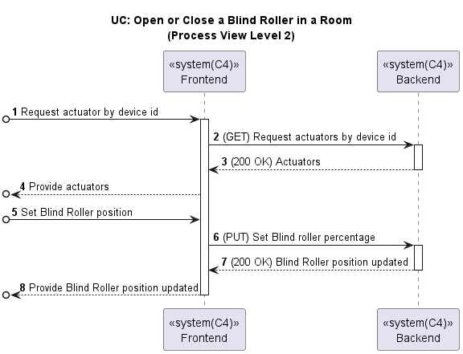

# US045 - Control Blind Roller (Web App)

### Table of Contents

1. [Requirements](#1-requirements)
    - [Dependency on existing use cases and system components](#dependency-on-existing-use-cases-and-system-components)
2. [Acceptance Criteria](#2-acceptance-criteria)
3. [Design](#3-design)
4. [Backend and External Services Integration](#4-backend-and-external-services-integration)
5. [Input validation](#5-input-validation)
6. [Application Screenshots and Navigation Flow](#6-application-screenshots-and-navigation-flow)
7. [Conclusion](#7-conclusion)

## 1. Requirements

_As a Room Owner \[or Power User, or Administrator], in my Web App I want to
know the current position, open or close a blind roller that is in a room._

Requirements:

- The Web App should allow the user to view the current position of the blind roller in a room.
- The Web App should provide controls to open or close the blind roller.
- The Web App should display the updated position of the blind roller after an action is taken.

### Dependency on existing use cases and system components

- **System Component Actuator of Blind Roller**: The Web App depends on the actuator of the blind roller to open or
  close the blind roller.
- **System Component Sensor of Scale Percentage**: The Web App depends on the sensor of the scale percentage to get the
  current position of the blind roller.
- **UC Open or Close Blind Roller**: The Web App should provide controls to open or close the blind roller, which is
  part of the existing use case.

## 2. Acceptance Criteria

- **Steps to follow:**
    - **Given** The user has opened the app and is in the main page
    - **When** the user presses the "Rooms" button
    - **Then** the user can see a list of rooms
    - **When** the user clicks on "View More"
    - **Then** the user can see a list of devices of the previously chosen room
    - **And** the user can click on "View More" to see the device details

- **Scenario 1:** The user wants to see the current position of the blind roller
    - **Given** The user can see the device details
    - **Then** the user can see the current state of the blind roller in the actuator's area

- **Scenario 2:** The user wants to control the blind roller
    - **Given** The user can see the device details
    - **Then** the user can see a slide button to control the blind roller in the actuator's area
    - **When** the user slides the button to the desired position
    - **And** the user clicks on "Operate"
    - **Then** the app should inform the user that the operation was successful

- **Scenario 3:** The user wants to control the blind roller but the device is inactive
    - **Given** The user can see the device details
    - **And** The device is inactive
    - **Then** the user can see a slide button to control the blind roller in the actuator's area
    - **But** the slide button is disabled and cannot be moved
    - **And** the "Operate" button is disabled and cannot be clicked
    - **When** the user tries to slide the button to a different position
    - **Then** the slide button does not move
    - **When** the user tries to click on "Operate"
    - **Then** the app should not perform any operation and no success message is shown

## 3. Design

Below is the process view diagram for controlling the blind roller in the Web App, which shows the interaction between
the frontend and backend components.

## 4. Backend and External Services Integration

To control the blind roller, the frontend uses two different endpoints: one to get the current position of the blind roller and another to operate the blind roller by setting its position.

First, the frontend sends a GET request to fetch the current position of the blind roller.
The endpoint is `GET http://10.9.24.232:8080/switch2023project_g6-1.0-SNAPSHOT/actuators/${actuatorId}
/current-percentage-value`.
The response includes the current percentage value of the blind roller, which is then displayed in the Web App.

To change the blind roller position, the frontend sends a PUT request to the backend with the desired position 
(percentage value) to open or close the blind roller.
The endpoint is `PUT http://10.9.24.232:8080/switch2023project_g6-1.0-SNAPSHOT/actuators/${actuatorId}
/operate-blind-roller?percentage=${value}`.
If successful, the new position of the blind roller is updated in the application's state, and the Operate button is disabled.
These integrations ensure that users can both view the current position and control the movement of the blind roller through the Web App.

## 5. Input validation

Input validation ensures that users provide the correct information when controlling the blind roller using the slider.
As a slider is used, it is not possible to input incorrect values. The slider is configured to accept values between 
0 and 100. The following validation rules and behaviors were implemented:

**Slider Position:**
If the slider is moved but then returned to its current position, the `Operate` button becomes inaccessible.
Any other value different from the current position is considered valid.

**Device without Required Sensor:**
If the device does not have the required sensor to provide the current position of the blind roller, the Web App 
displays the message _Required sensor is missing_.

**Inactive Device:**
If the device is inactive, the slider is disabled, and the `Operate` button is also disabled. The user cannot interact with the slider or the button.

**Loading and Success Messages:**
When a valid value is set and the slider is moved, a loading message "Loading..." is displayed while the operation is being processed.
Upon successful operation, a message "Success!" is displayed, indicating that the blind roller has been successfully operated to the new position.

## 6. Application Screenshots and Navigation Flow

The following screenshots show the navigation flow for controlling the blind roller in the Web App.
When the user selects a device with the type "Blind Roller", they can view the current position of the blind roller 
and control it by moving the slider to the desired position:

The `Operate` button remains disabled until the user moves the slider to a different position. Once the slider is moved,
the `Operate` button becomes enabled, allowing the user to click it to operate the blind roller to the new position:

If the device is inactive, the slider is disabled, and the `Operate` button is also disabled. The user cannot 
interact with the slider or the button:

Finally, when the user successfully operates the blind roller to a new position, a success message is displayed:

If the user tries to operate a blind roller that it does not have the required sensor, the Web App displays the message:

## 7. Conclusion

The Web App allows users to view the current position of the blind roller and control it by opening or closing the blind roller.
The integration with the backend ensures that the Web App can fetch the current position and operate the blind roller.
Input validation rules and behaviors were implemented to ensure that users provide the correct information when controlling the blind roller.

[Back to Top](#us038---sunset-and-sunrise-web-app)