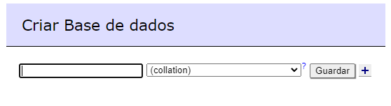
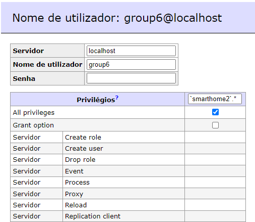

# US046 - Deploying Project Database in Docker

### Table of Contents

1. [Requirements](#1-requirements)
2. [Step-by-step guide](#2-step-by-step-guide)
    - [Set up the MySQL database](#21-set-up-the-mysql-database)
    - [Connect the System to the MySQL database](#22-connect-the-system-to-the-mysql-database)
    - [Validate the connection to the MySQL database](#23-validate-the-connection-to-the-mysql-database)
3. [Final Remarks](#3-final-remarks)


## 1. Requirements

_As Product Owner, I want the project database (MariaDB or MySQL) to be deployed in a Docker container._

Requirements for deploying the project database:

- The system must run its database contents in a MySQL Server within a Docker container.
- The system must validate that the MySQL server is operational and accessible via VPN.
- The system must be able to adequately retrieve and manipulate database entries from the MySQL server.


## 2. Step-by-step guide

### 2.1 Set up the MySQL database
- Considering the instructions received by the Product Owner and the DevOps teachers, the team will create a
container for the MySQL database, from the ones available in the DEI Virtual Server.


- The process of creating the container goes something like this:


1. Login into `https://vs-ctl.dei.isep.ipp.pt`


2. Click `Login - Cloud's Web Interface`


3. Click `Available Virtual Server Templates`


4. Pick Option 7 `MySQL 8 Server`


5. Initialize the container


6. The container does not have an actual terminal, shell or ssh installed, making communications with the Database impossible
without the help of another Container, an `Adminer` container, for example.
   

    - Adminer is a full-featured database management tool written in PHP. It provides a simple and user-friendly interface for managing databases, making it a popular alternative to phpMyAdmin.

    - Adminer supports a variety of database management systems including MySQL, PostgreSQL, SQLite, MS SQL, Oracle, SimpleDB, Elasticsearch, and MongoDB.
 
    - It offers a clean and intuitive user interface that simplifies database management tasks such as running SQL queries, managing tables, and handling user permissions

    - Adminer includes built-in security measures, such as protection against SQL injection attacks. It also supports HTTPS connections for secure data transmission.

    - Due to its lightweight nature, Adminer tends to perform better compared to other database management tools. It consumes fewer resources, making it suitable for servers with limited capacity.
 
    - Adminer is open-source software, which means it is free to use and modify. It is licensed under the Apache License 2.0, allowing users to customize the tool according to their needs.

    - For all these reasons, the Team decided to use `Adminer` to manage the MySQL database.

7. To create the `Adminer` container, follow the same steps as before, but this time pick Option 25 `Adminer 4.8.0`


8. Initialize the container


9. Access the Adminer container by clicking on the `Adminer Web Interface`


10. Fill in the fields with the following information:
  
    - Server: (the IP address of the MySQL container)
    - Username: (the username you set when creating the MySQL container or, in case you didn't set one, the default username is `root`)
    - Password : (the password you set when creating the MySQL container)
    - Database: (the name of the database you want to access, in case you didn't create one, just press enter)
11. Click `Login`


12. You are now connected to the MySQL database and can start managing it.


    
13. To create a new database, click on the `Create New Database` button, fill in the name of the database and click `Create`



14. Enter the actual Database by clicking on the database name


15. Press `Privileges` to create a new user


16. Choose an username and password


17. Click on `Modify User` to edit user permissions


18. Check the box saying `All privileges` and click `Save`



19. You can now access the database with the new user credentials

### 2.2 Connect the System to the MySQL database

- We documented our system using diagrams in a C4+1 approach, which includes Context, Container, Component, Class, and Code diagrams. The diagrams provide a high-level overview of the system architecture, components, and interactions, helping to understand the system's structure and design.


- In order to objectively document the connection to the MySQL database, here is a Component diagram in the implementation view Lvl3:


- Let's compare it to the Physical View Lvl2:


- After seeing these diagrams we can all understand that
  1. The Backend is connected to the MySQL database that is running in a different container
  2. The Backend consumes information from the MySQL and makes an API available for other parts of the system (and external partners) to consume

- The Database is available to be accessed, now it's time to connect the system to it.

- Some portions of our backend need reformulation in order to connect to the MySQL database.

- Firstly we are going to have to check our `pom.xml` available in the root of our project to see if it has all the dependencies
    necessary to connect to the MySQL database.
```xml
<dependency>
    <groupId>mysql</groupId>
    <artifactId>mysql-connector-java</artifactId>
    <version>8.0.29</version>
</dependency>
        <!-- Add other dependencies as needed -->
```
- This dependency is necessary to connect to the MySQL database, it is the official MySQL JDBC driver, and it is used to connect to the MySQL database from Java applications.

- Secondly, we are going to create a database SQL script to initialize the database schema and populate it with initial data. This script will be executed when the application starts to create the necessary tables and insert initial data into the database.
- The script should be named `import.sql` and placed in the `src/main/resources` folder of the project.
- Here is an example of an `import.sql` script that creates a table and inserts some initial data:
```sql
CREATE TABLE IF NOT EXISTS actuator_type
(
    actuator_type_name VARCHAR(255) NOT NULL PRIMARY KEY
    );

CREATE TABLE IF NOT EXISTS actuator_model
(
    actuator_model_name VARCHAR(255) NOT NULL PRIMARY KEY,
    actuator_type_name  VARCHAR(255)
    );

CREATE TABLE IF NOT EXISTS sensor_type
(
    sensor_type_id   VARCHAR(255) NOT NULL PRIMARY KEY,
    sensor_type_name VARCHAR(255),
    sensor_type_unit VARCHAR(255)
    );

CREATE TABLE IF NOT EXISTS sensor_model
(
    sensor_model_name VARCHAR(255) NOT NULL PRIMARY KEY,
    sensor_type_id    VARCHAR(255),
    FOREIGN KEY(sensor_type_id) REFERENCES sensor_type(sensor_type_id)
    );

CREATE TABLE IF NOT EXISTS device_type
(
    device_type_name VARCHAR(255) NOT NULL PRIMARY KEY
    );

CREATE TABLE IF NOT EXISTS house
(
    house_name    VARCHAR(255) NOT NULL PRIMARY KEY,
    city         VARCHAR(255),
    country      VARCHAR(255),
    latitude     DOUBLE,
    longitude    DOUBLE,
    street_name   VARCHAR(255),
    street_number VARCHAR(255),
    zip_code      VARCHAR(255)
    );

CREATE TABLE IF NOT EXISTS room
(
    room_id    VARCHAR(255) NOT NULL PRIMARY KEY,
    floor     INT,
    height    DOUBLE,
    house_name VARCHAR(255),
    length    DOUBLE PRECISION,
    room_name  VARCHAR(255),
    width     DOUBLE PRECISION,
    FOREIGN KEY(house_name) REFERENCES house(house_name)
    );

CREATE TABLE IF NOT EXISTS device
(
    device_id       VARCHAR(255) NOT NULL PRIMARY KEY,
    device_name     VARCHAR(255),
    device_status   BOOLEAN                NOT NULL,
    device_type_name VARCHAR(255),
    room_identity   VARCHAR(255),
    FOREIGN KEY(device_type_name) REFERENCES device_type(device_type_name),
    FOREIGN KEY(room_identity) REFERENCES room(room_id)
    );

CREATE TABLE IF NOT EXISTS sensor
(
    sensor_id        VARCHAR(255) NOT NULL PRIMARY KEY,
    device_id        VARCHAR(255),
    sensor_model_name VARCHAR(255),
    FOREIGN KEY(device_id) REFERENCES device(device_id),
    FOREIGN KEY(sensor_model_name) REFERENCES sensor_model(sensor_model_name)

    );

CREATE TABLE IF NOT EXISTS actuator
(
    actuator_id        VARCHAR(255) NOT NULL PRIMARY KEY,
    actuator_model_name VARCHAR(255),
    decimal_lower_limit DOUBLE,
    decimal_upper_limit DOUBLE,
    deviceid          VARCHAR(255),
    integer_lower_limit INTEGER,
    integer_upper_limit INTEGER,
    precision_value         INTEGER,
    FOREIGN KEY (deviceid) REFERENCES device(device_id)
    );

CREATE TABLE IF NOT EXISTS reading
(
    reading_id    VARCHAR(255) NOT NULL PRIMARY KEY,
    reading_value VARCHAR(255),
    sensor_id     VARCHAR(255),
    time_stamp    TIMESTAMP,
    FOREIGN KEY (sensor_id) REFERENCES sensor(sensor_id)
    );

-- Inserting data into the tables as previously provided
-- This data should now conform to the revised table definitions and constraints
-- table actuator_type
INSERT INTO actuator_type (actuator_type_name) VALUES
                                                   ('BlindsRoller'),
                                                   ('DecimalLimiter'),
                                                   ('Limiter'),
                                                   ('OnOffSwitch');
-- table actuator_model
INSERT INTO actuator_model (actuator_model_name, actuator_type_name) VALUES
                                                                         ('ActuatorOfBlindRoller', 'BlindsRoller'),
                                                                         ('ActuatorOfDecimalLimiter', 'DecimalLimiter'),
                                                                         ('ActuatorOfLimiter', 'Limiter'),
                                                                         ('ActuatorOfOnOffSwitch', 'OnOffSwitch');
-- table sensor_type
INSERT INTO sensor_type (sensor_type_id, sensor_type_name, sensor_type_unit) VALUES
                                                                                 ('TemperatureCelsius', 'Temperature', 'Celsius'),
                                                                                 ('ScalePercentagePercentage', 'ScalePercentage', 'Percentage'),
                                                                                 ('PowerConsumptionWatts', 'PowerConsumption', 'Watts'),
                                                                                 ('HumidityPercent', 'Humidity', 'Percent'),
                                                                                 ('OnOffNa', 'OnOff', 'Na'),
                                                                                 ('WindSpeedWindDirectionKmHrRadian', 'WindSpeedWindDirection', 'KmHrRadian'),
                                                                                 ('SunriseTime', 'Sunrise', 'Time'),
                                                                                 ('SunsetTime', 'Sunset', 'Time'),
                                                                                 ('DewPointCelsius', 'DewPoint', 'Celsius'),
                                                                                 ('SolarIrradianceWm2', 'SolarIrradiance', 'Wm2'),
                                                                                 ('AveragePowerConsumptionWatts', 'AveragePowerConsumption', 'Watts'),
                                                                                 ('ElectricEnergyConsumptionWh', 'ElectricEnergyConsumption', 'Wh');
-- table sensor_model
INSERT INTO sensor_model (sensor_model_name, sensor_type_id) VALUES
                                                                 ('SensorOfTemperature', 'TemperatureCelsius'),
                                                                 ('SensorOfScalePercentage', 'ScalePercentagePercentage'),
                                                                 ('SensorOfPowerConsumption', 'PowerConsumptionWatts'),
                                                                 ('SensorOfHumidity', 'HumidityPercent'),
                                                                 ('SensorOfOnOff', 'OnOffNa'),
                                                                 ('SensorOfWind', 'WindSpeedWindDirectionKmHrRadian'),
                                                                 ('SensorOfSunrise', 'SunriseTime'),
                                                                 ('SensorOfSunset', 'SunsetTime'),
                                                                 ('SensorOfDewPoint', 'DewPointCelsius'),
                                                                 ('SensorOfSolarIrradiance', 'SolarIrradianceWm2'),
                                                                 ('SensorOfAveragePowerConsumption', 'AveragePowerConsumptionWatts'),
                                                                 ('SensorOfElectricEnergyConsumption', 'ElectricEnergyConsumptionWh');
-- table device_type
INSERT INTO device_type (device_type_name) VALUES
                                               ('Default'),
                                               ('GridPowerMeter'),
                                               ('PowerSourcePowerMeter');
-- table house
INSERT INTO house (house_name, city, country, latitude, longitude, street_name, street_number, zip_code) VALUES
    ('TheHouse', 'Porto', 'Portugal', 44, 55, 'aquela rua', '22', '4200-500');
-- table room
INSERT INTO room (room_id, floor, height, house_name, length, room_name, width) VALUES
                                                                                    ('e21f52ec-7004-4c66-b011-248599d81e3a', 0, 3, 'TheHouse', 5, 'Living Room', 4),
                                                                                    ('9721346a-474b-4e41-8235-0af529fba7d5', 1, 3, 'TheHouse', 4, 'Master Bedroom', 4),
                                                                                    ('ad121731-b3cb-4125-a8fd-b691a01d4c77', 0, 3, 'TheHouse', 4, 'Kitchen', 3);
-- table device
INSERT INTO device (device_id, device_name, device_status, device_type_name, room_identity) VALUES
                                                                                          ('ebb2d7c8-0952-47bf-b818-8e27088ca53a', 'Windmill Power Meter', true, 'PowerSourcePowerMeter', 'e21f52ec-7004-4c66-b011-248599d81e3a'),
                                                                                          ('6f78b49c-e55a-478b-a173-ee4548781cd4', 'EDP power meter', true, 'GridPowerMeter', 'ad121731-b3cb-4125-a8fd-b691a01d4c77'),
                                                                                          ('f01004db-5d37-4592-928a-6cfb1e6428cd', 'Thermostat', true, 'Default', 'ad121731-b3cb-4125-a8fd-b691a01d4c77'),
                                                                                          ('c45e7894-7427-4848-8c9d-5aed1c8d9ec5', 'Thermostat', true, 'Default', '9721346a-474b-4e41-8235-0af529fba7d5'),
                                                                                          ('44ad9efa-6b89-485d-96ee-255083bcbbff', 'Blind Roller', true, 'Default', '9721346a-474b-4e41-8235-0af529fba7d5'),
                                                                                          ('41b7b867-a99f-4171-9d12-5a5e25601aec', 'Blind Roller', true, 'Default', 'e21f52ec-7004-4c66-b011-248599d81e3a'),
                                                                                          ('08504a80-4818-43d0-91b9-1f2da26fa87d', 'Air Conditioner', true, 'Default', 'e21f52ec-7004-4c66-b011-248599d81e3a'),
                                                                                          ('28a3fddb-e558-41ea-9efb-0683357b9e67', 'Central Heating', true, 'Default', 'e21f52ec-7004-4c66-b011-248599d81e3a'),
                                                                                          ('0167fb4a-d6b6-4d61-9fe9-7aec1a72f032', 'Alarm System', true, 'Default', 'e21f52ec-7004-4c66-b011-248599d81e3a'),
                                                                                          ('e4dc3aa4-25c3-4d9f-9b8c-6e4ef243a8f1', 'Solar Panel Power Meter', true, 'PowerSourcePowerMeter', 'e21f52ec-7004-4c66-b011-248599d81e3a');
-- table sensor
INSERT INTO sensor (sensor_id, device_id, sensor_model_name) VALUES
                                                                 ('2ca95c92-5a2e-4322-9e4d-6f6a954936a4', 'ebb2d7c8-0952-47bf-b818-8e27088ca53a', 'SensorOfPowerConsumption'),
                                                                 ('cbb76d06-4175-4c89-a5df-df662c5e0ad5', '41b7b867-a99f-4171-9d12-5a5e25601aec', 'SensorOfScalePercentage'),
                                                                 ('2dc8bab9-7268-40ff-a980-2ce175587fd9', '44ad9efa-6b89-485d-96ee-255083bcbbff', 'SensorOfScalePercentage'),
                                                                 ('17080dc0-9213-4de8-9ba3-1917b3b16085', 'f01004db-5d37-4592-928a-6cfb1e6428cd', 'SensorOfTemperature'),
                                                                 ('4187cfe0-34b6-4719-9811-847046b871cf', 'c45e7894-7427-4848-8c9d-5aed1c8d9ec5', 'SensorOfTemperature'),
                                                                 ('37953320-0cbb-44fe-9d9a-534c5212dc7f', '6f78b49c-e55a-478b-a173-ee4548781cd4', 'SensorOfPowerConsumption');
-- table actuators
INSERT INTO actuator (actuator_id, actuator_model_name, decimal_lower_limit, decimal_upper_limit, device_id, integer_lower_limit, integer_upper_limit, precision_value) VALUES
                                                                                                                                                                            ('46520740-6f3b-43e3-b407-512004ca0d17', 'ActuatorOfBlindRoller', null, null, '41b7b867-a99f-4171-9d12-5a5e25601aec', null, null, null),
                                                                                                                                                                            ('1788f71f-f3ef-42d8-bf34-fd93c5eb1544', 'ActuatorOfBlindRoller', null, null, '44ad9efa-6b89-485d-96ee-255083bcbbff', null, null, null),
                                                                                                                                                                            ('a109d123-040d-4e08-9dcc-c17472b56f87', 'ActuatorOfOnOffSwitch', null, null, '0167fb4a-d6b6-4d61-9fe9-7aec1a72f032', null, null, null),
                                                                                                                                                                            ('271cb3ee-7c6e-46c7-83cb-1e4e3e708e3d', 'ActuatorOfOnOffSwitch', null, null, '08504a80-4818-43d0-91b9-1f2da26fa87d', null, null, null),
                                                                                                                                                                            ('7d3991c7-dba5-4875-9234-bd60165c18fa', 'ActuatorOfOnOffSwitch', null, null, '28a3fddb-e558-41ea-9efb-0683357b9e67', null, null, null);
-- table reading
INSERT INTO reading (reading_id, reading_value, sensor_id, time_stamp) VALUES ('7a85932f-39ff-4fea-8b12-0c87821353ae', '25', '1', '2024-04-25 12:00:00.000000'),
 ('00d6dece-42e0-4d04-ae5c-ca6fe09c5d7c', '15', '2', '2024-04-25 12:00:10.000000'),
 ('e42e84d5-02fb-4a00-827d-36b840fc3197', '12', '3', '2024-04-25 12:00:00.000000'),
('5ec07ab6-fcad-4526-8532-83d5540fc17e', '5', '4', '2024-04-25 12:00:10.000000'),
 ('410febac-68a3-4ab9-8b5a-3e3c6d060e17', '100', '5', '2024-04-25 12:00:00.000000'),
('34e4c998-42d1-4790-8665-89176112f3cd', '25', '6', '2024-04-25 12:00:00.000000');

-- Add more data as needed--
```
- This script creates the necessary tables for the system, inserts initial data into the tables, and sets up the relationships between the tables.

- Thirdly we are going to have to check our `application.properties` file available in the `src/main/resources` folder to see if it has all the necessary configurations to connect to the MySQL database.
```properties
# Database connection settings
spring.datasource.url=jdbc:mysql://mysql/server/ip:3306/smarthome
spring.sql.init.data-locations=classpath:import.sql
spring.sql.init.schema-locations=classpath:import.sql

spring.datasource.username=(username)
spring.datasource.password=(password)
spring.datasource.driver-class-name=com.mysql.cj.jdbc.Driver

# JPA settings
spring.jpa.hibernate.ddl-auto=update
spring.jpa.properties.hibernate.dialect=org.hibernate.dialect.MySQLDialect
spring.jpa.generate-ddl=true
```
Let's break down the properties file:
1. spring.datasource.url=jdbc:mysql://mysql/server/ip:3306/smarthome
  - This specifies the JDBC URL for connecting to the MySQL database.
  - mysql/server/ip is the hostname or IP address of the MySQL server.
  - 3306 is the port number on which MySQL is running.
  - smarthome is the name of the database you want to connect to.


2. spring.sql.init.data-locations=classpath.import.sql
  - Specifies the location of the SQL data initialization script.
  - We use classpath:import.sql to indicate that the script is located in the classpath (typically src/main/resources).
  - This script is executed when the application starts to populate the database with initial data.


3. spring.sql.init.schema-locations=classpath.import.sql
   - Specifies the location of the SQL schema initialization script.
   - Same as above, indicating the schema script is also in the classpath at import.sql.


4. spring.datasource.username=(username) and spring.datasource.password=(password)
   - These properties specify the username and password to connect to the MySQL database.
   - Replace (username) and (password) with the actual credentials.


5. spring.datasource.driver-class-name=com.mysql.cj.jdbc.Driver
   - Specifies the JDBC driver class for MySQL.
   - com.mysql.cj.jdbc.Driver is the class name for MySQL Connector/J, which is the JDBC driver for MySQL.
   - This driver is used by Spring Data JPA to connect to the MySQL database.


6. spring.jpa.hibernate.ddl-auto=update
   - This setting controls the behavior of the schema generation.
   - update updates the database schema to match the entity definitions without dropping existing schema structures.
   - This is useful during development to automatically update the database schema based on entity changes.
   - In production, it's recommended to use validate or none to avoid accidental schema changes.

  
7. spring.jpa.properties.hibernate.dialect=org.hibernate.dialect.MySQLDialect
  - Specifies the SQL dialect that Hibernate should use. MySQLDialect tells Hibernate to generate SQL optimized for MySQL.


8. spring.jpa.generate-ddl=true
  - Tells Spring JPA to generate DDL (Data Definition Language) scripts from the entity definitions.
  - This is useful during development to see the SQL scripts that will be executed to create or update the database schema.
  - In production, it's recommended to set this to false to avoid accidental schema changes.

With these configurations in place, the system should be able to connect to the MySQL database and perform database operations.

### 2.3 Validate the connection to the MySQL database

- To validate the connection to the MySQL database, we can run the application and check if it can connect to the database and perform database operations.
  
- If the application starts successfully without any errors related to the database connection, it indicates that the connection to the MySQL database is working.
- You can also check the logs for any database-related messages to ensure that the application is communicating with the database.
- You can also use tools like Adminer or MySQL Workbench to connect to the MySQL database and verify that the data is being stored and retrieved correctly.
- We can also use a tool we have been getting more familiarized with, `Postman`, to test the API endpoints that interact with the database and verify that the data is being retrieved and manipulated correctly.
- For instance, we can run the project locally and use Postman to send requests to the API endpoints that interact with the MySQL database.
- Here, is a print for a request to the `/devices` endpoint:

- Here, is a print for a request to the `/rooms` endpoint:

- Here, is a print for a `POST` request to the `/rooms/house/houseId` endpoint (add a room to a house):

- As the responses are the ones we expected, we can assume the data is being retrieved correctly from the database, indicating that the connection to the MySQL database is working as expected.

## 3. Final Remarks

By following this guide, you will be able to set up a MySQL database in a Docker container, manage it using Adminer, connect your system to the database, and validate the connection to ensure seamless database operations.

[Back to top](#us046---deploying-project-database-in-docker)