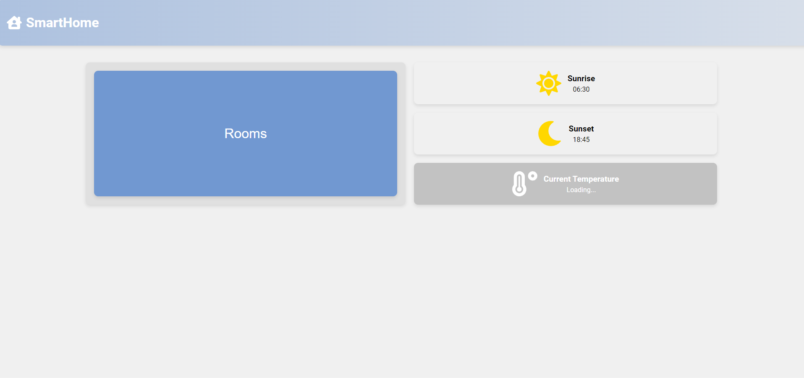

# US047 - Hosting System on Tomcat Server and Connecting to Database Container

## Table of Contents

1. [Requirements](#1-requirements)
2. [Step-by-step guide](#2-step-by-step-guide)
   1. [Set up the Tomcat server](#21-set-up-the-tomcat-server)
   2. [Deploy the system on Tomcat (and Frontend on Nginx)](#22-deploy-the-system-on-tomcat-and-frontend-on-nginx)
3. [Final Remarks](#3-final-remarks)

## 1. Requirements

_As Product Owner, I want the system to be hosted in a Tomcat server and connect to a database container to persist information._

Requirements for hosting the system on a Tomcat server and connecting it to a database container:

- The system must be hosted on a server running Apache Tomcat (to be able to deploy the system as a WAR file).
- The system must be connected to a MySQL database running within a separate container.
- The system must be able to retrieve and persist data in the database container.

## 2. Step-by-step guide

### 2.1 Set up the Tomcat server

To set up the Tomcat server, follow these steps:

1. Login into `https://vs-ctl.dei.isep.ipp.pt`


2. Click `Login - Cloud's Web Interface`


3. Click `Available Virtual Server Templates`


4. Initially we thought to choose a Tomcat Server (Option 85), that had already deployed in it the Tomcat server. 
    However, we found out that the way this Tomcat was deployed, in order to deploy a system in it, we would need to have
a .war file weighing under 50Mb. Since our system is bigger than that, we had to pick another option.


5. We picked the `Ubuntu 22.04 LTS - base system` template. 

For multiple reasons:
   1. We can install the Tomcat server in it and deploy our system in it using the Tomcat server.
   2. This distribution is more flexible than the Tomcat server template, allowing us to install other tools if needed.
   3. Although it does not offer a GUI, we can access it through the terminal, via SSH, which is already configured in the template.
   4. Ubuntu 22.04 LTS offers long-term support, ensuring stability and security updates for an extended period, which is crucial for production environments.
   5. Ubuntu has a vast user community and extensive documentation, which can be helpful for troubleshooting and finding solutions to potential issues.
   6. Ubuntu Server is designed to be resource-efficient, ensuring optimal performance for running applications like Tomcat.
   7. Ubuntu provides a robust environment for development, with support for multiple programming languages and development tools.
   8. Ubuntu Server is highly customizable, allowing us to configure it according to our specific requirements and preferences.
   9. Ubuntu Server is well-suited for hosting web applications, databases, and other server-side applications, making it an ideal choice for deploying our system.


6. Click `Create Virtual Server`


5. Initialize the container (press `Start`).


6. Access the terminal of the container by clicking `Open Terminal` or via SSH
- If you choose to access via SSH, firstly you need to be connected to the DEI-ISEP VPN.
- To connect via SSH, run the following command in your terminal:
```sh
ssh -p port root@server-ip
```
- And then input the password that was given to you when you created the container.

7. You're going to need to install Java and Tomcat in the container.
- Install Java (17 because its the version in which our system was developed):
```sh
sudo apt-get update
sudo apt-get install -y software-properties-common
sudo add-apt-repository ppa:openjdk-r/ppa
sudo apt-get install -y openjdk-17-jdk
```
- Then you can check if Java was installed correctly by running:
```sh
java -version
```
- It should output something like this:
```sh
openjdk 17.0.11 2024-04-16
OpenJDK Runtime Environment (build 17.0.11+9-Ubuntu-122.04.1)
OpenJDK 64-Bit Server VM (build 17.0.11+9-Ubuntu-122.04.1, mixed mode, sharing)
```

- Having Java deployed, we must install Tomcat We did so by running the following commands:
```sh
sudo apt-get update
sudo apt-get install -y wget
wget https://downloads.apache.org/tomcat/tomcat-10/v10.0.1.24/bin/apache-tomcat-10.0.1.24.tar.gz
tar -xvf apache-tomcat-10.0.1.24.tar.gz
mv apache-tomcat-10.0.1.24 /usr/local/tomcat
```
- We opted to use Tomcat10 and not 9 for the following reasons:
  1. Tomcat 10 is the latest stable version of Apache Tomcat, offering the most up-to-date features and improvements. It also has various performance improvements over Tomcat 9. These include better resource management, optimized request handling, and more efficient memory usage.
  2. Tomcat 10 provides better support for the latest Java versions, ensuring compatibility with our system developed in Java 17.
  3. Tomcat 10 includes security enhancements and bug fixes, making it a more secure and reliable choice for hosting our system.
  4. Tomcat 10 offers improved performance and scalability, allowing our system to handle a larger number of concurrent users and requests.
  5. Tomcat 10 provides better support for modern web technologies and standards, ensuring that our system remains compatible with the latest web browsers and devices.
  6. Tomcat 10 is actively maintained and supported by the Apache Software Foundation, ensuring that our system will receive updates and security patches in the future.
  7. Tomcat 10 is widely used in the industry and has a large community of developers and users, making it easier to find resources and support for our system.
  8. Tomcat 10 is well-documented and has a large number of tutorials and guides available online, making it easier to set up and configure our system for production use.
  9. Tomcat 10 is open-source and free to use, making it a cost-effective choice for hosting our system in a production environment.
  10. Tomcat 10 is compatible with a wide range of operating systems and platforms, ensuring that our system can be deployed on various environments without compatibility issues.
  11. Tomcat 10 fully supports the Jakarta EE 9 specification, which includes a major namespace change from javax.* to jakarta.*. This is crucial for staying current with the latest enterprise Java standards and future-proofing your applications.
  12. Tomcat 10 introduces several new features and improvements over Tomcat 9, including better support for HTTP/2 and HTTP/3, enhancements to the WebSocket API, and improvements in the overall performance and scalability of the server.

- Then you can check if Tomcat was installed correctly by running:
```sh
/usr/local/tomcat/bin/version.sh
```
- It should output something like this:
```sh
Using CATALINA_BASE:   /usr/local/tomcat
Using CATALINA_HOME:   /usr/local/tomcat
Using CATALINA_TMPDIR: /usr/local/tomcat/temp
Using JRE_HOME:        /usr
Using CLASSPATH:       /usr/local/tomcat/bin/bootstrap.jar:/usr/local/tomcat/bin/tomcat-juli.jar
Using CATALINA_OPTS:
Server version: Apache Tomcat/10.1.24
Server built:   May 9 2024 17:41:23 UTC
Server number:  10.1.24.0
OS Name:        Linux
OS Version:     5.4.0-153-generic
Architecture:   amd64
JVM Version:    17.0.11+9-Ubuntu-122.04.1
JVM Vendor:     Ubuntu
```

- After installing we want to make sure that Tomcat is running. We can do so by running the following commands:
```sh
/usr/local/tomcat/bin/startup.sh
```
- In order to be able to access Tomcat easily, we can create a service for it. We can do so by running the following commands:
```sh
sudo nano /etc/systemd/system/tomcat.service
```
- And then input the following:
```sh
  GNU nano 6.2                      /etc/systemd/system/tomcat.service                                [Unit]
Description=Apache Tomcat Web Application Container
After=network.target

[Service]
Type=forking

Environment=JAVA_HOME=/usr/lib/jvm/java-17-openjdk-amd64
Environment=CATALINA_PID=/usr/local/tomcat/temp/tomcat.pid
Environment=CATALINA_HOME=/usr/local/tomcat
Environment=CATALINA_BASE=/usr/local/tomcat
Environment='CATALINA_OPTS=-Xms512M -Xmx1024M -server -XX:+UseParallelGC'
Environment='JAVA_OPTS=-Djava.awt.headless=true -Djava.security.egd=file:/dev/./urandom'

ExecStart=/usr/local/tomcat/bin/startup.sh
ExecStop=/usr/local/tomcat/bin/shutdown.sh

User=tomcat
Group=tomcat
UMask=0007
RestartSec=10
Restart=always

[Install]
WantedBy=multi-user.target
```
- Then you'll need to create a Tomcat user by running the following commands:
```sh
sudo groupadd tomcat
sudo useradd -s /bin/false -g tomcat -d /usr/local/tomcat tomcat
sudo chown -R tomcat:tomcat /usr/local/tomcat
```
- In order for these alterations to go into effect we need to reload our daemon by running:
```sh
sudo systemctl daemon-reload
```
- And then we can start the Tomcat service by running:
```sh
sudo systemctl start tomcat
```
- And enable it to start on boot by running:
```sh
sudo systemctl enable tomcat
```

- Then you can check if Tomcat is running correctly by running:
```sh
systemctl status tomcat
```
- It should output something like this:
```sh
● root@vs1256:/usr/local/tomcat# sudo systemctl status tomcat
● tomcat.service - Apache Tomcat Web Application Container
     Loaded: loaded (/etc/systemd/system/tomcat.service; enabled; vendor preset: enabled)
    Drop-In: /run/systemd/system/service.d
             └─zzz-lxc-service.conf
     Active: active (running) since Fri 2024-06-14 21:42:03 WEST; 13s ago
   Main PID: 706 (java)
      Tasks: 17 (limit: 28737)
     Memory: 225.7M
     CGroup: /system.slice/tomcat.service
             └─706 /usr/lib/jvm/java-17-openjdk-amd64/bin/java -Djava.util.logging.config.file=/usr/l>

```

- Now, before the actual deployment, our system will have both a Frontend and a Backend. 
- Tomcat will be used to deploy the Backend portion of our project
- After some research about tools to deploy Frontend applications, we found out that Tomcat is not the best option to deploy a Frontend application.
- We found out that Nginx is a better option to deploy a Frontend application, so we decided to use it to deploy our Frontend, for these following reasons:
1. Nginx is designed to handle a large number of concurrent connections efficiently with low memory usage. This makes it an ideal choice for serving static content like HTML, CSS, and JavaScript files in a frontend application.
2. Nginx is widely used as a reverse proxy server to distribute incoming traffic across multiple backend servers, enhancing scalability and reliability. This can be useful for load balancing and failover scenarios in a production environment.
3. Nginx is optimized for serving static files, which makes it an ideal choice for frontend applications that involve delivering static assets quickly to users. It supports efficient caching mechanisms to reduce server load and improve response times.
4. Nginx has a relatively simple configuration language, which makes it easy to set up and maintain. It supports flexible URL rewriting and redirection, which can be useful for managing frontend application routes.
5. Nginx has a large and active community, extensive documentation, and a wide range of third-party modules and extensions.
6. Nginx provides robust security features, including SSL/TLS termination, DDoS mitigation, and request rate limiting, which help protect your frontend applications.
7. Tomcat is primarily designed as a Java Servlet and JSP container. It is ideal for deploying Java-based web applications that require server-side processing.
- Therefore, we needed to install Nginx in the container. We did so by running the following commands:
```sh
sudo apt-get update
sudo apt-get install -y nginx
```
- Then you can check if Nginx was installed correctly by running:
```sh
nginx -v
```
- It should output something like this:
```sh
nginx version: nginx/1.18.0 (Ubuntu)
```
- After installing we want to make sure that Nginx is running. We can do so by running the following commands:
```sh
sudo systemctl start nginx
```
- As the installation of Nginx is automatically run by Ubuntu, we don't need to create a service for it.
- Then you can check if Nginx is running correctly by running:
```sh
systemctl status nginx
```
- After these steps, we have Tomcat and Nginx running in our container. We can now deploy our system in Tomcat and our Frontend in Nginx.

### 2.2 Deploy the system on Tomcat (and Frontend on Nginx)

- Several attempts were made in order to automatize the deployment, almost without success
- As a docker container to whose Docker we don't actually have access, we can't build our project as a container in it.
- Although containers were out of the picture, we tried to deploy a Pipeline using Jenkins to automate the deployment.
- We started by installing Jenkins in the container. We did so by running the following commands:
```sh
sudo apt-get update
```
- Add the Jenkins repository key to the system:
```sh
curl -fsSL https://pkg.jenkins.io/debian/jenkins.io.key | sudo tee \
  /usr/share/keyrings/jenkins-keyring.asc > /dev/null
```
- Add the Jenkins repository to the system:
```sh
echo "deb [signed-by=/usr/share/keyrings/jenkins-keyring.asc] \
  https://pkg.jenkins.io/debian binary/" | sudo tee \
  /etc/apt/sources.list.d/jenkins.list > /dev/null
```
- Update the package list and install Jenkins:
```sh
sudo apt-get update
sudo apt-get install -y jenkins
```
- Start the Jenkins service:
```sh
sudo systemctl start jenkins
```
- Sometimes Jenkins doesn't start correctly as Tomcat is already using the port 8080. In order to fix this, we need to change the port of Tomcat. We can do so by running the following commands:
```sh 
sudo nano /usr/local/tomcat/conf/server.xml
```
- And then change the port from 8080 to 8081:
```sh
<Connector port="8081" protocol="HTTP/1.1"
               connectionTimeout="20000"
               redirectPort="8443" />
```
- After changing the port, we need to restart Tomcat by running:
```sh
sudo systemctl restart tomcat
```
- Now we can start Jenkins by running:
```sh
sudo systemctl start jenkins
```
- And enable it to start on boot by running:
```sh
sudo systemctl enable jenkins
```
- Then you can check if Jenkins is running correctly by running:
```sh
systemctl status jenkins
```
- It should output something like this:
```sh
● jenkins.service - Jenkins Continuous Integration Server
Loaded: loaded (/lib/systemd/system/jenkins.service; enabled; vendor preset: enabled)
Active: active (running) since [date and time]; [elapsed time]
Main PID: [PID] (java)
Tasks: [number]
Memory: [memory usage]
CPU: [CPU usage]
CGroup: /system.slice/jenkins.service
└─[PID] /usr/bin/java -Djava.awt.headless=true -jar /usr/share/jenkins/jenkins.war --logfile=/var/log/jenkins/jenkins.log --webroot=/var/cache/jenkins/war --httpPort=8080
```
- Before going through the Jenkins setup, we need to install the necessary plugins. We can do so by running:
```sh
sudo apt-get install -y maven
```
- We can check if Maven was installed correctly by running:
```sh
mvn -v
```
- It should output something like this:
```sh
Apache Maven [version] (...)
Maven home: /usr/share/maven
Java version: [version], vendor: [vendor]
Java home: /usr/lib/jvm/java-17-openjdk-amd64
Default locale: [locale], platform encoding: [encoding]
OS name: "linux", version: [version], arch: [arch], family: "unix"
```
- Now we can access Jenkins by going to `http://server-ip:8080` in your browser.
- You'll be asked to input the password that was given to you when you installed Jenkins. You can find it by running:
```sh
sudo cat /var/lib/jenkins/secrets/initialAdminPassword
```
- After inputting the password, you'll be asked to install the necessary plugins. You can choose the default ones. Although I'd recommend installing the `Nodejs` and `Nodejs Pipeline` plugins that will be necessary for the deployment of the Frontend.
- After installing the plugins, you'll be asked to create an admin user. You can do so by inputting the necessary information.
- After creating the admin user, you'll be asked to input the Jenkins URL. You can leave it as it is.
- After setting up Jenkins, you'll be redirected to the Jenkins dashboard.
- Before creating a pipeline, we need to create a Personal Token to access the GitHub repository. 
  - You can do so by going to `GitHub` -> `Settings` -> `Developer settings` -> `Personal access tokens` -> `Generate new token`. You can give it a name and select the necessary permissions. After generating the token, you'll be given a token. Save it as you'll need it later.
- You also need to create an SSH key to access the server. You can do so by running:
```sh
ssh-keygen -t rsa -b 4096 -C "
```
- You can input the name of the file where the key will be saved. You can leave it as it is. You can also input a passphrase if you want to. After generating the key, you can copy it by running:
```sh
cat ~/.ssh/id_rsa.pub
```
- And then you can paste it in the GitHub repository by going to `Settings` -> `SSH and GPG keys` -> `New SSH key`. You can input a title and paste the key. After adding the key, you can access the repository using that SSH key.
- Afterwards go to `Jenkins`->`Manage Jenkins`-> `Credentials`->`System`->`Global credentials`->`Add credentials`. You can input the following information:
  - Kind: `Username with password`
  - Scope: `Global`
  - Username: Your GitHub username
  - Password: The token you generated
  - ID: `gitHubCredentials`
  - Description: `GitHub credentials`
- You can create a new Pipeline by clicking `New Item` and then inputting the name of the Pipeline and selecting `Pipeline`.
- You can input the following script in the Pipeline:
```sh
pipeline {
    agent any
    
    environment {
        TOMCAT_SERVER = 'root@10.9.25.38'
        TOMCAT_PATH = '/usr/local/tomcat/webapps'
        NGINX_SERVER = 'root@10.9.25.38'
        NGINX_PATH = '/var/www/html'
        DB_HOST = 'vs1231.dei.isep.ipp.pt'
        DB_PORT = '3306'
        DB_USER = 'group6'
        DB_PASSWORD = 'group6'
        DB_NAME = 'smarthome'
        GIT_CREDENTIALS_ID = 'gitHubCredentials'
        SSH_CREDENTIALS_ID = '25a35bd5-00b0-4433-aae0-eda3a98c4b40'
    }
    
    tools{
        nodejs 'nodejs'
    }

    stages {
        stage('Checkout') {
            steps {
                script {
                    def gitRepoUrl = 'https://github.com/Departamento-de-Engenharia-Informatica/2023-2024-switch-dev-project-assignment-switch-project-2023-2024-grupo6.git'
                    checkout([$class: 'GitSCM',
                              branches: [[name: '*/main']],
                              doGenerateSubmoduleConfigurations: false,
                              extensions: [],
                              userRemoteConfigs: [[url: gitRepoUrl, credentialsId: GIT_CREDENTIALS_ID]]])
                }
            }
        }

        stage('Build Backend') {
            steps {
                script {
                    sh 'mvn clean package'
                }
            }
        }

        stage('Build Frontend') {
            steps {
                script {
                    dir('frontend') {
                        sh 'npm install'
                        sh 'npm run build'
                    }
                }
            }
        }

        stage('Deploy to Tomcat') {
            steps {
                // Copy the WAR file to the Tomcat server
                sshagent([SSH_CREDENTIALS_ID]) {
                    sh '''
                        scp target/switch2023project_g6-1.0-SNAPSHOT.war ${TOMCAT_SERVER}:${TOMCAT_PATH}/smarthome.war
                    '''
                }
            }
        }

        stage('Deploy to Nginx') {
            steps {
                // Copy the frontend build files to the Nginx server
                sshagent([SSH_CREDENTIALS_ID]) {
                    sh '''
                        scp -r frontend/build/* ${NGINX_SERVER}:${NGINX_PATH}
                    '''
                }
            }
        }
    }

    post {
        success {
            echo 'Deployment completed successfully!'
        }
        failure {
            echo 'Deployment failed!'
        }
    }
}
```
Let's break down the Jenkins pipeline script step by step:

### 1. Define Pipeline and Environment
- The pipeline begins with defining the environment variables and necessary tools.

```groovy
pipeline {
    agent any

    environment {
        JAVA_HOME = "/usr/local/jdk-17"
        PATH = "${JAVA_HOME}/bin:${PATH}"
        TOMCAT_SERVER = 'root@10.9.25.38'
        TOMCAT_PATH = '/opt/tomcat/webapps'
        NGINX_SERVER = 'root@10.9.25.38'
        NGINX_PATH = '/var/www/html'
        DB_HOST = 'vs1231.dei.isep.ipp.pt'
        DB_PORT = '3306'
        DB_USER = 'group6'
        DB_PASSWORD = 'group6'
        DB_NAME = 'smarthome'
        GIT_CREDENTIALS_ID = 'gitHubCredentials'
        SSH_CREDENTIALS_ID = '25a35bd5-00b0-4433-aae0-eda3a98c4b40'
    }
    
    tools {
        nodejs 'nodejs'
    }}
```

**Explanation:**
- `agent any` specifies that the pipeline can run on any available Jenkins agent.
- Environment variables for Java, Tomcat server, Nginx server, database, and credentials are set.
- Node.js is defined as a required tool (for frontend build).

### 2. Stages

#### Stage: Checkout
This stage checks out the code from the Git repository where the project is hosted.

```groovy
    stages {
        stage('Checkout') {
            steps {
                script {
                    def gitRepoUrl = 'https://github.com/Departamento-de-Engenharia-Informatica/2023-2024-switch-dev-project-assignment-switch-project-2023-2024-grupo6.git'
                    checkout([$class: 'GitSCM',
                              branches: [[name: '*/main']],
                              doGenerateSubmoduleConfigurations: false,
                              extensions: [],
                              userRemoteConfigs: [[url: gitRepoUrl, credentialsId: GIT_CREDENTIALS_ID]]])
                }
            }
        }}
```

**Explanation:**
- Uses the `checkout` step to pull the code from the specified Git repository using the provided credentials.

#### Stage: Build Backend
This stage builds the backend using Maven.

```groovy
        stage('Build Backend') {
            steps {
                script {
                    sh 'mvn clean package'
                }
            }
        }
```

**Explanation:**
- Runs `mvn clean package` to clean and package the Maven project, producing a WAR file.
- That is why we need to have Maven installed in the container.
- The WAR file is generated in the `target` directory of the project.
- The WAR file is named `switch2023project_g6-1.0-SNAPSHOT.war` (described in the `pom.xml` file).

#### Stage: Build Frontend
This stage builds the frontend using npm.

```groovy
        stage('Build Frontend') {
            steps {
                script {
                    dir('frontend') {
                        sh 'npm install'
                        sh 'npm run build'
                    }
                }
            }
        }
```

**Explanation:**
- Changes to the `frontend` directory.
- Runs `npm install` to install dependencies.
- Runs `npm run build` to build the frontend assets.

#### Stage: Deploy to Tomcat
This stage deploys the backend to the Tomcat server.

```groovy
        stage('Deploy to Tomcat') {
            steps {
                sshagent([SSH_CREDENTIALS_ID]) {
                    sh '''
                        scp target/switch2023project_g6-1.0-SNAPSHOT.war ${TOMCAT_SERVER}:${TOMCAT_PATH}/smarthome.war
                    '''
                }
            }
        }
```

**Explanation:**
- Uses SSH credentials to securely copy the WAR file to the specified Tomcat server (local) and path.

#### Stage: Deploy to Nginx
This stage deploys the frontend to the Nginx server.

```groovy
        stage('Deploy to Nginx') {
            steps {
                sshagent([SSH_CREDENTIALS_ID]) {
                    sh '''
                        scp -r frontend/build/* ${NGINX_SERVER}:${NGINX_PATH}
                    '''
                }
            }
        }
```

**Explanation:**
- Uses SSH credentials to securely copy the frontend build files to the specified Nginx server and path.

### 3. Post Actions
Defines actions to take on the success or failure of the pipeline (Personal Option).

```groovy
    post {
        success {
            echo 'Deployment completed successfully!'
        }
        failure {
            echo 'Deployment failed!'
        }
    }
}
```

**Explanation:**
- `success`: Prints a success message if the pipeline completes without errors.
- `failure`: Prints a failure message if the pipeline encounters errors.

- After several attempts to deploy the system using Jenkins, we found out that during the Frontend deployment, the pipeline crashed and showed this error:


- Therefore, not being able to run Dockers or a Jenkins Pipeline, we had to deploy the system manually.
- We worked with local copies of our repository and manually deployed the system in the Tomcat server.
- Firstly we clone the repository by running:
```sh
git clone https://github.com/Departamento-de-Engenharia-Informatica/2023-2024-switch-dev-project-assignment-switch-project-2023-2024-grupo6.git
```
- Then we build the project by running:
```sh
cd ./2023-2024-switch-dev-project-assignment-switch-project-2023-2024-grupo6
mvn clean package
```
- After building the project, we copy the WAR file to the Tomcat server by running:
```sh
scp ./2023-2024-switch-dev-project-assignment-switch-project-2023-2024-grupo6/target/switch2023project_g6-1.0-SNAPSHOT.war root@server_address:/usr/local/tomcat/webapps/name_you_wish_for_your_project.war
```
- Then we must restart Tomcat by running:
```sh
sudo systemctl restart tomcat
```
- The Backend should be deployed in the Tomcat server and running correctly. 
- You can check the Tomcat logs to see if there was any trouble running the Backend.
- The logs will be available via this command
```sh
cat /usr/local/tomcat/logs/catalina.out
```
- The outputs will be printed to the console and you can check error reports and compilation indicators.
- We can access the Tomcat server by turning on our DEI VPN and going to `http://server-ip:8080/name_you_wish_for_your_project` in your browser.
- The output should look something like this:

- Don't mistake this for an error, you are accessing the page of the application running inside tomcat
- We can make requests in `Postman` to test the Backend is actually working


- The way the Backend consumes data from the database and its connection to the Database container has been previously explored in [UserStory_046.md](../us046/UserStory_046.md#22-connect-the-system-to-the-mysql-database)

- Now we need to Deploy our frontend app. Its files are available in the `2023-2024-switch-dev-project-assignment-switch-project-2023-2024-grupo6/frontend` directory.
- Move to that directory and build the frontend app like this:
```sh
cd ./2023-2024-switch-dev-project-assignment-switch-project-2023-2024-grupo6/frontend
npm install
npm run build
```
- After building the frontend app, we need to copy the build files to the Nginx server by running:
```sh
scp -r ./2023-2024-switch-dev-project-assignment-switch-project-2023-2024-grupo6/frontend/build/* root@server_address:/var/www/html
```
- The Frontend should be deployed in the Nginx server and running correctly.
- You can access the Nginx server by turning on our DEI VPN and going to `http://server-ip:80` in your browser.
- The output should look something like this:



- These examples prove that 
1. The Frontend is deployed
2. The Frontend is connected to the Backend (consuming data from the Backend, which in turn is connected to the Database)
- Therefore the system is correctly deployed and connected to the Database container, as per the requirements.

## 3 Final Remarks

This report provides a detailed guide for setting up a Tomcat server and deploying a system on it, as well as connecting it to a MySQL database container. It outlines the steps for setting up the server, deploying the backend and frontend applications, and validating the deployment and connection.

1. Server Setup: The server was set up using an Ubuntu 22.04 LTS template, which provided flexibility and long-term support. Java 17 and Tomcat 10 were installed to support the backend application, while Nginx was installed to serve the frontend.
2. Deployment: The backend was deployed on Tomcat, and the frontend was deployed on Nginx. Attempts to automate the deployment using Jenkins were made but faced issues with the frontend deployment. Consequently, the deployment was done manually.
3. Validation: The deployment was validated by accessing the backend via Postman and the frontend via a browser. The connection between the frontend, backend, and database was confirmed, ensuring that the system met the requirements.

This approach ensures a robust, scalable, and secure deployment of the system, leveraging the strengths of Tomcat for the backend and Nginx for the frontend.


[Back to top](#us047---hosting-system-on-tomcat-server-and-connecting-to-database-container)